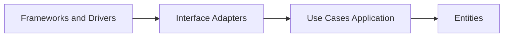

---
topic:
  - Architecture
subtopic:
  - Application Architecture
level:
  - "3"
priority: High
status: Ready to Repeat
publish: true
---
# Intro

Clean Architecture, popularized by Robert C Martin, organizes software so business policy is protected from technical details. The core rule is the Dependency Rule: source code dependencies point inward toward business rules, and inner layers know nothing about frameworks, databases, or UI. This matters because it keeps critical domain behavior testable and stable even when delivery technologies change. Reach for it when business logic is non-trivial and the system is expected to outlive current infrastructure choices.

## Mechanism

### The Dependency Rule in practice

Inward means code at the center defines policy, and code farther out implements details. A use case can depend on an `IOrderRepository` abstraction, but the EF Core repository implementation must depend on that abstraction, not the other way around. This reverses the typical framework first dependency chain and keeps business rules independent from storage, web, or messaging tools.

If you enforce this consistently:
- You can replace UI from MVC to Minimal API or gRPC without rewriting domain rules.
- You can swap persistence from EF Core to Dapper or Cosmos without changing use case logic.
- You can run fast unit tests over Entities and Use Cases without booting ASP NET Core.

### Four concentric layers

- **Entities**: Enterprise business rules and domain objects that capture invariants and core language.
- **Use Cases Application**: Application specific rules that orchestrate entities and define input output boundaries.
- **Interface Adapters**: Controllers presenters and gateways that translate between external contracts and use case models.
- **Frameworks and Drivers**: ASP NET Core EF Core queues and third party services at the outer edge.



The arrows point inward because outer circles implement details for inner policy. Inner layers can be compiled and reasoned about without referencing outer packages.

## Clean Architecture vs simple Layered Architecture

Traditional layered systems often become UI to business to data access, where business logic ends up coupled to repository implementation details and ORM behavior. Clean Architecture keeps similar responsibilities but changes ownership of dependencies: domain and use cases define interfaces, outer infrastructure implements them. Interview shorthand: Layered often describes responsibility stacking, while Clean Architecture adds a strict dependency direction contract. See [[Software Engineering/05 Architecture/Application Architecture/Layered Architecture|Layered Architecture]] for the baseline model this approach refines (and how Hexagonal/Onion/Clean are one family).

## .NET project structure

```text
src
  Ordering Domain
    Entities
    ValueObjects
    Exceptions
  Ordering Application
    Abstractions
    UseCases
    DTOs
  Ordering Infrastructure
    Persistence
    ExternalServices
  Ordering WebAPI
    Controllers
    Contracts
    CompositionRoot
```

The project references should follow this direction:
- `Ordering Domain` references nothing from other projects.
- `Ordering Application` references only `Ordering Domain`.
- `Ordering Infrastructure` references `Ordering Application` and `Ordering Domain`.
- `Ordering WebAPI` references `Ordering Application` and wires `Ordering Infrastructure` in DI.

### C# use case example

```csharp
namespace Ordering.Application.Abstractions;

public interface IOrderRepository
{
    Task AddAsync(Order order, CancellationToken cancellationToken);
    Task<bool> ExistsByExternalIdAsync(string externalId, CancellationToken cancellationToken);
    Task SaveChangesAsync(CancellationToken cancellationToken);
}
```

```csharp
namespace Ordering.Domain.Entities;

public sealed class Order
{
    private readonly List<OrderLine> _lines = new();

    public Guid Id { get; }
    public string ExternalId { get; }
    public string CustomerId { get; }
    public decimal TotalAmount => _lines.Sum(x => x.UnitPrice * x.Quantity);
    public IReadOnlyCollection<OrderLine> Lines => _lines;

    private Order(Guid id, string externalId, string customerId)
    {
        Id = id;
        ExternalId = externalId;
        CustomerId = customerId;
    }

    public static Order Create(Guid id, string externalId, string customerId, IEnumerable<OrderLineInput> lines)
    {
        var materialized = lines.ToList();
        if (string.IsNullOrWhiteSpace(externalId))
            throw new DomainException("External id is required");
        if (string.IsNullOrWhiteSpace(customerId))
            throw new DomainException("Customer id is required");
        if (materialized.Count == 0)
            throw new DomainException("Order must contain at least one line");

        var order = new Order(id, externalId, customerId);
        foreach (var line in materialized)
        {
            if (line.Quantity <= 0)
                throw new DomainException($"Invalid quantity for sku {line.Sku}");

            order._lines.Add(new OrderLine(line.Sku, line.Quantity, line.UnitPrice));
        }

        return order;
    }
}

public sealed record OrderLineInput(string Sku, int Quantity, decimal UnitPrice);
public sealed record OrderLine(string Sku, int Quantity, decimal UnitPrice);

public sealed class DomainException : Exception
{
    public DomainException(string message) : base(message) { }
}
```

```csharp
using Ordering.Application.Abstractions;
using Ordering.Domain.Entities;

namespace Ordering.Application.UseCases;

public sealed record PlaceOrderCommand(
    string ExternalId,
    string CustomerId,
    IReadOnlyList<OrderLineInput> Lines);

public sealed class PlaceOrderUseCase
{
    private readonly IOrderRepository _orderRepository;

    public PlaceOrderUseCase(IOrderRepository orderRepository)
    {
        _orderRepository = orderRepository;
    }

    public async Task<Guid> ExecuteAsync(PlaceOrderCommand command, CancellationToken cancellationToken)
    {
        if (await _orderRepository.ExistsByExternalIdAsync(command.ExternalId, cancellationToken))
            throw new InvalidOperationException($"Order {command.ExternalId} already exists");

        var order = Order.Create(
            Guid.NewGuid(),
            command.ExternalId,
            command.CustomerId,
            command.Lines);

        if (order.TotalAmount > 100000m)
            throw new InvalidOperationException("Manual approval required for high value orders");

        await _orderRepository.AddAsync(order, cancellationToken);
        await _orderRepository.SaveChangesAsync(cancellationToken);

        return order.Id;
    }
}
```

```csharp
using Microsoft.EntityFrameworkCore;
using Ordering.Application.Abstractions;
using Ordering.Domain.Entities;

namespace Ordering.Infrastructure.Persistence;

public sealed class EfOrderRepository : IOrderRepository
{
    private readonly OrderingDbContext _dbContext;

    public EfOrderRepository(OrderingDbContext dbContext)
    {
        _dbContext = dbContext;
    }

    public Task AddAsync(Order order, CancellationToken cancellationToken)
        => _dbContext.Orders.AddAsync(order, cancellationToken).AsTask();

    public Task<bool> ExistsByExternalIdAsync(string externalId, CancellationToken cancellationToken)
        => _dbContext.Orders.AnyAsync(x => x.ExternalId == externalId, cancellationToken);

    public Task SaveChangesAsync(CancellationToken cancellationToken)
        => _dbContext.SaveChangesAsync(cancellationToken);
}
```

The dependency arrow is the key: `PlaceOrderUseCase` depends on `IOrderRepository`, while `EfOrderRepository` depends on Application and Domain contracts.

## Pitfalls

### Over engineering simple CRUD

- What goes wrong: teams add command objects use cases and ports for endpoints that only pass through to a single table.
- Why it happens: architecture is applied as a rule instead of a response to domain complexity.
- How to avoid it: start with a thinner design for low complexity services and introduce use case boundaries only where behavior and invariants justify the extra indirection.

### Framework leakage into domain and use cases

- What goes wrong: entities get EF mapping attributes and use cases accept ASP NET request models directly.
- Why it happens: convenience shortcuts bypass adapter boundaries and import outer concerns into inner layers.
- How to avoid it: keep mapping and transport concerns in Interface Adapters and Infrastructure, and enforce package reference rules so Domain and Application cannot reference web or ORM assemblies.

### Treating clean architecture as folder naming

- What goes wrong: projects are named Domain Application Infrastructure but business code still depends on EF Core or HTTP clients from inside use cases.
- Why it happens: teams copy template folders without automated dependency checks.
- How to avoid it: validate project references in CI and add **architecture tests** (e.g. **NetArchTest** or **ArchUnitNET**) that fail the build when inner layers reference outer packages — the dependency rule only holds if something enforces it.

### Premature abstraction everywhere

- What goes wrong: every class gets an interface even when only one stable implementation exists, creating noise and indirection.
- Why it happens: dependency inversion is misunderstood as interface everything.
- How to avoid it: introduce interfaces at boundaries where behavior varies across infrastructure or where test seams are needed, and keep internal implementation details concrete.

## Tradeoffs

| Criterion | Clean Architecture | Layered | Vertical Slice |
|---|---|---|---|
| Dependency direction | Strict inward rule with policy at center | Usually top down layering | Feature scoped dependency chains per slice |
| Domain protection | Strong for rich business rules and invariants | Moderate and often erodes over time | Strong per feature if slices keep domain boundaries |
| Delivery speed for simple CRUD | Slower due to more boundaries and wiring | Fastest to start | Fast for incremental feature delivery |
| Change isolation | High for framework or database swaps | Medium because data concerns often leak upward | High for localized feature changes |
| Cognitive load | Higher at first due to ports adapters and composition root | Lower initial mental model | Medium with many slices and duplicated patterns |
| Best fit | Long lived systems with complex policy | Small medium apps with simple behavior | Product teams optimizing for independent feature flow |

Decision rule: start with Layered or Vertical Slice for simple domains, and move to Clean Architecture when policy complexity and longevity make framework independence and domain protection worth the indirection cost.

## Questions

> [!QUESTION]- How does Clean Architecture differ from traditional N Layer, and when does the extra indirection pay off
> - N Layer often keeps downward dependencies from UI to business to data, while Clean Architecture enforces inward dependencies toward policy.
> - In Clean Architecture, inner layers define contracts and outer layers implement them, so domain logic survives framework changes.
> - The indirection pays off when business rules are complex, testing speed matters, and infrastructure churn is expected over multiple years.
> - For short lived services with shallow rules, the same indirection can slow delivery with little resilience gain.
> - Tradeoff statement: Clean Architecture buys adaptability and testability by paying upfront complexity and wiring overhead.

> [!QUESTION]- What happens when you apply Clean Architecture to a simple CRUD service
> - You often create command handlers ports and adapters that do little more than pass data through, so cycle time drops without stronger correctness.
> - Teams spend effort maintaining abstractions instead of shipping user value because domain complexity never materializes.
> - Operationally it can still work, but the architecture tax shows up in onboarding and debugging cost.
> - A pragmatic approach is to keep boundaries light and evolve toward stricter clean boundaries only where invariants and integration volatility appear.
> - Tradeoff statement: using full Clean Architecture too early protects against hypothetical future change while charging real present complexity.

## References

- [The Clean Architecture by Robert C Martin](https://blog.cleancoder.com/uncle-bob/2012/08/13/the-clean-architecture.html) — canonical definition of the dependency rule and concentric layers written by Uncle Bob.
- [Common web application architectures](https://learn.microsoft.com/en-us/dotnet/architecture/modern-web-apps-azure/common-web-application-architectures) — Microsoft guidance comparing layered clean and other models in modern ASP NET Core systems.
- [CleanArchitecture template by Jason Taylor](https://github.com/jasontaylordev/CleanArchitecture) — widely used production oriented .NET template showing how Application Domain Infrastructure and Web projects are composed.
- [CleanArchitecture by Steve Smith](https://github.com/ardalis/CleanArchitecture) — pragmatic .NET implementation from Steve Smith that demonstrates boundaries use cases and test strategy.
- [Vertical Slice Architecture by Jimmy Bogard](https://www.jimmybogard.com/vertical-slice-architecture/) — practitioner explanation of an alternative architecture style and why feature oriented slices can reduce coupling.
