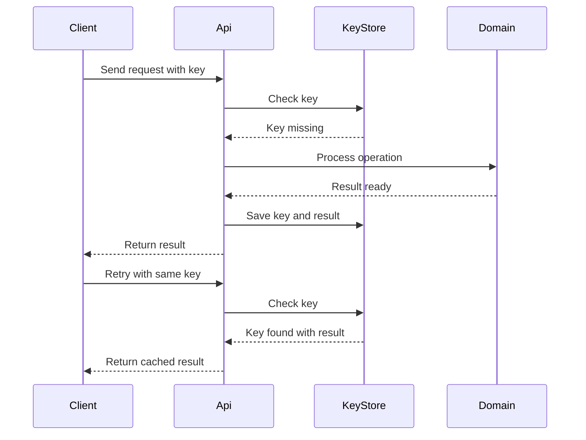

---
topic:
  - Architecture
subtopic:
  - Distributed Systems
level:
  - "2"
priority: High
status: Creation
dg-publish: true
---

# Intro

Idempotency means applying the same logical operation multiple times produces the same final state as applying it once. In distributed systems this is not optional because retries, timeouts, dropped acknowledgments, and at least once delivery are normal operating conditions, not edge cases. You reach for idempotency on any retriable operation such as API writes, message consumers, payment captures, and order creation. Without it, retries become dangerous and can double charge customers, create duplicate orders, or drift state across services.

## Mechanism

Idempotency is implemented at the boundary where duplicates can enter the system, then reinforced at persistence boundaries so duplicates cannot corrupt state.

### Natural idempotency

- `SET balance = 100` is idempotent because repeating it keeps the same result.
- `INCREMENT balance by 100` is not idempotent because each retry changes state again.
- HTTP `PUT` and `DELETE` are idempotent by semantics.
- HTTP `POST` is not idempotent by default because each call usually creates a new server side effect.

### Idempotency keys

For non-idempotent operations, the client sends a unique key per logical operation in `Idempotency-Key`.

Server flow:

1. Read `Idempotency-Key`.
2. Lookup key in a durable store.
3. If key exists and request fingerprint matches, return stored response.
4. If key does not exist, process exactly once, persist response, and bind response to key.

This turns ambiguous network outcomes into deterministic behavior for retries.

### Database level techniques

- **UPSERT**: `INSERT ... ON CONFLICT DO UPDATE` protects read model and projection handlers from duplicate writes.
- **Unique constraints**: enforce one row per business identity such as `merchant_id + client_operation_id`.
- **Conditional updates**: optimistic concurrency like `UPDATE ... WHERE version = @expectedVersion` prevents repeated stale updates from silently overwriting new state.

```sql
CREATE TABLE payments (
    payment_id UUID PRIMARY KEY,
    merchant_id UUID NOT NULL,
    client_operation_id TEXT NOT NULL,
    amount_cents BIGINT NOT NULL,
    status TEXT NOT NULL,
    version INT NOT NULL,
    created_utc TIMESTAMPTZ NOT NULL,
    UNIQUE (merchant_id, client_operation_id)
);
```



Idempotency is especially important for [[Message Queues]] consumers and for multi step workflows like [[Distributed Transactions]] where partial failures are expected.

## HTTP Methods and Idempotency

- **Idempotent by spec**: `GET`, `PUT`, `DELETE`, `HEAD`, `OPTIONS`.
- **Not idempotent by default**: `POST`, `PATCH`.

Interview critical distinction:

- `PUT` is idempotent because it replaces the representation with a full target state.
- `PATCH` applies a delta, and applying the same delta repeatedly can compound side effects unless the patch document itself is designed to be idempotent.

Even with idempotent methods, distributed replicas can still show temporary divergence depending on [[Consistency Models]], so method semantics and system consistency level are separate concerns.

## .NET Implementation Example

Example below uses ASP.NET Core .NET 8 with PostgreSQL and an external payment gateway. It handles duplicate concurrent requests by inserting an idempotency row first under a unique key and reusing a cached response on retries.

```sql
CREATE TABLE api_idempotency (
    idempotency_key TEXT PRIMARY KEY,
    request_hash TEXT NOT NULL,
    status_code INT,
    response_json JSONB,
    state TEXT NOT NULL,
    created_utc TIMESTAMPTZ NOT NULL,
    expires_utc TIMESTAMPTZ NOT NULL
);
```

```csharp
using System.Security.Cryptography;
using System.Text;
using System.Text.Json;
using Dapper;
using Npgsql;

var builder = WebApplication.CreateBuilder(args);
var app = builder.Build();

app.MapPost("/payments", async (HttpContext http, NpgsqlDataSource dataSource, CancellationToken ct) =>
{
    var key = http.Request.Headers["Idempotency-Key"].ToString();
    if (string.IsNullOrWhiteSpace(key))
        return Results.BadRequest(new { error = "Idempotency-Key header is required" });

    var request = await JsonSerializer.DeserializeAsync<ChargeRequest>(http.Request.Body, cancellationToken: ct);
    if (request is null || request.AmountCents <= 0)
        return Results.BadRequest(new { error = "Invalid request body" });

    var requestHash = ComputeRequestHash(request);
    await using var conn = await dataSource.OpenConnectionAsync(ct);
    await using var tx = await conn.BeginTransactionAsync(ct);

    const string insertPending = """
        INSERT INTO api_idempotency (idempotency_key, request_hash, state, created_utc, expires_utc)
        VALUES (@Key, @Hash, 'Pending', now(), now() + interval '24 hours')
        ON CONFLICT DO NOTHING;
        """;

    var inserted = await conn.ExecuteAsync(new CommandDefinition(
        insertPending,
        new { Key = key, Hash = requestHash },
        tx,
        cancellationToken: ct));

    if (inserted == 0)
    {
        const string readExisting = """
            SELECT request_hash, status_code, response_json, state
            FROM api_idempotency
            WHERE idempotency_key = @Key;
            """;

        var existing = await conn.QuerySingleAsync<IdempotencyRecord>(new CommandDefinition(
            readExisting,
            new { Key = key },
            tx,
            cancellationToken: ct));

        if (!string.Equals(existing.RequestHash, requestHash, StringComparison.Ordinal))
            return Results.Conflict(new { error = "Key reused with different payload" });

        if (existing.State == "Completed" && existing.StatusCode is not null && existing.ResponseJson is not null)
            return Results.Json(existing.ResponseJson, statusCode: existing.StatusCode.Value);

        return Results.StatusCode(StatusCodes.Status409Conflict);
    }

    ChargeResult gatewayResult;
    try
    {
        gatewayResult = await ChargeProvider.ChargeAsync(request, key, ct);
    }
    catch (Exception ex)
    {
        await tx.RollbackAsync(ct);
        return Results.Problem($"Payment provider error {ex.Message}", statusCode: StatusCodes.Status502BadGateway);
    }

    var apiResponse = new
    {
        paymentId = gatewayResult.PaymentId,
        status = gatewayResult.Status,
        amountCents = request.AmountCents,
        currency = request.Currency
    };

    const string complete = """
        UPDATE api_idempotency
        SET state = 'Completed',
            status_code = @StatusCode,
            response_json = @Response::jsonb
        WHERE idempotency_key = @Key;
        """;

    await conn.ExecuteAsync(new CommandDefinition(
        complete,
        new
        {
            Key = key,
            StatusCode = StatusCodes.Status200OK,
            Response = JsonSerializer.Serialize(apiResponse)
        },
        tx,
        cancellationToken: ct));

    await tx.CommitAsync(ct);
    return Results.Json(apiResponse, statusCode: StatusCodes.Status200OK);
});

app.Run();

static string ComputeRequestHash(ChargeRequest request)
{
    var json = JsonSerializer.Serialize(request);
    var bytes = SHA256.HashData(Encoding.UTF8.GetBytes(json));
    return Convert.ToHexString(bytes);
}

public sealed record ChargeRequest(Guid CustomerId, long AmountCents, string Currency, string CardToken);

public sealed record ChargeResult(string PaymentId, string Status);

public sealed class IdempotencyRecord
{
    public string RequestHash { get; init; } = string.Empty;
    public int? StatusCode { get; init; }
    public JsonElement? ResponseJson { get; init; }
    public string State { get; init; } = string.Empty;
}

public static class ChargeProvider
{
    public static Task<ChargeResult> ChargeAsync(ChargeRequest request, string idempotencyKey, CancellationToken ct)
    {
        var result = new ChargeResult($"pay_{Guid.NewGuid():N}", "Succeeded");
        return Task.FromResult(result);
    }
}
```

Why this avoids race conditions:

- The unique key insert is the concurrency gate.
- Exactly one request wins `INSERT` and proceeds to process the charge.
- Concurrent duplicates lose the insert and fetch existing status or cached response.
- Request hash prevents accidental key reuse across different payloads.

## Pitfalls

### Message handlers not idempotent under at least once delivery

- **What goes wrong**: duplicate events apply side effects multiple times, such as multiple shipment records.
- **Why it happens**: brokers redeliver when ack is lost or consumer crashes after processing.
- **How to avoid it**: persist processed message ids, use upserts, and make handlers safe to replay.

### Idempotency key scope set incorrectly

- **What goes wrong**: broad scope blocks legitimate operations or narrow scope fails to deduplicate retries.
- **Why it happens**: key design ignores tenant and operation boundaries.
- **How to avoid it**: scope keys by business boundary like tenant plus operation id and enforce payload hash checks.

### Check then process race window

- **What goes wrong**: two concurrent duplicates both pass pre check and both charge.
- **Why it happens**: non atomic check then execute logic without a uniqueness barrier.
- **How to avoid it**: move gate into atomic insert or unique constraint with transaction and conflict handling.

### Idempotent is not safe

- **What goes wrong**: teams assume idempotent operations have no side effects.
- **Why it happens**: confusion between HTTP safe and HTTP idempotent semantics.
- **How to avoid it**: remember `DELETE` is idempotent but still mutates state and can require authorization and auditing.

## Tradeoffs

| Approach | Benefit | Cost | Use when |
|---|---|---|---|
| Idempotency key in application layer | Works for non idempotent `POST` and external side effects, returns exact prior response | Requires durable key store, TTL cleanup, response caching, and payload hash validation | Public APIs and payment workflows where clients retry on timeout |
| Database constraints and UPSERT | Strong deduplication at data boundary, simple correctness model | Does not by itself replay exact HTTP response and may not cover external calls already made | Duplicate creation risk is mostly within one database boundary |
| Conditional updates with optimistic concurrency | Prevents stale duplicate writes from overwriting fresh state | Requires version columns and explicit conflict handling in callers | State transitions where repeated updates must enforce expected version |

Decision rule: start with database uniqueness for core entities, add idempotency keys for externally visible `POST` operations and third party side effects, then use optimistic concurrency for high contention aggregate updates.

## Questions

> [!QUESTION]- Why is idempotency essential for reliable retry strategies, and what happens without it?
> - Retries are a certainty in distributed systems because clients cannot always distinguish failure from delayed success.
> - Idempotency converts ambiguous outcomes into deterministic behavior, so retries do not amplify side effects.
> - Without it, transient faults become correctness bugs such as duplicate charges or duplicate shipment commands.
> - Idempotency also improves operational recovery because replay jobs and dead letter reprocessing become safe.
> - **Tradeoff**: stronger idempotency guarantees require extra storage, key lifecycle management, and stricter request validation.

> [!QUESTION]- How do you implement idempotency for a payment endpoint that processes charges through a third party provider?
> - Require `Idempotency-Key` for `POST /payments` and hash a canonical request payload.
> - Use an atomic insert into an idempotency table keyed by that header to gate concurrent duplicates.
> - If key exists with matching hash and completed state, return cached response with same status code.
> - Pass the same key to the provider when supported so upstream retries are also deduplicated.
> - If key exists but hash differs, reject with conflict to prevent accidental key reuse.
> - **Tradeoff**: caching and replaying responses gives predictable retries but adds storage overhead and response schema coupling.

## References

- [Stripe API docs Idempotent requests](https://docs.stripe.com/api/idempotent_requests) - Anchor source with concrete semantics for key reuse, result caching, TTL, and retry behavior.
- [Stripe engineering blog Designing robust and predictable APIs with idempotency](https://stripe.com/blog/idempotency) - Practitioner writeup on failure modes and retry design tradeoffs from production payment APIs.
- [Microsoft Learn Recommendations for handling transient faults](https://learn.microsoft.com/azure/well-architected/design-guides/handle-transient-faults#implementing-retries) - Reliability guidance that explicitly calls out idempotency as prerequisite for safe retries.
- [Microsoft Learn Data platform for mission critical workloads on Azure idempotent message processing](https://learn.microsoft.com/azure/architecture/reference-architectures/containers/aks-mission-critical/mission-critical-data-platform#idempotent-message-processing) - Practical cloud architecture guidance for dedup in at least once messaging.
- [Chris Richardson Idempotent Consumer pattern](https://microservices.io/post/microservices/patterns/2020/10/16/idempotent-consumer.html) - Practitioner pattern for implementing duplicate safe message handlers.
- [IETF RFC 9110 HTTP Semantics](https://www.rfc-editor.org/rfc/rfc9110.html#name-idempotent-methods) - Protocol level definition of idempotent methods and their intended behavior.

<!-- whats-next:start -->

---

> [!note] Whats next
> **Parent**
>  [[Software Engineering/05 Architecture/05 Architecture|05 Architecture]]
>
> **Topics**
> - [[Software Engineering/05 Architecture/Distributed Systems/Message Queues/Message Queues|Message Queues]]
> - [[Software Engineering/05 Architecture/Distributed Systems/Scalability Patterns/Scalability Patterns|Scalability Patterns]]
>
> **Pages**
> - [[Software Engineering/05 Architecture/Distributed Systems/API Gateway|API Gateway]]
> - [[Software Engineering/05 Architecture/Distributed Systems/CAP theorem|CAP theorem]]
> - [[Software Engineering/05 Architecture/Distributed Systems/Consistency Models|Consistency Models]]
> - [[Software Engineering/05 Architecture/Distributed Systems/Distributed Transactions|Distributed Transactions]]
> - [[Software Engineering/05 Architecture/Distributed Systems/Load Balancing|Load Balancing]]
> - [[Software Engineering/05 Architecture/Distributed Systems/Webhooks|Webhooks]]
<!-- whats-next:end -->
