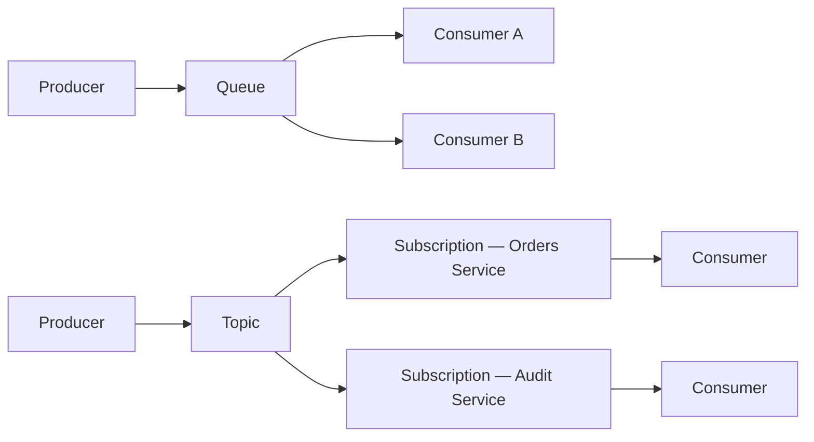

---
topic:
  - Architecture
subtopic:
  - Distributed Systems
level:
  - "2"
priority: High
status: Done

dg-publish: true
---

# Intro

Azure Service Bus is a fully managed enterprise message broker on Azure that supports both point-to-point queues and pub/sub topics with subscriptions. Producers send messages to a queue or topic; Service Bus holds them durably until a consumer receives and settles each one. It matters because it decouples services reliably without you managing broker infrastructure, and it covers the scenarios that raw event streaming (Kafka) deliberately does not: ordered delivery per logical entity, dead-lettering out of the box, message deferral, and session-based FIFO grouping. In a .NET/Azure system, reach for Service Bus when you need task queues, command dispatch, fan-out to multiple subscriber groups, or guaranteed ordered processing per customer or order.

## Core Model

Service Bus offers two routing primitives.



### Queue (Point-to-Point)

- A message sent to a queue is delivered to **exactly one** of the competing receivers connected to the queue.
- Consumers use the peek-lock pattern: the broker locks the message for a configurable window while the consumer processes it, then the consumer settles (completes, abandons, dead-letters, or defers).
- Competing consumers scale horizontally off the same queue without coordination.

### Topic and Subscription (Pub/Sub)

- A message published to a topic is copied to every subscription independently.
- Each subscription acts like its own queue — competing consumers drain one subscription without affecting others.
- Subscriptions support **SQL filter rules** and **correlation filters** so each subscriber sees only the messages it cares about.
- Default rule `1=1` means a fresh subscription receives all messages; forgetting to replace this is a common mistake.

## Message Settlement

When a consumer receives a message in **peek-lock** mode (the default), the message is locked and invisible to other consumers for the lock duration. The consumer must settle it before the lock expires:

| Action | Effect |
|---|---|
| `CompleteAsync` | Message removed from queue/subscription permanently. |
| `AbandonAsync` | Lock released immediately; message becomes visible again for redelivery. |
| `DeadLetterAsync` | Message moved to the dead-letter sub-queue with an optional reason. |
| `DeferAsync` | Message parked invisibly until explicitly received by sequence number using `ReceiveDeferredMessageAsync`; prior delivery increments are retained and further deliveries still count toward `MaxDeliveryCount`. |

**ReceiveAndDelete mode** skips locking and removes the message on delivery — at-most-once semantics. Use only when occasional loss is acceptable.

## Dead-Letter Queue

Every queue and every topic subscription has a built-in dead-letter sub-queue (DLQ) at the path `<entity>/$DeadLetterQueue`. Messages land there when:

- The consumer explicitly calls `DeadLetterAsync`.
- `MaxDeliveryCount` is exceeded (default: 10).
- A message TTL expires and `EnableDeadLetteringOnMessageExpiration` is set.
- A subscription filter evaluation exception occurs and `EnableDeadLetteringOnFilterEvaluationExceptions` is set on the subscription.

The DLQ is a standard queue — you read and settle its messages the same way. It does not auto-drain; you must monitor it and replay or discard messages intentionally.

## Sessions

Sessions provide **FIFO ordering per logical group** within a queue or subscription. A producer stamps each message with a `SessionId` (for example, `customer-42` or `order-9001`). The broker assigns one session at a time to a session receiver, which processes all messages for that session in order before another receiver can claim it.

- Session receivers use `AcceptSessionAsync` or `AcceptNextSessionAsync`.
- Useful when you need ordered processing per tenant, per customer, or per saga instance.
- Sessions are opt-in: the entity must be created with `RequiresSession = true`.

## C# Example (`Azure.Messaging.ServiceBus`)

### Send a message

```csharp
using Azure.Messaging.ServiceBus;

await using var client = new ServiceBusClient(connectionString);
// "orders" queue must be created with RequiresSession = true when using SessionId
await using var sender = client.CreateSender("orders");

var order = new Order("ord-1001", "cust-42", 129.50m);
var message = new ServiceBusMessage(BinaryData.FromObjectAsJson(order))
{
    MessageId = order.OrderId,
    ContentType = "application/json",
    SessionId = order.CustomerId
};

await sender.SendMessageAsync(message);

public sealed record Order(string OrderId, string CustomerId, decimal Amount);
```

### Receive with peek-lock, process, and complete

```csharp
using Azure.Messaging.ServiceBus;

await using var client = new ServiceBusClient(connectionString);
await using var receiver = client.CreateReceiver(
    "orders",
    new ServiceBusReceiverOptions { ReceiveMode = ServiceBusReceiveMode.PeekLock });

ServiceBusReceivedMessage message = await receiver.ReceiveMessageAsync();

try
{
    var order = message.Body.ToObjectFromJson<Order>();
    await ProcessOrderAsync(order);
    await receiver.CompleteMessageAsync(message);
}
catch (TransientDependencyException)
{
    await receiver.AbandonMessageAsync(message);
}
catch
{
    await receiver.DeadLetterMessageAsync(message, reason: "UnhandledProcessingError");
}

static Task ProcessOrderAsync(Order order) => Task.CompletedTask;

public sealed class TransientDependencyException : Exception;
public sealed record Order(string OrderId, string CustomerId, decimal Amount);
```

### Session-enabled receiver

```csharp
using Azure.Messaging.ServiceBus;

await using var client = new ServiceBusClient(connectionString);

// Accept the next available session; blocks until a session is available.
await using ServiceBusSessionReceiver sessionReceiver =
    await client.AcceptNextSessionAsync("orders");

while (true)
{
    ServiceBusReceivedMessage? message =
        await sessionReceiver.ReceiveMessageAsync(maxWaitTime: TimeSpan.FromSeconds(5));

    if (message is null)
        break;

    var order = message.Body.ToObjectFromJson<Order>();
    await ProcessOrderAsync(order);
    await sessionReceiver.CompleteMessageAsync(message);
}
```

## Pitfalls

### 1) Message lock expiry during slow processing

- **What goes wrong**: the lock window expires before `CompleteAsync` is called; Service Bus unlocks the message and redelivers it to another consumer.
- **Why**: lock duration defaults to 60 seconds; processing that involves database writes, downstream HTTP calls, or large payloads can exceed this.
- **Impact**: duplicate processing of the same message.
- **Mitigation**: call `RenewMessageLockAsync` periodically inside a long handler, or design handlers to complete within well under the lock duration. For very long jobs, use `DeferAsync` to park the message and drive progress from durable state.

### 2) Silent DLQ poisoning from MaxDeliveryCount

- **What goes wrong**: a message fails ten times, moves to the DLQ, and is never seen again. The team discovers weeks later that orders have been silently dropped.
- **Why**: `MaxDeliveryCount` is a hard ceiling per entity; once exceeded, the broker dead-letters without alerting anyone by default.
- **Impact**: permanent data loss in the absence of DLQ monitoring.
- **Mitigation**: treat the DLQ as a first-class operational concern — set alerts on DLQ depth, implement replay tooling, and review DLQ messages in your incident runbooks.

### 3) Topic subscription filter mistakes silently drop messages

- **What goes wrong**: messages that should reach a subscription never arrive because a SQL filter or correlation filter is wrong.
- **Why**: an incorrect filter evaluates to false for every incoming message, and Service Bus does not warn you — it simply routes nothing.
- **Impact**: subscriber receives no messages with no error surfaced at the producer.
- **Mitigation**: test filters explicitly with integration tests; monitor subscription message count and alert on unexpectedly zero-message subscriptions.

### 4) Session starvation under high concurrency

- **What goes wrong**: one active session with a steady stream of messages monopolizes a session receiver, starving sessions that arrive later.
- **Why**: a session receiver holds the session lock for its lifetime; under low consumer count and high session count, some sessions queue up.
- **Impact**: FIFO ordering is preserved but latency across sessions becomes uneven.
- **Mitigation**: set `SessionIdleTimeout` on `ServiceBusSessionProcessorOptions` so the processor releases a session after a period of inactivity, allowing other sessions to be picked up. Run multiple concurrent session receivers by tuning `MaxConcurrentSessions` for throughput — but starvation itself is driven by idle-timeout, not concurrency count alone.

## Tradeoffs

| Dimension | Azure Service Bus | [[Software Engineering/05 Architecture/Distributed Systems/Message Queues/RabbitMQ\|RabbitMQ]] | [[Software Engineering/05 Architecture/Distributed Systems/Message Queues/Kafka\|Kafka]] |
|---|---|---|---|
| Hosting | Fully managed (Azure) | Self-hosted or managed cloud | Self-hosted or managed cloud |
| Throughput ceiling | Medium-high (Premium tier: millions of messages/min per messaging unit, horizontally scalable) | Medium (tunable cluster) | Very high (designed for streaming at scale) |
| Ordering | FIFO per session; no global ordering | Per-queue; strict global ordering is hard | Strong ordering per partition |
| Replay / log retention | Not a design goal; message removed on complete | Not a core primitive | Native replay by offset; configurable retention |
| Dead-lettering | Built-in per entity, no configuration needed | Requires explicit DLX binding setup | No broker DLQ; handled at application level |
| Routing flexibility | SQL/correlation filters on topic subscriptions | Rich exchange types (direct, fanout, topic, headers) | Simpler topic/partition model |
| Ops overhead | Near-zero (SLA-backed managed service) | Cluster tuning, plugins, upgrades are your responsibility | Highest: partitions, replication, retention tuning |
| When to prefer | Azure-native systems, enterprise integration, managed operations | On-prem or containerized, complex routing needs, latency-sensitive | High-throughput event streaming, event sourcing, replay requirements |

## Questions

> [!QUESTION]- When would you choose Azure Service Bus over Kafka?
> Choose Service Bus when your system is already on Azure and you want a fully managed broker with zero cluster ops, when you need built-in dead-lettering, message deferral, or session-based FIFO ordering per entity, or when your throughput is in the millions of messages per day rather than hundreds of millions. Kafka is the right call when you need a durable, replayable event log, extreme throughput, or multiple independent consumer groups reading event history at different offsets. The rough dividing line: Service Bus moves and settles individual messages with rich settlement semantics; Kafka stores an immutable event log that consumers read by offset. If you find yourself wanting to replay past messages or feed multiple analytics pipelines from the same stream, you actually wanted Kafka.

> [!QUESTION]- How does Service Bus ensure ordered processing per customer or order?
> Through **sessions**: create the queue or subscription with `RequiresSession = true` and set a `SessionId` on every message (for example, `customer-42`). Service Bus assigns one session at a time to a session receiver, so all messages for `customer-42` are processed sequentially by a single receiver even when many receivers are running in parallel. Other sessions can be processed concurrently on other receivers, giving parallelism across customers while preserving strict in-order delivery within each customer's session. Without sessions, competing consumers interleave messages from different senders with no ordering guarantee.

> [!QUESTION]- What happens when MaxDeliveryCount is reached, and how do you handle it?
> When a message has been delivered and nacked (abandoned or returned due to lock expiry) `MaxDeliveryCount` times (default: 10), Service Bus automatically moves it to the entity's dead-letter sub-queue at `<entity>/$DeadLetterQueue` and stamps it with `DeadLetterReason` and `DeadLetterErrorDescription`. The message sits there indefinitely — it does not auto-replay or alert anyone. You handle this by: (1) setting alerts on DLQ depth so the team is notified promptly; (2) building replay tooling that can re-enqueue DLQ messages after the root cause is fixed; (3) inspecting `DeadLetterReason` to distinguish poison messages (bad data, schema mismatch) from transient failures (downstream timeout during a brief outage). Treating the DLQ as an operational queue — not a discard bin — is what separates a safe system from one that silently drops data.

## References

- [Azure Service Bus messaging overview (Microsoft Learn)](https://learn.microsoft.com/en-us/azure/service-bus-messaging/service-bus-messaging-overview)
- [Queues, topics, and subscriptions (Microsoft Learn)](https://learn.microsoft.com/en-us/azure/service-bus-messaging/service-bus-queues-topics-subscriptions)
- [Azure.Messaging.ServiceBus .NET API reference (Microsoft Learn)](https://learn.microsoft.com/en-us/dotnet/api/azure.messaging.servicebus)
- [Dead-letter queues (Microsoft Learn)](https://learn.microsoft.com/en-us/azure/service-bus-messaging/service-bus-dead-letter-queues)
- [Message sessions (Microsoft Learn)](https://learn.microsoft.com/en-us/azure/service-bus-messaging/message-sessions)

<!-- whats-next:start -->

---

> [!note] Whats next
> **Parent**
>  [[Software Engineering/05 Architecture/Distributed Systems/Message Queues/Message Queues|Message Queues]]
>
> **Pages**
> - [[Software Engineering/05 Architecture/Distributed Systems/Message Queues/Kafka|Kafka]]
> - [[Software Engineering/05 Architecture/Distributed Systems/Message Queues/MSMQ|MSMQ]]
> - [[Software Engineering/05 Architecture/Distributed Systems/Message Queues/RabbitMQ|RabbitMQ]]
<!-- whats-next:end -->
