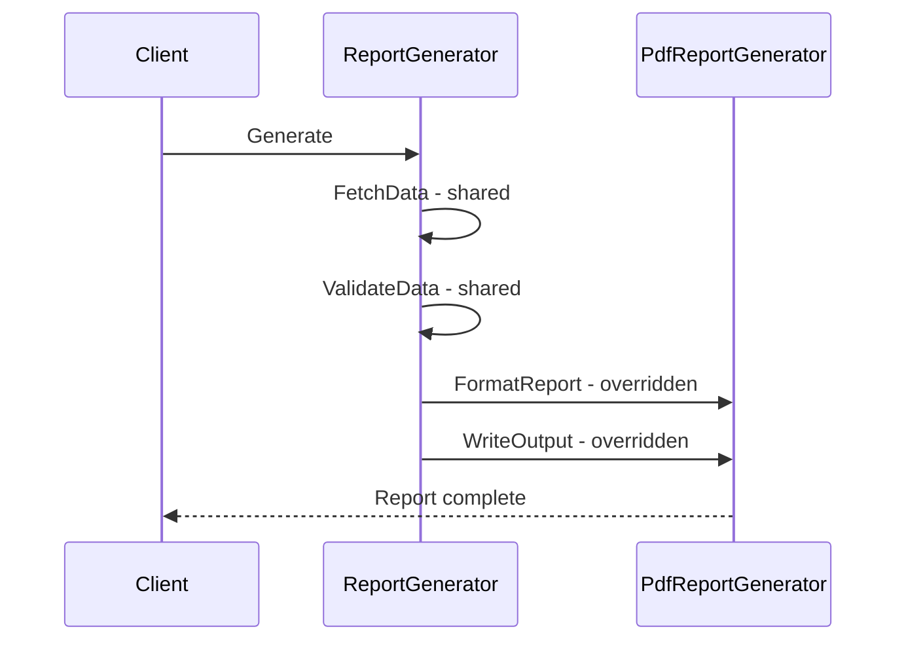

---
topic:
  - Architecture
subtopic:
  - Patterns
level:
  - "2"
priority: High
status: Creation
dg-publish: true
---
# Template Method

Making tea and making coffee follow the same recipe: boil water, brew the drink, pour into a cup, add condiments. The steps are identical; only the brewing and condiment details differ — tea steeps leaves and adds lemon, coffee uses grounds and adds sugar. The recipe template is fixed; specific steps are customized.

The Template Method pattern defines the skeleton of an algorithm in a base class, letting subclasses override specific steps without changing the overall structure. The base class declares a template method that calls a fixed sequence of steps — some concrete (shared by all subclasses), some abstract or virtual (customized by each subclass). In an e-commerce system, `ReportGenerator.Generate()` always follows fetch data → validate → format → write. The PDF, CSV, and Excel subclasses override only `FormatReport()` and `WriteOutput()` while sharing the orchestration logic.



## Problem

`PdfReportGenerator`, `CsvReportGenerator`, and `ExcelReportGenerator` each independently implement the same fetch → validate → format → write lifecycle, duplicating orchestration logic:

```csharp
public class PdfReportGenerator
{
    public async Task<byte[]> GenerateAsync(Guid orderId)
    {
        // ⚠️ Fetch, validate, and audit logic duplicated in every generator
        var order = await _repository.GetAsync(orderId);
        if (order is null) throw new NotFoundException(orderId);
        await _auditLog.RecordAsync($"Report generated for order {orderId}");

        // Format-specific logic
        var pdf = new PdfDocument();
        pdf.AddPage().AddTable(order.Items.Select(i => new[] { i.ProductId.ToString(), i.Quantity.ToString() }));
        return pdf.Save();
    }
}

public class CsvReportGenerator
{
    public async Task<byte[]> GenerateAsync(Guid orderId)
    {
        // ⚠️ Same fetch/validate/audit — copy-pasted
        var order = await _repository.GetAsync(orderId);
        if (order is null) throw new NotFoundException(orderId);
        await _auditLog.RecordAsync($"Report generated for order {orderId}");

        // Format-specific logic
        var sb = new StringBuilder("ProductId,Quantity,UnitPrice\n");
        foreach (var item in order.Items)
            sb.AppendLine($"{item.ProductId},{item.Quantity},{item.UnitPrice}");
        return Encoding.UTF8.GetBytes(sb.ToString());
    }
}
// ⚠️ Adding ExcelReportGenerator = copy-paste the fetch/validate/audit block again
```

Here's what breaks when requirements change: adding a new audit field to the report generation lifecycle requires editing every generator class.

## Solution

`ReportGenerator` base class defines the algorithm skeleton; subclasses override only the format-specific steps:

```csharp
// Abstract base — defines the template method
public abstract class ReportGenerator
{
    // ✅ Template method — sealed, defines the algorithm skeleton
    public async Task<Report> GenerateAsync(Guid orderId)
    {
        var order = await FetchDataAsync(orderId);    // step 1: always the same
        ValidateData(order);                           // step 2: always the same
        await RecordAuditAsync(orderId);               // step 3: always the same
        var content = await FormatReportAsync(order);  // step 4: subclass-specific
        return new Report(GetContentType(), content);  // step 5: uses subclass value
    }

    // Fixed steps — shared implementation
    protected virtual async Task<Order> FetchDataAsync(Guid orderId)
    {
        var order = await Repository.GetAsync(orderId);
        return order ?? throw new NotFoundException(orderId);
    }

    protected virtual void ValidateData(Order order)
    {
        if (order.Items.Count == 0)
            throw new InvalidOperationException("Cannot generate report for empty order");
    }

    private Task RecordAuditAsync(Guid orderId) =>
        AuditLog.RecordAsync($"Report generated for order {orderId} as {GetContentType()}");

    // Abstract steps — subclasses must implement
    protected abstract Task<byte[]> FormatReportAsync(Order order);
    protected abstract string GetContentType();

    protected IOrderRepository Repository { get; init; } = null!;
    protected IAuditLog AuditLog { get; init; } = null!;
}

// Concrete implementations — override only format-specific steps
public class PdfReportGenerator(IOrderRepository repository, IAuditLog auditLog) : ReportGenerator
{
    protected override Task<byte[]> FormatReportAsync(Order order)
    {
        var pdf = new PdfDocument();
        var page = pdf.AddPage();
        page.AddHeading($"Order #{order.Id}");
        page.AddTable(order.Items.Select(i => new[] { i.ProductId.ToString(), i.Quantity.ToString(), i.UnitPrice.ToString("C") }));
        return Task.FromResult(pdf.Save());
    }

    protected override string GetContentType() => "application/pdf";
}

public class CsvReportGenerator(IOrderRepository repository, IAuditLog auditLog) : ReportGenerator
{
    protected override Task<byte[]> FormatReportAsync(Order order)
    {
        var sb = new StringBuilder("ProductId,Quantity,UnitPrice\n");
        foreach (var item in order.Items)
            sb.AppendLine($"{item.ProductId},{item.Quantity},{item.UnitPrice:F2}");
        return Task.FromResult(Encoding.UTF8.GetBytes(sb.ToString()));
    }

    protected override string GetContentType() => "text/csv";
}

// ✅ Adding Excel = new subclass, zero changes to base class or other generators
public class ExcelReportGenerator(IOrderRepository repository, IAuditLog auditLog) : ReportGenerator
{
    protected override Task<byte[]> FormatReportAsync(Order order)
    {
        using var workbook = new XLWorkbook();
        var sheet = workbook.AddWorksheet("Order");
        // ... populate Excel
        using var stream = new MemoryStream();
        workbook.SaveAs(stream);
        return Task.FromResult(stream.ToArray());
    }

    protected override string GetContentType() =>
        "application/vnd.openxmlformats-officedocument.spreadsheetml.sheet";
}
```

Adding an Excel generator now means one new subclass — the fetch, validate, and audit logic is inherited automatically.

## You Already Use This

**`BackgroundService.ExecuteAsync()`** — the template method for hosted services. `BackgroundService` defines the lifecycle: start → execute → stop. `ExecuteAsync(CancellationToken)` is the abstract step you override. The base class handles registration, cancellation, and error handling.

**`Stream` abstract class** — `Read()`, `Write()`, `Seek()` are abstract steps. `CopyToAsync()` is a template method that calls `ReadAsync()` and `WriteAsync()` in a loop — the algorithm is fixed; the I/O implementation varies per stream type.

**`DbContext.OnModelCreating()`** — EF Core's template method for model configuration. The base `DbContext` calls `OnModelCreating()` during model building; you override it to configure entities. The overall model-building algorithm is fixed; your configuration is the variable step.

**`AuthenticationHandler<T>.HandleAuthenticateAsync()`** — ASP.NET Core authentication handlers use Template Method. The base class handles scheme registration, result caching, and challenge/forbid responses. `HandleAuthenticateAsync()` is the abstract step you implement.

## Questions

> [!QUESTION]- When should you use Template Method vs Strategy for algorithm variation?
> Template Method uses inheritance — the variation is in a subclass. Strategy uses composition — the variation is in an injected object. Use Template Method when: the algorithm skeleton is stable, the variations are tightly coupled to the base class, and you don't need to swap algorithms at runtime. Use Strategy when: you need to swap algorithms at runtime, the algorithm is independent of the class using it, or you want to avoid inheritance. The tradeoff: Template Method is simpler (no extra interface) but creates tight inheritance coupling; Strategy is more flexible but requires an extra interface and injection.

> [!QUESTION]- What's the "Hollywood Principle" and how does Template Method implement it?
> "Don't call us, we'll call you." The base class calls the subclass's methods (abstract steps), not the other way around. The subclass doesn't control when its methods are called — the template method does. This inverts the typical inheritance relationship: instead of the subclass calling `super.method()`, the base class calls `this.abstractStep()`. The benefit: the algorithm's structure is controlled by the base class; subclasses can't accidentally skip steps or change the order. The cost: subclasses are tightly coupled to the base class's algorithm structure.

## References

- [Template Method Pattern — Christopher Okhravi](https://www.youtube.com/watch?v=7ocpwK9uesw&list=PLrhzvIcii6GNjpARdnO4ueTUAVR9eMBpc&index=13) — video walkthrough of the Template Method pattern with OOP examples
- [Template Method — refactoring.guru](https://refactoring.guru/design-patterns/template-method) — canonical pattern description with base/subclass diagram and C# example
- [BackgroundService — Microsoft Learn](https://learn.microsoft.com/en-us/dotnet/api/microsoft.extensions.hosting.backgroundservice) — Template Method for hosted background services
- [Stream abstract class — Microsoft Learn](https://learn.microsoft.com/en-us/dotnet/api/system.io.stream) — Template Method in the .NET I/O hierarchy
- [`AuthenticationHandler<T>` — Microsoft Learn](https://learn.microsoft.com/en-us/dotnet/api/microsoft.aspnetcore.authentication.authenticationhandler-1) — Template Method for ASP.NET Core authentication schemes

<!-- whats-next:start -->

---

> [!note] Whats next
> **Parent**
>  [[Software Engineering/05 Architecture/Patterns/Design Patterns/Design Patterns|Design Patterns]]
>
> **Pages**
> - [[Software Engineering/05 Architecture/Patterns/Design Patterns/Behavioral/Chain of Responsibility|Chain of Responsibility]]
> - [[Software Engineering/05 Architecture/Patterns/Design Patterns/Behavioral/Command|Command]]
> - [[Software Engineering/05 Architecture/Patterns/Design Patterns/Behavioral/Interpreter|Interpreter]]
> - [[Software Engineering/05 Architecture/Patterns/Design Patterns/Behavioral/Iterator|Iterator]]
> - [[Software Engineering/05 Architecture/Patterns/Design Patterns/Behavioral/Mediator|Mediator]]
> - [[Software Engineering/05 Architecture/Patterns/Design Patterns/Behavioral/Memento|Memento]]
> - [[Software Engineering/05 Architecture/Patterns/Design Patterns/Behavioral/Observer|Observer]]
> - [[Software Engineering/05 Architecture/Patterns/Design Patterns/Behavioral/State|State]]
> - [[Software Engineering/05 Architecture/Patterns/Design Patterns/Behavioral/Strategy|Strategy]]
> - [[Software Engineering/05 Architecture/Patterns/Design Patterns/Behavioral/Visitor|Visitor]]
<!-- whats-next:end -->
