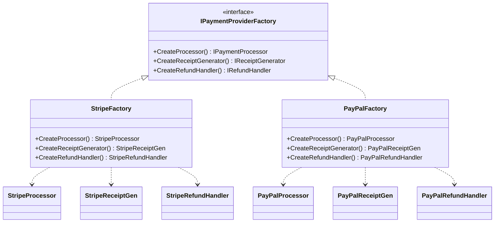

---
topic:
  - Architecture
subtopic:
  - Patterns
level:
  - "3"
priority: High
status: Creation
dg-publish: true
---
# Abstract Factory

Walk into an IKEA showroom and pick the "Modern" living room set — you get a modern chair, a modern table, and a modern lamp, all designed to look right together. You can’t accidentally mix a Victorian chair with a Modern table because the set is curated as a family. Pick a different style and every piece changes together.

The Abstract Factory pattern works the same way: it provides an interface for creating **families of related objects** without specifying their concrete classes. A factory interface declares creation methods for each product in the family (payment processor, receipt generator, refund handler). Each concrete factory (Stripe, PayPal, BankTransfer) implements the full interface, guaranteeing that all products it creates are compatible with each other. The client receives a factory and uses it — swapping `StripePaymentFactory` for `PayPalPaymentFactory` changes the entire product family in one place, and the compiler prevents mixing a Stripe processor with a PayPal receipt generator.



> [!NOTE] Abstract Factory vs Factory Method
> [[Software Engineering/05 Architecture/Patterns/Design Patterns/Creational/Factory Method|Factory Method]] creates **one product** via inheritance. Abstract Factory creates a **family of related products** via composition. If your products need to work together (Stripe payment + Stripe receipt + Stripe refund handler), use Abstract Factory to enforce that constraint.

## Problem

`CheckoutService` creates payment objects, receipt generators, and refund handlers per provider. Without a factory, provider selection is scattered:

```csharp
public class CheckoutService
{
    public async Task<CheckoutResult> CheckoutAsync(Order order, string provider)
    {
        IPaymentProcessor processor;
        IReceiptGenerator receiptGen;
        IRefundHandler refundHandler;

        // ⚠️ Provider selection duplicated in every method that needs payment objects
        if (provider == "stripe")
        {
            processor = new StripePaymentProcessor(Environment.GetEnvironmentVariable("STRIPE_KEY")!);
            receiptGen = new StripeReceiptGenerator();
            refundHandler = new StripeRefundHandler();
        }
        else if (provider == "paypal")
        {
            processor = new PayPalPaymentProcessor(Environment.GetEnvironmentVariable("PAYPAL_CLIENT_ID")!);
            receiptGen = new PayPalReceiptGenerator();
            refundHandler = new PayPalRefundHandler();
        }
        else
        {
            throw new NotSupportedException($"Provider '{provider}' not supported");
        }
        // ⚠️ Adding BankTransfer means editing this block AND every other place that creates payment objects
        // ⚠️ Nothing prevents mixing StripePaymentProcessor with PayPalReceiptGenerator

        var payment = await processor.ChargeAsync(order.Total, order.Customer.PaymentMethod);
        var receipt = receiptGen.Generate(order, payment);
        return new CheckoutResult(payment, receipt, refundHandler);
    }
}
```

Here's what breaks when requirements change: adding a BankTransfer provider requires editing `CheckoutService` and every other service that creates payment objects. A developer can accidentally mix `StripePaymentProcessor` with `PayPalReceiptGenerator` — the compiler won't catch it.

## Solution

Define a factory interface for the payment family. Each provider implements the full family:

```csharp
// Abstract products
public interface IPaymentProcessor
{
    Task<Payment> ChargeAsync(decimal amount, PaymentMethod method);
}

public interface IReceiptGenerator
{
    Invoice Generate(Order order, Payment payment);
}

public interface IRefundHandler
{
    Task<bool> RefundAsync(Payment payment, decimal amount);
}

// Abstract factory — the family contract
public interface IPaymentProviderFactory
{
    IPaymentProcessor CreateProcessor();
    IReceiptGenerator CreateReceiptGenerator();
    IRefundHandler CreateRefundHandler();
}

// Concrete factory — Stripe family (all products guaranteed compatible)
public class StripePaymentFactory(StripeOptions options) : IPaymentProviderFactory
{
    public IPaymentProcessor CreateProcessor() => new StripePaymentProcessor(options.ApiKey);
    public IReceiptGenerator CreateReceiptGenerator() => new StripeReceiptGenerator(options.AccountId);
    public IRefundHandler CreateRefundHandler() => new StripeRefundHandler(options.ApiKey);
}

// Concrete factory — PayPal family
public class PayPalPaymentFactory(PayPalOptions options) : IPaymentProviderFactory
{
    public IPaymentProcessor CreateProcessor() => new PayPalPaymentProcessor(options.ClientId, options.Secret);
    public IReceiptGenerator CreateReceiptGenerator() => new PayPalReceiptGenerator(options.MerchantId);
    public IRefundHandler CreateRefundHandler() => new PayPalRefundHandler(options.ClientId, options.Secret);
}

// ✅ Adding BankTransfer = new factory class, zero changes to CheckoutService
public class BankTransferFactory(BankOptions options) : IPaymentProviderFactory
{
    public IPaymentProcessor CreateProcessor() => new BankTransferProcessor(options);
    public IReceiptGenerator CreateReceiptGenerator() => new BankReceiptGenerator(options.BankName);
    public IRefundHandler CreateRefundHandler() => new BankRefundHandler(options);
}

// CheckoutService works against the abstract factory — no provider knowledge
public class CheckoutService(IPaymentProviderFactory factory)
{
    public async Task<CheckoutResult> CheckoutAsync(Order order)
    {
        // ✅ All three objects come from the same factory — guaranteed compatible
        var processor = factory.CreateProcessor();
        var receiptGen = factory.CreateReceiptGenerator();
        var refundHandler = factory.CreateRefundHandler();

        var payment = await processor.ChargeAsync(order.Total, order.Customer.PaymentMethod);
        var receipt = receiptGen.Generate(order, payment);
        return new CheckoutResult(payment, receipt, refundHandler);
    }
}

// DI registration — swap the factory to switch providers
builder.Services.AddSingleton<IPaymentProviderFactory>(
    new StripePaymentFactory(builder.Configuration.GetSection("Stripe").Get<StripeOptions>()!));
```

Adding BankTransfer now means one new `BankTransferFactory` class. `CheckoutService` never changes. The compiler enforces that all products come from the same family.

## You Already Use This

**`IServiceProvider` + DI container** — the DI container is an Abstract Factory. `serviceProvider.GetRequiredService<IPaymentProcessor>()` returns the registered implementation. Registering a different implementation swaps the entire "family" of services without touching consumers.

**`DbProviderFactory`** — ADO.NET's built-in Abstract Factory. `SqlClientFactory.Instance` creates `SqlConnection`, `SqlCommand`, `SqlDataAdapter` — a full family of compatible SQL Server objects. `NpgsqlFactory.Instance` creates the equivalent PostgreSQL family. You can't mix `SqlConnection` with `NpgsqlCommand` through the factory.

**`WebApplicationBuilder`** — creates a family of related hosting objects: `IConfiguration`, `IServiceCollection`, `ILoggingBuilder`, `IWebHostEnvironment`. All are wired together and compatible by construction.

## Pitfalls

**Mixing products from different factories** — the pattern prevents this at the design level, but if you bypass the factory and call `new StripeReceiptGenerator()` directly, you lose the guarantee. Enforce factory-only construction by making concrete product constructors `internal` and placing factories in the same assembly.

**Factory interface explosion when families grow** — every new product type (e.g., `IFraudDetector`) requires adding a method to `IPaymentProviderFactory` and implementing it in every concrete factory. For large families, this becomes a maintenance burden. Consider splitting into smaller, focused factory interfaces if the family has more than 4-5 products.

**Hardcoded factory selection at startup** — if you select the factory based on a config value at startup, you can't switch providers at runtime (e.g., failover from Stripe to PayPal). For runtime switching, combine with a registry or strategy pattern that selects the factory per request.

## Tradeoffs

| Concern | With Abstract Factory | Without (direct construction) |
|---|---|---|
| Product compatibility | Enforced by compiler — all products from same factory | Developer discipline required — easy to mix incompatible products |
| Adding a new provider | One new factory class, zero changes to consumers | Edit every service that creates payment objects |
| Adding a new product type | Add method to interface + implement in every factory | Add creation logic in every service |
| Testability | Inject a `MockPaymentFactory` in tests | Must mock each product individually |
| Complexity | Factory hierarchy adds indirection | Simpler for 1-2 providers |

**Decision rule**: Use Abstract Factory when you have 2+ product families that must stay internally consistent, and you expect new families to be added. For a single provider with no plans to swap, direct construction or a simple factory method is sufficient. The break-even point is roughly when you have 3+ products in a family and 2+ families.

## Questions

> [!QUESTION]- How do you add a new product type (e.g., IFraudDetector) to an existing Abstract Factory without breaking all existing factories?
> You can't without modifying the interface — that's the fundamental tension. Options: (1) Add the method with a default implementation in the interface (`default IFraudDetector CreateFraudDetector() => new NoOpFraudDetector()`), which avoids breaking existing factories but hides missing implementations. (2) Use a separate `IFraudDetectorFactory` interface and compose it with `IPaymentProviderFactory` at the call site. (3) Accept the breaking change and update all factories — justified when the product is truly part of the family. The tradeoff: default implementations hide gaps; separate interfaces reduce cohesion; breaking changes are honest but costly.

> [!QUESTION]- When is Abstract Factory overkill compared to a simpler approach?
> When you have only one product family (no need to swap providers), or when products don't need to stay compatible with each other. A single `IPaymentProcessor` interface with DI registration is sufficient if you never need `IReceiptGenerator` to match the processor's provider. Abstract Factory's value is the **family constraint** — if that constraint doesn't exist in your domain, you're adding indirection for no benefit. Cost: every new product type requires updating the factory interface and all implementations.

> [!QUESTION]- How does Abstract Factory relate to the DI container in modern .NET?
> The DI container IS an Abstract Factory at runtime. `services.AddSingleton<IPaymentProcessor, StripePaymentProcessor>()` registers a factory for `IPaymentProcessor`. The container creates compatible families when you register all related services together. The difference: DI containers don't enforce family consistency at compile time — you can register `StripePaymentProcessor` with `PayPalReceiptGenerator` and the compiler won't complain. A typed Abstract Factory interface enforces this at compile time. Use DI for flexibility; use a typed factory when family consistency is a hard requirement.

## References

- [Abstract Factory — refactoring.guru](https://refactoring.guru/design-patterns/abstract-factory) — canonical pattern description with structure diagram and C# example
- [DbProviderFactory — Microsoft Learn](https://learn.microsoft.com/en-us/dotnet/api/system.data.common.dbproviderfactory) — ADO.NET's built-in Abstract Factory for database provider families
- [Dependency injection in .NET — Microsoft Learn](https://learn.microsoft.com/en-us/dotnet/core/extensions/dependency-injection) — how the DI container acts as a runtime Abstract Factory
- [Design Patterns: Elements of Reusable Object-Oriented Software — GoF](https://www.amazon.com/Design-Patterns-Elements-Reusable-Object-Oriented/dp/0201633612) — original pattern definition and intent

<!-- whats-next:start -->

---

> [!note] Whats next
> **Parent**
>  [[Software Engineering/05 Architecture/Patterns/Design Patterns/Design Patterns|Design Patterns]]
>
> **Pages**
> - [[Software Engineering/05 Architecture/Patterns/Design Patterns/Creational/Builder|Builder]]
> - [[Software Engineering/05 Architecture/Patterns/Design Patterns/Creational/Factory Method|Factory Method]]
> - [[Software Engineering/05 Architecture/Patterns/Design Patterns/Creational/Prototype|Prototype]]
> - [[Software Engineering/05 Architecture/Patterns/Design Patterns/Creational/Singleton|Singleton]]
<!-- whats-next:end -->
