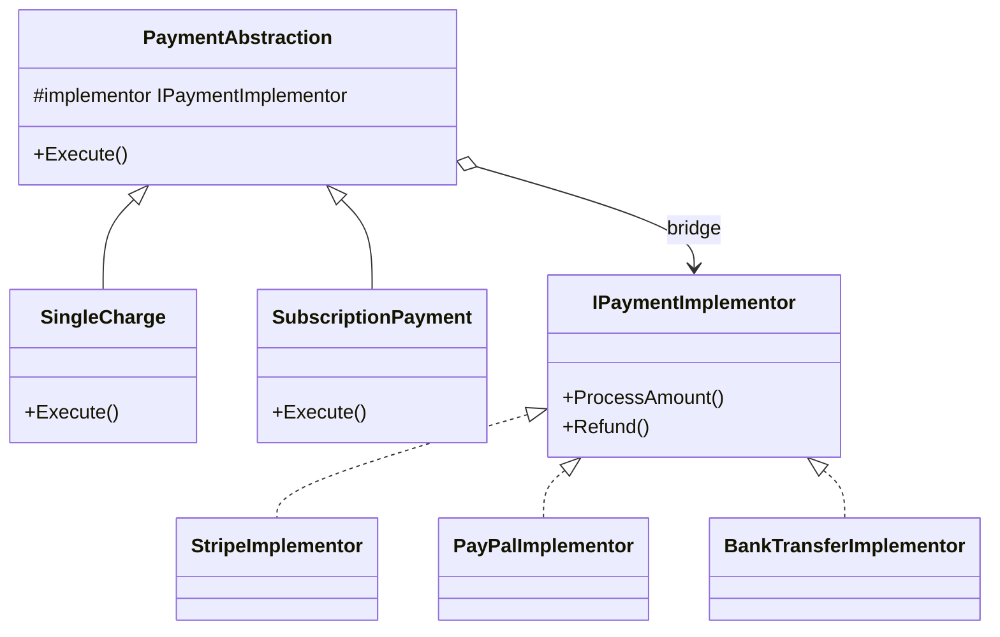

---
topic:
  - Architecture
subtopic:
  - Patterns
level:
  - "3"
priority: High
status: Creation
dg-publish: true
---
# Bridge

Think of remote controls and TVs. Any remote — basic, smart, universal — can operate any TV — Samsung, LG, Sony. The remote is the abstraction (what you want to do: power, volume, channel), the TV is the implementation (how it actually gets done). Adding a new TV brand doesn’t require redesigning any remote. Adding a new remote type doesn’t require changing any TV. The two hierarchies vary independently because they’re connected by a bridge, not welded together by inheritance.

The Bridge pattern decouples an abstraction from its implementation so they can evolve independently. The abstraction holds a reference to an implementation interface (the "bridge") rather than inheriting from a concrete class. In an e-commerce system, payment types (single charge, subscription, refund) are the abstraction dimension, and payment providers (Stripe, PayPal, BankTransfer) are the implementation dimension. Without Bridge, you’d need `StripeCharge`, `StripeSubscription`, `StripeRefund`, `PayPalCharge`, `PayPalSubscription`... — a combinatorial explosion. With Bridge, each abstraction delegates to whichever provider implementation it received.



> [!NOTE] Bridge vs Adapter
> [[Software Engineering/05 Architecture/Patterns/Design Patterns/Structural/Adapter|Adapter]] is a **retrofit** — you adapt an existing interface you can't change. Bridge is **designed upfront** — you plan the abstraction/implementation split from the start. If you're integrating a legacy system, use Adapter. If you're designing a new system with multiple dimensions of variation, use Bridge.

## Problem

`PaymentService` has methods per provider. Adding a new payment type (subscription) AND a new provider (BankTransfer) causes a combinatorial explosion:

```csharp
// ⚠️ 3 providers × 3 payment types = 9 methods, growing to N×M
public class PaymentService
{
    public Task<Payment> ProcessStripeChargeAsync(Order order) { /* Stripe API */ return null!; }
    public Task<Payment> ProcessStripeSubscriptionAsync(Customer customer, Product plan) { /* Stripe */ return null!; }
    public Task<bool> ProcessStripeRefundAsync(Payment payment) { /* Stripe */ return null!; }

    public Task<Payment> ProcessPayPalChargeAsync(Order order) { /* PayPal API */ return null!; }
    public Task<Payment> ProcessPayPalSubscriptionAsync(Customer customer, Product plan) { /* PayPal */ return null!; }
    public Task<bool> ProcessPayPalRefundAsync(Payment payment) { /* PayPal */ return null!; }

    // ⚠️ Adding BankTransfer requires 3 more methods
    // ⚠️ Adding "partial refund" payment type requires 2 more methods (one per provider)
    // ⚠️ Shared logic (retry, logging, idempotency) duplicated across all methods
}
```

Here's what breaks when requirements change: adding a "partial refund" payment type requires implementing it for every provider. Adding a new provider requires implementing every payment type. The two dimensions are locked together.

## Solution

Separate the payment type abstraction from the provider implementation:

```csharp
// Implementation interface — the "bridge"
public interface IPaymentGateway
{
    Task<string> AuthorizeAsync(decimal amount, string currency, PaymentMethod method);
    Task<string> CaptureAsync(string authorizationId);
    Task<bool> RefundAsync(string transactionId, decimal amount);
    Task<string> CreateSubscriptionAsync(string customerId, string planId, decimal amount);
}

// Concrete implementations — one per provider
public class StripeGateway(StripeOptions options) : IPaymentGateway
{
    public async Task<string> AuthorizeAsync(decimal amount, string currency, PaymentMethod method)
    {
        // Stripe-specific API call
        var intent = await StripeClient.CreatePaymentIntentAsync(amount, currency, method.Token);
        return intent.Id;
    }
    public Task<string> CaptureAsync(string authorizationId) =>
        StripeClient.CapturePaymentIntentAsync(authorizationId);
    public Task<bool> RefundAsync(string transactionId, decimal amount) =>
        StripeClient.CreateRefundAsync(transactionId, amount);
    public Task<string> CreateSubscriptionAsync(string customerId, string planId, decimal amount) =>
        StripeClient.CreateSubscriptionAsync(customerId, planId);
}

public class PayPalGateway(PayPalOptions options) : IPaymentGateway
{
    public Task<string> AuthorizeAsync(decimal amount, string currency, PaymentMethod method) =>
        PayPalClient.CreateOrderAsync(amount, currency, method.PayPalToken);
    public Task<string> CaptureAsync(string authorizationId) =>
        PayPalClient.CaptureOrderAsync(authorizationId);
    public Task<bool> RefundAsync(string transactionId, decimal amount) =>
        PayPalClient.RefundCaptureAsync(transactionId, amount);
    public Task<string> CreateSubscriptionAsync(string customerId, string planId, decimal amount) =>
        PayPalClient.CreateSubscriptionAsync(customerId, planId);
}

// Abstraction — payment types, each using the gateway bridge
public abstract class PaymentOperation(IPaymentGateway gateway)
{
    protected readonly IPaymentGateway Gateway = gateway;
    public abstract Task<Payment> ExecuteAsync(Order order);
}

// ✅ Concrete abstractions — payment types vary independently of providers
public class SingleChargePayment(IPaymentGateway gateway) : PaymentOperation(gateway)
{
    public override async Task<Payment> ExecuteAsync(Order order)
    {
        var authId = await Gateway.AuthorizeAsync(order.Total, "USD", order.Customer.PaymentMethod);
        var captureId = await Gateway.CaptureAsync(authId);
        return new Payment(captureId, order.Total, PaymentStatus.Captured);
    }
}

public class SubscriptionPayment(IPaymentGateway gateway, string planId) : PaymentOperation(gateway)
{
    public override async Task<Payment> ExecuteAsync(Order order)
    {
        var subscriptionId = await Gateway.CreateSubscriptionAsync(
            order.Customer.Id.ToString(), planId, order.Total);
        return new Payment(subscriptionId, order.Total, PaymentStatus.Subscribed);
    }
}

// ✅ Adding PartialRefundPayment = one new class, works with ALL providers
public class PartialRefundPayment(IPaymentGateway gateway, string originalTransactionId, decimal refundAmount)
    : PaymentOperation(gateway)
{
    public override async Task<Payment> ExecuteAsync(Order order)
    {
        var success = await Gateway.RefundAsync(originalTransactionId, refundAmount);
        return new Payment(originalTransactionId, refundAmount,
            success ? PaymentStatus.Refunded : PaymentStatus.Failed);
    }
}

// ✅ Adding BankTransferGateway = one new class, works with ALL payment types
public class BankTransferGateway(BankOptions options) : IPaymentGateway { /* ... */ }

// Usage: combine any abstraction with any implementation
var stripeGateway = new StripeGateway(stripeOptions);
var singleCharge = new SingleChargePayment(stripeGateway);
var payment = await singleCharge.ExecuteAsync(order);

// Switch to PayPal: change the gateway, keep the payment type
var paypalGateway = new PayPalGateway(paypalOptions);
var paypalCharge = new SingleChargePayment(paypalGateway);
```

Adding a new payment type now means one new `PaymentOperation` subclass that works with all existing gateways. Adding a new provider means one new `IPaymentGateway` implementation that works with all existing payment types.

## You Already Use This

**ADO.NET `DbConnection` / `DbCommand`** — the canonical .NET Bridge. `DbConnection` is the abstraction; `SqlConnection`, `NpgsqlConnection`, `MySqlConnection` are the implementations. `DbCommand` is another abstraction; `SqlCommand`, `NpgsqlCommand` are implementations. You can write provider-agnostic data access code against `DbConnection`/`DbCommand`.

**`ILogger<T>` + providers** — `ILogger<T>` is the abstraction; Console, Serilog, Application Insights, and NLog are implementations. The logging abstraction varies independently of the logging destination.

**`IDistributedCache`** — the abstraction for distributed caching. `StackExchangeRedisCache`, `SqlServerCache`, and `MemoryDistributedCache` are implementations. Application code depends on `IDistributedCache`; the provider is swapped via DI registration.

## Pitfalls

**Premature abstraction when only one implementation exists** — if you only have Stripe today and no concrete plans for PayPal, the Bridge adds two class hierarchies for no current benefit. Start with a direct implementation; introduce Bridge when the second dimension of variation appears. The cost of premature Bridge: extra indirection, harder to trace execution, more classes to maintain.

**Abstraction leaking implementation details** — if `IPaymentGateway` exposes Stripe-specific concepts (like `PaymentIntentId`), the abstraction is polluted. The gateway interface should speak in domain terms (`transactionId`, `amount`, `currency`), not provider terms. Leaky abstractions force all implementations to support concepts that only one provider uses.

**Misidentifying the two dimensions** — Bridge requires two genuinely orthogonal dimensions. If payment type and provider are actually coupled (subscriptions only work with Stripe), Bridge creates false flexibility. Verify that every combination of abstraction × implementation is valid before committing to the pattern.

## Tradeoffs

| Concern | Bridge | Monolithic class hierarchy |
|---|---|---|
| Adding a new provider | One new implementation class | N new methods (one per payment type) |
| Adding a new payment type | One new abstraction class | M new methods (one per provider) |
| Shared logic (retry, logging) | In the abstraction base class | Duplicated across all methods |
| Complexity | Two class hierarchies, indirection | Single hierarchy, direct calls |
| Testability | Mock `IPaymentGateway` for abstraction tests | Must mock entire service |

**Decision rule**: Use Bridge when you have 2+ implementations today AND expect 2+ abstractions, or vice versa. The break-even is roughly 2×2 = 4 combinations. Below that, a simpler approach (strategy, direct implementation) is less overhead. The signal is when you find yourself writing the same logic in multiple methods that differ only in the provider they call.

## Questions

> [!QUESTION]- How do you decide whether to use Bridge or Strategy for payment provider selection?
> Strategy selects an algorithm at runtime — the client chooses which strategy to inject. Bridge separates two dimensions of variation that both need to evolve independently. If you only need to swap payment providers (one dimension), Strategy is sufficient: inject `IPaymentGateway` and let the client choose. Bridge adds value when you also need payment types to vary independently — when both dimensions grow. The structural difference: Strategy has one interface; Bridge has two (abstraction + implementation). Use Strategy first; introduce Bridge when the second dimension appears.

> [!QUESTION]- Why does ADO.NET use Bridge instead of just having SqlCommand implement ICommand directly?
> Because the abstraction (`DbCommand`) and the implementation (`SqlConnection`) need to vary independently. `DbCommand` defines what operations are possible (execute, prepare, cancel); `SqlCommand` defines how they're executed against SQL Server. A new database provider (PostgreSQL) can implement `DbConnection`/`DbCommand` without changing the abstraction. A new command type (batch command) can be added to the abstraction without changing providers. If `SqlCommand` directly implemented `ICommand` without the Bridge hierarchy, adding PostgreSQL support would require duplicating the entire command abstraction. The cost: the hierarchy is complex; understanding ADO.NET requires understanding both layers.

> [!QUESTION]- What's the difference between Bridge and Dependency Injection?
> DI is a mechanism for providing dependencies; Bridge is a structural pattern for organizing class hierarchies. They're complementary: you use DI to inject the `IPaymentGateway` implementation into the `PaymentOperation` abstraction. DI doesn't tell you how to structure the classes — Bridge does. Without Bridge, DI would inject a single `IPaymentService` that handles both dimensions; with Bridge, DI injects the gateway into the abstraction, and the abstraction handles the payment type logic. Bridge defines the structure; DI wires it together.

## References

- [Bridge Pattern — Christopher Okhravi](https://www.youtube.com/watch?v=F1YQ7YRjttI&list=PLrhzvIcii6GNjpARdnO4ueTUAVR9eMBpc&index=11) — video walkthrough of the Bridge pattern with OOP examples
- [Bridge — refactoring.guru](https://refactoring.guru/design-patterns/bridge) — canonical pattern description with structure diagram and C# example
- [DbConnection — Microsoft Learn](https://learn.microsoft.com/en-us/dotnet/api/system.data.common.dbconnection) — ADO.NET's Bridge abstraction for database connections
- [IDistributedCache — Microsoft Learn](https://learn.microsoft.com/en-us/dotnet/api/microsoft.extensions.caching.distributed.idistributedcache) — .NET caching Bridge with multiple provider implementations
- [Design Patterns: Elements of Reusable Object-Oriented Software — GoF](https://www.amazon.com/Design-Patterns-Elements-Reusable-Object-Oriented/dp/0201633612) — original Bridge pattern definition and Handle/Body idiom

<!-- whats-next:start -->

---

> [!note] Whats next
> **Parent**
>  [[Software Engineering/05 Architecture/Patterns/Design Patterns/Design Patterns|Design Patterns]]
>
> **Pages**
> - [[Software Engineering/05 Architecture/Patterns/Design Patterns/Structural/Adapter|Adapter]]
> - [[Software Engineering/05 Architecture/Patterns/Design Patterns/Structural/Composite|Composite]]
> - [[Software Engineering/05 Architecture/Patterns/Design Patterns/Structural/Decorator|Decorator]]
> - [[Software Engineering/05 Architecture/Patterns/Design Patterns/Structural/Facade|Facade]]
> - [[Software Engineering/05 Architecture/Patterns/Design Patterns/Structural/Flyweight|Flyweight]]
> - [[Software Engineering/05 Architecture/Patterns/Design Patterns/Structural/Proxy|Proxy]]
<!-- whats-next:end -->
