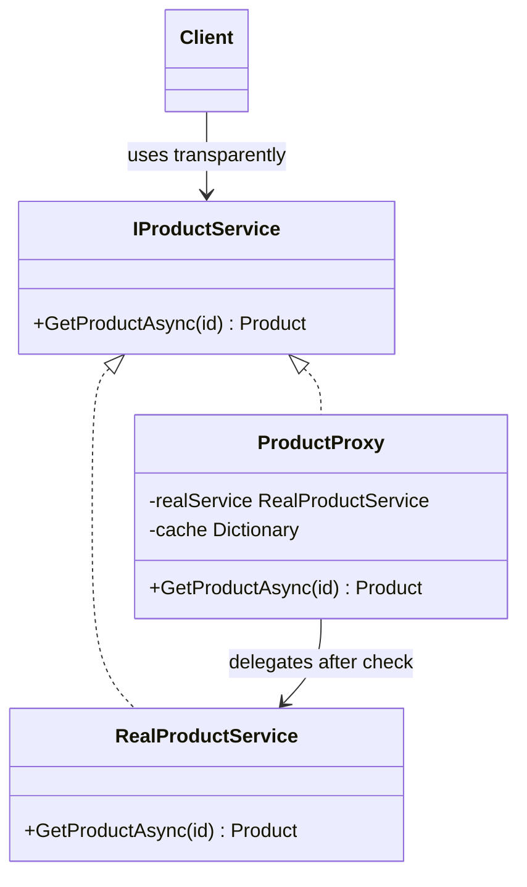

---
topic:
  - Architecture
subtopic:
  - Patterns
level:
  - "3"
priority: High
status: Creation
dg-publish: true
---
# Proxy

A security guard at a building entrance is a Proxy. The guard has the same "enter" interface as an open door, but checks your badge before letting you through. Some proxies are lazy — like an automatic door that only powers on when someone approaches. Some are protective — checking credentials before granting access. Some are virtual — an intercom that represents someone who isn’t physically present. In every case, the proxy stands in front of the real thing and controls access to it.

The Proxy pattern provides a surrogate for another object to control access to it. The proxy implements the same interface as the real subject and holds a reference to it, intercepting calls and deciding whether, when, and how to forward them. Three common variants: a **virtual proxy** defers expensive creation until first use (lazy-loading product images), a **caching proxy** stores results to avoid repeated work, and a **protection proxy** checks authorization before forwarding. The client interacts with the proxy transparently — it looks identical to the real object.



> [!NOTE] Proxy vs Decorator
> Both wrap the same interface. **Proxy CONTROLS ACCESS** — lazy loading, caching, auth. [[Software Engineering/05 Architecture/Patterns/Design Patterns/Structural/Decorator|Decorator]] **ADDS BEHAVIOR** — logging, metrics, validation. The structural difference is intent: Proxy restricts or defers; Decorator enriches. A caching proxy that also logs is a Proxy with a Decorator concern mixed in — keep them separate.

## Problem

`ProductService` loads full product details (high-res images, reviews, related products) on every request — slow and wasteful for catalog browsing:

```csharp
public class ProductService(IProductRepository repository)
{
    // ⚠️ Loads everything on every call — 500ms per product
    public async Task<Product> GetProductAsync(Guid productId)
    {
        var product = await repository.GetByIdAsync(productId);
        // ⚠️ Always loads expensive related data, even for list views
        product.HighResImages = await repository.GetImagesAsync(productId);
        product.Reviews = await repository.GetReviewsAsync(productId);
        product.RelatedProducts = await repository.GetRelatedAsync(productId);
        return product;
    }
}

// ⚠️ Catalog page loads 20 products × 500ms = 10 seconds
// ⚠️ No caching — same product fetched repeatedly across requests
```

Here's what breaks when requirements change: adding a "recently viewed" feature that loads 10 products per page makes the page 5 seconds slower because every product loads all related data.

## Solution

Three proxy variants for the same `IProductService` interface:

```csharp
public interface IProductService
{
    Task<Product> GetProductAsync(Guid productId);
    Task<IReadOnlyList<Product>> GetCatalogAsync(int page, int pageSize);
}

// Real subject
public class ProductService(IProductRepository repository) : IProductService
{
    public Task<Product> GetProductAsync(Guid productId) =>
        repository.GetFullProductAsync(productId); // loads everything

    public Task<IReadOnlyList<Product>> GetCatalogAsync(int page, int pageSize) =>
        repository.GetCatalogAsync(page, pageSize); // loads summaries only
}

// Virtual Proxy — lazy-loads expensive data on first access
public class LazyProductProxy(Guid productId, IProductRepository repository) : IProductService
{
    private Product? _product;
    private bool _imagesLoaded;

    public async Task<Product> GetProductAsync(Guid productId)
    {
        // ✅ Load basic data immediately, expensive data only when accessed
        _product ??= await repository.GetSummaryAsync(productId);

        if (!_imagesLoaded)
        {
            _product.HighResImages = await repository.GetImagesAsync(productId);
            _imagesLoaded = true; // ✅ subsequent calls use cached images
        }

        return _product;
    }

    public Task<IReadOnlyList<Product>> GetCatalogAsync(int page, int pageSize) =>
        repository.GetCatalogAsync(page, pageSize);
}

// Caching Proxy — memoizes results to avoid repeated DB calls
public class CachingProductProxy(IProductService inner, IMemoryCache cache) : IProductService
{
    public async Task<Product> GetProductAsync(Guid productId)
    {
        var cacheKey = $"product:{productId}";

        // ✅ Return cached result if available
        if (cache.TryGetValue(cacheKey, out Product? cached))
            return cached!;

        var product = await inner.GetProductAsync(productId);

        // ✅ Cache for 5 minutes — product details change infrequently
        cache.Set(cacheKey, product, TimeSpan.FromMinutes(5));
        return product;
    }

    public async Task<IReadOnlyList<Product>> GetCatalogAsync(int page, int pageSize)
    {
        var cacheKey = $"catalog:{page}:{pageSize}";
        if (cache.TryGetValue(cacheKey, out IReadOnlyList<Product>? cached))
            return cached!;

        var result = await inner.GetCatalogAsync(page, pageSize);
        cache.Set(cacheKey, result, TimeSpan.FromMinutes(1));
        return result;
    }
}

// Protection Proxy — checks authorization before forwarding
public class AuthorizedProductProxy(IProductService inner, IAuthorizationService auth, IHttpContextAccessor ctx)
    : IProductService
{
    public async Task<Product> GetProductAsync(Guid productId)
    {
        var product = await inner.GetProductAsync(productId);

        // ✅ B2B-only products require business account
        if (product.IsB2BOnly)
        {
            var result = await auth.AuthorizeAsync(ctx.HttpContext!.User, "B2BCustomer");
            if (!result.Succeeded)
                throw new UnauthorizedAccessException("B2B account required");
        }

        return product;
    }

    public Task<IReadOnlyList<Product>> GetCatalogAsync(int page, int pageSize) =>
        inner.GetCatalogAsync(page, pageSize);
}

// DI: compose proxies — caching wraps the real service, auth wraps caching
builder.Services.AddScoped<ProductService>();
builder.Services.AddScoped<IProductService>(sp =>
    new AuthorizedProductProxy(
        new CachingProductProxy(sp.GetRequiredService<ProductService>(), sp.GetRequiredService<IMemoryCache>()),
        sp.GetRequiredService<IAuthorizationService>(),
        sp.GetRequiredService<IHttpContextAccessor>()));
```

Adding a rate-limiting proxy now means one new class implementing `IProductService` — the real service and existing proxies never change.

## You Already Use This

**EF Core lazy-loading proxies** — `UseLazyLoadingProxies()` generates a proxy class for each entity. `order.Customer` returns a proxy; the proxy loads the `Customer` from the database on first property access. The proxy implements the same interface as the real entity.

**`System.Reflection.DispatchProxy`** — .NET's built-in mechanism for creating proxy classes at runtime. `DispatchProxy.Create<T, TProxy>()` generates a proxy that intercepts all interface method calls. Used by Moq, NSubstitute, and Castle DynamicProxy for test doubles.

**`IHttpClientFactory` + `DelegatingHandler`** — each `DelegatingHandler` in the `HttpClient` pipeline is a proxy over the inner handler. Retry handlers, auth handlers, and circuit breakers are all protection/virtual proxies over the HTTP call.

## Pitfalls

**Proxy hiding performance problems** — a caching proxy can mask a slow underlying service. If the cache is cold (first request, cache miss), the caller experiences the full latency. Monitor cache hit rates; a low hit rate means the proxy isn't helping and the underlying service needs optimization.

**Proxy chains creating unexpected behavior** — stacking a caching proxy over a protection proxy means the auth check runs on cache miss but not on cache hit. If authorization rules change, cached results bypass the new rules until they expire. Order proxies carefully: auth should be outermost (runs every time), caching should be inner (only caches authorized results).

**EF Core lazy-loading N+1 problem** — lazy-loading proxies load related entities one at a time. Loading 100 orders and accessing `order.Customer` for each triggers 100 separate DB queries. Use `Include()` for known access patterns; reserve lazy loading for genuinely unpredictable access.

## Tradeoffs

| Concern | Proxy | Direct access |
|---|---|---|
| Lazy loading | Defers cost to first access | Pays cost upfront or never |
| Caching | Transparent to callers | Callers must manage cache keys |
| Auth enforcement | Centralized, consistent | Scattered across callers |
| Debugging | Extra indirection, harder to trace | Direct call, easy to trace |
| Stale data (caching) | Risk of serving outdated results | Always fresh |

**Decision rule**: Use a caching proxy when the same data is read frequently and changes infrequently (product catalog, configuration). Use a virtual proxy when initialization is expensive and the object may not always be needed. Use a protection proxy when access control must be enforced consistently across all callers. Avoid proxy chains deeper than 3 — the interaction effects become hard to reason about.

## Questions

> [!QUESTION]- How does EF Core's lazy-loading proxy differ from a manually written virtual proxy?
> EF Core generates the proxy class at runtime using Castle DynamicProxy — you don't write it. The proxy overrides every virtual navigation property; accessing the property triggers a DB query if the value isn't loaded. The difference from a manual proxy: EF Core's proxy is generated per entity type, not per instance; it uses the same `DbContext` that loaded the entity. A manual proxy is written once and works for all instances. The tradeoff: EF Core's proxy is automatic but requires virtual properties and a parameterless constructor; a manual proxy is explicit but requires more code.

> [!QUESTION]- When should you use a caching proxy vs `IMemoryCache` directly in the service?
> Use a caching proxy when you want caching to be transparent to the service — the service doesn't know it's being cached. This is useful when the service is a third-party class you can't modify, or when you want to swap caching strategies (in-memory vs distributed) without changing the service. Use `IMemoryCache` directly in the service when caching is a core concern of the service (e.g., a product catalog service that always caches), or when you need fine-grained control over cache keys and expiration. The tradeoff: proxy keeps the service pure but adds indirection; direct caching is explicit but couples the service to the caching strategy.

> [!QUESTION]- What's the difference between a Proxy and a Decorator in terms of intent?
> Intent is the key difference — the structure is identical. A Proxy controls access: it decides whether to forward the call at all (protection proxy), when to forward it (virtual proxy), or whether to use a cached result instead (caching proxy). A Decorator always forwards the call and adds behavior around it. A logging decorator always calls `next.HandleAsync(order)` — it never skips the call. A protection proxy may throw before calling the real service. If the wrapper can prevent the call from reaching the real object, it's a Proxy. If it always calls through and adds behavior, it's a Decorator.

## References

- [Proxy Pattern — Christopher Okhravi](https://www.youtube.com/watch?v=NwaabHqPHeM&list=PLrhzvIcii6GNjpARdnO4ueTUAVR9eMBpc&index=10) — video walkthrough of the Proxy pattern with OOP examples
- [Proxy — refactoring.guru](https://refactoring.guru/design-patterns/proxy) — canonical pattern description with virtual/caching/protection variants and C# example
- [Lazy loading related data — EF Core — Microsoft Learn](https://learn.microsoft.com/en-us/ef/core/querying/related-data/lazy) — EF Core lazy-loading proxy in production use
- [DispatchProxy — Microsoft Learn](https://learn.microsoft.com/en-us/dotnet/api/system.reflection.dispatchproxy) — .NET's runtime proxy generation mechanism
- [Castle DynamicProxy — GitHub](https://github.com/castleproject/Core) — the proxy library used by Moq, NSubstitute, and EF Core

<!-- whats-next:start -->

---

> [!note] Whats next
> **Parent**
>  [[Software Engineering/05 Architecture/Patterns/Design Patterns/Design Patterns|Design Patterns]]
>
> **Pages**
> - [[Software Engineering/05 Architecture/Patterns/Design Patterns/Structural/Adapter|Adapter]]
> - [[Software Engineering/05 Architecture/Patterns/Design Patterns/Structural/Bridge|Bridge]]
> - [[Software Engineering/05 Architecture/Patterns/Design Patterns/Structural/Composite|Composite]]
> - [[Software Engineering/05 Architecture/Patterns/Design Patterns/Structural/Decorator|Decorator]]
> - [[Software Engineering/05 Architecture/Patterns/Design Patterns/Structural/Facade|Facade]]
> - [[Software Engineering/05 Architecture/Patterns/Design Patterns/Structural/Flyweight|Flyweight]]
<!-- whats-next:end -->
