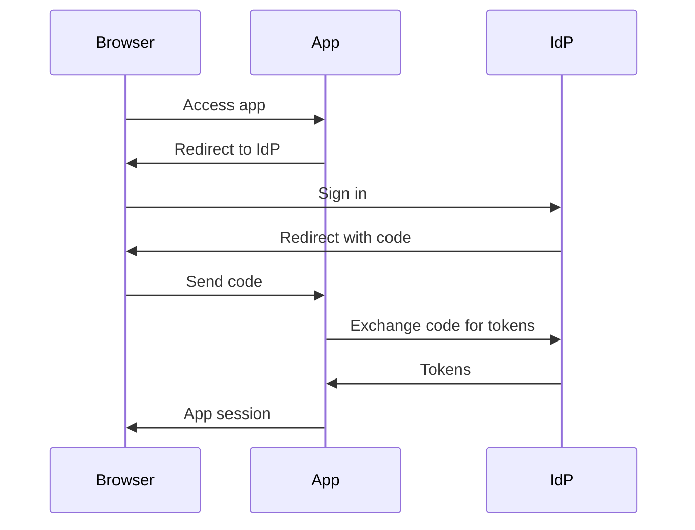

---
topic:
  - "Security"
subtopic: []
level:
  - "3"
priority: High
status: Not-Started

dg-publish: true
---

# Intro

Single sign-on (SSO) lets a user authenticate once with an identity provider (IdP) and then access multiple applications without re-entering credentials.
In modern web systems, SSO is usually implemented with OpenID Connect (OIDC) on top of OAuth 2.0.
The core engineering work is session management, token validation, and handling failure modes safely.

## Deeper Explanation

### Mental Model

In OIDC, the user signs in at the IdP and the application creates its own session after validating tokens.

## Questions

> [!QUESTION]- What problem does SSO solve and what does it not solve?
> It reduces repeated interactive logins across apps.
> It does not replace authorization or per app session management.

> [!QUESTION]- What must you validate when accepting a token from an IdP?
> Signature, issuer, audience, lifetime, and nonce or state where applicable.
> Also validate the redirect URI and expected auth flow.

## Links

- [OpenID Connect on ASP.NET Core](https://learn.microsoft.com/aspnet/core/security/authentication/openid-connect?view=aspnetcore-8.0)
- [OAuth 2.0 RFC 6749](https://www.rfc-editor.org/rfc/rfc6749)
- [OpenID Connect Core 1.0](https://openid.net/specs/openid-connect-core-1_0.html)
- [NIST Digital Identity Guidelines 800 63](https://pages.nist.gov/800-63-3/)

<!-- whats-next:start -->

---

> [!note] Whats next
> **Parent**
>  [[Software Engineering/07 Security/07 Security|07 Security]]
>
> **Pages**
> - [[Software Engineering/07 Security/Authentication/Basic Auth|Basic Auth]]
> - [[Software Engineering/07 Security/Authentication/Oauth OIDC (OpenId Connect)|Oauth OIDC (OpenId Connect)]]
> - [[Software Engineering/07 Security/Authentication/Resource-based Auth|Resource-based Auth]]
> - [[Software Engineering/07 Security/Authentication/Two-Factor Auth|Two-Factor Auth]]
<!-- whats-next:end -->
