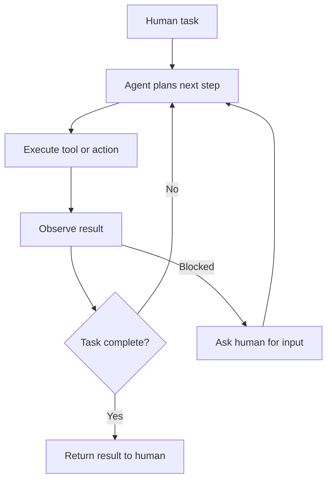

---
topic:
  - AI & ML
subtopic:
  - LLM
tags:
  - FolderNote
dg-publish: true
status: Done
priority: Low
level:
  - '3'
---

# Intro

An agentic system is any system where an LLM controls part of the workflow — calling tools, making decisions, or directing other LLMs. The term "agent" gets used loosely, but there is a practical distinction that matters for system design:

- **Workflows** are systems where LLMs and tools are orchestrated through predefined code paths. The developer controls the sequence; the LLM handles individual steps.
- **Agents** are systems where the LLM dynamically directs its own process and tool usage, deciding what to do next based on results so far.

Most production systems that people call "agents" are actually workflows — and that is the right choice. The most effective agentic systems use the simplest pattern that solves the problem. Start with a single LLM call with good prompting and retrieval. Add workflow orchestration when that falls short. Reach for autonomous agents only when the task is genuinely open-ended and unpredictable.

## The Augmented LLM

The building block of every agentic system is an LLM enhanced with retrieval, [[Software Engineering/11 AI & ML/LLM/Agents/Tools|tools]], and memory. The model generates its own search queries, selects appropriate tools, and decides what information to retain. Before building multi-step systems, invest in making this single building block work well — choose the right model, tune the prompts, and ensure tools have clear, well-documented interfaces.

[[Software Engineering/11 AI & ML/LLM/Agents/Model Context Protocol|Model Context Protocol (MCP)]] standardizes how an augmented LLM connects to external tools and data sources.

## Workflow Patterns

Five agentic workflow patterns — prompt chaining, routing, parallelization, orchestrator-workers, and evaluator-optimizer — form a progression of increasing complexity. See [[Software Engineering/11 AI & ML/LLM/Agents/Multi-Agentic Systems|Multi-Agentic Systems]] for all workflow pattern details, diagrams, and code examples.

## Autonomous Agents

When the task is genuinely open-ended — you cannot predict the number of steps, and no fixed workflow covers the problem — use an autonomous agent. An agent is an LLM using tools in a loop: observe results, decide next action, execute, repeat.

Agents are powerful but come with higher costs and compounding error risk. Each step that goes slightly wrong can push the agent further off track. Three principles from production experience:

1. **Simplicity** — keep the design minimal. Complex agents are harder to debug and more prone to cascading failures.
2. **Transparency** — show the agent's planning and reasoning steps explicitly. When something fails, you need to see where and why.
3. **Tool quality** — invest as much effort in tool interfaces (documentation, error messages, parameter design) as in prompts. Think of it as designing an API for a junior developer — if the tool is ambiguous to use, the agent will misuse it.

Where agents work well today: coding tasks (verifiable via tests), customer support (measurable via resolution), and research tasks (structured by sources). The common thread is clear success criteria and feedback loops that let the agent assess its own progress.

For patterns on coordinating multiple agents, see [[Software Engineering/11 AI & ML/LLM/Agents/Multi-Agentic Systems|Multi-Agentic Systems]].

## Questions

> [!QUESTION]- When should you use a workflow instead of an autonomous agent?
> - Use a workflow when the task decomposes into predictable steps with clear inputs and outputs at each stage
> - Workflows are cheaper, faster, and more debuggable than autonomous agents
> - Use an autonomous agent only when steps are unpredictable, the task is open-ended, and you have feedback mechanisms (tests, eval criteria) to catch errors
> - Most production "agents" are actually workflows — and that is the right choice for the majority of use cases
> - Key tradeoff: workflows trade flexibility for reliability; agents trade reliability for adaptability

## References

- [Building Effective Agents (Anthropic Engineering)](https://www.anthropic.com/engineering/building-effective-agents)
- [Patterns for Basic Agent Workflows — cookbook (Anthropic)](https://platform.claude.com/cookbook/patterns-agents-basic-workflows)
- [Claude Agent SDK — overview and patterns (Anthropic)](https://platform.claude.com/docs/en/agent-sdk/overview)
- [Microsoft Agent Framework — Overview (Microsoft Learn)](https://learn.microsoft.com/en-us/agent-framework/overview/)
- [Semantic Kernel to Agent Framework Migration Guide (Microsoft)](https://learn.microsoft.com/en-us/agent-framework/migration-guide/from-semantic-kernel/)

<!-- whats-next:start -->

---

> [!note] Whats next
> **Parent**
>  [[Software Engineering/11 AI & ML/LLM/LLM|LLM]]
>
> **Pages**
> - [[Software Engineering/11 AI & ML/LLM/Agents/Agent Loop|Agent Loop]]
> - [[Software Engineering/11 AI & ML/LLM/Agents/Model Context Protocol|Model Context Protocol]]
> - [[Software Engineering/11 AI & ML/LLM/Agents/Multi-Agentic Systems|Multi-Agentic Systems]]
> - [[Software Engineering/11 AI & ML/LLM/Agents/Tools|Tools]]
<!-- whats-next:end -->
