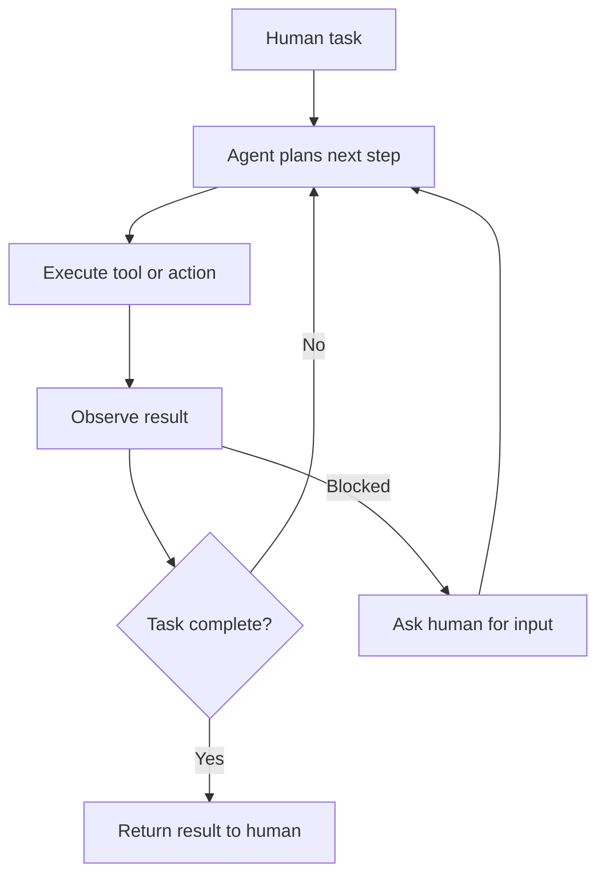

---
topic:
  - AI & ML
subtopic:
  - LLM
tags:
  - FolderNote
dg-publish: true
status: Creation
priority: Low
level:
  - '3'
---

# Intro

An agentic system is any system where an LLM controls part of the workflow — calling tools, making decisions, or directing other LLMs. The term "agent" gets used loosely, but there is a practical distinction that matters for system design:

- **Workflows** are systems where LLMs and tools are orchestrated through predefined code paths. The developer controls the sequence; the LLM handles individual steps.
- **Agents** are systems where the LLM dynamically directs its own process and tool usage, deciding what to do next based on results so far.

Most production systems that people call "agents" are actually workflows — and that is the right choice. The most effective agentic systems use the simplest pattern that solves the problem. Start with a single LLM call with good prompting and retrieval. Add workflow orchestration when that falls short. Reach for autonomous agents only when the task is genuinely open-ended and unpredictable.

## The Augmented LLM

The building block of every agentic system is an LLM enhanced with retrieval, [[Software Engineering/11 AI & ML/LLM/Agents/Tools|tools]], and memory. The model generates its own search queries, selects appropriate tools, and decides what information to retain. Before building multi-step systems, invest in making this single building block work well — choose the right model, tune the prompts, and ensure tools have clear, well-documented interfaces.

[[Software Engineering/11 AI & ML/LLM/Agents/Model Context Protocol|Model Context Protocol (MCP)]] standardizes how an augmented LLM connects to external tools and data sources.

## Workflow Patterns

Five patterns cover most production agentic systems. Each trades latency and cost for better task performance in a specific way.

### Prompt Chaining

Break a task into sequential steps where each LLM call processes the output of the previous one. Add programmatic checks between steps to verify the process stays on track.

When to use: tasks that decompose cleanly into fixed subtasks. Example: generate marketing copy, then translate it. Write an outline, validate it meets criteria, then write the document.

### Routing

Classify the input and direct it to a specialized prompt or model. This lets you optimize each downstream path independently — a change to handle refund requests will not degrade general question answering.

When to use: distinct input categories that need different handling. Example: route customer queries — general questions to a small fast model, complex technical issues to a larger model, refund requests to a constrained workflow with tool access.

### Parallelization

Run LLM calls simultaneously and aggregate results. Two variants: **sectioning** splits independent subtasks across parallel calls; **voting** runs the same task multiple times for higher confidence.

When to use: independent subtasks that benefit from speed, or tasks where multiple perspectives improve reliability. Example: one LLM processes the user query while another screens for policy violations in parallel. Or multiple prompts review code for vulnerabilities and flag issues independently.

### Orchestrator-Workers

A central LLM dynamically breaks the task into subtasks, delegates each to a worker LLM, and synthesizes results. Unlike parallelization, the subtasks are not predefined — the orchestrator determines them based on the input.

When to use: complex tasks where you cannot predict the subtasks in advance. Example: a coding agent that determines which files need changes and what each change should be.

### Evaluator-Optimizer

One LLM generates a response; another evaluates it and provides feedback. The loop continues until the evaluator is satisfied. This is the LLM equivalent of an iterative editing process.

When to use: tasks with clear evaluation criteria where iterative refinement adds measurable value. Example: literary translation where an evaluator catches nuance the translator missed.

## Autonomous Agents

When the task is genuinely open-ended — you cannot predict the number of steps, and no fixed workflow covers the problem — use an autonomous agent. An agent is an LLM using tools in a loop: observe results, decide next action, execute, repeat.

Agents are powerful but come with higher costs and compounding error risk. Each step that goes slightly wrong can push the agent further off track. Three principles from production experience:

1. **Simplicity** — keep the design minimal. Complex agents are harder to debug and more prone to cascading failures.
2. **Transparency** — show the agent's planning and reasoning steps explicitly. When something fails, you need to see where and why.
3. **Tool quality** — invest as much effort in tool interfaces (documentation, error messages, parameter design) as in prompts. Think of it as designing an API for a junior developer — if the tool is ambiguous to use, the agent will misuse it.

Where agents work well today: coding tasks (verifiable via tests), customer support (measurable via resolution), and research tasks (structured by sources). The common thread is clear success criteria and feedback loops that let the agent assess its own progress.

For patterns on coordinating multiple agents, see [[Software Engineering/11 AI & ML/LLM/Agents/Multi-Agentic Systems|Multi-Agentic Systems]].

## Questions

> [!QUESTION]- When should you use a workflow instead of an autonomous agent?
> Use a workflow when the task decomposes into predictable steps — you know the sequence in advance and each step has clear inputs and outputs. Workflows are cheaper, faster, and more debuggable. Use an autonomous agent only when you cannot predict the steps needed, the task is open-ended, and you have a feedback mechanism (tests, evaluation criteria) to catch errors. Most production "agents" are actually workflows, and that is the right choice for most use cases.

> [!QUESTION]- Why does Anthropic recommend starting with the simplest possible solution?
> Each layer of agentic complexity — chaining, routing, parallelization, autonomy — adds latency, cost, and failure surface. A single well-prompted LLM call with good retrieval solves many tasks. Adding orchestration only makes sense when you can demonstrate measurably better outcomes that justify the added complexity. Teams that start with complex multi-agent systems often spend more time debugging coordination than solving the actual problem.

> [!QUESTION]- Why is tool design often more important than prompt design in agentic systems?
> In a single LLM call, the prompt is the entire interface. In an agentic system, the LLM interacts with tools repeatedly — each tool call is a decision point where the agent can succeed or fail. Poorly documented tools, ambiguous parameters, or inconsistent error messages cause wrong tool calls that compound across steps. Anthropic's SWE-bench agent team spent more time optimizing tools (e.g., switching from relative to absolute file paths to eliminate a class of errors) than optimizing prompts, because tool quality directly determined task success rate.

## References

- [Building Effective Agents (Anthropic Engineering)](https://www.anthropic.com/engineering/building-effective-agents)
- [Patterns for Basic Agent Workflows — cookbook (Anthropic)](https://platform.claude.com/cookbook/patterns-agents-basic-workflows)
- [Claude Agent SDK — overview and patterns (Anthropic)](https://platform.claude.com/docs/en/agent-sdk/overview)
- [Using Azure AI Agents with Semantic Kernel in .NET and Python (Microsoft)](https://devblogs.microsoft.com/semantic-kernel/using-azure-ai-agents-with-semantic-kernel-in-net-and-python/)
- [The Future of AI — Customizing AI Agents with Semantic Kernel (Microsoft)](https://devblogs.microsoft.com/semantic-kernel/the-future-of-ai-customizing-ai-agents-with-the-semantic-kernel-agent-framework/)

<!-- whats-next:start -->

---

> [!note] Whats next
> **Parent**
>  [[Software Engineering/11 AI & ML/LLM/LLM|LLM]]
>
> **Pages**
> - [[Software Engineering/11 AI & ML/LLM/Agents/Agent Loop|Agent Loop]]
> - [[Software Engineering/11 AI & ML/LLM/Agents/Mental Framework|Mental Framework]]
> - [[Software Engineering/11 AI & ML/LLM/Agents/Model Context Protocol|Model Context Protocol]]
> - [[Software Engineering/11 AI & ML/LLM/Agents/Multi-Agentic Systems|Multi-Agentic Systems]]
> - [[Software Engineering/11 AI & ML/LLM/Agents/Tools|Tools]]
<!-- whats-next:end -->
