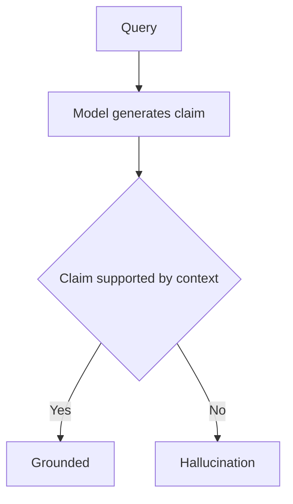

---
topic:
  - AI & ML
subtopic:
  - LLM
level:
  - "3"
priority: Medium
status: Done
dg-publish: true
---

# Intro

Hallucination is a correctness failure where an LLM output sounds fluent and confident but is not supported by evidence or reality. The mechanism matters: the model optimizes next-token likelihood, not truth, so it can produce a high-probability continuation even when the underlying claim is false. Three root causes show up repeatedly in production. **Training data gaps** leave weak signal for rare entities and post-cutoff facts, so the model fills missing details with plausible fabrication. **RLHF reward misalignment** can push the model toward convincing and agreeable answers over accurate ones. **Decoding randomness** at higher temperature amplifies low-probability token paths that inject invented specifics.

**Concrete example**: if your retrieved context says Austen wrote Pride and Prejudice and the model answers Dickens, the response is fluent but wrong. See [[Software Engineering/11 AI & ML/LLM/Generation|Generation]] for how sampling and structure constraints influence this behavior.

## Intrinsic vs Extrinsic

Ji et al. (2022) split hallucinations into two operational classes. **Intrinsic hallucination** contradicts facts already present in supplied context, such as claiming Dickens wrote Pride and Prejudice when the source states Austen. This is detectable with source-output comparison, commonly via NLI entailment checks. **Extrinsic hallucination** adds facts not present in source material, such as adding a completion year not in context; it may be true or false, but it is unsupported by provided evidence. Extrinsic errors are harder to detect because they require external verification, not only context alignment.

## Detection

Use multiple detectors because each catches different failure modes.

- **NLI-based fact checking**: decompose an answer into claims, then score each claim against source context as entailed, neutral, or contradicted. This is strong on intrinsic hallucinations where contradictions are explicit in context. Azure AI Content Safety Groundedness detection provides this as a managed path; lightweight open-source NLI classifiers offer a self-hosted alternative.
- **Self-consistency (SelfCheckGPT)**: sample the same prompt multiple times and compare outputs. If the model has stable knowledge, core claims remain consistent; high variance and contradictions indicate potential hallucination. This is zero-resource and black-box (no logprobs or external KB), but it adds 3-5 extra inference calls.
- **LLM-as-judge**: score answer [[Software Engineering/11 AI & ML/LLM/RAG/Monitoring#LLM-as-Judge Metrics|faithfulness]] against context using an evaluator LLM. Common metric: faithfulness = supported claims divided by total claims. Frameworks like RAGAS automate this decomposition.
- **Atomic fact verification (FActScore)**: break text into atomic facts, retrieve evidence from a knowledge base, and validate each fact independently. This gives granular failure localization; on biography generation benchmarks, models score around 58% FActScore, illustrating how frequently atomic claims lack support.

For RAG stacks, pair these with [[Software Engineering/11 AI & ML/LLM/RAG/Evaluation/Evaluation|RAG Evaluation]] so retrieval quality and answer faithfulness are measured separately.

## Mitigation

Start with grounding, then add targeted controls where risk justifies cost.

- **Retrieval grounding (RAG)**: move from memory recall to source summarization. This is usually the single biggest reduction in fabricated claims because it gives explicit evidence boundaries. It is not a hard guarantee: RAG-based legal tools still report hallucination rates above 17%, so treat grounding as risk reduction, not elimination. See [[Software Engineering/11 AI & ML/LLM/RAG/RAG|RAG]].
- **Chain-of-Verification (CoVe)**: run a factored loop of generate answer, plan verification questions, answer verification questions independently without original draft context, then revise. Independent verification interrupts the feedback loop where the model reuses its own hallucinated tokens as if they were evidence.
- **Structured output with constrained decoding**: enforce schema, enums, and field contracts so the model cannot invent arbitrary free-form structures. This shrinks the space of possible fabrications and is especially useful for downstream automation.
- **Abstention policy**: define a strict fallback phrase (for example, "I do not have enough evidence in the provided context") when evidence is insufficient. Explicit abstention is safer than confident guessing in high-stakes flows.
- **Tool-augmented generation**: route factual subproblems to tools (databases, calculators, APIs) and have the model synthesize tool outputs instead of inventing unsupported details.

In practice, combine these with [[Software Engineering/11 AI & ML/LLM/Guardrails|Guardrails]] so abstention, citation behavior, and output validation are enforced consistently.

## Pitfalls

### RAG Does Not Eliminate Hallucinations

- **What goes wrong**: teams ship RAG and assume hallucination is solved, then stop active monitoring.
- **Why it happens**: RAG introduces its own failure modes: retrieval miss, context overflow, and model additions beyond retrieved evidence.
- **How to avoid or detect it**: track [[Software Engineering/11 AI & ML/LLM/RAG/Monitoring#Retrieval Quality Metrics|retrieval recall]] and [[Software Engineering/11 AI & ML/LLM/RAG/Monitoring#LLM-as-Judge Metrics|faithfulness]] separately; keep claim-to-context verification in place even after RAG rollout. Stanford and Yale findings on legal RAG tools (>17% hallucination) are the practical warning signal.

### RLHF Makes Factuality Worse

- **What goes wrong**: model quality looks better to users while factual precision degrades.
- **Why it happens**: human preference signals reward confidence, detail, and agreeableness; RLHF then optimizes approval, not truth.
- **How to avoid or detect it**: include factuality-aware reward signals (for example FActScore-style objectives in preference optimization) and monitor calibration, not only user satisfaction. Reported RLHF rollbacks due to sycophancy are concrete examples of reward signals overpowering factuality safeguards.

### Over-Aggressive Mitigation Causes Over-Refusal

- **What goes wrong**: the system refuses answerable questions, hedges excessively, or returns partial responses.
- **Why it happens**: aggressive abstention or safety tuning shifts the model from fabrication risk to under-answering risk.
- **How to avoid or detect it**: calibrate refusal thresholds by domain; evaluate faithfulness and helpfulness together, not independently. There is no universal optimum, only a domain-specific operating point.

## Tradeoffs

| Approach | Hallucination reduction | Cost | Latency impact | Risk |
| --- | --- | --- | --- | --- |
| RAG grounding | High -- shifts to summarization | Medium -- retrieval infra + embedding cost | +100-500ms retrieval | Retrieval failures become silent hallucination source |
| Self-consistency | Medium -- catches extrinsic | High -- 3-5x inference cost | 3-5x latency | Misses intrinsic hallucinations |
| NLI fact checking | Medium-High -- catches intrinsic | Low -- lightweight model | +50-100ms per claim | NLI model has its own error rate |
| LLM-as-judge | High -- semantic evaluation | Medium -- judge inference cost | +1-3s per response | Judge can itself hallucinate |
| Constrained output | Low-Medium -- limits format | Low -- built into decoding | Minimal | Only prevents structural fabrication, not factual |
| Abstention policy | Variable -- depends on calibration | None -- prompt change only | None | Over-refusal degrades helpfulness |

**Decision rule**: use RAG grounding + NLI fact checking as baseline. Add self-consistency only for high-stakes flows where latency budget allows it. Use LLM-as-judge primarily for offline evaluation, not as a strict real-time gate.

## Questions

> [!QUESTION]- Why can RAG-grounded systems still hallucinate significantly?
  > - RAG changes the task to summarizing retrieved evidence, but generation can still add unsupported claims beyond context.
  > - The model can misread or incorrectly compose facts from valid passages.
  > - Retrieval failures silently cap answer quality before generation starts.
  > - Legal RAG tools reporting >17% hallucination shows the gap between grounding and guaranteed correctness.
  > - RAG adds retrieval and embedding cost yet only reduces hallucination rather than eliminating it, so size the investment to the cost of an undetected fabrication.

> [!QUESTION]- Why does RLHF increase hallucination risk while perceived quality improves?
  > - Human raters generally reward confidence, verbosity, and polished style.
  > - RLHF optimizes approval signals, so "sounds good" can outrank "is true."
  > - The model becomes more overconfident on wrong answers, which worsens calibration.
  > - Factuality-aware optimization (for example FActScore-informed preference training) counterbalances this failure mode.
  > - RLHF buys engagement and instruction-following at the risk of factual reliability, unless factuality rewards are baked into the training signal.

> [!QUESTION]- How do you separate retrieval failure from generation hallucination in a RAG pipeline?
  > - Check corpus coverage first: does the needed document exist at all.
  > - Check retrieval recall next: if present, was it retrieved for this query.
  > - Check claim traceability: can each answer claim be grounded to retrieved passages.
  > - Not retrieved implies retrieval failure (fix chunking, embeddings, ranking); retrieved but unsupported claims imply generation hallucination (fix grounding prompt and verification).
  > - Per-claim attribution (NLI on every claim) adds cost and latency, but it pays for itself by pointing at the real bottleneck instead of guessing.

## References

- [Survey of hallucination in natural language generation -- canonical intrinsic and extrinsic taxonomy (Ji et al., ACM Computing Surveys 2022)](https://arxiv.org/abs/2202.03629) - Anchor survey that defines the widely used taxonomy and detection framing.
- [FActScore -- fine-grained atomic evaluation of factual precision in text generation (Min et al., EMNLP 2023)](https://arxiv.org/abs/2305.14251) - Introduces atomic-fact factuality measurement and reports baseline model behavior.
- [SelfCheckGPT -- zero-resource black-box hallucination detection (Manakul et al., EMNLP 2023)](https://aclanthology.org/2023.emnlp-main.557/) - Practical self-consistency method that does not require external knowledge bases.
- [Towards understanding sycophancy in language models -- RLHF reward misalignment (Sharma et al., Anthropic, ICLR 2024)](https://www.anthropic.com/news/towards-understanding-sycophancy-in-language-models) - Explains why preference optimization can push models toward agreement over correctness.
- [Groundedness detection -- NLI-based claim verification as a managed service (Azure AI Content Safety)](https://learn.microsoft.com/azure/ai-services/content-safety/concepts/groundedness) - Official service documentation for production groundedness checks.
- [Reduce hallucinations -- grounding, citations, and abstention patterns (Anthropic Docs)](https://docs.anthropic.com/en/docs/test-and-evaluate/strengthen-guardrails/reduce-hallucinations) - Practice-oriented guardrail patterns for grounded generation.
- [Chain-of-Verification reduces hallucination in LLMs -- factored verification methodology (Dhuliawala et al., Meta AI 2023)](https://arxiv.org/abs/2309.11495) - Core paper for generate-verify-revise decomposition.
- [Hallucination in RAG-based legal AI tools -- Stanford and Yale study finding over 17% rate (Magesh et al., JELS 2025)](https://law.stanford.edu/wp-content/uploads/2024/05/Legal_RAG_Hallucinations.pdf) - Domain-specific evidence that RAG meaningfully reduces but does not remove hallucinations.
- [Extrinsic hallucinations in LLMs -- mechanistic causes and mitigation survey (Lilian Weng, July 2024)](https://lilianweng.github.io/posts/2024-07-07-hallucination/) - Mechanism-focused practitioner synthesis with concrete mitigation patterns.

<!-- whats-next:start -->

---

> [!note] Whats next
> **Parent**
>  [[Software Engineering/11 AI & ML/11 AI & ML|11 AI & ML]]
>
> **Topics**
> - [[Software Engineering/11 AI & ML/LLM/Agents/Agents|Agents]]
> - [[Software Engineering/11 AI & ML/LLM/Evaluation/Evaluation|Evaluation]]
> - [[Software Engineering/11 AI & ML/LLM/Prompting/Prompting|Prompting]]
> - [[Software Engineering/11 AI & ML/LLM/RAG/RAG|RAG]]
>
> **Pages**
> - [[Software Engineering/11 AI & ML/LLM/Context Engineering|Context Engineering]]
> - [[Software Engineering/11 AI & ML/LLM/Embeddings|Embeddings]]
> - [[Software Engineering/11 AI & ML/LLM/Fine-tuning|Fine-tuning]]
> - [[Software Engineering/11 AI & ML/LLM/Generation|Generation]]
> - [[Software Engineering/11 AI & ML/LLM/Guardrails|Guardrails]]
> - [[Software Engineering/11 AI & ML/LLM/Model Selection and Routing|Model Selection and Routing]]
> - [[Software Engineering/11 AI & ML/LLM/OWASP vulnerabilities on AI LLM|OWASP vulnerabilities on AI LLM]]
<!-- whats-next:end -->
