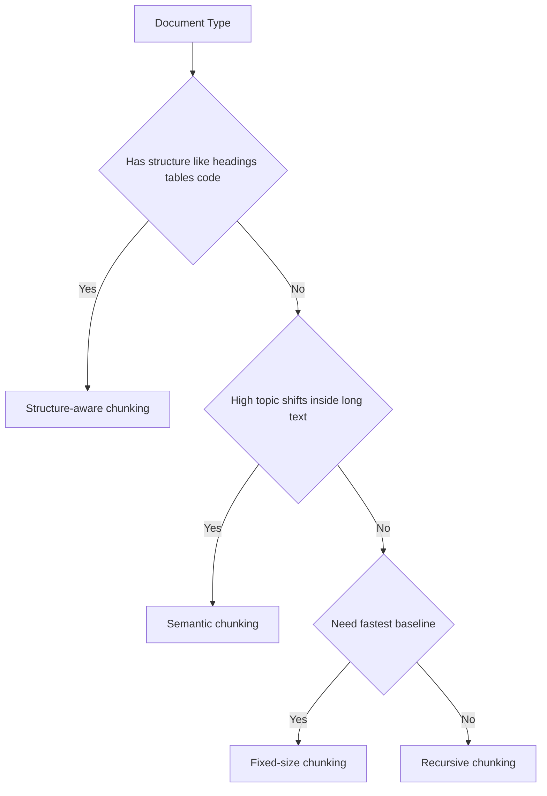

---
topic:
  - "AI & ML"
subtopic:
  - "LLM"
level:
  - "2"
priority: High
status: Creation
---

# Intro

Chunking decides the unit of retrieval. If chunks are too wide, retrieval returns noisy context; if chunks are too narrow, critical constraints are split across fragments and answers become incomplete. The goal is to create chunks that are semantically coherent, operationally efficient, and easy to trace back to source sections.

Example: for a policy doc, splitting by raw character count can separate "allowed action" from "exceptions" in a different chunk. A retriever may pull only the first chunk, and generation then answers incorrectly without the exception clause.

## How to Choose a Strategy



## Chunking Strategies

### Fixed-Size Chunking

How it works:

- Split text by token or character windows with optional overlap.
- Apply same rule to all documents.

Where it fits:

- First baseline when you need predictable latency and simple ingestion.
- Homogeneous corpora where semantic boundaries are less important.

Tradeoffs:

- Pros: easy to implement, stable performance profile.
- Cons: can cut through semantic boundaries and lower answer faithfulness.

### Recursive Chunking

How it works:

- Try splitting by high-level separators first (heading, paragraph, sentence).
- If a piece is still too large, recursively split by lower-level separators.

Where it fits:

- General-purpose default for mixed prose documents.
- Teams that need better boundaries without heavy preprocessing.

Tradeoffs:

- Pros: better semantic preservation than fixed-size in most corpora.
- Cons: still not aware of table or code semantics unless you add custom rules.

### Structure-Aware Chunking

How it works:

- Parse document structure (headings, table rows, code blocks, FAQ items).
- Keep logical blocks together and attach structural metadata.

Where it fits:

- Technical docs, contracts, APIs, and any corpus with strong layout semantics.

Tradeoffs:

- Pros: high interpretability, better citation quality.
- Cons: parser complexity and format-specific edge cases.

### Semantic Chunking

How it works:

- Split text where embedding similarity between neighboring spans drops.
- Bound final chunk length to keep retrieval efficient.

Where it fits:

- Long narrative content with gradual topic changes.
- Corpora where section headers are missing or unreliable.

Tradeoffs:

- Pros: aligns chunks with topic shifts.
- Cons: slower ingestion and parameter sensitivity.

### Paragraph Chunking

How it works:

- Use paragraph boundaries as the primary split unit.
- Merge short paragraphs until target size is reached.

Where it fits:

- Knowledge bases authored with clean paragraph structure.

Tradeoffs:

- Pros: simple and human-readable chunk boundaries.
- Cons: uneven chunk sizes and weak handling of very long paragraphs.

### Parent-Child Chunking

How it works:

- Store larger parent chunks for synthesis context.
- Retrieve smaller child chunks for precision, then map back to parent.

Where it fits:

- Tasks needing both precise retrieval and broader context assembly.

Tradeoffs:

- Pros: strong balance between precision and context completeness.
- Cons: extra storage and orchestration complexity.

### Agentic Chunking

How it works:

- Use an LLM or rule+LLM pipeline to decide chunk boundaries by intent.
- Optionally tag each chunk with summary, entities, and use-case labels.

Where it fits:

- High-value domains where chunk quality materially impacts business risk.

Tradeoffs:

- Pros: can outperform static heuristics on complex docs.
- Cons: high ingestion cost, non-determinism, and harder reproducibility.

## Practical Baselines

- Start with recursive chunking at 300-800 tokens and 10-20% overlap.
- Track per-source retrieval failure modes before switching strategy.
- Always store metadata: source ID, section path, updated timestamp, and ACL scope.
- Re-evaluate strategy when corpus format changes (for example plain docs to table-heavy docs).

## Example

```yaml
chunking:
  strategy: recursive
  target_tokens: 500
  overlap_tokens: 80
  separators:
    - "\n# "
    - "\n\n"
    - ". "
  metadata:
    - source_id
    - section_path
    - updated_at
    - acl_scope
```

## Questions

> [!QUESTION]- Why does parent-child chunking often improve answer completeness over child-only retrieval?
> **Expected answer:** Child chunks improve retrieval precision, but child-only context can miss adjacent constraints. Parent-child mapping restores broader context during generation, reducing partial or decontextualized answers.

> [!QUESTION]- When should a team move from recursive to structure-aware chunking?
> **Expected answer:** Move when retrieval errors consistently come from broken structural units such as split tables, code blocks, or policy clauses. Structure-aware chunking preserves those units and usually improves citation accuracy.

## References

- [RAG techniques (Azure AI Search)](https://learn.microsoft.com/en-us/azure/search/retrieval-augmented-generation-overview)
- [Text splitters (LangChain docs)](https://python.langchain.com/docs/concepts/text_splitters/)
- [Chunking strategies for RAG (Pinecone)](https://www.pinecone.io/learn/chunking-strategies/)

<!-- whats-next:start -->

---

> [!note] Whats next
> **Parent**
>  [[Software Engineering/11 AI & ML/LLM/LLM|LLM]]
>
> **Pages**
> - [[Software Engineering/11 AI & ML/LLM/RAG/Advanced RAG Patterns|Advanced RAG Patterns]]
> - [[Software Engineering/11 AI & ML/LLM/RAG/Caching|Caching]]
> - [[Software Engineering/11 AI & ML/LLM/RAG/Embeddings|Embeddings]]
> - [[Software Engineering/11 AI & ML/LLM/RAG/Evaluation|Evaluation]]
> - [[Software Engineering/11 AI & ML/LLM/RAG/Generation|Generation]]
> - [[Software Engineering/11 AI & ML/LLM/RAG/Grounding|Grounding]]
> - [[Software Engineering/11 AI & ML/LLM/RAG/Monitoring|Monitoring]]
> - [[Software Engineering/11 AI & ML/LLM/RAG/Query Translation|Query Translation]]
> - [[Software Engineering/11 AI & ML/LLM/RAG/RAG vs Fine-Tuning|RAG vs Fine-Tuning]]
> - [[Software Engineering/11 AI & ML/LLM/RAG/Retrieval|Retrieval]]
<!-- whats-next:end -->
