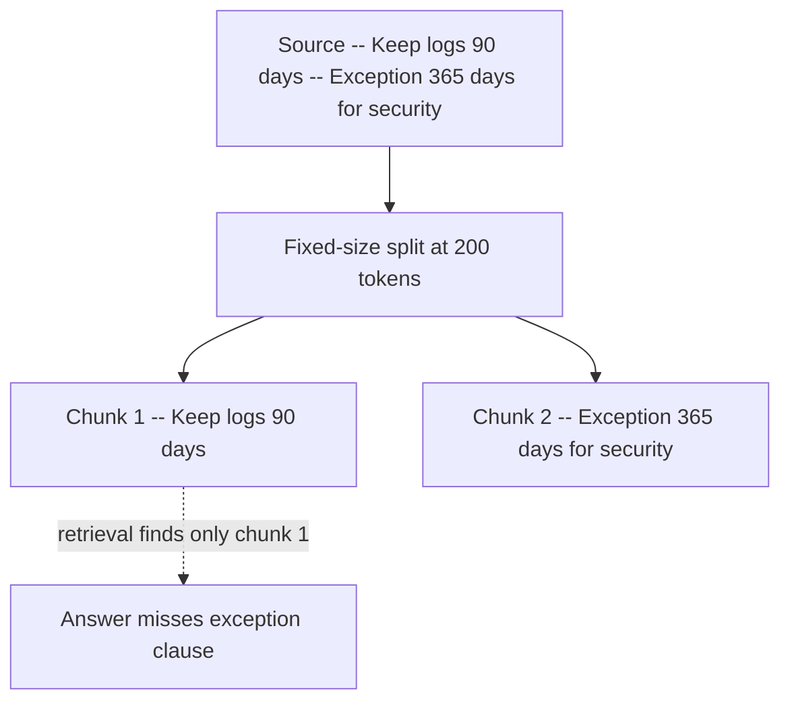
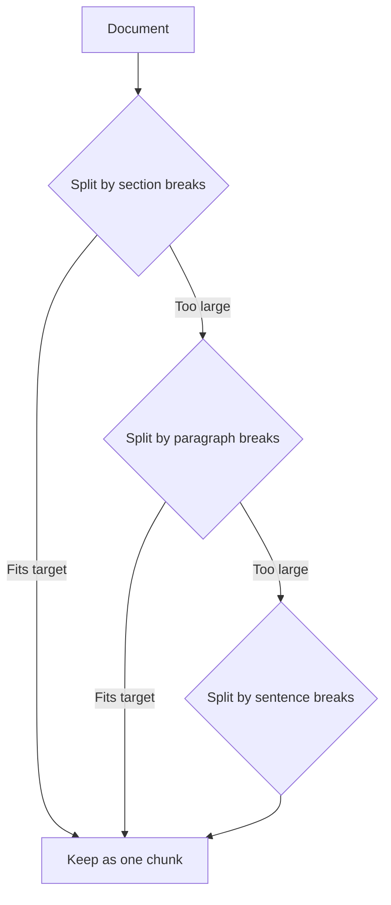
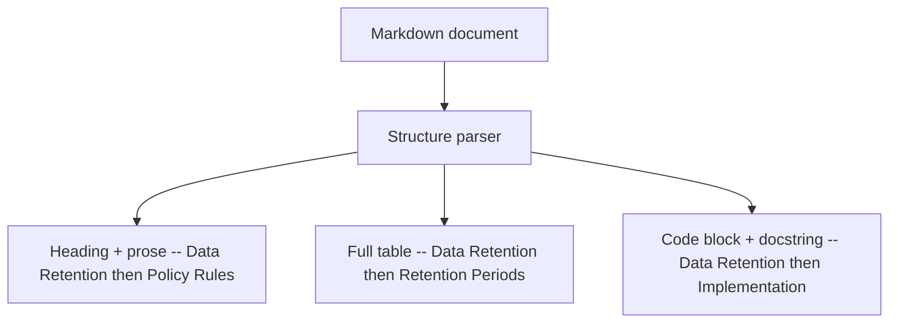
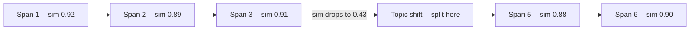
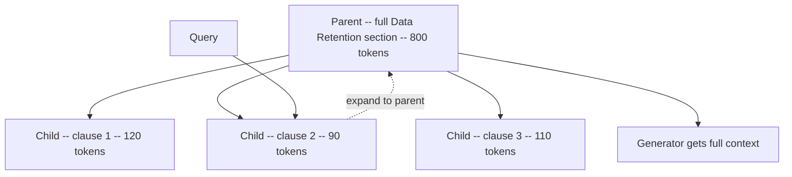
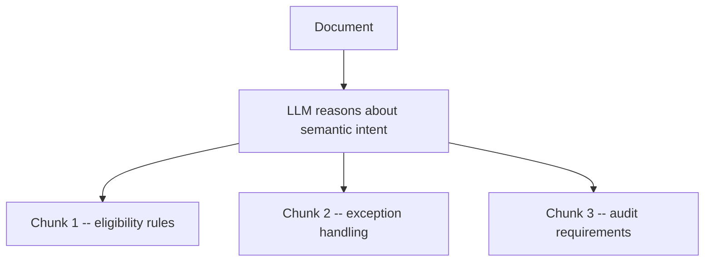

---
topic:
  - "AI & ML"
subtopic:
  - "RAG"
level:
  - "2"
priority: High
status: Creation
dg-publish: true
---

# Intro

Chunking decides the unit of retrieval. If chunks are too wide, retrieval returns noisy context that dilutes the answer; if chunks are too narrow, critical constraints get split across fragments and the model answers from incomplete evidence. The goal is to create chunks that are semantically coherent, operationally efficient, and traceable back to their source section.

Example: a policy doc states "Keep logs for 90 days. Exception: security investigations require 365 days." Splitting by raw character count can place the rule and exception in separate chunks. A retriever pulls only the first chunk, and the model answers without the exception clause — factually wrong, silently confident.

## How to Choose a Strategy

Use retrieval failures, not preference, to pick a strategy.

| What you observe in evaluation | Start with | Why | Upgrade trigger |
| --- | --- | --- | --- |
| Split clauses, tables, or code blocks break answer correctness | Structure-aware | Preserves logical units and improves citation traceability | Parser misses important layouts or ingestion cost gets too high |
| Answers miss adjacent constraints even when relevant docs are found | Parent-child | Keeps retrieval precise while restoring broader synthesis context | Storage and orchestration overhead outweigh quality gains |
| Queries drift across topics inside long prose | Semantic | Places boundaries around topic shifts | Ingestion becomes too slow or unstable across model updates |
| Need a fast, predictable baseline now | Recursive | Better boundaries than fixed-size with low implementation cost | Quality plateaus on mixed-format or highly structured corpora |
| Tight latency and simple homogeneous corpus | Fixed-size | Most operationally predictable ingestion | Faithfulness drops from boundary cuts |

## Chunking Strategies

### Fixed-Size Chunking

How it works:

- Split every document into windows of N tokens (or characters) with a configurable overlap between adjacent windows. Every document follows the same split rule regardless of content structure.
- The overlap parameter controls how much context is shared between neighboring chunks. Typical values are 10-20% of chunk size. Zero overlap is fastest but maximizes the chance of splitting a sentence mid-thought.
- This is the fastest strategy to implement and the most predictable operationally — ingestion throughput is constant per document size, and chunk sizes are uniform, which simplifies vector DB capacity planning.

Where it fits:

- Fast baseline when you need a working pipeline today and plan to improve chunking later.
- Homogeneous text corpora (blog posts, news articles) where documents have consistent structure and few tables or code blocks.

Main risk:

- **Boundary cuts through logical units.** A policy clause, code block, or table row gets split at an arbitrary token offset. The retriever returns a fragment that looks relevant but is incomplete, and the model generates a confidently wrong answer. Mitigate by increasing overlap and auditing retrieval on structured documents.
- **No awareness of document structure.** Headers, sections, and paragraphs are invisible to the splitter. A chunk may start mid-paragraph and end mid-sentence. This hurts both retrieval precision (partial matches) and generation quality (decontextualized evidence).

### Recursive Chunking

How it works:

- Apply a hierarchy of separators from largest to smallest: section breaks (`\n# `), paragraph breaks (`\n\n`), sentence breaks (`. `), then character-level splits. At each level, try the largest separator first. Only recurse to smaller separators when a chunk still exceeds the target size.
- This preserves the largest coherent units possible. A short section stays as one chunk. A long section gets split at paragraph boundaries, not arbitrary offsets.
- Most general-purpose RAG frameworks (LangChain, LlamaIndex) use recursive character splitting as their default. The separator hierarchy is configurable per document format.

Where it fits:

- Strong general-purpose default for mixed prose documents (wiki pages, runbooks, knowledge base articles).
- First upgrade from fixed-size when you need better boundary placement without investing in format-specific parsers.

Main risk:

- **Tables and code blocks can still be split** if the separator hierarchy is text-centric. A markdown table has no `\n\n` between rows, so the splitter treats the whole table as continuous text and may cut mid-row. Add custom separators for table and code block delimiters, or pre-extract these as atomic units before recursive splitting.
- **Separator ordering is format-dependent.** The default hierarchy assumes markdown-style headings. HTML, PDF-extracted text, or Slack exports need different separator lists. A wrong hierarchy degrades to character-level splitting silently.

### Structure-Aware Chunking

How it works:

- Parse the document's actual structure (headings, tables, code blocks, list items) and treat each structural element as an atomic retrieval unit. The parser produces a tree of logical blocks, and each block becomes a chunk with its full structural context preserved.
- Different source formats need different parsers: markdown heading hierarchy, HTML DOM tree, PDF layout analysis (Unstructured, PyMuPDF), DOCX paragraph styles. The parser output is a sequence of typed blocks (heading + prose, table, code block, list).
- Each chunk inherits metadata from its structural ancestors: section title, heading path, document ID. This enables section-level filtering at retrieval time and improves citation traceability.

Where it fits:

- Documents where layout carries meaning: policies with clause/exception structure, API docs with endpoint/parameter tables, runbooks with step/command pairs, legal contracts with nested clauses.
- Corpora with heavy table or code content where recursive splitting consistently breaks structured elements.

Main risk:

- **Parser drift across format versions.** A parser tuned for one markdown flavor may silently misparse another. When document sources change format (e.g., Confluence to Notion export), chunk boundaries degrade without visible errors. Version parsers per source type and run ingestion QA snapshots that compare expected vs actual chunk boundaries on sample documents.
- **Oversized chunks from large structural units.** A single section with 2000 tokens becomes one chunk that exceeds embedding model context or dilutes retrieval precision. Set a max chunk size and recursively split oversized blocks internally while preserving the structural metadata.
- **Parser complexity and maintenance.** Each document format needs its own parser or extraction pipeline. Budget for ongoing parser updates as source formats evolve.

### Semantic Chunking

How it works:

- Compute embedding similarity between adjacent text spans (sentences or small windows). Walk through the document and measure how semantically similar each span is to its neighbor. When similarity drops below a threshold, insert a chunk boundary at that point.
- The core assumption: spans that are semantically similar belong together, and a drop in similarity signals a topic shift. The boundary is placed where the content actually changes, not where a fixed window happens to end.
- Threshold selection is critical. Too aggressive (high threshold) fragments the document into single-sentence chunks. Too conservative (low threshold) produces oversized chunks that span multiple topics. Calibrate on a held-out evaluation set per corpus.

Where it fits:

- Long narrative text that changes topic without reliable headings: transcripts, meeting notes, email threads, unstructured knowledge base articles.
- Corpora where recursive splitting produces chunks that mix unrelated topics because the text lacks structural markers.

Main risk:

- **Threshold instability.** The optimal threshold varies by embedding model, document domain, and even writing style. A threshold tuned on technical docs may over-fragment conversational text. Lock thresholds per corpus and re-evaluate when the embedding model changes.
- **Ingestion cost.** Every span needs an embedding call during chunking (not just at retrieval time). For large corpora, this can be significantly slower and more expensive than rule-based strategies. Batch embedding calls and cache results.
- **Embedding model sensitivity.** Different embedding models produce different similarity distributions for the same text. Switching models requires re-tuning thresholds and potentially re-chunking the entire corpus.

### Parent-Child Chunking

How it works:

- Create two layers of chunks from the same document. Child chunks are small, precise retrieval units (100-200 tokens). Parent chunks are larger context windows (500-1000 tokens) that contain one or more children.
- At retrieval time, search against child chunks for precision — small chunks match specific queries better. When a child matches, expand to its parent chunk before passing context to the generator. The parent provides the surrounding context that the child alone may lack.
- The parent-child mapping is stored as metadata. Each child stores its parent ID. Expansion is a metadata lookup, not a second retrieval call.

Where it fits:

- Domains where child-only retrieval is precise but answers consistently miss adjacent constraints or context. Common in policy docs (rule + exception), technical specs (parameter + constraint), and legal text (clause + condition).
- When you want to improve answer completeness without sacrificing retrieval precision — parent expansion adds context without changing what the retriever matches against.

Main risk:

- **Parent expansion reintroduces noise.** If the parent span is too broad (entire document section), expanding to parent floods the context window with irrelevant content. Limit parent size and track citation precision before and after expansion.
- **Storage overhead.** Storing both parent and child chunks roughly doubles storage per document. For large corpora, this affects vector DB cost and indexing time.
- **Orchestration complexity.** The retrieval pipeline needs a post-retrieval expansion step that maps children to parents, deduplicates overlapping parents, and assembles final context. This adds latency and code to maintain.

### Agentic Chunking

How it works:

- Use an LLM to read the document and decide where to place chunk boundaries based on semantic intent, not fixed rules. The model reasons about document structure, identifies self-contained units of meaning, and outputs boundary positions with optional metadata tags.
- This can be fully agentic (LLM decides everything) or hybrid (rules propose candidates, LLM refines). The hybrid approach is more practical — use recursive splitting to generate candidate chunks, then have the LLM merge or split candidates based on semantic coherence.
- Boundary decisions are non-deterministic. The same document can produce different chunks on re-processing unless you cache the LLM's boundary decisions and version them alongside the prompts and model used.

Where it fits:

- High-stakes domains where chunk quality directly affects business risk: medical guidelines, financial compliance, safety procedures. The marginal improvement in chunk quality justifies the higher ingestion cost.
- Documents with complex implicit structure that rule-based parsers cannot capture — e.g., narrative documents where the logical structure does not follow heading conventions.

Main risk:

- **Non-deterministic boundaries.** Re-running ingestion can produce different chunks, which breaks diff-based cache invalidation and makes regressions hard to reproduce. Cache boundary decisions, version the prompt and model, and treat chunk definitions as versioned artifacts.
- **Cost at scale.** Every document requires LLM inference during ingestion (not just at query time). For large corpora, this can be orders of magnitude more expensive than rule-based chunking. Budget accordingly and reserve for high-value documents.
- **Prompt sensitivity.** Small changes to the chunking prompt can shift boundaries across the corpus. Treat the prompt as production code: version it, test it on a sample set, and monitor chunk quality metrics after changes.

## Practical Baselines

- Start with recursive chunking at 300-800 tokens and 10-20% overlap. This handles most document types well enough to establish baseline retrieval metrics.
- Track per-source retrieval failure modes before switching strategy. Aggregate metrics hide format-specific problems — a retriever can perform well on prose while consistently breaking on table-heavy docs.
- Always store metadata with each chunk: source document ID, section path, ingestion timestamp, and ACL scope. Metadata enables filtering at retrieval time and is much cheaper to add during ingestion than to backfill later.
- Re-evaluate strategy when corpus format changes (e.g., prose-heavy docs to table-heavy docs) or when retrieval metrics plateau despite query translation improvements.

## Tradeoffs

| Strategy | Retrieval precision | Ingestion cost | Implementation complexity | Best corpus type |
| --- | --- | --- | --- | --- |
| Fixed-size | Low — arbitrary cuts split logical units | Lowest — no parsing, constant throughput | Trivial — one parameter (window + overlap) | Homogeneous prose with uniform structure |
| Recursive | Medium — respects paragraph/sentence boundaries | Low — rule-based, no model calls | Low — configurable separator list per format | Mixed prose without heavy tables or code |
| Structure-aware | High — preserves tables, code, clauses as atomic units | Medium — requires format-specific parsers | Medium-High — one parser per source format, ongoing maintenance | Documents where layout carries meaning (policies, API docs, contracts) |
| Semantic | High — boundaries align with actual topic shifts | High — embedding call per span during ingestion | Medium — threshold tuning per corpus and embedding model | Long narrative text without reliable structural markers |
| Parent-child | High (child precision + parent context expansion) | Medium — two-layer indexing, metadata mapping | Medium — retrieval pipeline needs expansion and deduplication step | Domains where answers depend on adjacent constraints (policy, legal, specs) |
| Agentic | Highest — LLM reasons about semantic intent per document | Highest — LLM inference per document at ingestion | High — prompt versioning, non-deterministic output, caching infra | High-stakes documents where chunk quality directly affects business risk |

The table compares steady-state characteristics. In practice, most teams start with recursive chunking to establish baseline metrics, then upgrade specific source types based on observed retrieval failures rather than switching the entire corpus at once.

## Questions

> [!QUESTION]- Why does parent-child chunking often improve answer completeness over child-only retrieval?
> Child chunks maximize retrieval precision — small, focused units match specific queries well. But child-only context can miss adjacent constraints that the answer depends on (e.g., a policy rule in one child and its exception in a sibling). Parent expansion restores the surrounding context during generation, reducing partial or decontextualized answers. The tradeoff is increased context size and potential noise from the broader parent span.

> [!QUESTION]- When should a team move from recursive to structure-aware chunking?
> Move when retrieval errors consistently trace back to broken structural units — split tables, bisected code blocks, or separated clause/exception pairs. Recursive splitting respects paragraph boundaries but is blind to document-specific structures. Structure-aware chunking preserves those units at the cost of format-specific parser investment and ongoing parser maintenance.

> [!QUESTION]- Why is semantic chunking not always superior to simpler rule-based approaches?
> Semantic chunking places boundaries at actual topic shifts, which sounds ideal. But it requires embedding every span during ingestion (high cost), the similarity threshold is sensitive to embedding model and domain (tuning burden), and threshold instability can cause over-fragmentation or oversized chunks. For documents with reliable structural markers (headings, sections), recursive or structure-aware chunking achieves similar boundary quality at a fraction of the ingestion cost.

## References

- [Chunking and integrated vectorization (Azure AI Search)](https://learn.microsoft.com/en-us/azure/search/vector-search-how-to-chunk-documents)
- [Text splitters (LangChain docs)](https://python.langchain.com/docs/concepts/text_splitters/)
- [Chunking strategies for RAG (Pinecone)](https://www.pinecone.io/learn/chunking-strategies/)
- [Chunking Strategies for RAG Systems: A Practical Engineering Guide](https://zenvanriel.com/ai-engineer-blog/chunking-strategies-for-rag-systems/)
- [5 Levels of Text Splitting (Greg Kamradt)](https://github.com/FullStackRetrieval-com/RetrievalTutorials/blob/main/tutorials/LevelsOfTextSplitting/5_Levels_Of_Text_Splitting.ipynb)
- [Unstructured: Document preprocessing and chunking](https://docs.unstructured.io/open-source/core-functionality/chunking)

<!-- whats-next:start -->

---

> [!note] Whats next
> **Parent**
>  [[Software Engineering/11 AI & ML/LLM/LLM|LLM]]
>
> **Pages**
> - [[Software Engineering/11 AI & ML/LLM/RAG/Caching|Caching]]
> - [[Software Engineering/11 AI & ML/LLM/RAG/Embeddings|Embeddings]]
> - [[Software Engineering/11 AI & ML/LLM/RAG/Evaluation|Evaluation]]
> - [[Software Engineering/11 AI & ML/LLM/RAG/Generation|Generation]]
> - [[Software Engineering/11 AI & ML/LLM/RAG/Grounding|Grounding]]
> - [[Software Engineering/11 AI & ML/LLM/RAG/Monitoring|Monitoring]]
> - [[Software Engineering/11 AI & ML/LLM/RAG/Query Translation|Query Translation]]
> - [[Software Engineering/11 AI & ML/LLM/RAG/RAG vs Fine-Tuning|RAG vs Fine-Tuning]]
> - [[Software Engineering/11 AI & ML/LLM/RAG/Retrieval|Retrieval]]
<!-- whats-next:end -->
