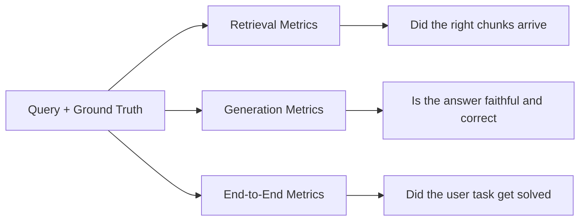
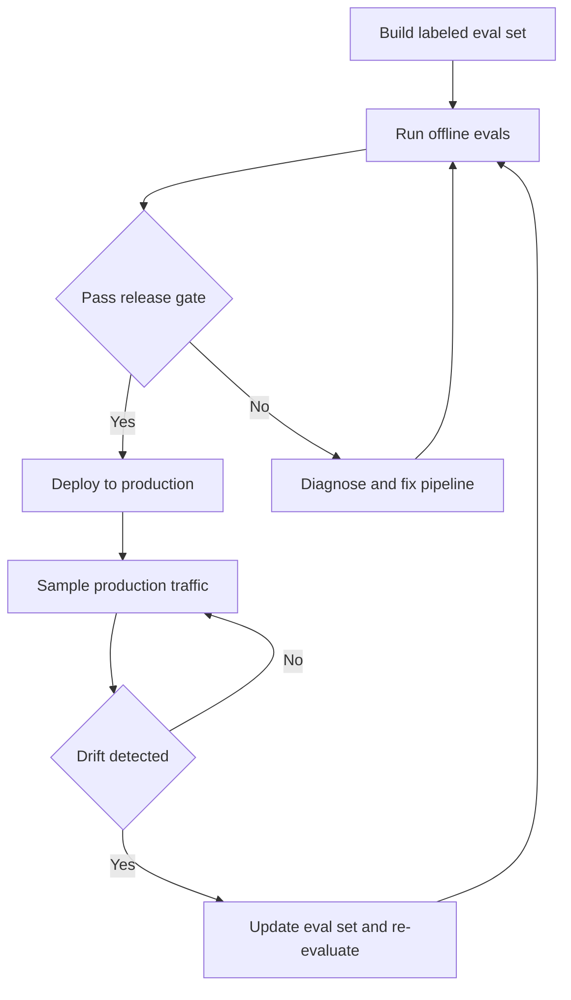

---
topic:
  - "AI & ML"
subtopic:
  - "LLM"
level:
  - "2"
priority: High
status: Creation
dg-publish: true
---

# Intro

RAG evaluation decomposes into three layers: retrieval quality, generation quality, and end-to-end usefulness. Without this decomposition, teams observe "quality dropped" but cannot isolate whether chunking, embedding, retrieval ranking, prompt assembly, or model behavior caused the regression.

The mechanism: each layer has its own metrics, its own failure modes, and its own fix. Retrieval metrics measure whether the right evidence reaches the generator. Generation metrics measure whether the output is faithful to that evidence and actually answers the question. End-to-end metrics measure whether the user's task got solved. A pipeline can have perfect retrieval but poor generation (model ignores context), or perfect generation but poor retrieval (model faithfully summarizes irrelevant documents).

Example: a support bot returns the correct policy document (retrieval passes) but the model misreads a date constraint and answers with the wrong deadline (generation fails). Without layer separation, the team would chase retrieval improvements that cannot fix a generation problem.

## Retrieval Metrics

Retrieval metrics evaluate whether the relevant documents reached the generator. All assume a labeled set where each query has known relevant documents.

**Recall@k** — of all relevant documents in the corpus, what fraction appears in the top-k results. Recall@5 = 0.8 means 80% of relevant documents land in the top 5. This is the primary retrieval metric for RAG because the generator cannot use evidence it never sees. A recall failure is a hard ceiling on answer quality.

**Precision@k** — of the k documents retrieved, what fraction is relevant. Precision@5 = 0.6 means 3 of 5 retrieved documents are relevant. Low precision floods the context window with noise, which can degrade generation quality and increase token cost.

**MRR (Mean Reciprocal Rank)** — the average of 1/rank for the first relevant document across queries. If the first relevant result is at position 3, the reciprocal rank is 1/3. MRR rewards pushing the best result higher. Useful when the generator primarily uses the top-ranked chunk.

**nDCG@k (Normalized Discounted Cumulative Gain)** — measures ranking quality with graded relevance. Documents at higher positions contribute more to the score, and more relevant documents contribute more than partially relevant ones. nDCG captures both "did you find it" and "did you rank it well" in a single number. Range: 0 to 1.

**Empty-result rate** — the fraction of queries that return zero results. Even a small empty-result rate can indicate coverage gaps in the index (missing document types, unforeseen query patterns). Track this separately because aggregate recall hides it.

| Metric | What it answers | When to prefer |
| --- | --- | --- |
| Recall@k | Did we find the relevant documents | Primary metric -- always track |
| Precision@k | How much noise is in the context | Context window is tight or token cost matters |
| MRR | Is the best result ranked first | Generator uses only top-1 or top-2 chunks |
| nDCG@k | Is the full ranking quality good | Generator uses all k chunks with position-aware weighting |
| Empty-result rate | Are there coverage gaps | Corpus is growing or query patterns are shifting |

## Generation Metrics

Generation metrics evaluate the quality of the model's output given the retrieved context. Most are computed using an [[Software Engineering/11 AI & ML/LLM/Evaluation/LLM-as-a-Judge|LLM-as-judge]] pattern — a separate model scores the output against the context and query.

**Faithfulness (groundedness)** — does every claim in the answer trace back to the provided context? A faithfulness evaluator decomposes the answer into individual claims, then checks each claim against the retrieved passages. Claims not supported by any passage are flagged as unfaithful. This is the RAG-specific counterpart to hallucination detection — see [[Software Engineering/11 AI & ML/LLM/Hallucinations|Hallucinations]] for broader coverage.

**Answer correctness** — does the answer actually solve the user's question? A response can be perfectly faithful (every claim is grounded) but still wrong if it misses the key constraint, answers a different question, or is incomplete. Correctness evaluation compares the answer against a reference answer or expected behavior.

**Citation validity** — do the citations in the answer actually support the claims they are attached to? This is stricter than faithfulness: the answer may be grounded overall, but a specific citation may point to an irrelevant passage. Citation validation maps each cited passage to the claim it supposedly supports and checks the entailment.

**Response completeness** — does the answer cover all aspects of the query? A query asking "compare A and B" expects coverage of both. Partial answers score lower. Azure AI Foundry includes completeness as a separate evaluator for this reason.

## Building an Evaluation Set

The evaluation set is the foundation — bad eval sets produce misleading metrics regardless of how sophisticated the scoring is.

### Structure

Each evaluation example contains: a query, the set of relevant documents (ground truth retrieval), and the expected answer behavior (reference answer or acceptance criteria). Some frameworks separate these: RAGAS can run reference-free (no expected answer, judges faithfulness and relevance from context alone), while ARES evaluates context relevance, answer faithfulness, and answer relevance using synthetic data plus a small human-labeled set via prediction-powered inference (PPI).

### Synthetic generation

Generate QA pairs from your corpus using an LLM: for each document chunk, prompt the model to produce questions that the chunk would answer, along with the expected answer. This bootstraps a large eval set fast. The risk is distributional homogeneity — LLM-generated questions tend to be individually reasonable but collectively similar in style and difficulty. Augment with real user queries from production logs to cover the actual query distribution.

### Golden set curation

Maintain a smaller, human-verified golden set (100-500 examples) that covers known failure modes, edge cases, and high-stakes query types. This set serves as the regression gate — if a pipeline change degrades performance on the golden set, the change is blocked regardless of aggregate metric movement. Version the golden set alongside the corpus: when the corpus changes, review which golden examples are still valid.

### Size and statistical power

Most RAG eval sets are too small to detect meaningful differences between pipeline configurations. Anthropic's analysis shows that treating eval questions as samples from a query universe and computing confidence intervals reveals that many published eval results lack statistical power. Required sample size depends on target effect size, confidence level, and metric variance. End-to-end metrics typically have higher variance than component metrics and therefore need more samples, not fewer. For regression detection: aim for enough examples that a 3-5% change in your target metric is statistically significant at your desired confidence level.

## Evaluation Loop

**Offline evaluation** runs the full pipeline against the eval set before any deployment. Compute retrieval metrics (Recall@k, nDCG@k) and generation metrics (faithfulness, correctness) on the same set. Compare against the baseline from the last release. Block deployment if any metric regresses beyond the agreed delta.

**Release gate** — define regression thresholds relative to the baseline, not absolute targets. Absolute thresholds ("Recall@5 must be above 0.85") are fragile across corpus changes. Relative thresholds ("Recall@5 must not drop more than 3% from baseline") adapt as the system improves.

**Online evaluation** samples production traffic and runs the same metrics on real queries. This catches distribution shift — queries in production that the offline eval set does not cover. For generation metrics, sample a fraction of responses and run [[Software Engineering/11 AI & ML/LLM/Evaluation/LLM-as-a-Judge|LLM-as-judge]] scoring asynchronously. For production monitoring of these metrics, see [[Software Engineering/11 AI & ML/LLM/RAG/Monitoring|Monitoring]].

**Regression set** — a must-pass subset of the eval set covering known past failures. Every pipeline change must pass the regression set. When a new failure is discovered in production, add the failing query to the regression set to prevent recurrence.

## Pitfalls

### Aggregate Metrics Mask Segment Regressions

A pipeline change improves average Recall@5 by 2% but degrades recall by 15% on a specific tenant's query cluster. The aggregate looks great, the tenant files a support ticket. This happens because RAG workloads are heterogeneous — different query types, document formats, and languages have different retrieval characteristics.

Detection: always slice metrics by meaningful segments — tenant, language, query cluster, document source type. If any segment degrades beyond the threshold, treat it as a regression even if the aggregate improves.

### Eval Set Drift

The corpus grows or changes, but the eval set stays frozen. Queries that were valid last month reference documents that have been updated, deleted, or superseded. The eval set reports stable metrics on stale ground truth while real users see degraded answers.

Detection: track the fraction of eval set ground-truth documents that still exist in the current index. When this drops below 90%, the eval set needs refresh. Version the eval set alongside corpus snapshots so you can tie metric changes to corpus changes, not just pipeline changes.

### LLM-as-Judge Bias in Generation Metrics

LLM judges exhibit positional bias (scoring the first response higher in pairwise comparisons), verbosity bias (rewarding longer answers regardless of correctness), and self-preference bias (scoring outputs from the same model family higher). For RAG specifically, judges are also sensitive to evaluation prompt wording — small changes in how you ask "is this answer faithful" can shift scores across the entire eval set.

Mitigation: use binary pass/fail judgments instead of numeric scales (reduces calibration noise). Run the same evaluation with varied prompt phrasings and check consistency. Validate judge outputs against a small human-labeled set and track agreement rate over time. See [[Software Engineering/11 AI & ML/LLM/Evaluation/LLM-as-a-Judge|LLM-as-a-Judge]] for deeper coverage of judge reliability.

### Threshold Cargo-Culting

Teams copy evaluation thresholds from blog posts or conference talks ("Recall@5 should be above 0.85", "faithfulness above 0.9") without validating that those thresholds match their workload. A customer support RAG on a small curated knowledge base may need Recall@5 above 0.95 to be useful, while a research assistant over millions of papers may work acceptably at 0.7.

Fix: establish your own baseline by running the pipeline on your eval set and measuring user satisfaction at different metric levels. Set thresholds as regression deltas from your baseline, not as absolute targets borrowed from other deployments.

## Tradeoffs

| Approach | Coverage | Cost | Latency | Reliability |
| --- | --- | --- | --- | --- |
| Human evaluation | Highest -- catches nuance and edge cases | Highest -- annotator time per query | Slow -- days to weeks per batch | Gold standard but low throughput |
| LLM-as-judge | High -- handles open-ended semantics | Medium -- API cost per scored response | Fast -- seconds per judgment | Subject to bias and prompt sensitivity |
| Deterministic checks | Low -- only exact match and format rules | Lowest -- no model calls | Instant | Perfect reliability but misses semantic quality |
| Reference-free metrics | Medium -- no ground truth needed | Medium -- model calls for scoring | Fast | Lower precision -- cannot catch factual errors without reference |
| End-to-end user metrics | Highest signal -- measures real impact | Low direct cost -- piggybacks on production | Delayed -- needs traffic volume | Noisy -- confounded by UI and user behavior |

Decision rule: combine deterministic checks (format, citation presence, length) as fast gates, LLM-as-judge for semantic quality (faithfulness, correctness), and human evaluation for calibration and edge-case discovery. Use end-to-end user metrics as the ultimate validation but never as the only evaluation.

## Questions

> [!QUESTION]- Why can aggregate retrieval metrics improve while individual user segments degrade?
> Aggregate metrics average across all query types and tenants, masking localized regressions. A pipeline change that improves average Recall@5 can simultaneously degrade recall by double digits on a specific tenant's query cluster. The fix is to evaluate per segment (tenant, language, query cluster, document type) and flag any segment that degrades beyond the threshold, even when the aggregate improves. This is the most common RAG evaluation failure in production.

> [!QUESTION]- Why are relative regression thresholds preferable to absolute quality targets for RAG release gates?
> Absolute thresholds are brittle across corpus changes, model updates, and workload shifts. A threshold set during initial launch becomes meaningless after the corpus doubles or the query distribution shifts. Relative thresholds (no more than N% regression from baseline) adapt automatically because the baseline tracks the current system state. They also prevent the failure mode where a team sets an ambitious absolute target, cannot reach it, and disables the gate entirely.

> [!QUESTION]- When should a team invest in building a human-annotated golden evaluation set versus relying on synthetic QA generation?
> Synthetic generation bootstraps evaluation quickly and covers breadth, but LLM-generated questions cluster around patterns the model finds easy to generate — missing adversarial cases, ambiguous queries, and domain-specific edge cases. A golden set is worth the investment when the RAG system serves high-stakes decisions (medical, legal, financial) where evaluation failures have direct business or safety impact. In practice, use synthetic generation for broad coverage and a smaller golden set for regression gating on known failure modes.

## References

- [RAGAS metrics reference -- faithfulness, context precision, answer correctness (RAGAS docs)](https://docs.ragas.io/en/stable/concepts/metrics/available_metrics/)
- [RAG evaluators -- groundedness, relevance, completeness (Azure AI Foundry)](https://learn.microsoft.com/en-us/azure/ai-foundry/concepts/evaluation-evaluators/rag-evaluators)
- [LLM evaluation phase for RAG -- calculation methods per metric (Azure Architecture Center)](https://learn.microsoft.com/en-us/azure/architecture/ai-ml/guide/rag/rag-llm-evaluation-phase)
- [BEIR -- heterogeneous zero-shot retrieval benchmark across 18 datasets (NeurIPS 2021)](https://arxiv.org/abs/2104.08663)
- [RAGAS -- automated evaluation of RAG pipelines (EACL 2024)](https://arxiv.org/abs/2309.15217)
- [ARES -- automated RAG evaluation with synthetic data and prediction-powered inference (Stanford)](https://arxiv.org/abs/2311.09476)
- [A statistical approach to model evaluations -- confidence intervals and sample sizing (Anthropic)](https://www.anthropic.com/research/statistical-approach-to-model-evals)
- [Creating a LLM-as-a-judge that drives business results (Hamel Husain)](https://hamel.dev/blog/posts/llm-judge/)
- [What we learned from a year of building with LLMs -- eval strategy and judge reliability (Applied LLMs)](https://applied-llms.org/)
- [Judging LLM-as-a-Judge with MT-Bench and Chatbot Arena -- positional and verbosity bias (NeurIPS 2023)](https://arxiv.org/abs/2306.05685)

<!-- whats-next:start -->

---

> [!note] Whats next
> **Parent**
>  [[Software Engineering/11 AI & ML/LLM/LLM|LLM]]
>
> **Pages**
> - [[Software Engineering/11 AI & ML/LLM/RAG/Caching|Caching]]
> - [[Software Engineering/11 AI & ML/LLM/RAG/Chunking|Chunking]]
> - [[Software Engineering/11 AI & ML/LLM/RAG/Embeddings|Embeddings]]
> - [[Software Engineering/11 AI & ML/LLM/RAG/Generation|Generation]]
> - [[Software Engineering/11 AI & ML/LLM/RAG/Grounding|Grounding]]
> - [[Software Engineering/11 AI & ML/LLM/RAG/Monitoring|Monitoring]]
> - [[Software Engineering/11 AI & ML/LLM/RAG/Query Translation|Query Translation]]
> - [[Software Engineering/11 AI & ML/LLM/RAG/RAG vs Fine-Tuning|RAG vs Fine-Tuning]]
> - [[Software Engineering/11 AI & ML/LLM/RAG/Re-ranking|Re-ranking]]
> - [[Software Engineering/11 AI & ML/LLM/RAG/Retrieval|Retrieval]]
<!-- whats-next:end -->
