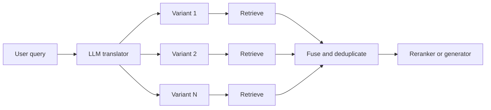

---
topic:
  - AI & ML
subtopic:
  - LLM
level:
  - "2"
priority: High
status: Done
dg-publish: true
---

# Intro

Query translation rewrites a user question into one or more retrieval-optimized variants before search. The core problem: user phrasing rarely matches document phrasing. A user asks "Can partners burst above limits now?" but the answer lives in a document titled "Q3 Quota Policy Update — Partner Tier Burst Allowance." A single query embedding captures one neighborhood in vector space; translation expands coverage to multiple neighborhoods without changing the corpus or the [[Software Engineering/11 AI & ML/LLM/Embeddings|embedding model]].

The mechanism: the user query goes to an LLM that generates N translated variants — paraphrases, sub-questions, abstractions, or hypothetical answers depending on the technique. Each variant runs through [[Software Engineering/11 AI & ML/LLM/RAG/Retrieval|retrieval]] independently. Results are fused and deduplicated into a single candidate set, then passed to [[Software Engineering/11 AI & ML/LLM/RAG/Re-ranking|reranking]] or directly to the generator.

Example: a user asks "rate limit behavior for partner tier accounts." Multi-query generates paraphrases — "partner tier throttling policy," "API quota enforcement for partner customers," "rate limiting rules by account tier." Each paraphrase hits a different document neighborhood. Fusion combines the best candidates from all three retrieval runs. Without translation, only chunks matching the exact phrasing "rate limit behavior" surface, missing policy documents that use "throttling" or "quota enforcement" instead.

Query translation addresses a specific failure mode: recall gaps caused by vocabulary mismatch between queries and documents. It does not fix [[Software Engineering/11 AI & ML/LLM/RAG/Chunking|chunking]] problems, embedding model quality, or index configuration — those are upstream issues. If relevant documents are not in the corpus at all, no amount of query rewriting will find them.

## Approaches

### Multi-Query

The LLM generates N paraphrases of the same intent, each targeting a different vocabulary or framing angle. Each paraphrase retrieves independently, and results are deduplicated by document ID.

The key insight: different phrasings land in different neighborhoods of embedding space. "Authentication failure" and "credential validation error" are semantically similar to a human but may be far apart in a specific embedding model's vector space. Generating both as query variants covers both neighborhoods.

Example — original query: "How to handle connection timeouts in HttpClient?"
Translated variants:

- "HttpClient timeout configuration and retry behavior"
- "System.Net.Http connection timeout exception handling"
- ".NET HTTP client request deadline exceeded"

Each variant retrieves chunks that the others miss. The fused set covers API-reference-style documentation (matching "System.Net.Http") and tutorial-style content (matching "retry behavior").

Where it fits: user-facing systems with natural-language queries and varied vocabulary. The safe starting point when user query phrasing is unpredictable.

Main risk: query drift — a paraphrase that subtly shifts intent pulls in irrelevant documents. "HttpClient timeout" drifting to "network timeout troubleshooting" surfaces OS-level networking content that dilutes the .NET-specific answer.

### RAG-Fusion

RAG-Fusion extends multi-query with explicit rank fusion. Instead of simple deduplication, results from all query variants are merged using [[Software Engineering/11 AI & ML/LLM/RAG/Re-ranking|Reciprocal Rank Fusion (RRF)]]: for each document, sum `1 / (rank + k)` across all query variant result lists, where k=60 is the standard constant.

The mechanism rewards consensus — a document that appears in the top results for 3 of 4 query variants scores higher than one that ranks first for a single variant but is absent from the others. This acts as an implicit relevance vote: agreement across phrasings is a stronger signal than high rank from one phrasing.

Where it fits: broad questions where a single phrasing captures only part of the relevant evidence space. Enterprise search, customer support knowledge bases, and policy-heavy domains where terminology varies across documents.

Main risk: latency and cost. N query variants means N retrieval calls plus the LLM call that generates the variants. For 4 variants against a retriever with 100ms latency, query translation adds ~400ms sequentially (parallelizable to ~100ms with concurrent retrieval) plus the LLM generation time for variant creation.

### Step-Back Prompting

Step-back prompting generates a more abstract, higher-level version of the question. The system retrieves context for both the step-back question (background/principles) and the original question (specifics), then provides both to the generator.

The intuition: some questions require first-principles context before the specific answer is useful. Asking "Why does EF Core throw timeout on batch insert of 10K rows?" benefits from background on EF Core's batch execution model and connection management before the specific timeout cause.

Example — original query: "Why is my HNSW recall dropping after adding 5M vectors?"

Step-back question: "How does HNSW index recall scale with corpus size and what parameters affect it?"

The step-back retrieval surfaces foundational content about HNSW graph structure, `ef_search` tuning, and recall-versus-scale behavior. The original query retrieval surfaces specific troubleshooting content. Together, the generator has both the conceptual framework and the specific guidance to produce a grounded answer.

Where it fits: questions that implicitly assume background knowledge. Common in technical domains where users ask about symptoms without understanding the underlying mechanism.

Main risk: overly abstract retrieval. If the step-back question is too general ("What are vector database best practices?"), the retrieved context is too broad to be actionable and wastes prompt tokens on background the generator does not need.

### Decomposition

Decomposition splits a complex multi-part question into focused sub-questions, retrieves evidence for each independently, and synthesizes the final answer from the combined context. Unlike multi-query, the sub-questions are *different questions* — each targets a distinct piece of evidence needed for the answer.

Example — original query: "How does Task compare to ValueTask for high-throughput API endpoints?"

Sub-questions:

- "What is the allocation behavior of Task in async methods?"
- "When does ValueTask avoid heap allocation and what are its constraints?"
- "What are the performance characteristics of high-throughput API endpoints with frequent async completions?"

Each sub-question retrieves different documents. The synthesis step combines the evidence into a comparative answer that the original single query could not have retrieved directly — no single chunk likely contains both Task internals and ValueTask constraints and throughput benchmarks together.

Where it fits: multi-hop questions that span multiple concepts, entities, or constraints. Comparison questions, timeline questions ("What changed between v1 and v2?"), and questions requiring evidence from different document sections.

Main risk: context fragmentation. Sub-questions lose the constraints that connect them. "Compare Task vs ValueTask for high-throughput endpoints" becomes three independent questions — none of which carries the "high-throughput" constraint that makes the comparison relevant. Sub-question retrieval returns general-purpose content, and the synthesis step cannot reconstruct specificity that was discarded during decomposition. For questions that are not genuinely multi-hop, decomposition adds complexity without improving retrieval.

### HyDE — Hypothetical Document Embeddings

HyDE flips the approach: instead of rewriting the query, the LLM generates a hypothetical answer document. That synthetic text is embedded (not the query), and the embedding retrieves the nearest real documents in vector space.

The mechanism exploits a property of dense retrieval: answer documents are closer to each other in embedding space than they are to short queries. A user query like "connection pooling in EF Core" is a sparse, underspecified point in embedding space. A hypothetical answer — a paragraph explaining how EF Core manages connection pools, default pool sizes, and disposal behavior — occupies a denser, more specific region near real documentation about the same topic. The encoder's dense bottleneck filters out hallucinated specifics while preserving the correct semantic neighborhood.

Where it fits: very short or vague queries where the query embedding is too sparse to retrieve well. Also effective for exploratory questions where the user does not know the right terminology.

Main risk: hallucination bias. If the LLM generates a plausible but semantically wrong hypothetical document, the embedding retrieves real documents from the wrong neighborhood. For factual queries with specific constraints (error codes, version numbers, entity names), HyDE can encode wrong assumptions into the search vector — retrieving documents that match the hallucinated answer rather than the actual question. In practice, HyDE performs strongest on semantic similarity tasks and degrades on identifier-heavy or constraint-specific queries where exact tokens matter more than meaning; validate per query type on your own data.

## Pitfalls

### Query Drift and Semantic Leakage

Translated queries subtly shift intent, introducing concepts not present in the original question. "HttpClient connection timeout" becomes "network infrastructure timeout diagnostics" — still related, but now retrieving OS-level networking content instead of .NET HttpClient documentation. The LLM generator receives diluted context and produces a vague answer that touches the right topic but misses the specific question.

This is especially dangerous with multi-query and RAG-Fusion because drifted variants still contribute to the fused result. If 2 of 4 variants drift, up to half the candidate set may be off-topic.

Mitigation: include the original query as one of the retrieval variants — never translate only, always include the original. Set explicit constraints in the translation prompt ("preserve all specific entities, identifiers, and version numbers"). Evaluate translated queries against the original: if cosine similarity between a variant and the original drops below a threshold, discard the variant before retrieval.

### Latency Multiplication

N query variants means N retrieval calls. In a pipeline with a tight total latency SLA, the LLM translation step (generating the variants) runs before any retrieval begins, and the retrieval calls follow — even with parallelization, the sequential translation-then-retrieval pattern adds meaningful overhead. Teams adopt query translation for quality, then discover that p95 latency exceeds the SLA under production load because total cost is LLM generation time plus the slowest retrieval call, not just retrieval alone.

Mitigation: set a hard variant budget (2–4 variants is the practical range). Parallelize all retrieval calls. Pre-compute translations for common query patterns via [[Software Engineering/11 AI & ML/LLM/RAG/Caching|caching]]. Profile end-to-end latency under realistic concurrency, not single-query benchmarks.

### HyDE Hallucination Amplification

HyDE's hypothetical document encodes the LLM's assumptions into the search vector. For domain-specific or factual queries, those assumptions can be wrong — the LLM "imagines" a plausible but incorrect answer, and the embedding retrieves real documents matching the hallucination rather than the actual question. Unlike multi-query drift (which dilutes results with noise), HyDE hallucination actively steers retrieval toward the wrong document neighborhood.

Detection: compare HyDE retrieval results against direct query retrieval on a ground-truth evaluation set. If HyDE consistently retrieves different documents that score lower on relevance, the hypothetical document is misleading. HyDE works best on semantic similarity tasks and poorly on identifier-heavy or constraint-specific queries — evaluate per query type, not in aggregate.

### Decomposition Losing Global Constraints

When a complex question is split into sub-questions, the constraints connecting them are often lost. "Compare Task vs ValueTask for high-throughput endpoints" becomes three independent questions — none of which carries the "high-throughput" constraint that makes the comparison relevant. Sub-question retrieval returns general-purpose content, and the synthesis step cannot reconstruct specificity that was discarded during decomposition.

Mitigation: append the original question or its key constraints to each sub-question as context. Use a synthesis prompt that explicitly references the original question, not just the sub-question answers. Only use decomposition for genuinely multi-hop questions — for single-intent queries, multi-query is simpler and preserves context better.

## Tradeoffs

| Technique | Recall improvement | Precision risk | Latency cost | Best for |
| --- | --- | --- | --- | --- |
| No translation | Baseline -- single query only | Lowest -- no drift risk | None | Simple corpora with predictable query vocabulary |
| Multi-Query | Moderate -- covers vocabulary variants | Low-moderate -- drift from paraphrases | N retrieval calls -- parallelizable | Natural-language queries with varied user phrasing |
| RAG-Fusion | Moderate-high -- consensus ranking suppresses noise | Low -- RRF filters drifted variants | N retrieval calls + fusion computation | Broad questions where single phrasing is insufficient |
| Decomposition | High for multi-hop -- distinct evidence per sub-question | Moderate -- constraint loss across sub-questions | N retrieval calls + synthesis LLM call | Multi-entity or multi-constraint questions requiring separate evidence |
| Step-Back | Moderate -- adds principled background context | Low-moderate -- overly abstract retrieval possible | 2 retrieval calls -- original + step-back | Questions requiring first-principles context before specifics |
| HyDE | High for vague queries -- denser search vector | High -- hallucination can bias retrieval | 1 retrieval call + LLM generation | Short or exploratory queries where direct embedding is too sparse |

Decision rule: start with no translation and measure baseline retrieval quality. Add multi-query or RAG-Fusion first — they provide the most consistent recall improvement with manageable risk. Use decomposition only for verified multi-hop query patterns. Use HyDE only for vague/short query patterns where direct embedding measurably underperforms. Always evaluate each technique against the no-translation baseline on your actual query distribution.

## Questions

> [!QUESTION]- Why does query translation often improve recall but sometimes hurt precision, and how do you detect the tradeoff?
> Expected answer:
> - Additional query variants cover vocabulary the original misses, hitting more document neighborhoods and improving recall
> - Weak variants introduce concepts not in the original intent, pulling related-but-irrelevant documents into the candidate set
> - Precision drop is invisible in aggregate recall metrics — recall goes up while noisy candidates are buried in the ranked list
> - Detection: measure precision@k (not just recall@k) before and after translation, segmented by query type
> - If recall@20 improves but precision@5 drops, translation helps coverage but hurts candidates that reach the generator
> - Key mitigation: always include the original query as a variant and discard translations that drift too far from the original intent

> [!QUESTION]- When is decomposition a better choice than multi-query, and when does it hurt?
> Expected answer:
> - Decomposition fits when the original query has distinct sub-problems requiring separate evidence — comparisons, multi-entity questions, timeline questions
> - Multi-query fits when the question has a single intent but user phrasing may not match document terminology
> - Decomposition hurts on single-intent questions: sub-questions fragment a coherent topic and lose the constraints that make the original specific
> - The test: if sub-questions can be answered independently and concatenated answers address the original, decomposition fits
> - If sub-questions only make sense in context of the original question, use multi-query instead
> - Key tradeoff: decomposition adds a synthesis LLM call and risks context fragmentation; multi-query only adds retrieval calls

> [!QUESTION]- Why can HyDE outperform direct query embedding for vague questions but fail on specific factual queries?
> Expected answer:
> - Vague queries produce sparse, underspecified embeddings equidistant from many document clusters — poor retrieval signal
> - HyDE generates a hypothetical answer paragraph, creating a denser point in embedding space closer to real answer documents
> - The encoder's bottleneck filters hallucinated details while preserving the correct semantic neighborhood
> - For specific factual queries (error codes, versions), the LLM may hallucinate wrong details — different error code, different version
> - The hallucinated embedding steers retrieval toward documents matching the wrong specifics
> - Direct query embedding, while sparse, preserves exact tokens that keyword search in a hybrid setup can catch
> - HyDE failure is stealth: retrieved documents look topically relevant but answer the wrong specific question

## References

- [Precise Zero-Shot Dense Retrieval without Relevance Labels — the original HyDE paper (Gao et al., ACL 2023)](https://arxiv.org/abs/2212.10496)
- [Take a Step Back: Evoking Reasoning via Abstraction in Large Language Models (Zheng et al., ICLR 2024)](https://arxiv.org/abs/2310.06117)
- [RAG-Fusion: a New Take on Retrieval-Augmented Generation (Rackauckas, IJNLC 2024)](https://arxiv.org/abs/2402.03367)
- [Query Rewriting for Retrieval-Augmented Large Language Models — Rewrite-Retrieve-Read framework (Ma et al., EMNLP 2023)](https://arxiv.org/abs/2305.14283)
- [Query Transformations — practitioner overview of multi-query, RAG-Fusion, step-back, and HyDE with real prompts (LangChain Engineering)](https://blog.langchain.dev/query-transformations/)
- [Retrieval-Augmented Generation for Large Language Models: A Survey — query transformation taxonomy within Advanced RAG (Gao et al., 2024)](https://arxiv.org/abs/2312.10997)
- [MultiQueryRetriever — multi-query implementation and usage patterns (LangChain)](https://python.langchain.com/docs/how_to/MultiQueryRetriever/)
- [Query Transform Cookbook — HyDE, step-back, and decomposition implementations (LlamaIndex)](https://docs.llamaindex.ai/en/stable/examples/query_transformations/query_transform_cookbook/)
- [Deconstructing RAG — retrieval patterns and query strategy evaluation (LangChain Engineering)](https://blog.langchain.com/deconstructing-rag/)

<!-- whats-next:start -->

---

> [!note] Whats next
> **Parent**
>  [[Software Engineering/11 AI & ML/LLM/LLM|LLM]]
>
> **Pages**
> - [[Software Engineering/11 AI & ML/LLM/RAG/Caching|Caching]]
> - [[Software Engineering/11 AI & ML/LLM/RAG/Chunking|Chunking]]
> - [[Software Engineering/11 AI & ML/LLM/RAG/Monitoring|Monitoring]]
> - [[Software Engineering/11 AI & ML/LLM/RAG/RAG Evaluation|RAG Evaluation]]
> - [[Software Engineering/11 AI & ML/LLM/RAG/RAG Patterns|RAG Patterns]]
> - [[Software Engineering/11 AI & ML/LLM/RAG/Re-ranking|Re-ranking]]
> - [[Software Engineering/11 AI & ML/LLM/RAG/Retrieval|Retrieval]]
<!-- whats-next:end -->
