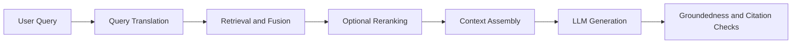
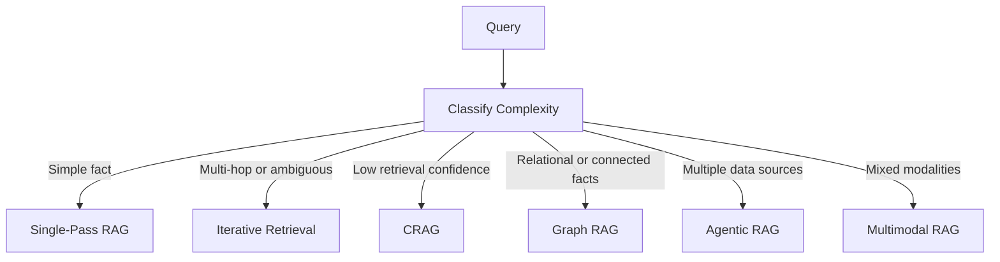
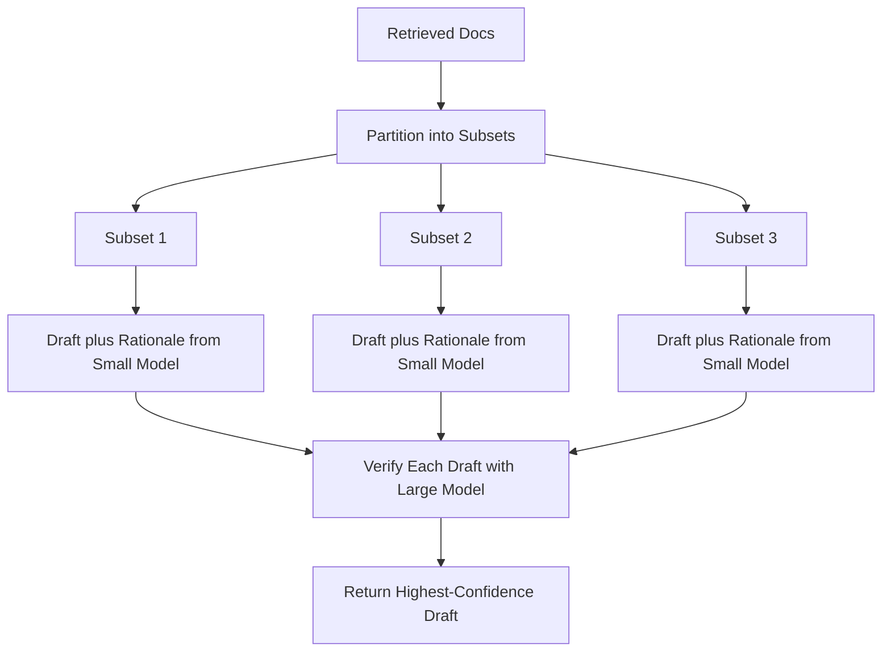

---
tags:
  - FolderNote
status: Creation
priority: High
level:
  - "2"
dg-publish: true
---

# Intro

Retrieval-Augmented Generation (RAG) combines retrieval and generation: retrieve evidence from your corpus, then generate an answer grounded in that evidence. It matters because knowledge changes faster than model weights, and RAG lets you update knowledge without retraining the model.
In practice, strong RAG systems are pipelines, not prompts. The main engineering work is query processing, retrieval quality, context assembly, evaluation, and production operations.
Example: for a support assistant, a user asks "What changed in API v2 rate limits?". RAG retrieves release notes and policy docs first, then the model answers with citations to the exact source sections instead of guessing from stale parametric memory.

## Core Flow



## Advanced RAG Patterns

Basic retrieve-then-generate works for straightforward factual lookups, but production systems hit failure modes that need more sophisticated patterns: multi-hop reasoning, uncertain retrieval quality, cross-modal evidence, and dynamic tool selection. Each pattern below solves a specific class of failures. Adopt incrementally after baseline RAG metrics plateau — every pattern adds latency, cost, and operational complexity.



### Iterative Retrieval

How it works:

- Run a retrieve-reason-retrieve loop instead of a single retrieval pass.
- After each retrieval, the LLM reasons over current evidence and generates a follow-up retrieval query targeting information gaps.
- The loop continues until a stop condition fires. Common strategies:
  - **Fixed iteration cap** (2-4 hops) — predictable latency and cost but may stop early or waste iterations.
  - **Information gain threshold** — stop when newly retrieved documents add little novel content. Requires a novelty metric (embedding similarity or entity overlap against existing context).
  - **Explicit stop signal** — the LLM emits a stop token when it determines evidence is sufficient. Risk: the model may stop prematurely or never stop.
- In practice, most multi-hop questions are answered within a few iterations. Adding more hops yields diminishing returns and increasing noise.

```python
context = []
for step in range(max_steps):
    thought = llm.reason(query, context)
    if has_sufficient_info(thought):
        break
    follow_up = extract_retrieval_query(thought)
    new_docs = retrieve(follow_up, top_k=3)
    context.extend(new_docs)
answer = llm.generate(query, context)
```

Where it fits:

- Multi-hop questions where second-hop evidence depends on first-hop findings — "Who is the spouse of the director of Inception?" needs hop 1 to find the director, hop 2 to find the spouse.
- Bridge entity problems where the connecting document is not in the initial top-k results.
- Complex analytical queries that decompose into sub-questions, each needing separate evidence.

Main risk:

- **Query drift** — each iteration's retrieval query can wander from the original intent. Mitigate by including the original query in every reasoning prompt.
- **Noise accumulation** — irrelevant documents pile up, confusing later reasoning steps. Rerank and prune before adding to context.
- **Latency multiplier** — each hop adds another embedding + retrieval + reasoning round-trip. With multiple hops, total response time grows multiplicatively.

### Self-RAG

How it works:

- A single language model is trained with four special reflection tokens that control retrieval and self-critique:

| Token | Purpose | Values |
|-------|---------|--------|
| **Retrieve** | Decide whether to call the retriever | yes, no, continue |
| **IsRel** | Grade if retrieved document is relevant to the query | relevant, irrelevant |
| **IsSup** | Check if the generation is supported by the document | fully supported, partially supported, no support |
| **IsUse** | Rate if the generation actually answers the query | 1 through 5 |

- At inference, the model generates text and reflection tokens together. When `Retrieve` fires "yes", documents are fetched and scored. Multiple candidate segments are generated in parallel (one per retrieved passage), scored by the reflection tokens, and the best segment is selected via beam search.
- Training is two-stage: first train a critic model to label reflection tokens on a dataset, then insert those labels into the training corpus and train the generator with standard next-token prediction. No RLHF needed — reflection tokens are vocabulary expansion.

```python
retrieve_token = model.predict_token(input_x, preceding_y)
if retrieve_token == "yes":
    passages = retriever.get_top_k(input_x)
    candidates = []
    for passage in passages:
        segment = model.generate(input_x, passage)
        is_rel = model.predict_token("IsRel", input_x, passage)
        is_sup = model.predict_token("IsSup", input_x, passage, segment)
        is_use = model.predict_token("IsUse", input_x, segment)
        candidates.append((segment, score(is_rel, is_sup, is_use)))
    best = max(candidates, key=lambda x: x[1])
```

Where it fits:

- Workloads with mixed knowledge needs — some queries need retrieval, others do not, and the model learns when to retrieve.
- Long-form generation where retrieval mid-generation (not just at the start) improves grounding.
- High hallucination risk scenarios where `IsSup` filtering catches unsupported claims before they reach the user.

Main risk:

- **Requires custom model training.** You cannot add Self-RAG to an off-the-shelf LLM without fine-tuning. This is not a plug-and-play pattern.
- **Beam search complexity** over reflection token scores adds inference overhead. Weights for each token type (relevance, support, utility) are dataset-specific and need tuning.
- **Critic quality ceiling** — if the critic model mislabels during training, the generator learns wrong retrieval and grounding behavior. Garbage labels in, garbage behavior out.

### CRAG — Corrective Retrieval-Augmented Generation

How it works:

- Add a lightweight retrieval evaluator (the paper uses fine-tuned T5-large, 770M params) that scores retrieved documents before they reach the generator.
- Based on the evaluator's confidence score, the system triggers one of three corrective actions:

| Confidence | Action | Behavior |
|------------|--------|----------|
| High — above upper threshold | Correct | Refine documents with decompose-then-recompose |
| Low — below lower threshold | Incorrect | Discard retrieved docs and fall back to web search |
| Middle — between thresholds | Ambiguous | Combine refined documents with web search results |

- **Knowledge refinement** (decompose-then-recompose): split each document into sentence-level strips, score each strip individually with the evaluator, discard irrelevant strips, and concatenate surviving strips in original order. This removes "partially relevant" noise that hurts generation quality.
- **Web search fallback**: rewrite the query for web search optimization, fetch results, and optionally apply knowledge refinement to web results too.

```python
scores = [evaluator.score(query, doc) for doc in retrieved_docs]
confidence = max(scores)
if confidence >= upper_threshold:
    knowledge = refine_strips(query, retrieved_docs)
elif confidence < lower_threshold:
    knowledge = web_search(rewrite_query(query))
else:
    knowledge = refine_strips(query, retrieved_docs) + web_search(rewrite_query(query))
answer = llm.generate(query, knowledge)
```

Where it fits:

- Noisy retriever environments where precision is inconsistent across query types.
- Domains where the static corpus has gaps and web search can fill them (time-sensitive content, emerging topics).
- Systems that need graceful degradation — CRAG provides a structured fallback chain instead of silently hallucinating from bad evidence.

Main risk:

- **Threshold tuning** — upper and lower confidence thresholds are dataset-specific with no universal values. Requires a validation set to calibrate.
- **Web search overhead** — adds noticeable latency, API cost, and rate limit exposure per query that routes through the Incorrect or Ambiguous path. Cache web results and implement backoff.
- **Evaluator drift** — the relevance evaluator's accuracy degrades as the domain evolves. Monitor false-positive and false-negative rates and retrain periodically.
- **Strip granularity tradeoff** — too fine (word-level) loses context, too coarse (paragraph-level) keeps noise. Sentence-level is the paper's default heuristic, not a universal optimum.

### Graph RAG

How it works:

- Instead of flat vector similarity over chunks, Graph RAG builds a knowledge graph from the corpus and retrieves over entity relationships. The pipeline has three stages:

**1. Entity and relationship extraction.** An LLM reads each chunk and extracts typed entities (Person, Organization, Concept, Event) and typed directed edges with properties. The main challenge is entity linking — disambiguating the same name across documents.

**2. Community detection.** The Leiden algorithm (successor to Louvain) partitions the graph into hierarchical communities. The number of levels depends on the graph and resolution parameters. As an illustrative example: fine-grained communities might represent individual subsystems, while coarser levels group those into broader domains. This precomputes semantic clusters so query-time retrieval does not need to traverse the full graph.

**3. Community summarization.** Each community gets an LLM-generated summary. Summaries are expensive to generate (multiple LLM calls across the hierarchy) but cheap to query.

At query time, the paper describes a map-reduce approach: community summaries are ranked for relevance, the LLM generates partial answers from each relevant summary (map), and a final synthesis step combines partial answers into a coherent response (reduce). The open-source [GraphRAG library](https://github.com/microsoft/graphrag) extends this with two query modes:

- **Local search** — retrieves entities, relationships, and associated text chunks relevant to the query. Best for specific fact retrieval that requires relational context.
- **Global search** — operates over community summaries at a chosen hierarchy level using the map-reduce pattern. Best for synthesis questions like "what are the main themes across all documents?" that flat retrieval cannot answer.

Where it fits:

- Multi-hop reasoning where answers require connecting entities across documents — "what breaks if we remove component X?".
- Dependency-heavy domains: legal contracts, technical architecture, supply chains, compliance tracing.
- Global synthesis queries that need a dataset-wide perspective, not just top-k chunks.

Main risk:

- **Entity linking errors propagate.** A wrong entity merge creates broken multi-hop paths and nonsensical query results. Fine-tune extraction on domain data and validate extraction quality before building the graph.
- **Schema drift** — open-domain extraction creates 100+ relationship types that are logically equivalent but stored as distinct edge types. Define a constrained ontology of 10-20 relation types upfront and normalize during extraction.
- **Expensive indexing** — entity extraction + relation extraction + community summarization costs significantly more than embedding-based indexing (multiple LLM calls per chunk at each stage). Budget accordingly and benchmark on a representative sample before full-corpus indexing.
- **Incremental updates are hard.** Adding new documents requires re-running community detection and re-summarizing affected communities, or accepting stale graph structure.

### Agentic RAG

How it works:

- The LLM acts as a reasoning engine that dynamically decides which tools to call, rather than following a fixed retrieve-then-generate pipeline.
- The agent maintains a scratchpad of Thought/Action/Observation traces (ReAct pattern) and loops until it has enough information to answer.
- Available tools typically include: vector search, SQL query, web search, API calls, and calculators. The LLM sees tool descriptions and picks based on query type — no hardcoded if/else routing.

```python
while iteration < max_iterations:
    thought = llm.reason(query, scratchpad)
    if thought.is_final_answer:
        return thought.answer
    tool, args = llm.select_tool(thought, available_tools)
    observation = execute_tool(tool, args)
    scratchpad.append(thought, tool, observation)
    iteration += 1
```

Where it fits:

- Queries requiring multiple data sources — "why did sales drop in Q3?" needs SQL for revenue data, vector search for market reports, and web search for competitor news.
- Ambiguous queries where the first retrieval attempt may miss and the agent needs to retry with a refined query.
- Research-style tasks where the user expects multi-step investigation with intermediate results.

Main risk:

- **Infinite loops** — the agent never converges and keeps calling the same tool. Set a strict `max_iterations` cap (5-7) and detect repeated tool calls.
- **Tool hallucination** — the LLM invents tool names that do not exist. Use structured output (function calling) instead of free-text tool selection.
- **Cost explosion** — often several times more LLM calls than single-pass RAG per query. Use a cheaper model for routing decisions and the expensive model only for final generation.
- **Latency accumulation** — multi-turn reasoning often pushes response time into seconds. Stream intermediate results to the user and parallelize independent tool calls where possible.
- **Debugging complexity** — tracing which step failed across a multi-turn agent graph is significantly harder than debugging single-pass RAG. Production deployments need trace logging (LangSmith, Langfuse).

### Adaptive RAG

How it works:

- A lightweight classifier (fine-tuned smaller LM or heuristic rules) scores query complexity and routes to the cheapest strategy that can handle it:

| Complexity | Strategy | Example |
|------------|----------|---------|
| Simple | No retrieval — LLM answers from parametric memory | "What is 2+2?" |
| Moderate | Single-pass RAG | "What is the return policy?" |
| Complex | Iterative multi-hop RAG | "Compare implications across three papers" |

- The classifier is trained on automatically collected labels: run all three strategies on a dataset, and label each query with the simplest strategy that produced a correct answer.
- Heuristic fast-path signals work as a bootstrap before the classifier is trained: short definitional queries ("what is X") skip retrieval, queries with comparison words or multiple entities route to multi-hop, queries mentioning recent events route to web-augmented retrieval.

Where it fits:

- High-volume production systems where most queries are simple but a tail of complex queries needs multi-hop reasoning.
- Cost-sensitive deployments where routing simple queries to the no-retrieval path saves retrieval and generation cost for those queries.

Main risk:

- **Asymmetric misclassification cost.** Routing a complex query to the simple strategy produces a wrong answer (high cost to user). Routing a simple query to the complex strategy wastes money but still works (low cost). Err toward the more capable strategy when uncertain.
- **Classifier drift** — query distribution changes over time. Retrain on production traffic periodically.
- **Cold start** — needs labeled data. Bootstrap with heuristics first, collect production labels, then fine-tune.

### Speculative RAG

How it works:

- Partition retrieved documents into subsets and generate candidate answers in parallel using a small specialist model (e.g., Mistral-7B fine-tuned on RAG tasks).
- A larger generalist model scores each draft by computing the conditional probability P(answer | rationale).
- Select the draft with the highest verification score.



- The speedup comes from three sources: the smaller model is substantially faster per draft, drafts execute in parallel, and the verifier only scores (does not generate from scratch).

Where it fits:

- Latency-sensitive applications where standard RAG is too slow and you can trade parallel compute for wall-clock time.
- Workloads where documents may contain conflicting information — parallel drafting from different subsets surfaces disagreements that the verifier can adjudicate.

Main risk:

- **Draft quality depends on fine-tuning.** The small model must be fine-tuned specifically for RAG tasks, not just general instruction following. A generic small model produces low-quality drafts that waste the verifier's time.
- **Document partitioning strategy matters.** The paper clusters retrieved documents by similarity and samples one from each cluster per subset to maximize diversity. Poor partitioning (e.g., random splitting) leads to redundant or incomplete drafts.
- **Verification overhead can negate speedup** if too many drafts are generated. Keep the draft count low enough that verification cost stays below the generation savings.

### Multimodal RAG

How it works:

- Extend the RAG pipeline to retrieve across text, tables, images, and structured data using modality-aware processing at each stage.

**Embedding strategies by modality:**

| Modality | Approach | Tradeoff |
|----------|----------|----------|
| Text | Standard text embeddings | Mature and fast. Works with any vector DB |
| Tables | Whole-table as markdown or HTML with text embedding, or vision model reads table image directly | Vision avoids OCR errors but costs significantly more per table |
| Images | ColPali for page-level retrieval preserving layout, or CLIP for image-text alignment | ColPali uses multi-vector per page and needs custom indexing. CLIP uses single vector and works with standard DBs |
| Mixed pages | Semantic chunking with modality markers grouping related text and image and table into one unit | Keeps cross-modal context together but increases chunk size |

**Chunking rules by modality:**

- Text — recursive character split, 400-512 tokens with 10-20% overlap.
- Tables — always chunk as whole table with caption/title as metadata. Never split a table across chunks — rows lose column headers and the data becomes meaningless.
- Images — page-level (ColPali) or image-level (CLIP). Splitting images destroys visual coherence.

**Cross-modal alignment:** generate potential queries from each chunk regardless of modality. A table and a chart can both answer "revenue growth" even though their raw formats differ. At retrieval time, match the user query against these generated queries rather than raw chunk content.

Where it fits:

- Document corpora with significant table and figure content: financial reports, research papers, technical manuals.
- Scanned documents where OCR quality is poor — vision-first approaches (ColPali) bypass OCR entirely.

Main risk:

- **OCR cascade errors** — a table with merged cells becomes gibberish text. Vision models read tables better but add meaningful inference latency per table.
- **Embedding dimension mismatch** — ColPali multi-vector embeddings do not fit standard single-vector stores. Use stores with multi-vector support or flatten with dimensionality reduction (at some accuracy cost).
- **Cross-modal retrieval drift** — a text query retrieves an image, but the LLM cannot interpret image content. Always pass retrieved images to a vision-capable model (GPT-4o, Gemini, Qwen-VL).

## Pattern Selection Guide

| Pattern | Best For | Runtime Latency | Setup Effort | Runtime Cost | When to Skip |
|---------|----------|-----------------|--------------|--------------|--------------|
| Iterative Retrieval | Multi-hop questions | High — multiple retrieval round-trips | Low — works with existing retriever | High — multiple LLM calls per query | Simple single-hop lookups |
| Self-RAG | Adaptive retrieval and hallucination control | Medium — parallel passage scoring | High — requires custom model training | Medium — single model with reflection tokens | Cannot fine-tune models |
| CRAG | Noisy retrievers and web fallback | Medium — evaluator plus optional web search | Medium — train or configure evaluator | Medium — evaluator inference plus occasional web API | Retriever already has high precision |
| Graph RAG | Relational and connected-fact queries | Medium — community lookup plus generation | High — entity extraction and graph construction | High — many community summaries and partial answers in map-reduce | Simple fact lookups or frequently changing data |
| Agentic RAG | Multi-source orchestration | High — multi-turn reasoning loop | Medium — define tools and routing | High — many LLM calls per query | Single data source is sufficient |
| Adaptive RAG | Mixed-complexity query traffic | Low to High — depends on routed strategy | Medium — train or configure classifier | Low to High — saves on simple queries | Uniform query complexity |
| Speculative RAG | Latency-sensitive with conflict detection | Low — parallel drafting reduces wall-clock time | High — fine-tune specialist drafter | Medium — parallel small-model calls plus verifier | Low query volume |
| Multimodal RAG | Tables and images and mixed-format docs | Medium to High — vision model inference | Medium — modality-aware chunking pipeline | Medium to High — vision embeddings and models | Text-only corpus |

**Adoption order**: start with baseline single-pass RAG. Add CRAG or Adaptive RAG first (lowest integration effort). Move to Iterative or Graph RAG when metrics plateau on multi-hop queries. Add Agentic RAG only when multiple data sources are required.

## Operational Baselines

- Gate every pattern behind a feature flag. Measure retrieval precision, generation faithfulness, latency p95, and cost per query before and after.
- Set hard iteration caps on looping patterns (Iterative, Agentic) to bound latency and cost. For Self-RAG, cap the number of retrieval calls per answer rather than loop iterations.
- Monitor query drift and noise accumulation in iterative patterns. Track semantic similarity between the original query and each iteration's retrieval query.
- Cache aggressively: community summaries (Graph RAG), web search results (CRAG), reasoning chains (Iterative), and tool outputs (Agentic).
- Route simple queries to the cheapest path. Most production traffic is simple — do not pay multi-hop costs for single-hop questions.

## RAG vs Fine-Tuning

RAG and fine-tuning optimize different parts of the system. RAG externalizes knowledge into retrievable sources, while fine-tuning changes model behavior in weights. Choosing correctly prevents expensive retraining for problems that retrieval can solve more safely.

Example: if product policy changes weekly, RAG can update by reindexing documents. Fine-tuning would require repeated retraining cycles and still provide weak source traceability.

| Axis | RAG | Fine-tuning |
|---|---|---|
| Knowledge freshness | High | Low |
| Source traceability | High | Low |
| Behavioral consistency | Medium | High |
| Time to first value | Faster | Slower |
| Operational complexity | Retrieval and index ops | Training and eval and release ops |

**Decision rules:**

1. Start with RAG when facts change often or citation is required.
2. Add fine-tuning when output style or policy behavior remains unstable after prompt and retrieval tuning.
3. Keep mutable facts in retrieval; keep behavior patterns in fine-tuned weights.

The combined pattern — fine-tune the model for behavior (format, tone, refusal policy) and use RAG for current factual knowledge — keeps updates fast while preserving behavioral control.

## Questions

> [!QUESTION]- Why should advanced RAG patterns be introduced incrementally instead of all at once?
> Each pattern adds independent failure modes and observability needs. Incremental rollout isolates impact, allows A/B measurement against baseline, and prevents compounding complexity from masking root causes. Start with the pattern that addresses your highest-frequency failure mode.

> [!QUESTION]- When is Graph RAG a better fit than plain vector retrieval?
> When answers require explicit entity relations, dependency paths, or multi-hop joins that are hard to recover from independent text chunks. Examples: compliance tracing across policy documents, architecture dependency analysis, supply chain impact assessment. Skip Graph RAG for simple fact lookups where vector similarity suffices.

> [!QUESTION]- How does Adaptive RAG reduce cost without sacrificing accuracy on complex queries?
> A query complexity classifier routes simple queries to no-retrieval or single-pass RAG (cheap and fast) and reserves iterative multi-hop retrieval for the complex tail. Since most production queries are simple, the average cost drops significantly while complex queries still get full retrieval. Misclassification cost is asymmetric — err toward the more capable strategy when uncertain.

## References

- [Retrieval-Augmented Generation for Knowledge-Intensive NLP Tasks](https://arxiv.org/abs/2005.11401)
- [RAG techniques (Azure AI Search)](https://learn.microsoft.com/en-us/azure/search/retrieval-augmented-generation-overview)
- [Self-RAG: Learning to Retrieve, Generate, and Critique Through Self-Reflection](https://arxiv.org/abs/2310.11511)
- [Corrective Retrieval Augmented Generation (CRAG)](https://arxiv.org/abs/2401.15884)
- [From Local to Global: A Graph RAG Approach to Query-Focused Summarization](https://arxiv.org/abs/2404.16130)
- [Adaptive-RAG: Learning to Adapt Retrieval-Augmented Large Language Models through Question Complexity](https://arxiv.org/abs/2403.14403)
- [Speculative RAG: Enhancing Retrieval Augmented Generation through Drafting](https://arxiv.org/abs/2407.08223)
- [Agentic RAG with LangGraph (LangChain engineering)](https://blog.langchain.com/agentic-rag-with-langgraph/)
- [Deconstructing RAG (LangChain engineering)](https://blog.langchain.com/deconstructing-rag/)
- [Fine-tuning guide (OpenAI)](https://platform.openai.com/docs/guides/fine-tuning)
- [RAGOps: Operating and Managing RAG Pipelines](https://arxiv.org/abs/2506.03401)

<!-- whats-next:start -->

---

> [!note] Whats next
> **Parent**
>  [[Software Engineering/11 AI & ML/LLM/LLM|LLM]]
>
> **Pages**
> - [[Software Engineering/11 AI & ML/LLM/RAG/Caching|Caching]]
> - [[Software Engineering/11 AI & ML/LLM/RAG/Chunking|Chunking]]
> - [[Software Engineering/11 AI & ML/LLM/RAG/Evaluation|Evaluation]]
> - [[Software Engineering/11 AI & ML/LLM/RAG/Monitoring|Monitoring]]
> - [[Software Engineering/11 AI & ML/LLM/RAG/Query Translation|Query Translation]]
> - [[Software Engineering/11 AI & ML/LLM/RAG/Re-ranking|Re-ranking]]
> - [[Software Engineering/11 AI & ML/LLM/RAG/Retrieval|Retrieval]]
<!-- whats-next:end -->
