---
tags:
  - FolderNote
status: Done
priority: High
level:
  - "2"
dg-publish: true
---

# Intro

Retrieval-Augmented Generation (RAG) combines retrieval and generation: retrieve evidence from your corpus, then generate an answer grounded in that evidence. It matters because knowledge changes faster than model weights, and RAG lets you update knowledge without retraining the model.
In practice, strong RAG systems are pipelines, not prompts. The main engineering work is query processing, retrieval quality, context assembly, evaluation, and production operations.
Example: for a support assistant, a user asks "What changed in API v2 rate limits?". RAG retrieves release notes and policy docs first, then the model answers with citations to the exact source sections instead of guessing from stale parametric memory.

## Core Flow

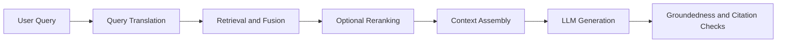

## RAG Patterns Ranked by Commonness

This ranking is a practical adoption heuristic, not market-share data. It orders patterns by how often they appear as default production guidance in current vendor docs, open-source frameworks, and enterprise RAG architectures. Start at the top and move down only when [[Software Engineering/11 AI & ML/LLM/RAG/Evaluation|evaluation]] shows a specific failure that cheaper patterns do not fix.

### 1. Baseline Single-Pass RAG

#### Work principle

The system embeds the user query, retrieves the most similar chunks, places those chunks into the prompt, and asks the model to answer from that context. It is the simplest useful RAG loop: one query in, one retrieval pass, one generated answer out.

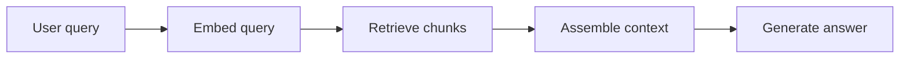

Where it fits:

- First production version of a documentation assistant or support bot.
- Small curated corpora where [[Software Engineering/11 AI & ML/LLM/RAG/Chunking|chunking]] is clean and the answer usually lives in one document.
- Baseline measurement before adding expensive retrieval logic.

Main risk:

- **Low precision or recall ceiling** — a single dense top-k search often misses exact identifiers, product codes, and policy names. Treat this as the baseline, not the final architecture.

### 2. Hybrid Search plus Reranking

#### Work principle

Run lexical search and vector search together, merge their candidates, then rerank the merged set so the generator sees the best few passages. Lexical search catches exact terms; vector search catches semantic matches; [[Software Engineering/11 AI & ML/LLM/RAG/Re-ranking|reranking]] removes noise before context assembly.

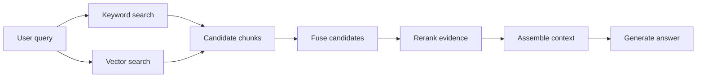

Where it fits:

- Most production text RAG over enterprise documents, tickets, policies, and API docs.
- Corpora with exact names, acronyms, error codes, or version numbers.
- Systems where dense retrieval has acceptable recall but too much irrelevant context reaches the model.

Main risk:

- **Ranking stack complexity** — BM25 weights, vector similarity, reciprocal rank fusion, semantic rankers, and cross-encoder rerankers all affect final order. Tune with a golden query set instead of eyeballing examples.

### 3. Query Rewriting and Routing

#### Work principle

Before retrieval, a small model or rules engine rewrites the user request into a better search query and routes it to the cheapest capable path. The rewrite makes implicit intent explicit; the router decides whether to use normal RAG, web search, SQL, multi-hop retrieval, or no retrieval.

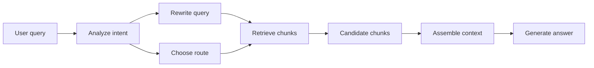

Where it fits:

- Users ask vague questions like "does the new limit apply to partners" while the corpus uses terms like "external reseller quota".
- High-volume systems where simple queries should not pay for agentic or multi-hop execution.
- Multilingual or synonym-heavy corpora where the user vocabulary differs from the document vocabulary.

Main risk:

- **Semantic drift** — the rewritten query can silently change the user's intent. Log original and rewritten queries together, and measure whether rewrites improve retrieval recall.

### 4. Parent-Document and Recursive Retrieval

#### Work principle

Index small chunks for precise matching, but return a larger parent section or document window for generation. Retrieval stays sharp, while the model receives enough surrounding context to interpret tables, definitions, and dependencies.

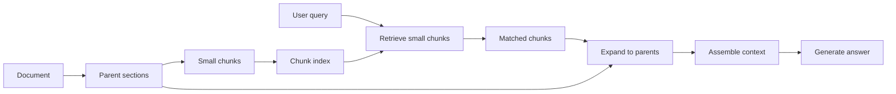

Where it fits:

- Long manuals, design docs, RFCs, and legal policies where a 300-token chunk is not enough to answer correctly.
- Tables and lists where a matching row needs its header, caption, or section preamble.
- Questions that need local context but not full multi-hop reasoning.

Main risk:

- **Context bloat** — returning parent sections can drown the prompt in irrelevant text. Use token budgets and rerank parent windows before generation.

### 5. Multi-Query Fusion

#### Work principle

Generate several search variants for the same user question, retrieve for each variant, deduplicate results, then fuse the rankings. This raises recall when no single query wording captures all relevant evidence.

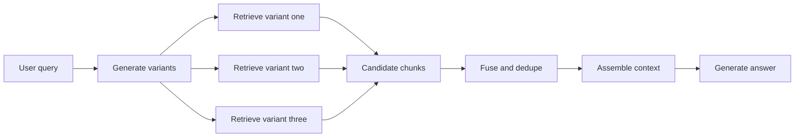

Where it fits:

- Compound questions such as "compare retention, deletion, and export rules".
- Domains with many aliases for the same concept.
- Recall-sensitive assistants where missing evidence is worse than retrieving a few extra candidates.

Main risk:

- **Duplicate cost** — every variant runs another retrieval path. Cap variants, deduplicate aggressively, and skip this pattern for simple fact lookups.

### 6. Contextual Retrieval

#### Work principle

Add a short document-aware explanation to each chunk before indexing it. The retriever no longer sees a bare fragment; it sees the fragment plus enough context to know what the fragment means inside the original document.

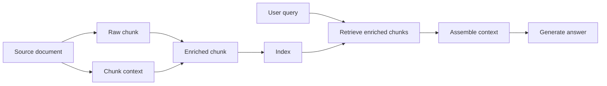

Where it fits:

- Chunks that contain pronouns, shorthand, table rows, or local definitions that make sense only inside the source document.
- Static or slowly changing corpora where extra indexing-time LLM calls are acceptable.
- Systems already using hybrid search and reranking but still losing meaning at chunk boundaries.

Main risk:

- **Indexing cost and stale enrichment** — every chunk may need an LLM-generated description. When source documents change, regenerate enriched chunks or the index will preserve old context.

### 7. Multimodal RAG

#### Work principle

Retrieve and pass evidence across text, tables, images, charts, and scanned pages. The system either converts non-text content into text-like representations or uses vision-capable embeddings and models so the answer can cite visual evidence.

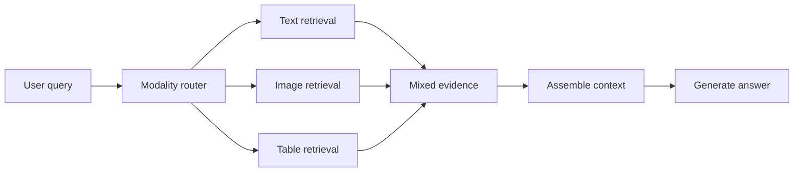

Where it fits:

- Financial reports, research papers, technical manuals, medical forms, and scanned PDFs.
- Questions where the evidence is in a chart, layout, or table rather than prose.
- Document AI systems where OCR-only pipelines lose structure.

Main risk:

- **Modality mismatch** — retrieving an image is useless if the final model only receives text. Pass visual evidence to a model that can inspect it, or extract reliable text and table structure first.

### 8. HyDE

#### Work principle

The model writes a hypothetical answer first, embeds that synthetic answer, and searches with the answer embedding instead of the raw query. The fake answer acts like a semantic bridge when the user query is too short or uses different vocabulary than the corpus.

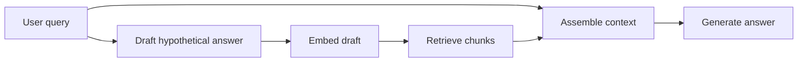

Where it fits:

- Sparse or vague user queries where direct embedding search underperforms.
- Domains with vocabulary mismatch between layperson questions and expert documents.
- Offline research assistants where extra model calls are acceptable.

Main risk:

- **Hallucinated retrieval anchor** — the hypothetical answer can invent details and retrieve evidence for the wrong premise. Use HyDE selectively and compare it against direct retrieval in evals.

### 9. Iterative Multi-Hop Retrieval

#### Work principle

The system retrieves evidence, reasons about what is missing, creates a follow-up query, and retrieves again. It repeats for a small number of hops until the evidence covers the question.

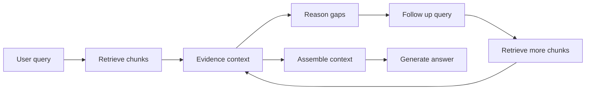

Where it fits:

- Multi-hop questions where second-hop evidence depends on first-hop findings.
- Bridge entity problems where the connecting document is not in the initial top-k results.
- Complex analytical queries that decompose into sub-questions, each needing separate evidence.

Main risk:

- **Query drift and noise accumulation** — each hop can move away from the original intent. Include the original query in every step, cap hops, rerank before adding new evidence, and trace each hop for debugging.

### 10. Agentic RAG

#### Work principle

An [[Software Engineering/11 AI & ML/LLM/Agents/Agents|agent]] decides which retrieval or data tools to call, observes the result, and chooses the next action. Unlike a fixed pipeline, the path can change per query.

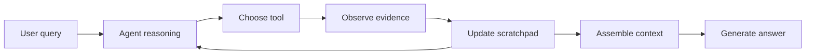

Where it fits:

- Queries requiring multiple data sources: vector search, SQL, web search, APIs, and calculators.
- Research-style tasks where the user expects multi-step investigation.
- Ambiguous questions where the system must try one route, inspect the result, then retry differently.

Main risk:

- **Unbounded execution** — agents can loop, call expensive tools, or choose the wrong tool confidently. Use structured tool calls, iteration caps, trace logging, and cost budgets.

### 11. GraphRAG

#### Work principle

Build a knowledge graph from documents, connect entities and relationships, summarize communities, then retrieve from graph neighborhoods or community summaries. The graph gives the retriever explicit relationship structure that flat chunks do not contain.

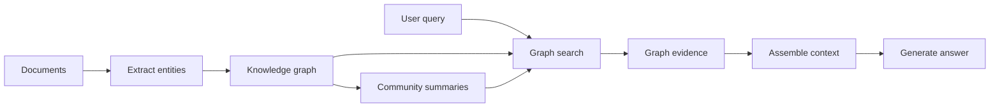

Where it fits:

- Dependency-heavy domains: architecture, compliance, contracts, supply chains, investigations.
- Questions that ask about relationships, impact, ownership, or themes across a corpus.
- Global synthesis queries where top-k chunks miss the dataset-level picture.

Main risk:

- **Expensive and brittle indexing** — entity extraction, entity linking, graph construction, and community summaries all introduce errors. GraphRAG is powerful when relationships matter, but overkill for ordinary support Q&A.

### 12. Corrective and Self-Reflective RAG

#### Work principle

Add an evaluator or specially trained model that decides whether retrieved evidence is relevant and whether the generated answer is supported. If evidence looks weak, the system retries retrieval, falls back to web search, or rejects unsupported output.

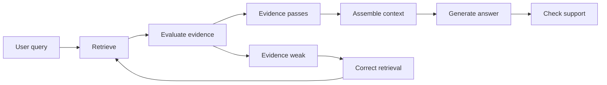

Where it fits:

- High-risk domains where unsupported answers are unacceptable.
- Research or custom-model environments that can train reflection tokens, relevance evaluators, or domain-specific critics.
- Systems with mature observability where the team can calibrate evaluator thresholds.

Main risk:

- **Rare as a plug-and-play production pattern** — Self-RAG requires custom model training, and CRAG-style correction needs calibrated evaluators. For most teams, start with reranking, evals, and guardrails before adopting this family.

## Pattern Selection Guide

| Pattern | Commonness | Best For | Runtime Cost | When to Skip |
|---------|------------|----------|--------------|--------------|
| Baseline Single-Pass RAG | Mainstream baseline | First version and simple factual lookup | Low | Retrieval metrics already show exact-term or precision failures |
| Hybrid Search plus Reranking | Mainstream production default | Enterprise text with exact terms and semantic matches | Medium | Tiny curated corpus where dense retrieval is already excellent |
| Query Rewriting and Routing | Common | Vague queries and mixed complexity traffic | Low to medium | Users already write precise search queries |
| Parent-Document and Recursive Retrieval | Common | Long documents and structure-sensitive answers | Medium | Short standalone snippets answer most questions |
| Multi-Query Fusion | Emerging | Compound or synonym-heavy questions | Medium | Simple single-intent lookup traffic |
| Contextual Retrieval | Emerging | Chunks that lose meaning outside the source document | Indexing cost high and runtime cost low | Fast-changing corpora where enrichment goes stale quickly |
| Multimodal RAG | Emerging | PDFs, tables, figures, scans, diagrams | Medium to high | Text-only corpus |
| HyDE | Niche | Vocabulary mismatch and sparse queries | Medium | Queries are already specific and direct retrieval works |
| Iterative Multi-Hop Retrieval | Rare to emerging | Multi-hop evidence chains | High | Single-hop answers dominate traffic |
| Agentic RAG | Rare to emerging | Multiple tools and dynamic investigation | High | One data source and one retrieval path are enough |
| GraphRAG | Rare and specialized | Entity relationships and global synthesis | High | Simple fact lookup or frequently changing data |
| Corrective and Self-Reflective RAG | Research and very rare | High-risk answers needing custom critique | High | You cannot train evaluators or calibrate thresholds |

**Adoption order**: ship baseline RAG first, then add hybrid search and reranking. Add query rewriting, parent-document retrieval, or multi-query fusion when evals show recall gaps. Use contextual, multimodal, iterative, agentic, or GraphRAG only for the specific failure modes they solve. Treat Self-RAG, CRAG, and Speculative RAG as research patterns unless your team can justify the training, evaluator, or specialist-model overhead.

## Operational Baselines

- Gate every pattern behind a feature flag. Measure [[Software Engineering/11 AI & ML/LLM/RAG/Monitoring#Retrieval Quality Metrics|retrieval precision]], [[Software Engineering/11 AI & ML/LLM/RAG/Monitoring#LLM-as-Judge Metrics|generation faithfulness]], latency p95, and cost per query before and after.
- Set hard iteration caps on looping patterns (Iterative, Agentic) to bound latency and cost. For corrective/self-reflective patterns, cap retry count and reject unsupported output instead of looping until the answer looks good.
- Monitor query drift and noise accumulation in iterative patterns. Track semantic similarity between the original query and each iteration's retrieval query.
- Cache aggressively: community summaries (GraphRAG), query rewrites, multi-query result sets, contextual chunk enrichments, reasoning chains, and agent tool outputs. See [[Software Engineering/11 AI & ML/LLM/RAG/Caching|Caching]] for cache-key risks.
- Route simple queries to the cheapest path. Most production traffic is simple — do not pay multi-hop costs for single-hop questions.

## RAG vs Fine-Tuning

RAG and fine-tuning optimize different parts of the system. RAG externalizes knowledge into retrievable sources, while fine-tuning changes model behavior in weights. Choosing correctly prevents expensive retraining for problems that retrieval can solve more safely.

Example: if product policy changes weekly, RAG can update by reindexing documents. Fine-tuning would require repeated retraining cycles and still provide weak source traceability.

| Axis | RAG | Fine-tuning |
|---|---|---|
| Knowledge freshness | High | Low |
| Source traceability | High | Low |
| Behavioral consistency | Medium | High |
| Time to first value | Faster | Slower |
| Operational complexity | Retrieval and index ops | Training and eval and release ops |

**Decision rules:**

1. Start with RAG when facts change often or citation is required.
2. Add fine-tuning when output style or policy behavior remains unstable after prompt and retrieval tuning.
3. Keep mutable facts in retrieval; keep behavior patterns in fine-tuned weights.

The combined pattern — fine-tune the model for behavior (format, tone, refusal policy) and use RAG for current factual knowledge — keeps updates fast while preserving behavioral control.

## Questions

> [!QUESTION]- Why should advanced RAG patterns be introduced incrementally instead of all at once?
> Each pattern adds independent failure modes and observability needs. Incremental rollout isolates impact, allows A/B measurement against baseline, and prevents compounding complexity from masking root causes. Start with the pattern that addresses your highest-frequency failure mode.

> [!QUESTION]- When is Graph RAG a better fit than plain vector retrieval?
> When answers require explicit entity relations, dependency paths, or multi-hop joins that are hard to recover from independent text chunks. Examples: compliance tracing across policy documents, architecture dependency analysis, supply chain impact assessment. Skip Graph RAG for simple fact lookups where vector similarity suffices.

> [!QUESTION]- Why is hybrid search plus reranking usually added before GraphRAG or agentic RAG?
> Hybrid search and reranking fix the most common production failure first: the right evidence is missing or buried under noisy chunks. They reuse the same corpus and retrieval pipeline, so the integration cost is lower than building agents or knowledge graphs. GraphRAG and agentic RAG are justified only when evals show relationship reasoning or multi-tool orchestration is the actual bottleneck. The tradeoff is that hybrid search improves retrieval quality cheaply, while graph and agentic systems buy extra capability at a large indexing, latency, and observability cost.

## References

- [Retrieval-Augmented Generation for Knowledge-Intensive NLP Tasks](https://arxiv.org/abs/2005.11401) — the original RAG paper; useful for understanding the baseline retrieve-then-generate formulation before modern production extensions.
- [RAG techniques in Azure AI Search](https://learn.microsoft.com/en-us/azure/search/retrieval-augmented-generation-overview) — Microsoft’s current production-oriented overview of classic RAG, chunking, indexing, retrieval, and answer generation.
- [Hybrid search in Azure AI Search](https://learn.microsoft.com/en-us/azure/search/hybrid-search-overview) — explains why modern search stacks combine keyword and vector retrieval rather than relying on dense vectors alone.
- [Semantic ranking in Azure AI Search](https://learn.microsoft.com/en-us/azure/search/semantic-search-overview) — documents reranking as a second-stage relevance step after the initial candidate set is retrieved.
- [Contextual Retrieval](https://www.anthropic.com/news/contextual-retrieval) — Anthropic’s 2024 write-up on enriching chunks with document-aware context before indexing.
- [Advanced retrieval strategies in LlamaIndex](https://developers.llamaindex.ai/python/framework/module_guides/querying/retriever/retrievers/) — framework documentation covering practical retriever variants such as hybrid, recursive, and auto-retrieval patterns.
- [Multimodal search in Azure AI Search](https://learn.microsoft.com/en-us/azure/search/multimodal-search-overview) — production guidance for retrieving over mixed text and image content.
- [From Local to Global: A Graph RAG Approach to Query-Focused Summarization](https://arxiv.org/abs/2404.16130) — Microsoft Research paper behind GraphRAG; use it for relationship-heavy and global-synthesis workloads, not as a default RAG baseline.
- [Self-RAG: Learning to Retrieve, Generate, and Critique Through Self-Reflection](https://arxiv.org/abs/2310.11511) — research source for reflection-token-based retrieval and critique; included to explain why Self-RAG is powerful but rarely plug-and-play.
- [Corrective Retrieval Augmented Generation](https://arxiv.org/abs/2401.15884) — research source for evaluator-driven correction and web-search fallback; useful when studying corrective RAG but not a first production pattern.

<!-- whats-next:start -->

---

> [!note] Whats next
> **Parent**
>  [[Software Engineering/11 AI & ML/LLM/LLM|LLM]]
>
> **Pages**
> - [[Software Engineering/11 AI & ML/LLM/RAG/Caching|Caching]]
> - [[Software Engineering/11 AI & ML/LLM/RAG/Chunking|Chunking]]
> - [[Software Engineering/11 AI & ML/LLM/RAG/Evaluation|Evaluation]]
> - [[Software Engineering/11 AI & ML/LLM/RAG/Monitoring|Monitoring]]
> - [[Software Engineering/11 AI & ML/LLM/RAG/Query Translation|Query Translation]]
> - [[Software Engineering/11 AI & ML/LLM/RAG/Re-ranking|Re-ranking]]
> - [[Software Engineering/11 AI & ML/LLM/RAG/Retrieval|Retrieval]]
<!-- whats-next:end -->
