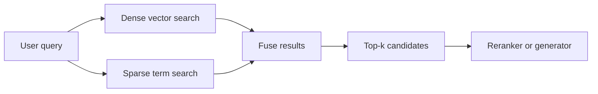

---
topic:
  - "AI & ML"
subtopic:
  - "LLM"
level:
  - "2"
priority: High
status: Creation
dg-publish: true
---

# Intro

Retrieval is the stage that decides what evidence enters the prompt. In most RAG systems, generation quality plateaus at the quality of retrieval — no prompt engineering or model upgrade compensates for missing or wrong context. The goal is to balance recall (find everything relevant), precision (exclude everything irrelevant), and latency across query types: semantic paraphrases, exact identifiers, and multi-constraint requests.

The mechanism: the user query is converted into one or more search representations — a dense vector, a sparse term-weight vector, or both. Dense vectors are matched against pre-indexed chunk embeddings via approximate nearest neighbor (ANN) search. Sparse representations are matched via inverted index lookup (BM25). The top-k candidates from one or both modes are fused into a single ranked list and passed to [[Software Engineering/11 AI & ML/LLM/RAG/Re-ranking|reranking]] or directly to the generator.

Example: a user asks "rate limit error 429 behavior in partner tier." Dense retrieval captures the semantic intent — rate limiting behavior — but may miss the exact token `429`. BM25 catches `429` and `partner tier` via exact match but misses semantically related content phrased differently. Hybrid retrieval runs both in parallel and fuses results, covering both failure modes. Though hybrid is the safe default, it is not universally better — see Pitfalls.

## Retrieval Modes

### Dense Retrieval

How it works:

- A bi-encoder embeds query and document chunks independently into the same vector space. The query encoder and document encoder share architecture (typically a transformer) but run separately — document embeddings are pre-computed at index time, and only the query needs encoding at search time.
- Retrieval uses ANN search (commonly HNSW or IVF indexes) to find the top-k vectors closest to the query vector by cosine similarity or dot product. ANN trades a small recall loss for orders-of-magnitude speed gains over brute-force search.
- Embedding model choice directly affects retrieval quality. Models differ in dimensionality, training data, and domain performance. MTEB leaderboard scores provide a starting point, but a model topping MTEB on general benchmarks can collapse on specialized corpora or non-English queries — domain-specific evaluation is essential.

Where it fits:

- Semantic paraphrases and natural-language questions where user wording differs from source text.
- Multilingual corpora where cross-lingual embeddings capture meaning across languages.

Main risk:

- **Treats exact identifiers as noise.** Dense models learn to focus on semantic meaning, not specific tokens. Error codes, API paths, and version strings get low attention weight. The retriever returns topically related but operationally wrong chunks — and unlike BM25 misses (which return obviously unrelated content), dense misses look plausible, making them harder to catch.

### Sparse Retrieval — BM25

How it works:

- BM25 ranks documents by lexical overlap weighted by term statistics. For each query term, it computes a score based on term frequency in the document (how often the term appears), inverse document frequency across the corpus (how rare the term is globally), and document length normalization. Rare terms that appear in a document score high; common terms score low.
- The two key improvements over basic TF-IDF: term frequency saturation (a term appearing 100 times is not 10x more relevant than appearing 10 times) and document length normalization (prevents long documents from dominating by having more words).
- Implemented via inverted indexes: each term maps to a posting list of documents containing it. No embedding model, no GPU, no vector index — operationally the simplest retrieval mode.

Where it fits:

- Queries with exact keyword constraints: error codes, product names, version numbers, configuration keys.
- Domains with specialized terminology where exact matches carry high signal.

Main risk:

- **Weak semantic recall.** BM25 cannot match "authentication failure" to a chunk about "credential validation errors" because the terms do not overlap. Synonym expansion and stemming help marginally but do not close the gap with dense retrieval on paraphrase-heavy queries.

### Hybrid Retrieval

How it works:

- Run dense and sparse retrieval in parallel against the same query. Fuse the two ranked lists into a single candidate set.
- **[[Software Engineering/11 AI & ML/LLM/RAG/Re-ranking|Reciprocal Rank Fusion (RRF)]]** is the most common fusion method: for each document, sum `1 / (k + rank)` across retrievers, where k=60 is the standard constant from the original paper. RRF is rank-based — it needs no score normalization across retrievers with different scales, which makes it robust. A document ranked high in both lists scores higher than one ranked first in only one list, rewarding consensus.
- **Linear combination** normalizes scores and computes `alpha * dense_score + (1 - alpha) * sparse_score`. This preserves score magnitude but requires choosing alpha and is sensitive to score distribution shifts. Domain tuning matters: identifier-heavy corpora benefit from higher sparse weight (alpha around 0.6); conversational queries benefit from higher dense weight (alpha around 0.7).

Where it fits:

- Production systems with mixed query patterns — the safe default for most RAG systems.

Main risk:

- **Not universally better than single-mode.** On homogeneous corpora where one mode dominates, the weaker retriever introduces noise into the fused results. In one production benchmark on scientific documents, dense-only achieved 69.2% hit rate versus hybrid's 63.5% — sparse search added noise, not signal. The "weakest link" phenomenon: adding a weak retrieval path to a hybrid system can degrade overall performance. Evaluate hybrid against single-mode baselines on your actual corpus.
- **Over-retrieval noise when top-k is high.** Fusing two ranked lists with large top-k produces candidates with diminishing relevance. Without [[Software Engineering/11 AI & ML/LLM/RAG/Re-ranking|reranking]] or deduplication, low-ranked fused candidates dilute generation context.

## Indexing and Filtering

The index structure determines the latency-recall tradeoff for dense retrieval:

- **HNSW** (Hierarchical Navigable Small World) builds a multi-layer proximity graph. Queries traverse from the top layer down, narrowing search at each level. High recall at sub-millisecond latency for moderate-scale corpora. The key parameter `ef_search` controls exploration breadth — higher values improve recall but increase latency. Recall degrades silently as the corpus grows if `ef_search` is not re-tuned (see Pitfalls).
- **IVF-PQ** (Inverted File Index with Product Quantization) partitions the vector space into clusters and compresses vectors within each cluster. Lower memory than HNSW (up to 32x compression), but recall drops faster with aggressive quantization. Better suited for very large corpora (10M+ vectors) where memory is the primary constraint.

Metadata filtering is equally critical:

- **Pre-filtering** narrows the search space by metadata constraints (tenant ID, ACL, date range) before vector search. Required for tenant-safe retrieval — semantic relevance does not enforce authorization boundaries.
- **Post-filtering** applies constraints after vector search. Faster to implement but dangerous: if many top-k results are filtered out, the effective candidate set shrinks unpredictably and recall drops.
- Keep index versioning explicit. Collection aliases enable instant rollback during index rebuilds.

## Pitfalls

### Silent Recall Degradation at Scale

HNSW recall degrades as the corpus grows — no errors, no latency spike, just worse context fed to the LLM. At fixed `ef_search`, the graph's approximation becomes less accurate as more vectors crowd the space. Infrastructure dashboards show healthy metrics while answer quality silently declines. Long-tail and rare-entity queries degrade first.

Detection: maintain ground-truth query-chunk pairs and run Recall@k checks on a schedule. Latency and error-rate monitoring alone will not catch recall regression.

### Embedding Model Migration Debt

Embedding models produce incompatible vector spaces. Upgrading models means re-embedding the entire corpus — you cannot mix old document embeddings with new query embeddings. At scale, this means parallel infrastructure costs, downtime risk, and potential regression even when benchmark scores improve. API providers (like OpenAI) can deprecate models on their schedule, forcing emergency re-embedding.

Mitigation: treat embedding model selection as a long-term infrastructure decision. Store the model version alongside each vector. Set upgrade thresholds based on domain-specific metrics, not MTEB deltas. Use collection aliases and shadow traffic to validate before cutover.

### Aggregate Metrics Hiding Segment Failures

Overall recall of 70% can mask 5% recall on the query types that matter most (multi-hop, date-filtered, identifier-heavy). Without segmentation, you cannot distinguish inventory failures (data missing from corpus) from capability failures (data exists but retrieval cannot surface it).

Detection: segment retrieval metrics by query type, tenant, locale, and domain. Alert on per-segment degradation, not just aggregate.

### Dense Retrieval Failing Silently on Identifiers

Dense models return topically related but operationally wrong chunks for identifier-heavy queries. Unlike BM25 misses that return obviously unrelated content, dense misses look plausible — the LLM synthesizes a confident answer from wrong evidence.

Mitigation: use hybrid retrieval for identifier-heavy corpora. Explicitly test retrieval on identifier-based queries during evaluation. If dense retrieval is responsible for most failures in your pipeline, inspect fusion weights — identifier-heavy domains often need higher sparse weight.

## Tradeoffs

| Mode | Recall profile | Latency | Operational complexity | Best for |
| --- | --- | --- | --- | --- |
| Dense only | Strong on semantic paraphrases -- weak on exact identifiers | Low -- single ANN lookup | Moderate -- embedding model and vector index required | Homogeneous semantic corpora with natural-language queries |
| Sparse only -- BM25 | Strong on exact terms -- weak on paraphrases | Lowest -- inverted index lookup | Low -- no embedding model or vector index | Identifier-heavy domains with stable vocabulary |
| Hybrid -- RRF | Broad -- covers semantic and lexical queries | Moderate -- two parallel retrievals plus fusion | Higher -- two indexes and fusion logic | Mixed query patterns -- default for most production systems |
| Hybrid -- linear combination | Tunable -- weight toward dominant retriever | Moderate -- same as RRF | Highest -- requires alpha tuning per domain | When one retriever is consistently stronger and you want explicit weighting |

Decision rule: start with hybrid retrieval (RRF) and conservative top-k (5-20). Evaluate against single-mode baselines on your actual corpus and query distribution — hybrid is the safe default but not always the winner. Add [[Software Engineering/11 AI & ML/LLM/RAG/Re-ranking|reranking]] only after baseline retrieval is stable and precision at the top of the ranked list is the dominant error mode.

## Questions

> [!QUESTION]- Why can dense-only retrieval underperform on technical support workloads?
> Technical support queries often include exact lexical constraints: error codes, version strings, API paths, and SKU IDs. Dense retrieval learns to focus on semantic meaning, not specific tokens — a query for "error E4392 in v2.3" may retrieve content about error handling in general rather than the specific code. The failure is subtle because returned chunks are topically related, so the LLM synthesizes a plausible but wrong answer. BM25 catches these exact tokens via high IDF weight, which is why hybrid retrieval is essential for these workloads.

> [!QUESTION]- When does hybrid retrieval perform worse than single-mode retrieval?
> When the weaker retriever contributes more noise than signal to the fused list. On homogeneous corpora where one mode dominates (e.g., scientific documents with consistent terminology and natural-language queries), the non-dominant retriever pulls in marginally relevant candidates that dilute fused results. In production benchmarks, dense-only has beaten hybrid on scientific corpora because sparse search on specialized vocabulary introduced noise. Always evaluate hybrid against single-mode baselines on your actual corpus before committing to the added complexity.

> [!QUESTION]- Why does HNSW recall degrade silently as the vector database grows?
> HNSW traverses a proximity graph to find approximate nearest neighbors. The `ef_search` parameter controls how many nodes the algorithm explores during each query. At small corpus sizes, moderate `ef_search` values find most true neighbors. As the corpus grows, the graph becomes denser and the same `ef_search` misses more true neighbors — the greedy search gets stuck in local minima more often. Latency stays stable because the algorithm still explores the same number of nodes, and no errors are raised. The only signal is less relevant retrieved chunks. Detection requires explicit Recall@k monitoring against a ground-truth test set.

## References

- [RAG techniques — retrieval and ranking overview (Azure AI Search)](https://learn.microsoft.com/en-us/azure/search/retrieval-augmented-generation-overview)
- [Reciprocal Rank Fusion outperforms Condorcet and individual rank learning methods (SIGIR 2009)](https://plg.uwaterloo.ca/~gvcormac/cormacksigir09-rrf.pdf)
- [Introducing Contextual Retrieval — hybrid retrieval gains measured (Anthropic Engineering)](https://anthropic.com/engineering/contextual-retrieval)
- [HNSW at scale — why recall degrades as the vector database grows (Towards Data Science)](https://towardsdatascience.com/hnsw-at-scale-why-your-rag-system-gets-worse-as-the-vector-database-grows/)
- [When good models go bad — embedding model migration and MTEB limitations (Weaviate)](https://weaviate.io/blog/when-good-models-go-bad)
- [BM25 vs dense retrieval — what actually breaks in production (Ranjan Kumar)](https://ranjankumar.in/bm25-vs-dense-retrieval-for-rag-engineers)
- [Evaluate your own RAG — why best practices failed on scientific documents (Hugging Face)](https://huggingface.co/blog/charles-azam/rag)
- [How to systematically improve RAG — segmentation and failure taxonomy (Jason Liu)](https://jxnl.co/writing/2025/01/24/systematically-improving-rag-applications/)
- [Deconstructing RAG — retrieval patterns and evaluation (LangChain Engineering)](https://blog.langchain.com/deconstructing-rag/)
- [MTEB leaderboard — retrieval task benchmarks (Hugging Face)](https://huggingface.co/spaces/mteb/leaderboard)

<!-- whats-next:start -->

---

> [!note] Whats next
> **Parent**
>  [[Software Engineering/11 AI & ML/LLM/LLM|LLM]]
>
> **Pages**
> - [[Software Engineering/11 AI & ML/LLM/RAG/Caching|Caching]]
> - [[Software Engineering/11 AI & ML/LLM/RAG/Chunking|Chunking]]
> - [[Software Engineering/11 AI & ML/LLM/RAG/Evaluation|Evaluation]]
> - [[Software Engineering/11 AI & ML/LLM/RAG/Monitoring|Monitoring]]
> - [[Software Engineering/11 AI & ML/LLM/RAG/Query Translation|Query Translation]]
> - [[Software Engineering/11 AI & ML/LLM/RAG/Re-ranking|Re-ranking]]
<!-- whats-next:end -->
