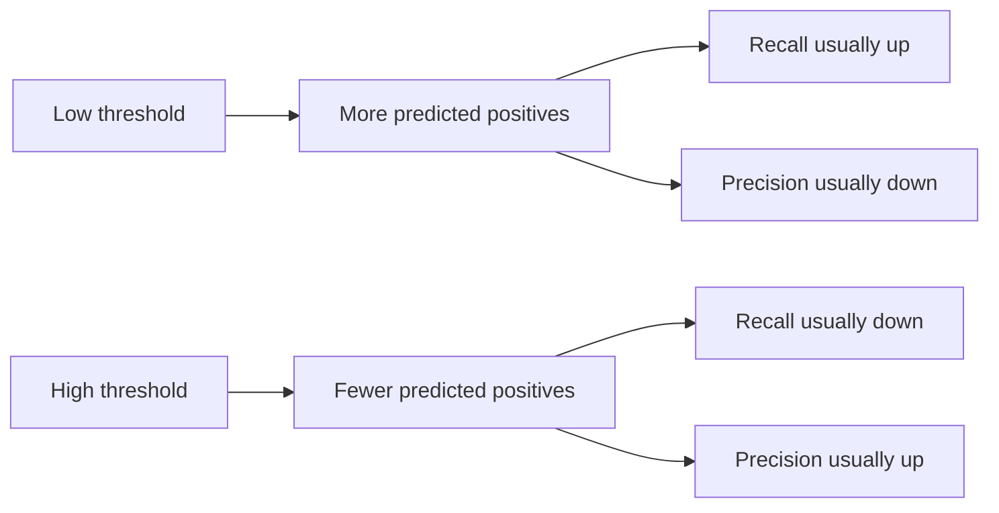

---
topic:
  - AI & ML
subtopic:
  - Machine Learning
level:
  - "3"
priority: Medium
status: Creation

dg-publish: true
---

# Intro

Classification evaluation is how you measure whether a model assigns the right label (or set of labels) for an input. In software terms: you want to quantify the failure modes (false alarms vs misses), pick an operating point (threshold), and prevent regressions when data/model changes.

## Precision Recall and F1 in one page

### Confusion matrix first

Everything starts from four counts:

| | Actual positive | Actual negative |
|---|---:|---:|
| Predicted positive | TP | FP |
| Predicted negative | FN | TN |

- `TP`: you flagged positive and it really was positive.
- `FP`: false alarm.
- `FN`: miss.
- `TN`: correctly ignored.

### The three formulas to remember

```text
precision = TP / (TP + FP)
recall    = TP / (TP + FN)
F1        = 2 * (precision * recall) / (precision + recall)
```

- Precision: from predicted positives, how many are truly positive.
- Recall: from real positives, how many you found.
- F1: one score that is high only when both precision and recall are high.

Memory hook:

- Precision is hurt by `FP` false alarms.
- Recall is hurt by `FN` misses.

### Threshold tradeoff



### Real world examples

Content moderation:

- Low threshold catches more unsafe posts, but blocks more safe posts.
- High threshold blocks fewer safe posts, but lets more unsafe posts pass.

Fraud detection:

- High recall means fewer fraud cases slip through.
- High precision means fewer legit users get flagged.

### Worked example

Binary classifier on 100 cases:

```text
TP = 32
FP = 8
TN = 50
FN = 10
```

```text
precision = 32 / (32 + 8)  = 0.80
recall    = 32 / (32 + 10) = 0.76
F1        = 2 * (0.80 * 0.76) / (0.80 + 0.76) = 0.78
```

Same model family at two thresholds:

| Threshold | TP | FP | FN | Precision | Recall |
|---|---:|---:|---:|---:|---:|
| 0.30 | 90 | 60 | 10 | 0.60 | 0.90 |
| 0.80 | 55 | 10 | 45 | 0.85 | 0.55 |

### Pitfalls

**F1 hides asymmetric failures** — an F1 of 0.78 could be precision 0.95 / recall 0.66 or precision 0.66 / recall 0.95. These have completely different operational impact. A fraud detection model with recall 0.66 misses a third of fraud cases — a $2M/year loss at a mid-size payment processor. Always report precision and recall separately alongside F1.

**Comparing models at different thresholds** — if Model A runs at threshold 0.3 and Model B at 0.7, comparing their precision/recall is meaningless. Fix the threshold policy first (e.g., "recall ≥ 0.95"), then compare precision at that fixed operating point. Better yet, compare PR-AUC or ROC-AUC for threshold-invariant comparison.

**Optimizing a single metric** — a spam filter optimized purely for precision (blocking only obvious spam) lets 40% of spam through. The same filter optimized purely for recall blocks 15% of legitimate emails. Neither is deployable. Always optimize under a constraint: "maximize precision subject to recall ≥ X" (or vice versa).

**Class imbalance distortion** — accuracy is misleading on imbalanced datasets. A model that always predicts "not fraud" on a dataset with 0.1% fraud rate achieves 99.9% accuracy but catches zero fraud. Use precision/recall/F1 (which ignore TN) or balanced accuracy. In production, track per-class metrics separately.

## Multi-class Averaging

When extending precision/recall to multi-class problems, the averaging method changes the number you see:

| Method | Formula | When to Use |
| --- | --- | --- |
| **Macro** | Average metric across classes equally | All classes are equally important regardless of size (e.g., rare disease detection) |
| **Micro** | Aggregate TP/FP/FN globally, then compute | Overall correctness matters most, classes are roughly balanced |
| **Weighted** | Average weighted by class support (count) | Classes have different sizes and you want proportional representation |

**Decision rule**: use macro-average when minority classes matter (medical, safety). Use micro-average for balanced datasets or when you want a single aggregate number. Use weighted-average for reporting to stakeholders who think in terms of "percentage of all predictions correct."

## Questions

> [!QUESTION]- When should you optimize precision vs recall, and how do you operationalize the choice?
> Optimize precision when false positives are expensive: blocking legitimate users (payment fraud → customer churn at $50/incident), creating costly manual review queues (content moderation team costs $35/hour per reviewer), or triggering expensive downstream actions (automated account lockouts). Optimize recall when misses are dangerous: fraud slipping through ($500 average loss per undetected case), safety violations in content moderation (regulatory fines), or medical screening (missed diagnosis). Operationalize by setting a hard constraint on the priority metric (e.g., "recall ≥ 0.95"), then maximizing the other. Freeze the threshold and monitor both metrics daily with alerting on ≥5% drift.

> [!QUESTION]- How do you pick a classification threshold in practice?
> 1. Define the business constraint: "recall must be ≥ 0.95" or "FP rate must be ≤ 0.02." 2. Plot the precision-recall curve on a held-out validation set. 3. Find the threshold that satisfies your constraint while maximizing the complementary metric. 4. Validate on a separate golden test set (not the validation set used for selection). 5. Freeze the threshold in production config (not hardcoded). 6. Set up monitoring: if the metric drops ≥5% on weekly golden-set runs, trigger re-evaluation. **Tradeoff**: a static threshold degrades as data distribution shifts — schedule quarterly threshold reviews or implement dynamic thresholding with confidence calibration.

> [!QUESTION]- Your model has F1 = 0.78. The PM says it's "good enough." What questions do you ask?
> 1. What are precision and recall separately? F1 0.78 could be 0.95/0.66 or 0.66/0.95 — radically different operational impact. 2. What's the class balance? On imbalanced data, F1 can be misleadingly high for the majority class. 3. What's the business cost of each error type? If FP costs $5 and FN costs $500, optimizing F1 (which weights them equally) is wrong — you need a cost-weighted metric. 4. At what threshold? If threshold isn't fixed, the number is meaningless. 5. On what data split? If measured on training data, it's overfit. Must be held-out or cross-validated.

## Links

- [Scikit-learn: Classification metrics](https://scikit-learn.org/stable/modules/model_evaluation.html#classification-metrics) — comprehensive reference for precision, recall, F1, confusion matrix, ROC, and multi-class variants with code examples.
- [Google ML Crash Course: Accuracy, precision, recall](https://developers.google.com/machine-learning/crash-course/classification/accuracy-precision-recall) — interactive tutorial with threshold visualization and worked examples.
- [Precision-recall tradeoff in production ML (Eugene Yan)](https://eugeneyan.com/writing/simplicity/) — practitioner perspective on choosing operating points, monitoring metric drift, and when simpler models with better-understood failure modes beat complex ones.
- [Beyond Accuracy: Behavioral Testing of NLP Models (Ribeiro et al., ACL 2020)](https://aclanthology.org/2020.acl-main.442/) — introduces CheckList methodology for testing classification models beyond aggregate metrics, with per-capability precision/recall analysis.

<!-- whats-next:start -->

---

> [!note] Whats next
> **Parent**
>  [[Software Engineering/11 AI & ML/Machine Learning/Machine Learning|Machine Learning]]
>
> **Pages**
> - [[Software Engineering/11 AI & ML/Machine Learning/Evaluation/ROC-AUC and PR-AUC|ROC-AUC and PR-AUC]]
<!-- whats-next:end -->
