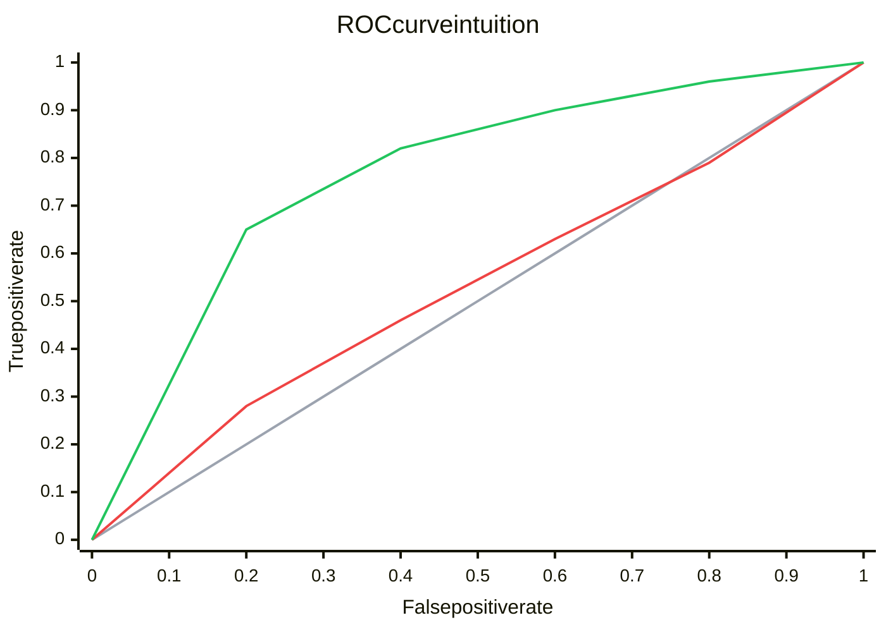
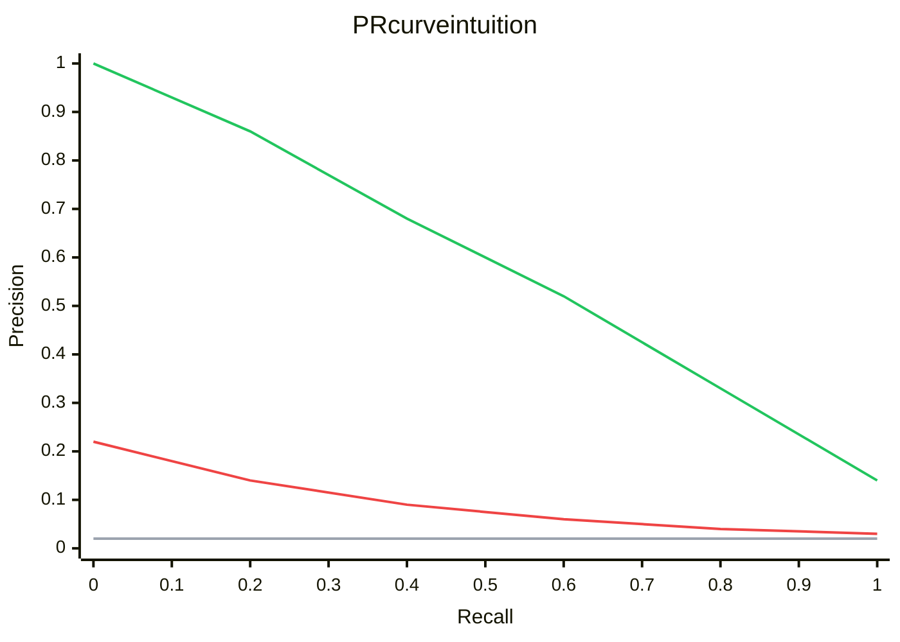

---
topic:
  - "AI & ML"
subtopic:
  - "Machine Learning"
level:
  - "2"
priority: Medium
status: Not-Started
dg-publish: true
---

# Intro

ROC-AUC means Receiver Operating Characteristic Area Under the Curve. PR-AUC means Precision Recall Area Under the Curve. Both are threshold-free metrics for binary classifiers.

Use ROC-AUC for general ranking quality when classes are fairly balanced. Use PR-AUC for imbalanced data where false positives are expensive.

This note fits the evaluation stage of [[Software Engineering/11 AI & ML/Machine Learning/Machine Learning|Machine Learning]] and is most relevant for [[Software Engineering/11 AI & ML/Machine Learning/Types|Types]] like binary classification and rare event detection.

## Deeper Explanation

### Mental Model

Both curves come from sweeping a score threshold from strict to loose.



What this ROC diagram shows:

- Line one gray is the random baseline classifier.
- Line two red is a weak model.
- Line three green is a strong model.
- Better ROC means higher true positive rate at the same false positive rate.
- If your model line stays close to gray, ranking quality is weak.




What this PR diagram shows:

- Line one gray is the random baseline at class prevalence, shown as a flat precision line.
- Line two red is a weak model that loses precision early.
- Line three green is a strong model that keeps precision while recall increases.
- Better PR means finding more positives without flooding downstream systems with false positives.
- If your model line tracks red, the alert queue will be noisy.

Area under the curve is average performance across thresholds.
- `ROC AUC` can be read as probability that a random positive gets a higher score than a random negative.

In ML.NET, `BinaryClassificationMetrics` exposes both `AreaUnderRocCurve` and `AreaUnderPrecisionRecallCurve` directly after calling `mlContext.BinaryClassification.Evaluate`.

### When to Use Which

Use this quick rule:

- Use `ROC AUC` for balanced-ish data and general ranking comparisons.
- Use `PR AUC` for imbalanced data where positive prediction quality matters most.

Why this matters in production:

- On highly imbalanced data, ROC-AUC can still look good while your alert queue is noisy.
- PR-AUC exposes that noise faster because false positives directly reduce precision.

### Example

ML.NET example that prints ROC-AUC and PR-AUC side by side:

```csharp
using Microsoft.ML;
using Microsoft.ML.Data;

var mlContext = new MLContext(seed: 42);

var data = mlContext.Data.LoadFromTextFile<ModelInput>(
    "transactions.csv", hasHeader: true, separatorChar: ',');

var split = mlContext.Data.TrainTestSplit(data, testFraction: 0.3);

var pipeline = mlContext.Transforms
    .NormalizeMinMax("Features")
    .Append(mlContext.BinaryClassification.Trainers
        .SdcaLogisticRegression(labelColumnName: "Label", featureColumnName: "Features"));

var model = pipeline.Fit(split.TrainSet);
var predictions = model.Transform(split.TestSet);

var metrics = mlContext.BinaryClassification.Evaluate(predictions, labelColumnName: "Label");

Console.WriteLine($"ROC-AUC:  {metrics.AreaUnderRocCurve:F3}");
Console.WriteLine($"PR-AUC:   {metrics.AreaUnderPrecisionRecallCurve:F3}");
Console.WriteLine($"F1:       {metrics.F1Score:F3}");
Console.WriteLine($"Accuracy: {metrics.Accuracy:F3}");

// Input schema
public class ModelInput
{
    [LoadColumn(0)]
    public bool Label { get; set; }

    [LoadColumn(1, 20), VectorType(20)]
    public float[] Features { get; set; } = default!;
}
```

How to read the output:

- High ROC-AUC with low PR-AUC means ranking is decent but positive predictions are noisy.
- High accuracy alone is not enough on imbalanced datasets.

### Reading the Curves

Anchor points:

- Random classifier baseline
  - `ROC AUC` is `0.5`
  - `PR AUC` baseline is the prevalence, the positive rate `P / (P + N)`
- Perfect classifier
  - `ROC AUC` is `1.0` and the ROC curve rises to the top left corner quickly
  - `PR AUC` is `1.0` and the PR curve stays near precision `1` until recall reaches `1`
- Typical shape
  - ROC often looks optimistic on imbalanced data.
  - PR often drops fast when you push recall too high.

For threshold selection, look for the knee:

- ROC knee: better recall with a small false positive increase.
- PR knee: point before precision collapses.

Practical threshold tuning pattern:

- Start from a constraint like "precision must be at least 0.8" or "recall must be at least 0.9".
- Sweep score thresholds and pick the one that meets your business constraint. In ML.NET you can iterate `predictions` and test cutoffs.

### Pitfalls

- ROC-AUC can hide poor positive prediction quality on imbalanced data.
- PR-AUC baseline depends on prevalence, so cross-dataset comparisons can mislead.
- AUC does not pick your threshold; you still need operating-point tuning.
- AUC does not measure calibration; a high AUC model can still output bad probabilities.
- Data leakage can inflate both metrics and fail in production.

### Tradeoffs

| Metric | Measures | Fits when | Misleads when |
|---|---|---|---|
| ROC-AUC | Ranking positives above negatives across all thresholds | Balanced-ish classes, you want a general ranking metric, you compare rankers | Extreme imbalance, you care about precision at a specific operating point |
| PR-AUC | Precision vs recall tradeoff for positives across thresholds | Rare positives, alerting and review pipelines, positive class is what matters | Prevalence changes between datasets, you need a globally comparable score |
| F1 | Single point tradeoff of precision and recall at one threshold | You have a chosen threshold and want a simple alert quality number | Threshold is not fixed, costs are asymmetric, you care about probability quality |
| Log loss | Quality of predicted probabilities with heavy penalty for confident mistakes | You optimize calibrated probabilities, you compare probabilistic models | Labels are noisy, you only care about ranking not probability magnitude |

## Questions

> [!QUESTION]- What does ROC-AUC measure?
> - It measures ranking quality across thresholds.
> - A higher ROC-AUC means positives usually get higher scores than negatives.

> [!QUESTION]- When should I use PR-AUC instead of ROC-AUC?
> - Use PR-AUC when positives are rare, like fraud or anomaly detection.
> - PR-AUC shows how precision changes as recall increases, which is key when false positives are costly.

> [!QUESTION]- Why can high accuracy be misleading on imbalanced data?
> - If negatives dominate, a model can predict mostly negatives and still get high accuracy.
> - Check PR-AUC, precision, and recall to understand real positive-class performance.

## Links

- [ML.NET BinaryClassificationMetrics](https://learn.microsoft.com/dotnet/api/microsoft.ml.data.binaryclassificationmetrics)
- [ML.NET evaluate binary classification model](https://learn.microsoft.com/dotnet/machine-learning/resources/metrics#evaluation-metrics-for-binary-classification)
- [ML.NET tutorial binary classification](https://learn.microsoft.com/dotnet/machine-learning/tutorials/sentiment-analysis)
- [The Relationship Between Precision Recall and ROC Curves](https://dl.acm.org/doi/10.1145/1143844.1143874)
- [Precision Recall Plot is More Informative than the ROC Plot when Evaluating Binary Classifiers on Imbalanced Datasets](https://www.ncbi.nlm.nih.gov/pmc/articles/PMC4349800/)

<!-- whats-next:start -->

---

> [!note] Whats next
> **Parent**
>  [[Software Engineering/11 AI & ML/Machine Learning/Machine Learning|Machine Learning]]
>
<!-- whats-next:end -->
