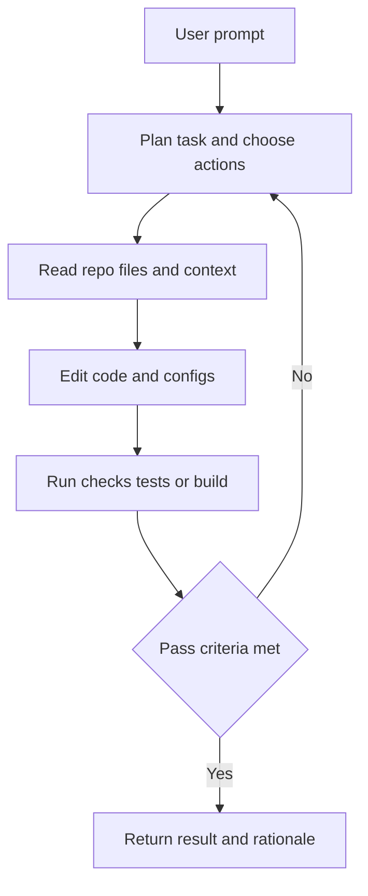

---
topic:
  - AI & ML
subtopic:
  - Tooling
dg-publish: false
status: Creation
level:
  - '2'
priority: Medium
---

# Intro

Coding agents are software tools that run an LLM inside an action loop to complete engineering tasks end to end: read code, propose a plan, edit files, run commands, inspect failures, and iterate until a stopping condition is met. They matter because they shift AI from "suggestion mode" to "execution mode". In practice, that changes team throughput only when the agent can follow repository conventions, verify changes, and expose enough execution detail for humans to trust the result.

A useful distinction in daily engineering:

- **Autocomplete** (for example, Copilot inline): predicts the next tokens in your current file; fast but local and non-autonomous
- **Chat assistant** (for example, ChatGPT or Copilot Chat): explains code and proposes snippets; typically waits for manual copy-paste or explicit actions
- **Coding agent** (for example, Claude Code, Cursor Agent, Copilot agent mode): executes multi-step work in a loop across files, tools, and validation commands

## How the Agent Loop Works

The key mechanism is iterative tool use, not one-shot generation. The model decides what to do next from observed outputs (test failures, lint errors, command logs), then re-plans. Better agents expose this loop clearly so developers can intervene before incorrect edits spread.

## Major Tools

### Claude Code (Anthropic)

Claude Code is a terminal-first agentic environment that can also integrate with IDE workflows. It uses Claude models and executes a tool-use loop around file operations and shell commands. It supports MCP servers for external capabilities, supports reusable skills, and offers hooks to run custom automation around agent actions. Project instructions are commonly stored in `AGENTS.md` or `CLAUDE.md` to constrain behavior consistently across sessions.

### Cursor

Cursor is a VS Code-based IDE with three integrated modes: tab completion, chat, and agent mode. The agent can inspect project files, apply edits, and run commands while preserving editor-native workflows such as navigation and refactoring. Cursor supports multiple model providers and uses rules files in `.cursor/rules/` (`.mdc` with frontmatter), superseding the legacy `.cursorrules` approach.

### GitHub Copilot

GitHub Copilot spans IDE extension workflows, Copilot Chat, CLI support, and newer agent-style experiences in GitHub environments. It is strongest when teams already standardize on GitHub for source control and pull-request operations. Repository-level behavior can be guided with `.github/copilot-instructions.md`, so generated changes align with team architecture, testing policy, and naming standards.

### Cline

Cline is an open-source VS Code extension focused on transparent agentic execution. It supports multiple LLM providers through user-managed credentials and exposes action-by-action behavior so developers can approve or redirect work. Teams often use `.clinerules` to persist local project guidance.

### Aider

Aider is an open-source terminal coding assistant with a strong git-aware workflow. It is optimized for patch-style iteration in existing repositories and works with many model providers. Configuration can be centralized in `.aider.conf.yml`, which helps teams keep consistent defaults for model choice, test commands, and editing behavior.

### Windsurf (Codeium)

Windsurf is a Codeium IDE centered on agentic development via Cascade and assisted editing via Supercomplete. It combines planning, editing, and conversational interaction in one interface, with project rules typically encoded in `.windsurfrules`. It is positioned as an integrated IDE workflow rather than a terminal-first agent.

### Opencode

Opencode is an open-source coding agent that runs in terminal and extended app/editor contexts. It emphasizes provider flexibility, MCP server integration, and a skills system for repeatable workflows. It uses `AGENTS.md` for project instructions, which makes it easier to align automation behavior with repository policy.

### Amazon Q Developer

Amazon Q Developer provides AI coding assistance in IDE and CLI experiences with a stronger AWS-centric operating model. Beyond generation and chat, it focuses on modernization and transformation workflows for enterprise codebases (for example, migration and refactoring assistance tied to AWS services).

## Pitfalls

- **Over-reliance without review:** teams accept large agent-generated diffs without understanding side effects; this happens because fast output can feel authoritative; mitigate with small-scoped tasks, mandatory human review, and test gates.
- **Context window limits:** very large repos or long sessions can push relevant files out of active context; this causes stale assumptions and partial refactors; mitigate by constraining task scope, refreshing context, and requiring explicit file lists.
- **Cost drift:** autonomous loops can trigger repeated model/tool calls during retries; this inflates spend and latency in CI or shared environments; mitigate with token budgets, loop limits, and model tier routing.
- **Hallucinated code or APIs:** agents can invent methods, config keys, or package names when context is weak; mitigate by running builds/tests, checking official docs, and preferring tool-assisted code search before implementation.

## Tradeoffs

| Decision | Option A | Option B | Practical tradeoff |
|---|---|---|---|
| Interaction model | Terminal agents | IDE agents | Terminal gives scriptability and explicit command logs; IDE gives lower context-switching and faster interactive editing |
| Product model | Open-source tools | Commercial tools | Open-source gives transparency and provider control; commercial tools give polished UX, managed infra, and enterprise support |
| Model strategy | Single-model stack | Multi-model stack | Single-model simplifies behavior and tuning; multi-model improves task fit and cost optimization but adds configuration complexity |

## Questions

> [!QUESTION]- Why is an agentic coding tool not just "better autocomplete"?
> - Autocomplete predicts local tokens, while coding agents execute multi-step plans across files and tools
> - Agents can run verification commands and revise output based on failures, which autocomplete does not do autonomously
> - The mechanism changes risk: agent output must be governed with approvals, tests, and repository rules
> - Net benefit comes from closed-loop execution, not from raw text quality alone

> [!QUESTION]- When should a team prefer terminal agents over IDE agents?
> - Prefer terminal agents when workflows are command-heavy, scriptable, and CI-first
> - Prefer IDE agents when developers rely on interactive navigation, visual diffing, and editor-native refactors
> - The deciding factor is operational fit with current engineering process, not vendor marketing claims
> - Teams can mix both if shared instruction files and validation gates keep behavior consistent

> [!QUESTION]- What controls reduce production risk when adopting coding agents?
> - Repository instruction files to encode architecture and testing constraints
> - Hooks and policy checks to block unsafe operations automatically
> - Bounded execution: cost limits, step limits, and explicit approval points
> - Mandatory verification (build, tests, lint) before merge, regardless of which model produced the patch

## References

- [Claude Code overview (Anthropic Docs)](https://docs.anthropic.com/en/docs/agents-and-tools/claude-code/overview)
- [Cursor Documentation](https://docs.cursor.com/)
- [GitHub Copilot documentation](https://docs.github.com/en/copilot)
- [Cline Documentation](https://docs.cline.bot/)
- [Aider Documentation](https://aider.chat/docs/)
- [Windsurf Documentation (Codeium)](https://docs.windsurf.com/)
- [Amazon Q Developer documentation](https://docs.aws.amazon.com/amazonq/latest/qdeveloper-ug/what-is.html)
- [Building Effective Agents (Anthropic Engineering)](https://www.anthropic.com/engineering/building-effective-agents)

<!-- whats-next:start -->

---

> [!note] Whats next
> **Parent**
>  [[Software Engineering/11 AI & ML/11 AI & ML|11 AI & ML]]
>
> **Pages**
> - [[Software Engineering/11 AI & ML/Tooling/Agent Instructions|Agent Instructions]]
> - [[Software Engineering/11 AI & ML/Tooling/Hooks|Hooks]]
> - [[Software Engineering/11 AI & ML/Tooling/Plugins|Plugins]]
> - [[Software Engineering/11 AI & ML/Tooling/Skills|Skills]]
<!-- whats-next:end -->
