<%*
let choice = await tp.system.suggester(
    [
        "Flowchart",
        "Graph",
        "Sequence Diagram",
        "ZenUML Sequence",
        "Class Diagram",
        "State Diagram",
        "Entity Relationship Diagram",
        "User Journey",
        "Gantt Chart",
        "Pie Chart",
        "Quadrant Chart",
        "Requirement Diagram",
        "GitGraph",
        "C4 Context",
        "C4 Container",
        "C4 Component",
        "C4 Dynamic",
        "C4 Deployment",
        "Mindmap",
        "Timeline",
        "Sankey",
        "XY Chart",
        "Block",
        "Packet",
        "Kanban",
        "Radar",
        "Architecture",
        "Treemap"
    ],
    [
        "flowchart",
        "graph",
        "sequence",
        "zenuml",
        "class",
        "state",
        "er",
        "journey",
        "gantt",
        "pie",
        "quadrant",
        "requirement",
        "gitgraph",
        "c4context",
        "c4container",
        "c4component",
        "c4dynamic",
        "c4deployment",
        "mindmap",
        "timeline",
        "sankey",
        "xychart",
        "block",
        "packet",
        "kanban",
        "radar",
        "architecture",
        "treemap"
    ]
);

if (choice === "flowchart") { %>
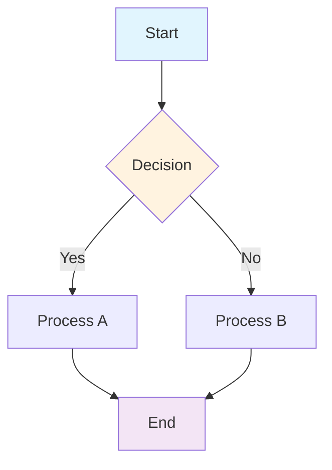
```mermaid
flowchart TD
    A[Start] --> B{Decision}
    B -->|Yes| C[Process A]
    B -->|No| D[Process B]
    C --> E[End]
    D --> E

    style A fill:#e1f5fe
    style E fill:#f3e5f5
    style B fill:#fff3e0
```
<% } else if (choice === "graph") { %>
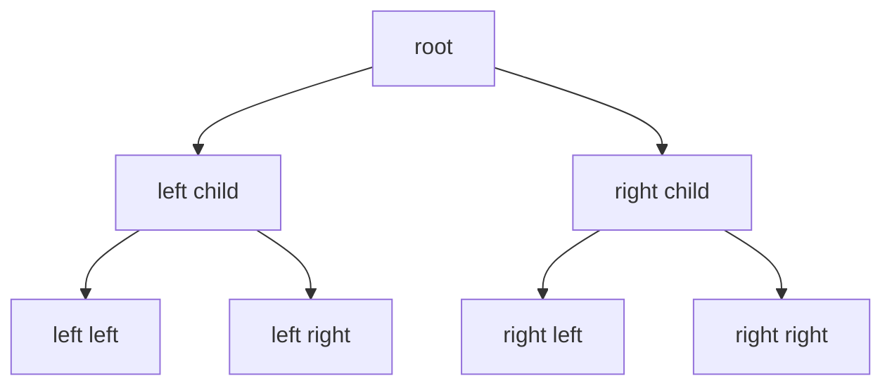
```mermaid
graph TD
    R[root]
    R --> L[left child]
    R --> M[right child]
    L --> LL[left left]
    L --> LR[left right]
    M --> RL[right left]
    M --> RR[right right]
```
<% } else if (choice === "sequence") { %>
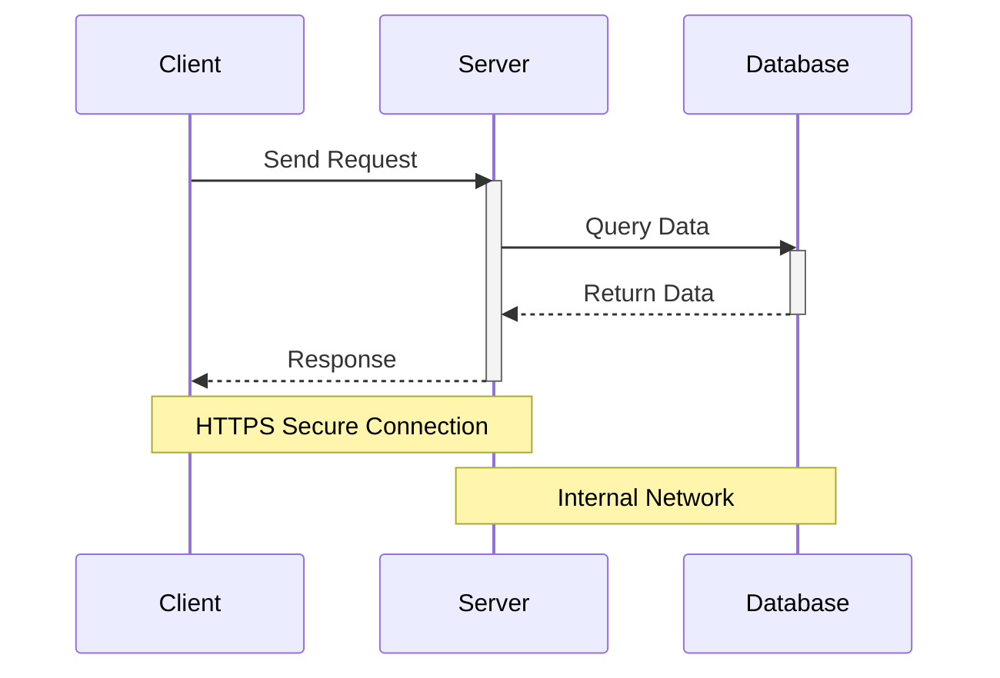
```mermaid
sequenceDiagram
    participant C as Client
    participant S as Server
    participant D as Database

    C->>S: Send Request
    activate S
    S->>D: Query Data
    activate D
    D-->>S: Return Data
    deactivate D
    S-->>C: Response
    deactivate S

    Note over C,S: HTTPS Secure Connection
    Note over S,D: Internal Network
```
<% } else if (choice === "zenuml") { %>
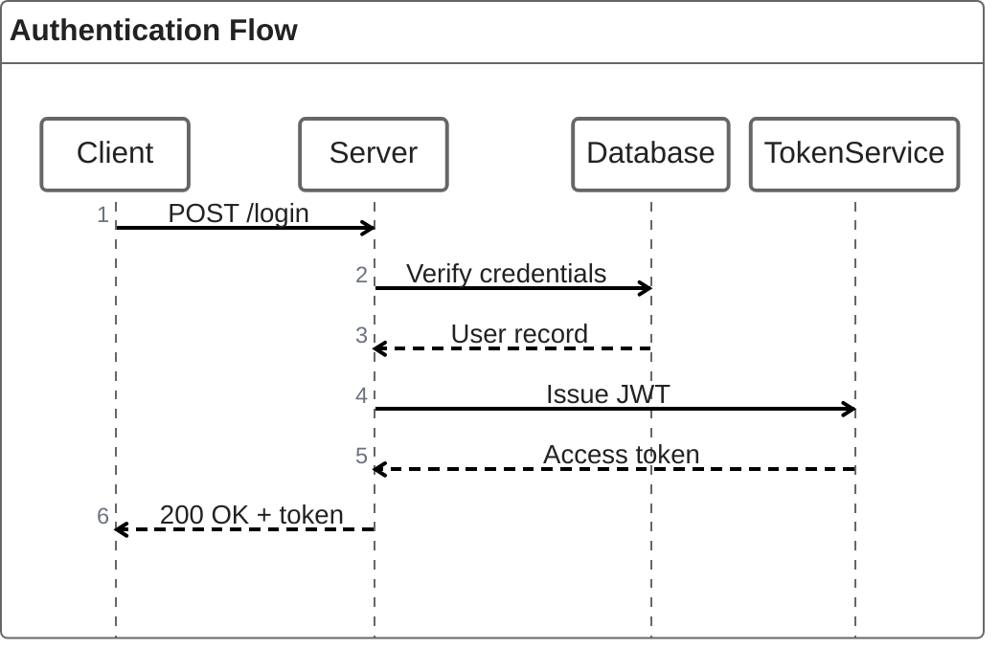
```mermaid
zenuml
    title Authentication Flow
    Client->Server: POST /login
    Server->Database: Verify credentials
    Database-->Server: User record
    Server->TokenService: Issue JWT
    TokenService-->Server: Access token
    Server-->Client: 200 OK + token
```
<% } else if (choice === "class") { %>
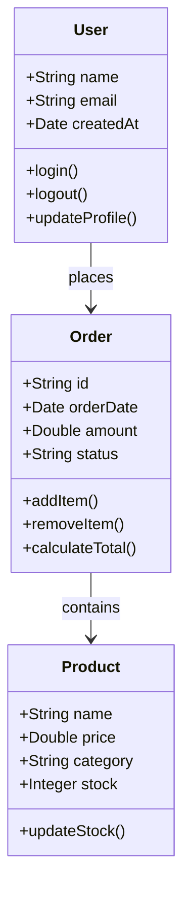
```mermaid
classDiagram
    class User {
        +String name
        +String email
        +Date createdAt
        +login()
        +logout()
        +updateProfile()
    }

    class Order {
        +String id
        +Date orderDate
        +Double amount
        +String status
        +addItem()
        +removeItem()
        +calculateTotal()
    }

    class Product {
        +String name
        +Double price
        +String category
        +Integer stock
        +updateStock()
    }

    User --> Order : places
    Order --> Product : contains
```
<% } else if (choice === "state") { %>
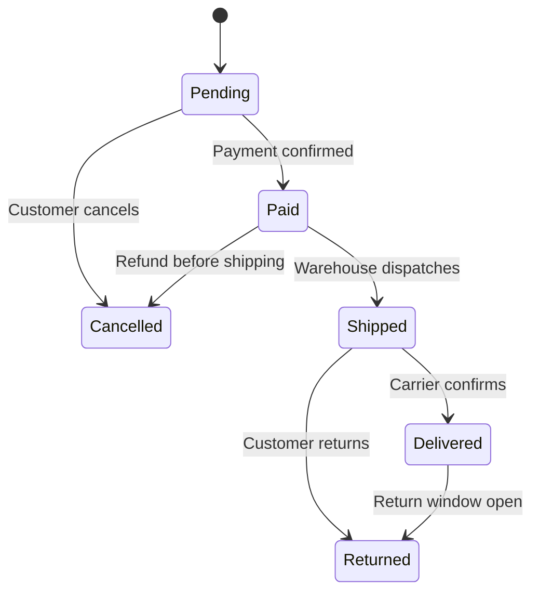
```mermaid
stateDiagram-v2
    [*] --> Pending
    Pending --> Paid : Payment confirmed
    Pending --> Cancelled : Customer cancels
    Paid --> Shipped : Warehouse dispatches
    Paid --> Cancelled : Refund before shipping
    Shipped --> Delivered : Carrier confirms
    Shipped --> Returned : Customer returns
    Delivered --> Returned : Return window open
```
<% } else if (choice === "er") { %>
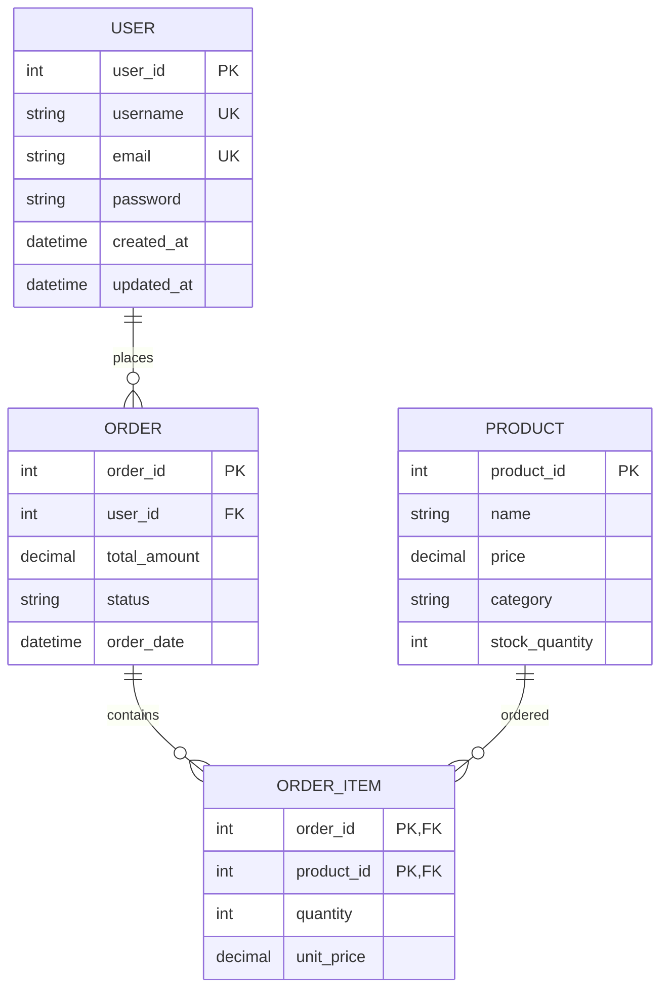
```mermaid
erDiagram
    USER {
        int user_id PK
        string username UK
        string email UK
        string password
        datetime created_at
        datetime updated_at
    }

    ORDER {
        int order_id PK
        int user_id FK
        decimal total_amount
        string status
        datetime order_date
    }

    PRODUCT {
        int product_id PK
        string name
        decimal price
        string category
        int stock_quantity
    }

    ORDER_ITEM {
        int order_id PK,FK
        int product_id PK,FK
        int quantity
        decimal unit_price
    }

    USER ||--o{ ORDER : "places"
    ORDER ||--o{ ORDER_ITEM : "contains"
    PRODUCT ||--o{ ORDER_ITEM : "ordered"
```
<% } else if (choice === "journey") { %>
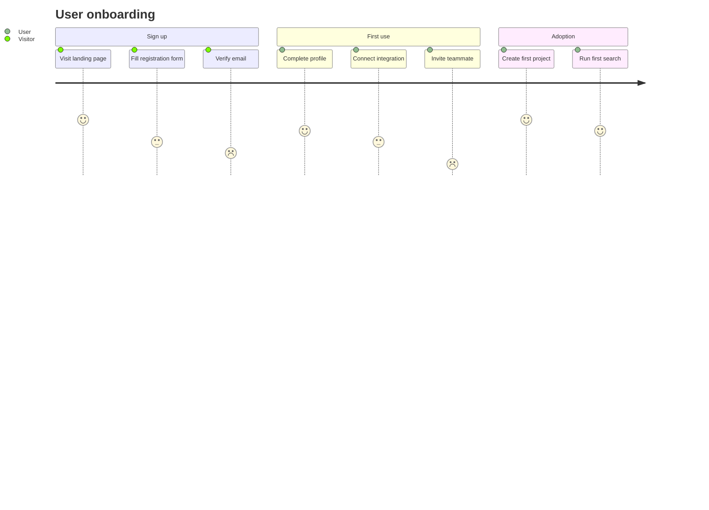
```mermaid
journey
    title User onboarding
    section Sign up
        Visit landing page: 5: Visitor
        Fill registration form: 3: Visitor
        Verify email: 2: Visitor
    section First use
        Complete profile: 4: User
        Connect integration: 3: User
        Invite teammate: 1: User
    section Adoption
        Create first project: 5: User
        Run first search: 4: User
```
<% } else if (choice === "gantt") { %>
```mermaid
gantt
    title Feature rollout
    dateFormat YYYY-MM-DD
    excludes weekends

    section Design
        Spec draft        :done, des1, 2025-01-06, 3d
        Review            :active, des2, after des1, 2d

    section Build
        Implement backend  :crit, dev1, after des2, 5d
        Implement frontend :dev2, after des2, 5d
        Integration tests  :crit, dev3, after dev1, 3d

    section Ship
        Staging deploy     :milestone, ship1, after dev3, 0d
        Production deploy  :milestone, ship2, 1d
```
<% } else if (choice === "pie") { %>
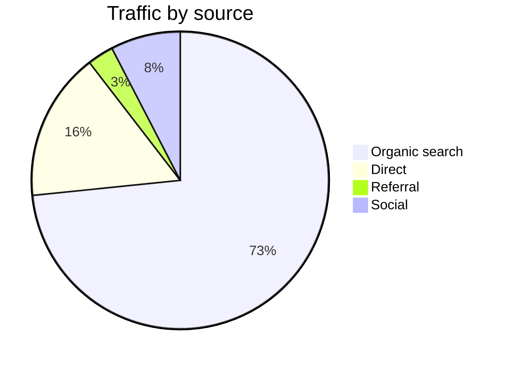
```mermaid
pie title Traffic by source
    "Organic search" : 386
    "Direct" : 85
    "Referral" : 15
    "Social" : 40
```
<% } else if (choice === "quadrant") { %>
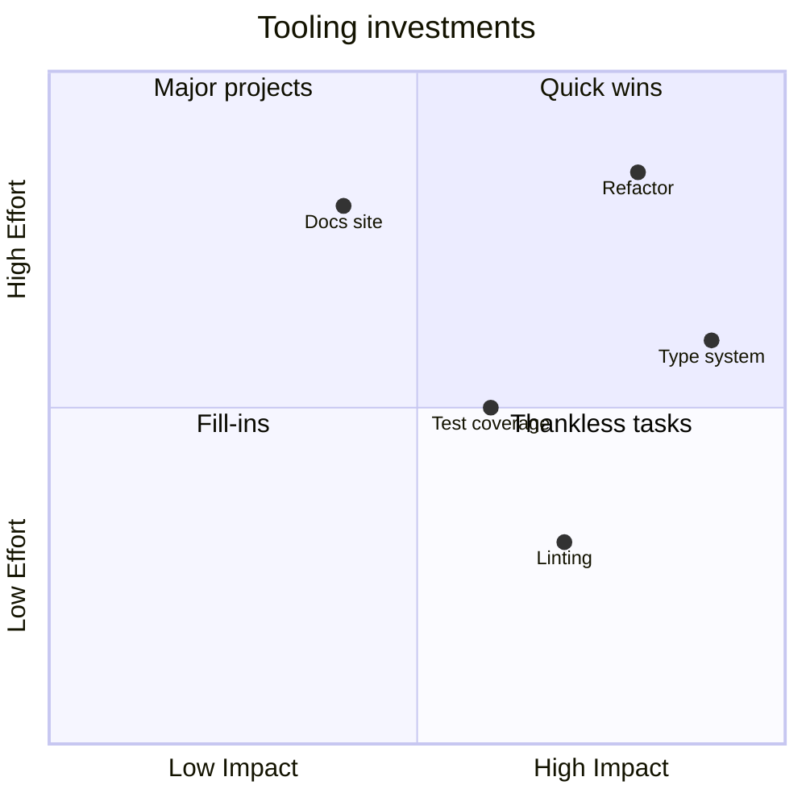
```mermaid
quadrantChart
    title Tooling investments
    x-axis Low Impact --> High Impact
    y-axis Low Effort --> High Effort
    quadrant-1 Quick wins
    quadrant-2 Major projects
    quadrant-3 Fill-ins
    quadrant-4 Thankless tasks
    Linting: [0.7, 0.3]
    Type system: [0.9, 0.6]
    Test coverage: [0.6, 0.5]
    Docs site: [0.4, 0.8]
    Refactor: [0.8, 0.85]
```
<% } else if (choice === "requirement") { %>
```mermaid
requirementDiagram
    requirement search_latency {
        id: 1
        text: P95 search must return in under 200ms
        risk: high
        verifymethod: test
    }

    element rag_pipeline {
        type: system
    }

    requirement result_relevance {
        id: 2
        text: Top-5 results must include the grounded source in 90% of queries
        risk: medium
        verifymethod: demonstration
    }

    rag_pipeline - satisfies -> search_latency
    rag_pipeline - satisfies -> result_relevance
```
<% } else if (choice === "gitgraph") { %>
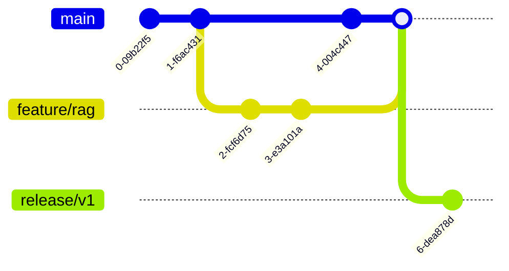
```mermaid
gitGraph
    commit
    commit
    branch feature/rag
    checkout feature/rag
    commit
    commit
    checkout main
    commit
    merge feature/rag
    branch release/v1
    checkout release/v1
    commit
```
<% } else if (choice === "c4context") { %>
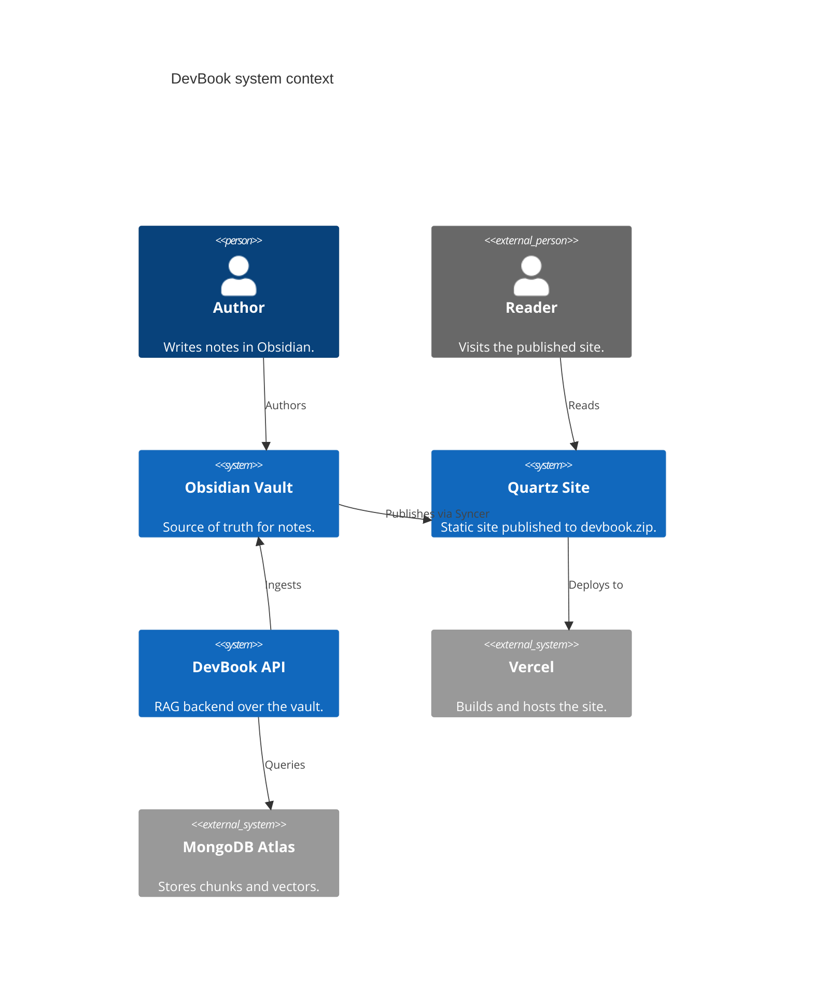
```mermaid
C4Context
    title DevBook system context

    Person(author, "Author", "Writes notes in Obsidian.")
    Person_Ext(reader, "Reader", "Visits the published site.")

    System(vault, "Obsidian Vault", "Source of truth for notes.")
    System(web, "Quartz Site", "Static site published to devbook.zip.")
    System(api, "DevBook API", "RAG backend over the vault.")
    System_Ext(vercel, "Vercel", "Builds and hosts the site.")
    System_Ext(atlas, "MongoDB Atlas", "Stores chunks and vectors.")

    Rel(author, vault, "Authors")
    Rel(vault, web, "Publishes via Syncer")
    Rel(web, vercel, "Deploys to")
    Rel(reader, web, "Reads")
    Rel(api, vault, "Ingests")
    Rel(api, atlas, "Queries")
```
<% } else if (choice === "c4container") { %>
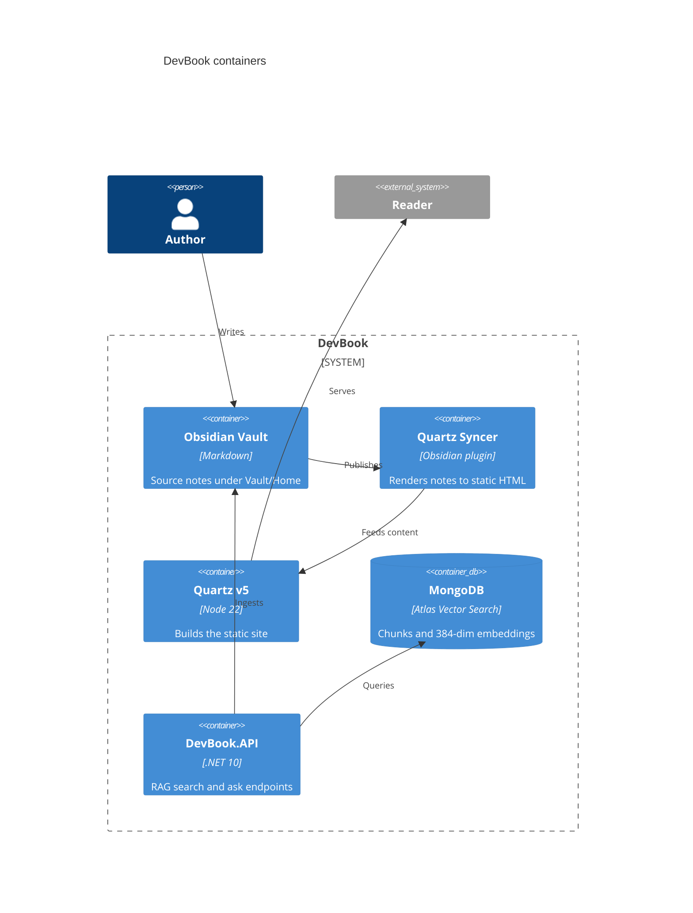
```mermaid
C4Container
    title DevBook containers

    Person(author, "Author")
    System_Ext(reader, "Reader")

    System_Boundary(devbook, "DevBook") {
        Container(vault, "Obsidian Vault", "Markdown", "Source notes under Vault/Home")
        Container(syncer, "Quartz Syncer", "Obsidian plugin", "Renders notes to static HTML")
        Container(site, "Quartz v5", "Node 22", "Builds the static site")
        ContainerDb(mongo, "MongoDB", "Atlas Vector Search", "Chunks and 384-dim embeddings")
        Container(api, "DevBook.API", ".NET 10", "RAG search and ask endpoints")
    }

    Rel(author, vault, "Writes")
    Rel(vault, syncer, "Publishes")
    Rel(syncer, site, "Feeds content")
    Rel(site, reader, "Serves")
    Rel(api, vault, "Ingests")
    Rel(api, mongo, "Queries")
```
<% } else if (choice === "c4component") { %>
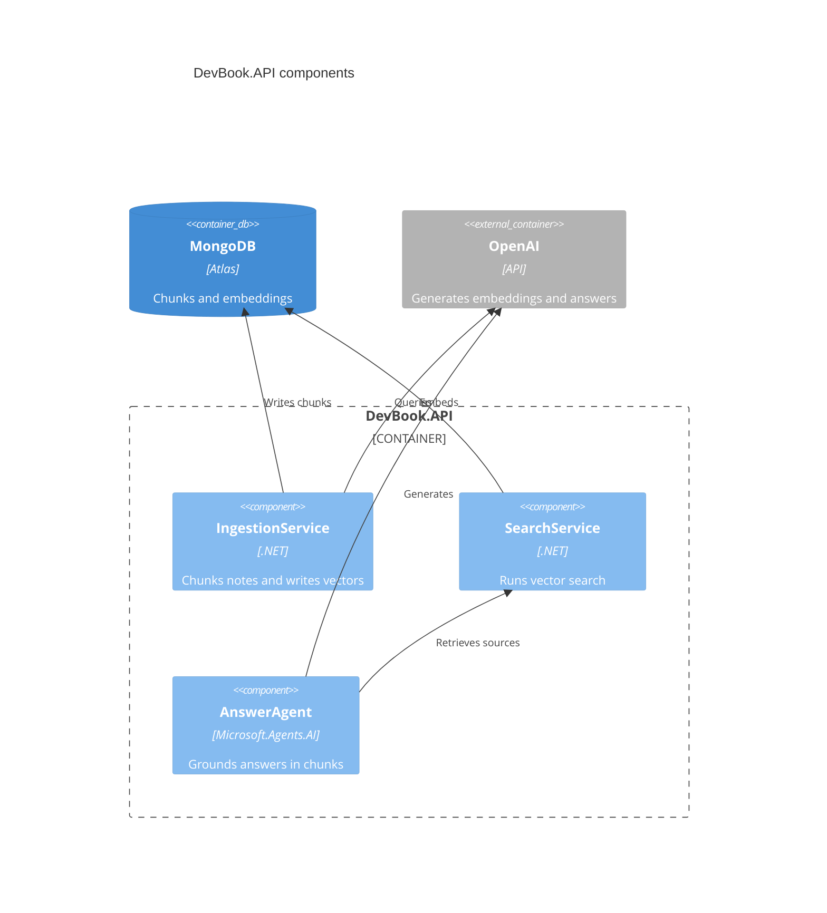
```mermaid
C4Component
    title DevBook.API components

    ContainerDb(mongo, "MongoDB", "Atlas", "Chunks and embeddings")
    Container_Ext(openai, "OpenAI", "API", "Generates embeddings and answers")

    Container_Boundary(api, "DevBook.API") {
        Component(ingest, "IngestionService", ".NET", "Chunks notes and writes vectors")
        Component(search, "SearchService", ".NET", "Runs vector search")
        Component(agent, "AnswerAgent", "Microsoft.Agents.AI", "Grounds answers in chunks")
    }

    Rel(ingest, mongo, "Writes chunks")
    Rel(ingest, openai, "Embeds")
    Rel(search, mongo, "Queries")
    Rel(agent, search, "Retrieves sources")
    Rel(agent, openai, "Generates")
```
<% } else if (choice === "c4dynamic") { %>
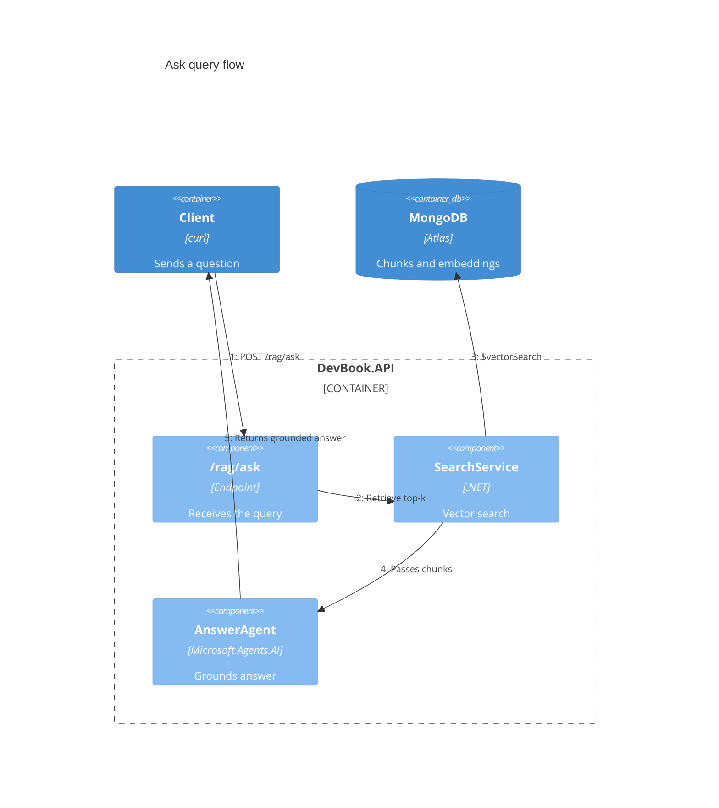
```mermaid
C4Dynamic
    title Ask query flow

    Container(client, "Client", "curl", "Sends a question")
    Container_Boundary(api, "DevBook.API") {
        Component(endpoint, "/rag/ask", "Endpoint", "Receives the query")
        Component(search, "SearchService", ".NET", "Vector search")
        Component(agent, "AnswerAgent", "Microsoft.Agents.AI", "Grounds answer")
    }
    ContainerDb(mongo, "MongoDB", "Atlas", "Chunks and embeddings")

    Rel(client, endpoint, "POST /rag/ask")
    Rel(endpoint, search, "Retrieve top-k")
    Rel(search, mongo, "$vectorSearch")
    Rel(search, agent, "Passes chunks")
    Rel(agent, client, "Returns grounded answer")
```
<% } else if (choice === "c4deployment") { %>
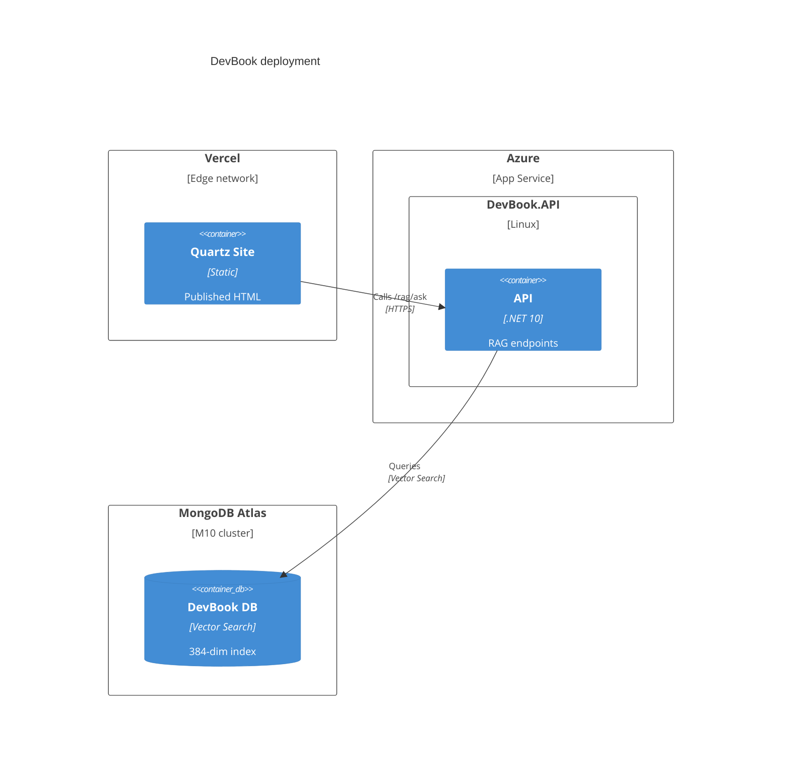
```mermaid
C4Deployment
    title DevBook deployment

    Deployment_Node(vercel, "Vercel", "Edge network") {
        Container(site, "Quartz Site", "Static", "Published HTML")
    }

    Deployment_Node(azure, "Azure", "App Service") {
        Deployment_Node(api, "DevBook.API", "Linux") {
            Container(app, "API", ".NET 10", "RAG endpoints")
        }
    }

    Deployment_Node(atlas, "MongoDB Atlas", "M10 cluster") {
        ContainerDb(mongo, "DevBook DB", "Vector Search", "384-dim index")
    }

    Rel(site, app, "Calls /rag/ask", "HTTPS")
    Rel(app, mongo, "Queries", "Vector Search")
```
<% } else if (choice === "mindmap") { %>
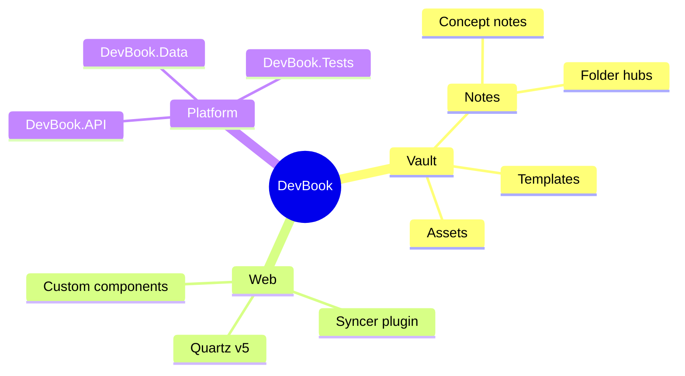
```mermaid
mindmap
    root((DevBook))
        Vault
            Notes
                Concept notes
                Folder hubs
            Templates
            Assets
        Web
            Quartz v5
            Syncer plugin
            Custom components
        Platform
            DevBook.API
            DevBook.Data
            DevBook.Tests
```
<% } else if (choice === "timeline") { %>
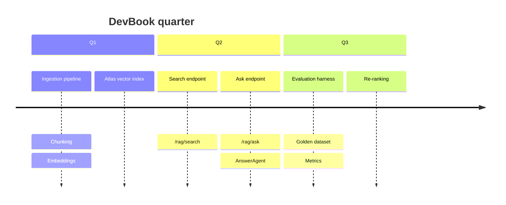
```mermaid
timeline
    title DevBook quarter
    section Q1
        Ingestion pipeline : Chunking : Embeddings
        Atlas vector index
    section Q2
        Search endpoint : /rag/search
        Ask endpoint : /rag/ask : AnswerAgent
    section Q3
        Evaluation harness : Golden dataset : Metrics
        Re-ranking
```
<% } else if (choice === "sankey") { %>
```mermaid
sankey

Vault/Home,Chunking,1000
Chunking,Embeddings,1000
Embeddings,Atlas,950
Embeddings,Errors,50
Atlas,Vector Search,800
Vector Search,AnswerAgent,800
AnswerAgent,Grounded Answer,780
AnswerAgent,No source,20
```
<% } else if (choice === "xychart") { %>
```mermaid
xychart
    title Retrieval latency (P95, ms)
    x-axis [jan, feb, mar, apr, may, jun, jul, aug, sep, oct, nov, dec]
    y-axis "ms" 0 --> 500
    bar [420, 380, 350, 310, 280, 250, 220, 200, 190, 185, 180, 175]
    line [420, 380, 350, 310, 280, 250, 220, 200, 190, 185, 180, 175]
```
<% } else if (choice === "block") { %>
```mermaid
block-beta
    columns 3
    Client["Client"] blockArrowId<[" "]>(right) API["DevBook.API"]
    space:2 down<[" "]>(down)
    Disk left<[" "]>(left) DB[("MongoDB")]

    classDef front fill:#696,stroke:#333
    classDef back fill:#969,stroke:#333
    class Client front
    class API,DB back
```
<% } else if (choice === "packet") { %>
```mermaid
packet
    title TCP segment
    0-15: "Source Port"
    16-31: "Destination Port"
    32-63: "Sequence Number"
    64-95: "Acknowledgment Number"
    96-99: "Data Offset"
    100-105: "Reserved"
    106: "URG"
    107: "ACK"
    108: "PSH"
    109: "RST"
    110: "SYN"
    111: "FIN"
    112-127: "Window"
    128-143: "Checksum"
    144-159: "Urgent Pointer"
    160-191: "Options"
    192-255: "Data"
```
<% } else if (choice === "kanban") { %>
```mermaid
kanban
    id1[Todo]
        id2[Add XY chart template]
        id3[Wire C4 deployment example]
    id4[In progress]
        id5[Review radar-beta syntax]
    id6[Done]
        id7[Class diagram template]
        id8[Sequence diagram template]

    id5@{ ticket: DEV-1042, assigned: nikita, priority: High }
```
<% } else if (choice === "radar") { %>
```mermaid
radar-beta
    axis Latency["Latency"], Recall["Recall"], Precision["Precision"], Cost["Cost"], Coverage["Coverage"]
    curve baseline{4, 3, 3, 5, 3}
    curve reranked{3, 4, 5, 4, 5}
```
<% } else if (choice === "architecture") { %>
```mermaid
architecture-beta
    group devbook(cloud)[DevBook]

    service vault(disk)[Obsidian Vault] in devbook
    service api(server)[DevBook.API] in devbook
    service mongo(database)[MongoDB Atlas] in devbook
    service web(internet)[Quartz Site] in devbook

    vault:L -- R:api
    api:L -- R:mongo
    api:T -- B:web
```
<% } else if (choice === "treemap") { %>
```mermaid
treemap
    "DevBook"
        "Vault"
            "Notes": 220
            "Templates": 28
            "Assets": 15
        "Web"
            "Quartz": 1
            "Content": 240
            "Custom": 12
        "Platform"
            "API": 45
            "Data": 30
            "Tests": 25
```
<% } %>
