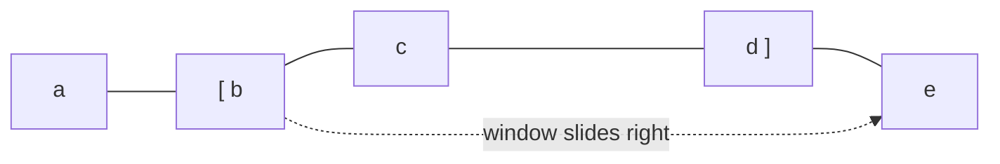

# Intro

The sliding-window technique computes something over every contiguous sub-array/substring in **O(n)** instead of O(n·k) or O(n²), by maintaining a moving range and **updating its aggregate incrementally** rather than recomputing it from scratch. The insight: when the window slides one step, you add the element entering on the right and remove the element leaving on the left — O(1) per step. It's the go-to pattern for "longest/shortest/maximum sub-array satisfying a constraint": max sum of k consecutive elements, longest substring without repeats, smallest sub-array with sum ≥ target, etc.

## How It Works

Two flavours:

- **Fixed-size window** — the window is always exactly k wide; slide it across, adding the new element and dropping the old one. Used for "max/avg of every k consecutive elements."
- **Variable-size window** — two pointers (`left`, `right`) bound the window. **Grow** `right` to include more; when the window violates the constraint, **shrink** from `left` until it's valid again. Used for "longest/shortest range satisfying X."

Both are O(n) because each index advances at most n times total — every element enters the window once and leaves once.




## Visualization

```steptrace
{"algorithm":"sliding-window","array":[2,3,1,2,4,3],"target":7}
```

## Example

Fixed window — maximum sum of any k consecutive elements:

```csharp
public static int MaxSumWindow(int[] a, int k)
{
    int sum = 0;
    for (int i = 0; i < k; i++) sum += a[i];      // first window
    int best = sum;
    for (int i = k; i < a.Length; i++)
    {
        sum += a[i] - a[i - k];                    // enter a[i], leave a[i-k]
        best = Math.Max(best, sum);
    }
    return best;
}
```

Variable window — length of the longest substring with no repeating characters:

```csharp
public static int LongestUnique(string s)
{
    var lastSeen = new Dictionary<char, int>();
    int left = 0, best = 0;
    for (int right = 0; right < s.Length; right++)
    {
        if (lastSeen.TryGetValue(s[right], out var prev) && prev >= left)
            left = prev + 1;                        // shrink past the duplicate
        lastSeen[s[right]] = right;
        best = Math.Max(best, right - left + 1);
    }
    return best;
}
```

## Pitfalls

- **Recomputing the aggregate each slide** — the whole point is incremental update. Re-summing the window every step makes it O(n·k) again, no better than brute force.
- **Window contents only valid for the right monotonicity** — variable windows assume that once a window is invalid, _growing_ it keeps it invalid until you shrink. This holds for sums of **non-negative** numbers and for "distinct count" constraints, but **breaks with negative numbers** (a longer window can become valid again) — those need prefix sums + a hash map or a deque, not a plain sliding window.
- **Forgetting to shrink fully** — after a violation you must shrink `left` until the window is valid again, which can be several steps; a single decrement is a common bug.
- **Max/min over the window** needs a **monotonic deque** — tracking the maximum of every window in O(1) amortised requires a deque of candidate indices, not just a running variable (you can't "remove the max" from a plain sum).

## Tradeoffs

| Problem shape | Technique | Complexity |
|---|---|---|
| Aggregate over fixed-k windows | Fixed sliding window | O(n) |
| Longest/shortest window meeting a constraint (non-negative) | Variable sliding window | O(n) |
| Sub-array sum = target with negatives | Prefix sums + hash map | O(n) time, O(n) space |
| Max/min of every window | Sliding window + monotonic deque | O(n) |
| Brute force all sub-arrays | Nested loops | O(n²) |

**Decision rule**: if the answer is about a **contiguous** range and you can update a running metric in O(1) as the range moves, it's a sliding window. If the constraint can be re-satisfied by _extending_ (negatives, "exactly k" sums), switch to prefix sums + hashing.

## Questions

> [!QUESTION]- Why is a sliding window O(n) and not O(n·k)?
> Because each step only adds the entering element and removes the leaving one — O(1) — instead of re-summing all k elements. Across the whole pass `right` advances n times and `left` advances at most n times, so total work is O(n) regardless of window size.

> [!QUESTION]- When does the sliding-window approach break, and what replaces it?
> When the validity constraint isn't monotonic with window growth — most commonly **arrays with negative numbers** for sum-based problems, where a longer window can flip from invalid back to valid. There you use **prefix sums + a hash map** (to find ranges with a given sum) rather than a growing/shrinking window.

> [!QUESTION]- How do you get the maximum of every fixed window in O(n)?
> Use a **monotonic deque** of indices kept in decreasing value order: push the new index (popping smaller values off the back) and pop the front when it slides out of the window. The front is always the current window's max, giving O(1) amortised per step.

## References

- [Sliding window technique (cp-algorithms / GeeksforGeeks)](https://www.geeksforgeeks.org/window-sliding-technique/) — fixed and variable windows with worked examples.
- [Longest Substring Without Repeating Characters (LeetCode #3)](https://leetcode.com/problems/longest-substring-without-repeating-characters/) — canonical variable-window problem.
- [Sliding Window Maximum (LeetCode #239)](https://leetcode.com/problems/sliding-window-maximum/) — the monotonic-deque variant.
