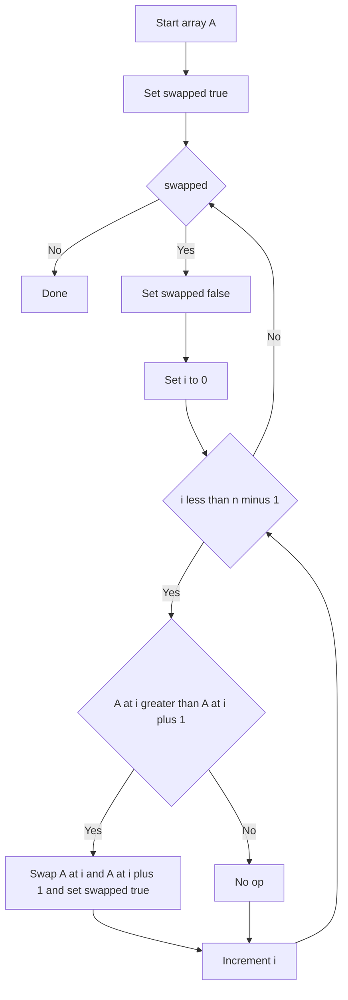

# Intro

Bubble sort repeatedly swaps adjacent out-of-order elements, pushing large values toward the end each pass. It is easy to understand but rarely used in production due to poor performance. Its main value is as a teaching tool and as a baseline to understand why better algorithms exist.

## Mechanism

Each pass scans left-to-right and swaps `a[i]` with `a[i+1]` when they are out of order. After one full pass, the largest element is in its final position. With an early-exit flag, the algorithm stops as soon as a pass makes zero swaps — giving O(n) best case on already-sorted input.




## Visualization

```steptrace
{"algorithm":"bubble-sort","array":[8,3,5,1,9,2,7,4]}
```

## Complexity

| Case | Time | Space |
|------|------|-------|
| Best (sorted input, early-exit) | O(n) | O(1) |
| Average | O(n²) | O(1) |
| Worst (reverse-sorted) | O(n²) | O(1) |

**Properties:** stable (adjacent swaps preserve equal-element order), in-place.

## C# Implementation

```csharp
public static void BubbleSort(int[] a)
{
    int n = a.Length;
    bool swapped;
    do
    {
        swapped = false;
        for (int i = 0; i < n - 1; i++)
        {
            if (a[i] > a[i + 1])
            {
                (a[i], a[i + 1]) = (a[i + 1], a[i]);
                swapped = true;
            }
        }
        n--; // last element is already in place
    } while (swapped);
}
```

> [!NOTE]
> **Cocktail shaker sort** is the bidirectional variant: alternate a left-to-right pass (bubbling the max up) with a right-to-left pass (bubbling the min down). It fixes bubble sort's "turtles" problem — small values near the end that move left only one step per full pass — but it's still O(n²) and remains a teaching curiosity, not a production choice.

## When to Use

Almost never in production. Prefer:

- **Insertion sort** for small arrays (n ≤ 20) or nearly-sorted data — better constant factors.
- **Array.Sort** (introsort) for general-purpose sorting in .NET.

Bubble sort is useful as a teaching example and for understanding stability and in-place constraints.

## Pitfalls

### Using Bubble Sort in Production

**What goes wrong**: bubble sort is used for a small utility sort because it is easy to write. Even for n=100, it performs ~5,000 comparisons versus ~700 for insertion sort. For n=1,000, it is ~500,000 versus ~250,000.

**Mitigation**: use insertion sort instead of bubble sort for small arrays. Insertion sort has the same O(n²) worst case but fewer comparisons, fewer swaps, and better cache behavior. For n > 50, use `Array.Sort` (introsort).

### Omitting the Early-Exit Optimization

**What goes wrong**: the basic bubble sort without the `swapped` flag always runs n²/2 comparisons, even on already-sorted input. The O(n) best case only applies with the early-exit optimization.

**Mitigation**: always include the `swapped` flag. If a full pass makes zero swaps, the array is sorted and the algorithm can stop. This is the only scenario where bubble sort has any advantage over selection sort.

## Tradeoffs

| Algorithm | Time (avg) | Stable | Best case | Practical use |
|-----------|-----------|--------|-----------|--------------|
| Bubble sort | O(n²) | Yes | O(n) with early-exit | Teaching only |
| Insertion sort | O(n²) | Yes | O(n) | Small arrays, nearly-sorted data, hybrid sort base case |
| Selection sort | O(n²) | No | O(n²) | When writes are expensive |
| Array.Sort (introsort) | O(n log n) | No | O(n log n) | General-purpose production sorting |

**Decision rule**: never use bubble sort in production. Insertion sort is strictly better for small arrays (same stability, better constant factors). For general-purpose sorting, use `Array.Sort`.

## Questions

> [!QUESTION]- Why is bubble sort never used in production?
> Bubble sort has O(n²) average and worst-case time with poor cache behavior — each swap touches two adjacent elements, causing many cache misses on large arrays. Insertion sort is strictly better for small arrays (same O(n²) but fewer comparisons and better cache access). For large arrays, introsort (Array.Sort in .NET) is O(n log n). Bubble sort has no scenario where it is the best choice.

> [!QUESTION]- What is bubble sort's one practical advantage?
> The early-exit optimization gives O(n) best case on already-sorted input — the same as insertion sort. However, insertion sort achieves this with fewer comparisons and better cache behavior, so even in this case insertion sort is preferred. Bubble sort's main value is pedagogical: it is easy to explain and visualize.

## References

- [Bubble sort (Wikipedia)](https://en.wikipedia.org/wiki/Bubble_sort) — algorithm description, variants (cocktail shaker sort), and stability proof.

- [Sorting visualizations (VisuAlgo)](https://visualgo.net/en/sorting) — step-by-step animation to build intuition for all comparison sorts.

- [Timsort (Wikipedia)](https://en.wikipedia.org/wiki/Timsort) — Python's and Java's default sort; replaced bubble sort and insertion sort for general use; shows why O(n²) algorithms are only kept as base cases for small partitions.

- [Sorting algorithms comparison (Big-O Cheat Sheet)](https://www.bigocheatsheet.com/) — quick reference for time and space complexity of all common sorting algorithms.
