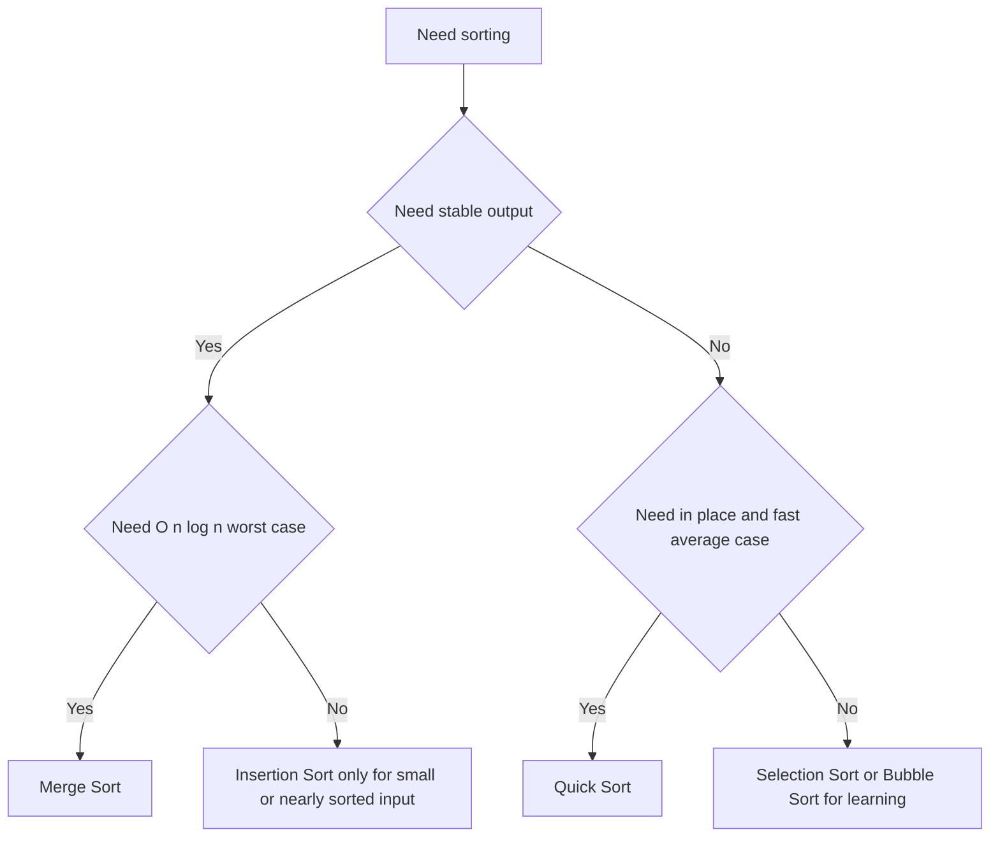

# Intro

Sorting is a foundational operation that impacts performance all over the stack: databases, UIs, pipelines, and in-memory processing. The important part is not memorizing algorithms, but understanding stability, memory tradeoffs, and typical runtime behavior. Example: mergesort is stable and predictable, while quicksort is often fast in practice but has worst-case pitfalls.

## Diagram

## Questions

> [!QUESTION]- How do you choose between Merge Sort and Quick Sort in production?
>
> - Merge sort gives reliable `O(n log n)` worst-case behavior and stable ordering.
> - Quick sort is often faster in practice on in-memory arrays due to cache behavior.
> - Quick sort has worst-case `O(n^2)` if pivot strategy is poor, so randomized or introspective variants are safer.
> - Why it matters: this choice affects latency tail risk, memory usage, and correctness when stable ordering is required.

> [!QUESTION]- When is Insertion Sort still a good choice?
>
> - It is strong on very small arrays because constant overhead is tiny.
> - It performs well on nearly sorted data where shifts are minimal.
> - It is commonly used as a base case inside hybrid production sort implementations.
> - Why it matters: knowing this avoids overengineering and explains hybrid sort internals in interviews.

> [!QUESTION]- What does .NET's built-in Array.Sort use, and why?
> .NET uses an introspective sort (IntroSort): it starts with Quick Sort for fast average performance, switches to Heap Sort when recursion depth exceeds a threshold (to guarantee O(n log n) worst case), and uses Insertion Sort for small partitions (to exploit its low overhead on nearly-sorted data).
> This hybrid approach demonstrates why production sort implementations combine multiple algorithms rather than using a single one.

## Links

- [Sorting algorithm (Wikipedia)](https://en.wikipedia.org/wiki/Sorting_algorithm)
- [Array Sort method .NET](https://learn.microsoft.com/dotnet/api/system.array.sort)
- [Nearly all binary searches and mergesorts are broken](https://research.google/blog/extra-extra-read-all-about-it-nearly-all-binary-searches-and-mergesorts-are-broken/)
