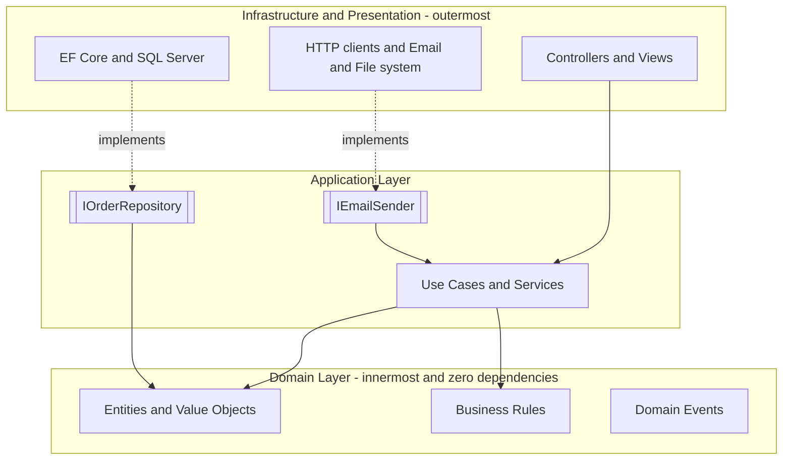
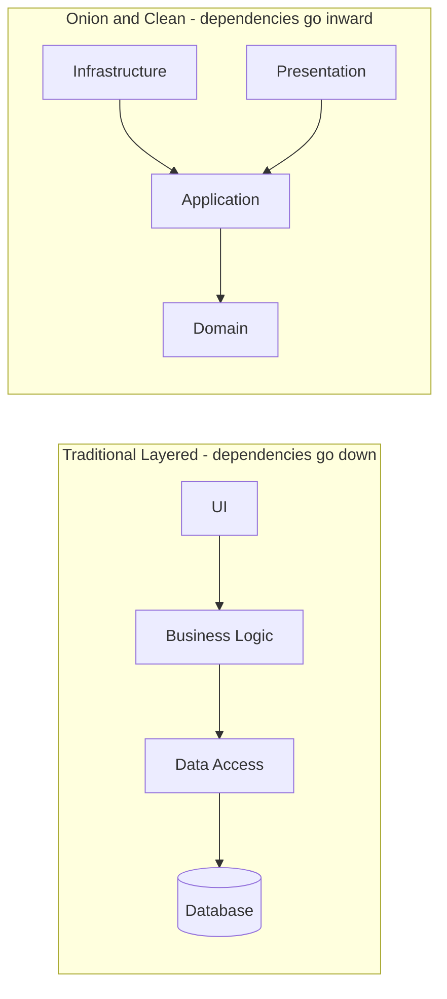

---
topic:
  - Architecture
subtopic:
  - Application Architecture
level:
  - "4"
priority: High
status: Ready to Repeat
publish: true
---

# Intro

Layered architecture structures an application into layers with clear responsibilities and strict dependency directions. Each layer only depends on the layer directly below it (traditional) or on inner layers (onion/clean). The goal is to isolate business rules from infrastructure details — so you can swap databases, frameworks, or delivery mechanisms without touching domain logic.

## Layer Responsibilities

A typical four-layer structure:

| Layer | Responsibility | Examples |
|-------|---------------|---------|
| **Presentation** | Handle input, render output | ASP.NET Core controllers, Razor views, Blazor components |
| **Application** | Orchestrate use cases, coordinate domain + infrastructure | Service classes, CQRS handlers, DTOs |
| **Domain** | Business rules, entities, invariants | Entities, value objects, domain events, domain services |
| **Infrastructure** | Technical details: persistence, messaging, external APIs | EF Core `DbContext`, HTTP clients, email senders |

## Dependency Rule

**All dependencies point inward.** The Domain knows nothing about databases, frameworks, or UI. Infrastructure implements interfaces defined by inner layers.



## Traditional vs Onion/Clean



In traditional layered architecture, changing the database affects everything above it. In Onion/Clean Architecture, the dependency is **inverted**: Infrastructure depends on the Domain through interfaces, so you can swap databases without touching business rules.

## One Family: Layered, Hexagonal, Onion, Clean

These names get used interchangeably, but they're variations on one idea — *protect the domain by pointing dependencies inward*:

- **Traditional layered (n-tier)** — strict top-down: UI → Business → Data. Simple, but the domain still depends on data access.
- **Hexagonal (Ports & Adapters, Alistair Cockburn)** — the domain defines **ports** (interfaces); the outside world plugs in **adapters** (a DB adapter, an HTTP adapter, a test adapter). The `IOrderRepository`/`IEmailSender` interfaces in the diagrams above *are* ports. There's no "up/down," just "inside the hexagon" (domain) vs "outside" (adapters).
- **Onion (Jeffrey Palermo)** — concentric rings with the domain at the center; same inward rule, drawn as circles.
- **Clean (Robert C. Martin)** — the same again with named rings (Entities → Use Cases → Interface Adapters → Frameworks) and the explicit **Dependency Rule**.

The takeaway: don't agonize over the name — they all enforce the same Dependency Rule, differing mostly in vocabulary and diagram shape. See [[05 Architecture/Application Architecture/Clean Architecture|Clean Architecture]] for the most prescriptive variant; the same boundary discipline scales up to the [[05 Architecture/System Architecture/Modular Monolith|modular monolith]] and microservices.

## .NET Example

```csharp
// Domain layer — no dependencies on EF Core or ASP.NET
public class Order
{
    public int Id { get; private set; }
    public Money Total { get; private set; }

    public void AddItem(Product product, int quantity)
    {
        // Business rule: enforce invariants here
        if (quantity <= 0) throw new DomainException("Quantity must be positive");
        Total = Total.Add(product.Price.Multiply(quantity));
    }
}

// Application layer — depends on domain + abstractions
public class PlaceOrderHandler
{
    private readonly IOrderRepository _orders;
    private readonly IEmailSender _email;

    public async Task HandleAsync(PlaceOrderCommand cmd, CancellationToken ct)
    {
        var order = new Order();
        foreach (var item in cmd.Items)
            order.AddItem(item.Product, item.Quantity);

        await _orders.SaveAsync(order, ct);
        await _email.SendConfirmationAsync(cmd.CustomerEmail, order, ct);
    }
}

// Infrastructure layer — implements domain abstractions
public class EfOrderRepository : IOrderRepository
{
    private readonly AppDbContext _db;
    public async Task SaveAsync(Order order, CancellationToken ct)
        => await _db.Orders.AddAsync(order, ct);
}
```

## Pitfalls

**Anemic domain model**
Business logic leaks into the Application layer (service classes do everything) while the Domain layer contains only data bags. The layers exist but the dependency rule is violated in spirit — the Domain has no behavior to protect.

**Layer bypass**
Controllers calling repositories directly, skipping the Application layer. Breaks the single-responsibility of each layer and makes the codebase harder to test.

**Over-engineering small apps**
Four layers with interfaces and DI for a 3-endpoint CRUD API adds ceremony without benefit. Apply layered architecture when the domain has real complexity worth protecting.

## Questions

> [!QUESTION]- What is the Dependency Rule and why does it matter?
> All source code dependencies must point inward — toward higher-level policies (domain). Outer layers (infrastructure, UI) depend on inner layers; inner layers never depend on outer layers. This means you can change databases, frameworks, or delivery mechanisms without touching business rules.
> Cost: requires defining interfaces in inner layers and wiring implementations in outer layers — more upfront structure.

> [!QUESTION]- What is the difference between traditional layered and Onion/Clean Architecture?
> Traditional layered: UI → Business Logic → Data Access → Database. Changing the DB affects everything above. Onion/Clean: Infrastructure → Application → Domain. The Domain has zero dependencies; Infrastructure implements Domain interfaces. The key difference is dependency inversion at the data access boundary.

## References

- [Multitier architecture (Wikipedia)](https://en.wikipedia.org/wiki/Multitier_architecture) — overview of n-tier patterns, layer responsibilities, and historical context.
- [The Clean Architecture (Robert C. Martin)](https://blog.cleancoder.com/uncle-bob/2012/08/13/the-clean-architecture.html) — the canonical article defining the dependency rule and how Clean Architecture relates to Onion and Hexagonal.
- [Onion Architecture (Jeffrey Palermo)](https://jeffreypalermo.com/2008/07/the-onion-architecture-part-1/) — original blog post introducing Onion Architecture with the inward-dependency model.
- [ASP.NET Core architecture guidance (Microsoft)](https://learn.microsoft.com/en-us/dotnet/architecture/modern-web-apps-azure/common-web-application-architectures) — Microsoft's guidance on layered, clean, and modular architectures for ASP.NET Core applications.
