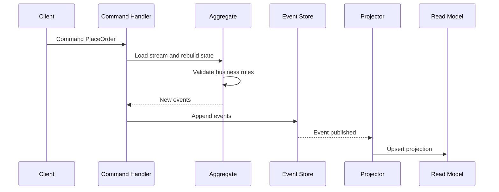

# Intro

Event Sourcing stores each aggregate's state as an ordered stream of domain events instead of saving only the latest row snapshot. That event history gives you a built-in audit trail, enables temporal queries like "what did we believe at 10:15 yesterday", and allows replay when you need to rebuild read models or recover from projection bugs. You usually reach for it when business value depends on immutable history, traceability, and intent-level debugging, not just current state reads. In .NET systems, it often appears together with [[CQRS]] so writes persist events and reads consume projections optimized for query use cases.

## Mechanism

### Core flow

1. A command reaches the write model (`PlaceOrder`, `AddItem`, `ShipOrder`).
2. The aggregate loads its prior event stream and replays events to rebuild current in-memory state.
3. Business invariants are validated against that rebuilt state.
4. New domain event(s) are appended to an append-only event store.
5. Projection handlers consume appended events and update one or more read models.

### Why append-only matters

- **Immutability**: old facts are never updated in place, so history stays trustworthy.
- **Auditability**: every state transition is explainable by concrete business events.
- **Temporal analysis**: you can rehydrate state as-of a version or timestamp.
- **Operational recovery**: if a projection is corrupted, rebuild it by replaying events.

### State reconstruction by replay

At load time, you fetch events for a stream (for example `order-123`) and apply them in sequence.

- `OrderPlaced` creates base state.
- `ItemAdded` mutates line items and totals.
- `OrderShipped` flips lifecycle status and shipment metadata.
  Your aggregate is deterministic if applying the same ordered events always yields the same state.

### Projections and read models

Write-side aggregates enforce invariants; read-side models optimize querying.

- A projection can build `OrderSummary` for dashboard lookups.
- Another projection can build `RevenueByDay` for analytics.
- A third can drive search indexing.
  Read models are disposable when they are derived only from replayable event history and can be rebuilt deterministically.

### Snapshots

As streams grow, replay cost increases.

- A snapshot stores aggregate state at a known version (for example, version 5\_000).
- Rebuild starts from snapshot then replays only newer events.
- This reduces load latency but adds extra persistence/versioning logic.
  Snapshots are a performance optimization, not a source of truth.

### Request-to-projection sequence



## C# Example

The example shows a minimal event-sourced `Order` aggregate with three events and replay-based state rebuild.

```csharp
using System;
using System.Collections.Generic;
using System.Linq;

public interface IDomainEvent
{
    DateTime OccurredUtc { get; }
}

public sealed record OrderPlaced(Guid OrderId, Guid CustomerId, DateTime OccurredUtc) : IDomainEvent;
public sealed record ItemAdded(Guid OrderId, string Sku, int Quantity, decimal UnitPrice, DateTime OccurredUtc) : IDomainEvent;
public sealed record OrderShipped(Guid OrderId, DateTime ShippedUtc, DateTime OccurredUtc) : IDomainEvent;

public sealed class Order
{
    private readonly List<IDomainEvent> _uncommitted = new();
    private readonly List<(string Sku, int Qty, decimal UnitPrice)> _items = new();

    public Guid Id { get; private set; }
    public Guid CustomerId { get; private set; }
    public bool IsPlaced { get; private set; }
    public bool IsShipped { get; private set; }
    public DateTime? ShippedUtc { get; private set; }
    public decimal Total => _items.Sum(x => x.Qty * x.UnitPrice);

    public IReadOnlyCollection<IDomainEvent> UncommittedEvents => _uncommitted;

    public static Order FromHistory(IEnumerable<IDomainEvent> history)
    {
        var order = new Order();
        foreach (var @event in history)
        {
            order.Apply(@event);
        }

        return order;
    }

    public void Place(Guid orderId, Guid customerId, DateTime utcNow)
    {
        if (IsPlaced)
        {
            throw new InvalidOperationException("Order already placed.");
        }

        Raise(new OrderPlaced(orderId, customerId, utcNow));
    }

    public void AddItem(string sku, int quantity, decimal unitPrice, DateTime utcNow)
    {
        if (!IsPlaced)
        {
            throw new InvalidOperationException("Place order before adding items.");
        }

        if (IsShipped)
        {
            throw new InvalidOperationException("Cannot add items to a shipped order.");
        }

        if (quantity <= 0 || unitPrice < 0)
        {
            throw new ArgumentOutOfRangeException(nameof(quantity), "Quantity and price must be valid.");
        }

        Raise(new ItemAdded(Id, sku, quantity, unitPrice, utcNow));
    }

    public void Ship(DateTime shippedUtc, DateTime utcNow)
    {
        if (!IsPlaced || !_items.Any())
        {
            throw new InvalidOperationException("Cannot ship an empty or unplaced order.");
        }

        if (IsShipped)
        {
            throw new InvalidOperationException("Order already shipped.");
        }

        Raise(new OrderShipped(Id, shippedUtc, utcNow));
    }

    public void ClearUncommittedEvents() => _uncommitted.Clear();

    private void Raise(IDomainEvent @event)
    {
        Apply(@event);
        _uncommitted.Add(@event);
    }

    private void Apply(IDomainEvent @event)
    {
        switch (@event)
        {
            case OrderPlaced e:
                Id = e.OrderId;
                CustomerId = e.CustomerId;
                IsPlaced = true;
                break;

            case ItemAdded e:
                _items.Add((e.Sku, e.Quantity, e.UnitPrice));
                break;

            case OrderShipped e:
                IsShipped = true;
                ShippedUtc = e.ShippedUtc;
                break;

            default:
                throw new NotSupportedException($"Unknown event type: {@event.GetType().Name}");
        }
    }
}
```

Typical write path in a repository:

```csharp
using System.Threading;
using System.Threading.Tasks;
using System.Collections.Generic;
using System.Linq;

public interface IEventStore
{
    Task<IReadOnlyList<IDomainEvent>> LoadStreamAsync(string streamId, CancellationToken cancellationToken);
    Task AppendAsync(string streamId, int expectedRevision, IReadOnlyCollection<IDomainEvent> events, CancellationToken cancellationToken);
}

public static async Task AddItemToOrderAsync(IEventStore eventStore, Guid orderId, CancellationToken ct)
{
    var streamId = $"order-{orderId}";
    var history = await eventStore.LoadStreamAsync(streamId, ct);

    var order = Order.FromHistory(history);
    order.AddItem("SKU-123", quantity: 2, unitPrice: 19.99m, utcNow: DateTime.UtcNow);

    var expectedRevision = history.Count - 1;
    await eventStore.AppendAsync(streamId, expectedRevision, order.UncommittedEvents.ToList(), ct);
    order.ClearUncommittedEvents();
}
```

`expectedRevision` semantics are store-specific (for example, some stores use `-1` for an empty stream), so use your event store's concurrency API exactly.

## Event Sourcing + CQRS

Event Sourcing and [[CQRS]] solve different concerns and complement each other well.

- **Write side**: command handlers persist validated domain events to the event store.
- **Bridge**: those events become the integration boundary between write and read models.
- **Read side**: projectors consume events and maintain query-optimized denormalized views.
  You can do CQRS without Event Sourcing, and Event Sourcing without strict CQRS separation, but pairing them usually gives the cleanest model when auditability and replay are first-class requirements.

## Pitfalls

### 1) Event schema evolution breaks replay without versioning

- **What can go wrong**: adding/removing/renaming event fields causes old events to deserialize incorrectly.
- **Why**: event history is immutable; consumers evolve while old payloads remain in prior formats.
- **Mitigation**: version event contracts, keep upcasters/migrators, and prefer additive schema changes.

### 2) Event store growth increases replay cost

- **What can go wrong**: long streams increase aggregate load latency and infrastructure cost.
- **Why**: every command may require replaying many historical events.
- **Mitigation**: snapshot strategic aggregates, and if you tier cold streams ensure full replay remains possible end-to-end with automated rebuild tests and clear retrieval SLAs.

### 3) Eventual consistency between store and projections

- **What can go wrong**: user reads stale data immediately after a successful command.
- **Why**: projection update is asynchronous and may lag during spikes or failures.
- **Mitigation**: communicate async behavior in UX, use idempotent projectors, expose projection lag metrics.

### 4) Event soup from overly fine-grained modeling

- **What can go wrong**: huge noisy event streams become hard to reason about during incidents.
- **Why**: events are modeled as technical deltas instead of meaningful domain facts.
- **Mitigation**: model events around business intent, establish naming guidelines, and review event taxonomy.

## Tradeoffs

| Concern | Event Sourcing | Traditional CRUD |
|---|---|---|
| Source of truth | Immutable event history | Latest row/document state |
| Auditability | Native, complete timeline | Usually add separate audit table/log |
| Temporal queries | Natural via replay/as-of version | Hard, often requires custom history model |
| Write complexity | Higher: events, versions, projections | Lower: direct update/insert/delete |
| Read complexity | Higher with projection pipeline | Lower for straightforward queries |
| Operational model | Needs idempotency/replay tooling | Simpler operational story |
Decision rule: prefer CRUD by default; choose Event Sourcing only when immutable audit history, temporal reconstruction, or replay-based recovery are explicit and valuable requirements.

## Questions

> [!QUESTION]- When does Event Sourcing justify its complexity over CRUD plus an audit-log table?
>
> - CRUD + audit table can satisfy compliance for many systems with lower operational overhead.
> - Event Sourcing is justified when domain behavior depends on historical intent and replay, not only final values.
> - If you need deterministic rebuild of multiple read models, Event Sourcing is stronger.
> - If temporal queries are frequent and core to product value, Event Sourcing can pay off.
> - If team maturity for schema evolution and projection operations is low, choose CRUD first.
> - The honest default is CRUD plus an audit table; Event Sourcing earns its cost only when replay and historical intent are core to the product, not merely compliance.

> [!QUESTION]- How do you evolve event schemas safely without breaking old streams?
>
> - Use explicit event versioning strategy.
> - Prefer backward-compatible additive changes.
> - Introduce upcasters/adapters for old payloads.
> - Keep integration tests that replay production-like historical streams.
> - Treat event contracts as long-lived public interfaces.
> - Schema evolution is the most common production failure mode in event-sourced systems — especially when teams skip compatibility testing across historical streams.

## References

- [Event Sourcing - Greg Young FAQ](https://cqrs.nu/faq/event-sourcing)
- [SimpleCQRS - Greg Young sample repository](https://github.com/gregoryyoung/m-r)
- [Event Sourcing pattern - Azure Architecture Center](https://learn.microsoft.com/azure/architecture/patterns/event-sourcing)
- [CQRS pattern - Azure Architecture Center](https://learn.microsoft.com/azure/architecture/patterns/cqrs)
- [Event Sourcing - Martin Fowler](https://martinfowler.com/eaaDev/EventSourcing.html)
- [Turning the database inside out with Apache Samza - Martin Kleppmann](https://www.confluent.io/blog/turning-the-database-inside-out-with-apache-samza/)
