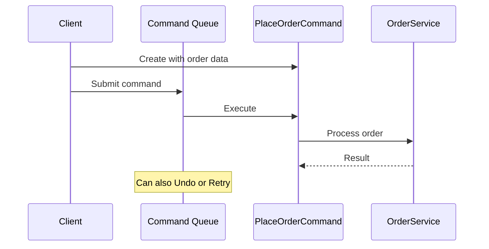

# Command

A restaurant order ticket is a Command. The waiter writes down what you want (the request), walks it to the kitchen (the invoker), and the chef prepares it (the receiver). The ticket can be queued behind other orders, prioritized for VIPs, cancelled before cooking starts, or saved in a log for the end-of-night audit. The waiter doesn’t cook; the chef doesn’t take orders. The ticket decouples who requests from who executes.

The Command pattern encapsulates a request as an object, bundling the action, its parameters, and the receiver into one unit. An invoker calls `Execute()` without knowing what the command does; the command knows how to do it and — critically — how to `Undo()` it. Because commands are objects, they can be serialized, queued, logged, retried, and replayed. In an e-commerce system, `PlaceOrderCommand`, `CancelOrderCommand`, and `RefundOrderCommand` each carry their context and can be pushed onto a command history for full undo support.



> [!NOTE] Command vs Strategy
> **Command** encapsulates a **request** with all its data — what to do, when, and with what context. [[Strategy]] encapsulates an **algorithm** — how to do something. Command is about WHAT and WHEN; Strategy is about HOW. A `PlaceOrderCommand` carries the order data and knows how to place it. A `ShippingCostStrategy` knows how to calculate cost but doesn't carry the order.

## Problem

`OrderService` has `PlaceOrder`, `CancelOrder`, `RefundOrder` methods — no undo, no queuing, no audit trail:

```csharp
public class OrderService
{
    // ⚠️ No undo — once placed, can't roll back without a separate cancel call
    public async Task PlaceOrderAsync(Order order)
    {
        await _repository.SaveAsync(order);
        await _inventory.ReserveAsync(order.Items);
        await _payment.ChargeAsync(order.Total, order.Customer.PaymentMethod);
    }

    // ⚠️ No record of who cancelled, when, or why
    public async Task CancelOrderAsync(Guid orderId)
    {
        var order = await _repository.GetAsync(orderId);
        order.Status = OrderStatus.Cancelled;
        await _repository.UpdateAsync(order);
        await _inventory.ReleaseAsync(order.Items);
        await _payment.RefundAsync(order.PaymentTransactionId, order.Total);
    }

    // ⚠️ Retry logic scattered — if refund fails, caller must retry manually
    public async Task RefundOrderAsync(Guid orderId, decimal amount) { /* ... */ }
}
```

Here's what breaks when requirements change: adding an "undo last action" feature for customer service agents requires tracking what was done and how to reverse it — there's no structure for that.

## Solution

Each operation becomes a command object with `ExecuteAsync()` and `UndoAsync()`:

```csharp
// Command interface
public interface IOrderCommand
{
    Task ExecuteAsync();
    Task UndoAsync();
    string Description { get; } // for audit trail
}

// Concrete commands
public class PlaceOrderCommand(
    Order order,
    IOrderRepository repository,
    IInventoryService inventory,
    IPaymentService payment) : IOrderCommand
{
    private string? _transactionId;

    public string Description => $"Place order #{order.Id} for {order.Total:C}";

    public async Task ExecuteAsync()
    {
        await repository.SaveAsync(order);
        await inventory.ReserveAsync(order.Items);
        _transactionId = await payment.ChargeAsync(order.Total, order.Customer.PaymentMethod);
        order.Status = OrderStatus.Paid;
    }

    public async Task UndoAsync()
    {
        // ✅ Undo knows exactly what to reverse
        if (_transactionId is not null)
            await payment.RefundAsync(_transactionId, order.Total);
        await inventory.ReleaseAsync(order.Items);
        order.Status = OrderStatus.Cancelled;
        await repository.UpdateAsync(order);
    }
}

public class CancelOrderCommand(
    Guid orderId,
    string reason,
    IOrderRepository repository,
    IInventoryService inventory,
    IPaymentService payment) : IOrderCommand
{
    private Order? _cancelledOrder;

    public string Description => $"Cancel order #{orderId}: {reason}";

    public async Task ExecuteAsync()
    {
        _cancelledOrder = await repository.GetAsync(orderId);
        _cancelledOrder.Status = OrderStatus.Cancelled;
        _cancelledOrder.CancellationReason = reason;
        await repository.UpdateAsync(_cancelledOrder);
        await inventory.ReleaseAsync(_cancelledOrder.Items);
        await payment.RefundAsync(_cancelledOrder.PaymentTransactionId, _cancelledOrder.Total);
    }

    public async Task UndoAsync()
    {
        if (_cancelledOrder is null) return;
        _cancelledOrder.Status = OrderStatus.Paid;
        await repository.UpdateAsync(_cancelledOrder);
        await inventory.ReserveAsync(_cancelledOrder.Items);
        // Note: re-charging is not always possible — undo may be limited
    }
}

// Invoker — executes commands and maintains history for undo
public class OrderCommandInvoker
{
    private readonly Stack<IOrderCommand> _history = new();
    private readonly ICommandAuditLog _auditLog;

    public OrderCommandInvoker(ICommandAuditLog auditLog) => _auditLog = auditLog;

    public async Task ExecuteAsync(IOrderCommand command)
    {
        await command.ExecuteAsync();
        _history.Push(command);
        await _auditLog.RecordAsync(command.Description, DateTime.UtcNow); // ✅ automatic audit trail
    }

    public async Task UndoLastAsync()
    {
        if (_history.TryPop(out var command))
        {
            await command.UndoAsync();
            await _auditLog.RecordAsync($"UNDO: {command.Description}", DateTime.UtcNow);
        }
    }
}

// Usage
var placeCommand = new PlaceOrderCommand(order, repository, inventory, payment);
await invoker.ExecuteAsync(placeCommand);

// Customer service agent undoes the last action
await invoker.UndoLastAsync();
```

Adding a `PartialRefundCommand` now means one new class — the invoker and audit trail work automatically.

## You Already Use This

**`ICommand` (WPF/MAUI)** — `Execute(parameter)` and `CanExecute(parameter)` are the Command pattern. UI buttons bind to commands; the command encapsulates the action and its preconditions. The button doesn't know what the command does.

**MediatR `IRequest<T>` + handler** — MediatR is a Command pattern implementation. `PlaceOrderCommand : IRequest<OrderResult>` is the command; `PlaceOrderCommandHandler` is the receiver. The mediator is the invoker.

**`IDbCommand` / `SqlCommand`** — `SqlCommand` encapsulates a SQL statement, its parameters, and the connection. `ExecuteNonQueryAsync()` is `Execute()`. The command can be prepared, parameterized, and reused.

**`Action<T>` / `Func<T>` delegates** — a delegate is a lightweight command. `Task.Run(() => ProcessOrder(order))` queues a command for execution on the thread pool.

## Questions

> [!QUESTION]- When is undo not feasible, and how do you handle it?
> Undo is not feasible when the operation has external side effects that can't be reversed: sending an email (can't unsend), charging a card (refund is a new operation, not a reversal), or publishing an event to a message bus. In these cases, implement compensating transactions instead of true undo: `CancelOrderCommand` is the compensation for `PlaceOrderCommand`. Document which commands support true undo and which only support compensation. The tradeoff: true undo is simpler for the caller; compensating transactions are more realistic for distributed systems.

> [!QUESTION]- How does MediatR implement the Command pattern, and what does it add?
> MediatR separates the command (data + intent) from the handler (execution logic). `PlaceOrderCommand` carries the order data; `PlaceOrderCommandHandler` knows how to process it. The mediator routes commands to handlers without the sender knowing the handler. MediatR adds: pipeline behaviors (Chain of Responsibility around the handler), notification publishing (one command → multiple handlers), and request/response typing. The tradeoff: MediatR adds a dependency and indirection; direct service calls are simpler. MediatR earns its complexity when you need pipeline behaviors (validation, logging, caching) applied consistently across all commands.

## References

- [Command Pattern — Christopher Okhravi](https://www.youtube.com/watch?v=9qA5kw8dcSU\&list=PLrhzvIcii6GNjpARdnO4ueTUAVR9eMBpc\&index=7) — video walkthrough of the Command pattern with OOP examples
- [Command — refactoring.guru](https://refactoring.guru/design-patterns/command) — canonical pattern description with invoker/command/receiver diagram and C# example
- [ICommand interface (WPF) — Microsoft Learn](https://learn.microsoft.com/en-us/dotnet/api/system.windows.input.icommand) — Command pattern in WPF/MAUI UI frameworks
- [MediatR — GitHub](https://github.com/jbogard/MediatR) — Command pattern implementation for .NET with pipeline behaviors
- [Transactional outbox pattern — Microsoft Learn](https://learn.microsoft.com/en-us/azure/architecture/patterns/transactional-outbox) — reliable command execution with compensating transactions
