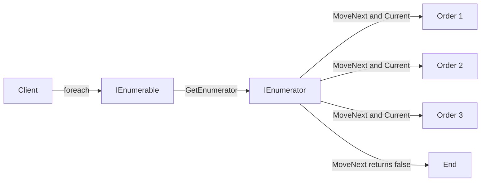

# Iterator

A TV remote’s channel button is an Iterator. Press "next" and you get the next channel without knowing whether channels are stored in an array, a linked list, or streamed from a satellite. The remote abstracts away how channels are organized — you just get the next one. You can start over, skip ahead, or stop anytime.

The Iterator pattern provides a way to sequentially access elements of a collection without exposing its underlying representation. In C#, **`foreach` and `yield return` ARE the Iterator pattern** — the compiler generates the iterator state machine (`IEnumerator<T>`) for you. `IEnumerable<T>` is the iterable (the collection that knows how to create an iterator); `IEnumerator<T>` is the iterator (the cursor that tracks position). Most C# developers use this pattern daily without recognizing it as a design pattern. The `async` counterpart — `IAsyncEnumerable<T>` with `await foreach` — extends the same concept to asynchronous data streams.



## Problem

`OrderRepository` returns a `List<Order>` for the entire order history — memory explosion for customers with thousands of orders:

```csharp
public class OrderRepository
{
    // ⚠️ Loads ALL orders into memory before returning
    public async Task<List<Order>> GetOrderHistoryAsync(Guid customerId)
    {
        return await _db.Orders
            .Where(o => o.CustomerId == customerId)
            .OrderByDescending(o => o.CreatedAt)
            .ToListAsync(); // ⚠️ customer with 50,000 orders = 50,000 objects in memory
    }
}

public class OrderHistoryService
{
    public async Task<List<OrderSummary>> GetRecentOrdersAsync(Guid customerId, int count)
    {
        var allOrders = await _repository.GetOrderHistoryAsync(customerId); // ⚠️ loads all 50,000
        return allOrders.Take(count).Select(o => new OrderSummary(o)).ToList(); // uses 20
    }
}
```

Here's what breaks when requirements change: adding a "load more" feature requires the caller to know about pagination — the collection type leaks implementation details.

## Solution

Use `IEnumerable<T>` with `yield return` for lazy, paginated iteration:

```csharp
public class OrderRepository
{
    // ✅ Returns IAsyncEnumerable — lazy, paginated, caller controls how many to consume
    public async IAsyncEnumerable<Order> GetOrderHistoryAsync(
        Guid customerId,
        [EnumeratorCancellation] CancellationToken ct = default)
    {
        const int pageSize = 100;
        int page = 0;

        while (true)
        {
            var batch = await _db.Orders
                .Where(o => o.CustomerId == customerId)
                .OrderByDescending(o => o.CreatedAt)
                .Skip(page * pageSize)
                .Take(pageSize)
                .ToListAsync(ct);

            if (batch.Count == 0) yield break;

            foreach (var order in batch)
                yield return order; // ✅ caller receives one order at a time

            if (batch.Count < pageSize) yield break;
            page++;
        }
    }
}

public class OrderHistoryService
{
    // ✅ Takes only what it needs — no full load
    public async Task<List<OrderSummary>> GetRecentOrdersAsync(Guid customerId, int count)
    {
        var summaries = new List<OrderSummary>(count);
        await foreach (var order in _repository.GetOrderHistoryAsync(customerId))
        {
            summaries.Add(new OrderSummary(order));
            if (summaries.Count >= count) break; // ✅ stops iteration early
        }
        return summaries;
    }

    // ✅ Synchronous iterator with yield return
    public IEnumerable<OrderSummary> GetOrderSummaries(IEnumerable<Order> orders)
    {
        foreach (var order in orders)
        {
            if (order.Status == OrderStatus.Cancelled) continue; // ✅ filter inline
            yield return new OrderSummary(order); // ✅ lazy — only computed when consumed
        }
    }
}
```

The caller uses `await foreach` without knowing whether the source is a database, a file, or an in-memory list.

## You Already Use This

**`IEnumerable<T>` / `IEnumerator<T>` + `foreach`** — the language-native Iterator. Every `foreach` loop calls `GetEnumerator()` and `MoveNext()` on the iterator. The compiler generates the state machine for `yield return` methods.

**`yield return`** — the compiler transforms a method with `yield return` into a class implementing `IEnumerator<T>`. The method body becomes a state machine that resumes after each `yield return`. This is the Iterator pattern implemented at the language level.

**`IAsyncEnumerable<T>` / `await foreach`** — the async variant. `Channel<T>.ReadAllAsync()`, EF Core `AsAsyncEnumerable()`, and gRPC streaming all return `IAsyncEnumerable<T>`. The caller uses `await foreach` without knowing the source.

**LINQ `IQueryable<T>`** — a deferred iterator over a database query. The query is built lazily; execution happens when the iterator is consumed (`ToListAsync()`, `FirstOrDefaultAsync()`).

## Tradeoffs

**Use it when**: you need sequential access without exposing the underlying structure, you're streaming a large or **infinite/unbounded** sequence (lazy, constant memory), or a type can be traversed multiple ways. In C# you almost never _implement_ `IEnumerator<T>` by hand — `yield return` generates it for you, so "using the Iterator pattern" just means returning `IEnumerable<T>`/`IAsyncEnumerable<T>`.

**Don't reach for it when**: you need random access by index or a `Count` — an iterator is single-pass and forward-only; use a `List`/array. And remember the lazy-iteration footguns: **deferred execution** means exceptions and DB queries fire _when consumed_, not when called, and enumerating twice re-runs the work.

**vs related**: Iterator gives sequential _access_; **[[Visitor]]** adds _operations_ over a structure's elements; **[[Composite]]** is the tree structure you often iterate. See [[Foreach|foreach & yield]] for the language mechanics.

## Questions

> [!QUESTION]- When should you return `IEnumerable<T>` vs `IReadOnlyList<T>` vs `IAsyncEnumerable<T>`?
> Return `IReadOnlyList<T>` when the collection is fully materialized and callers need random access or `Count`. Return `IEnumerable<T>` when the collection is lazy or the caller only needs sequential access. Return `IAsyncEnumerable<T>` when the source is async (database, network) and you want to stream results without buffering all of them. The tradeoff: `IReadOnlyList<T>` is simpler but requires full materialization; `IAsyncEnumerable<T>` is memory-efficient but requires `await foreach` at the call site. Default to `IReadOnlyList<T>` for small collections; use `IAsyncEnumerable<T>` when the collection could be large or unbounded.

> [!QUESTION]- What does the compiler generate for a `yield return` method?
> The compiler generates a private class implementing `IEnumerator<T>` and `IEnumerable<T>`. The method body is split into states at each `yield return` point. `MoveNext()` advances the state machine to the next `yield return`, executes the code between yields, and returns `true`. `Current` returns the last yielded value. The generated class captures all local variables as fields. This is why `yield return` methods can't use `ref` locals or `unsafe` code — the state machine can't capture those.

## References

- [Iterator Pattern — Christopher Okhravi](https://www.youtube.com/watch?v=uNTNEfwYXhI\&list=PLrhzvIcii6GNjpARdnO4ueTUAVR9eMBpc\&index=16) — video walkthrough of the Iterator pattern with OOP examples
- [Iterator — refactoring.guru](https://refactoring.guru/design-patterns/iterator) — canonical pattern description with C# example
- [`IEnumerable<T>` — Microsoft Learn](https://learn.microsoft.com/en-us/dotnet/api/system.collections.generic.ienumerable-1) — the .NET Iterator interface
- [yield statement — C# reference — Microsoft Learn](https://learn.microsoft.com/en-us/dotnet/csharp/language-reference/statements/yield) — how `yield return` implements the Iterator pattern
- [`IAsyncEnumerable<T>` — Microsoft Learn](https://learn.microsoft.com/en-us/dotnet/api/system.collections.generic.iasyncenumerable-1) — async Iterator for streaming data sources
