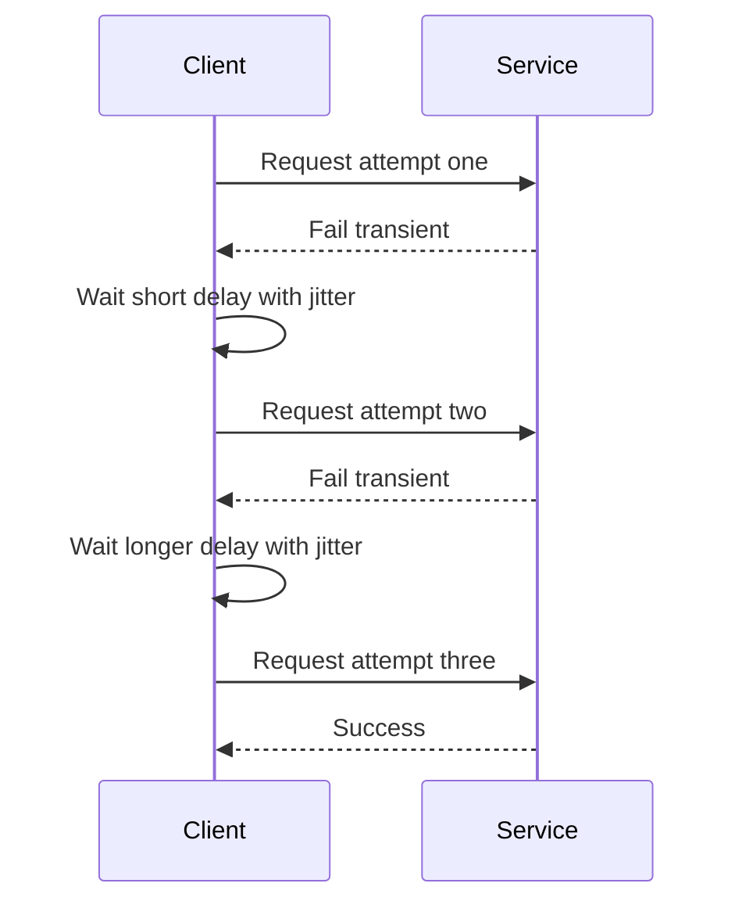

---
topic:
  - Architecture
subtopic:
  - Patterns
level:
  - "3"
priority: High
status: Ready to Repeat
publish: true
---

# Intro

Retry and timeout patterns are defensive reliability strategies for outbound calls: retry re-attempts operations that fail for transient reasons, and timeout bounds how long you wait before treating the attempt as failed. They matter because distributed systems regularly see short network loss, DNS hiccups, brief overload, and cold-start latency spikes that are recoverable seconds later. Without retry, you fail fast on recoverable faults; without timeout, a single hung dependency can hold connection pool slots and request capacity until upstream latency collapses. Reach for both patterns on most request response external dependency boundaries such as HTTP APIs, message brokers, databases, and cache services. For streaming and long-running background flows, use explicit deadline ownership and different timeout and retry budgets. In modern .NET, the standard implementation is Polly v8 through `Microsoft.Extensions.Http.Resilience`.

# Retry mechanism

## Retry strategies

- `Immediate retry`: run the next attempt with no delay; useful only for very short transient blips.
- `Fixed delay`: wait the same interval each time; simple and predictable, but can still synchronize clients.
- `Exponential backoff`: increase wait duration after each failure to reduce pressure on an unhealthy dependency.
- `Exponential backoff with jitter`: add randomization to each delay so clients do not retry in lockstep.

## Why jitter matters

If 10,000 clients all fail at the same time and all retry at exactly 200 ms, then 400 ms, then 800 ms, they create synchronized request spikes that prolong outage recovery. Jitter decorrelates retry timing, turning one synchronized storm into a spread-out arrival pattern that gives the downstream service room to recover.

## Exponential backoff formula

Use this as a conceptual model for exponential backoff:

```text
delay grows exponentially from a base value and jitter randomizes each attempt
```

Polly v8 exponential retry with `UseJitter = true` uses a decorrelated jitter approach, so treat the formula as intuition and verify exact delay behavior in the Polly retry docs. In practice, keep `baseDelay` small, cap max delay, and cap max attempts to stay within your latency SLO.

## Max retry attempts

Cap retries on user-facing request paths. For long-running background workers, indefinite retries can be acceptable only when combined with cancellation support, max-delay caps, and monitoring that can stop unhealthy loops.

## What to retry

- Retry only transient failures: connection reset, timeout, temporary DNS failure, HTTP `408`, `429`, and most `5xx`.
- Do not retry client bugs and invalid requests (`400`, `401`, `403`, `404`, validation errors).
- Do not retry non-idempotent operations unless you provide idempotency keys or equivalent deduplication.

## Retry flow



# Timeout mechanism

## Per-attempt timeout

Per-attempt timeout bounds one call attempt. If the dependency hangs, the attempt is canceled and retry logic can decide whether to try again.

## Overall timeout

Overall timeout bounds the total operation budget across all attempts, waits, and strategy overhead. It prevents retry loops from consuming request time indefinitely.

## Why both are required

- Per-attempt timeout only: each attempt is bounded, but cumulative retries can still exceed acceptable end-to-end latency.
- Overall timeout only: one hung attempt can consume the full budget before retry gets a chance.
- Combined: each attempt is bounded and the full operation is also bounded.

# .NET Polly v8 example

This ASP.NET Core example configures an `HttpClient` for an inventory dependency with an outer total timeout, a transient-fault retry policy using exponential backoff and jitter, and an inner per-attempt timeout.

```csharp
using Microsoft.Extensions.DependencyInjection;
using Microsoft.Extensions.Http.Resilience;
using Polly;
using Polly.Retry;
using Polly.Timeout;

var builder = WebApplication.CreateBuilder(args);

builder.Services.AddHttpClient<InventoryClient>(client =>
{
    client.BaseAddress = new Uri("https://inventory.internal/");
    client.Timeout = Timeout.InfiniteTimeSpan;
})
.AddResilienceHandler("inventory-http", (pipelineBuilder, context) =>
{
    // Outermost total timeout for full operation budget
    pipelineBuilder.AddTimeout(new TimeoutStrategyOptions
    {
        Timeout = TimeSpan.FromSeconds(8)
    });

    pipelineBuilder.AddRetry(new RetryStrategyOptions<HttpResponseMessage>
    {
        MaxRetryAttempts = 3,
        Delay = TimeSpan.FromMilliseconds(200),
        BackoffType = DelayBackoffType.Exponential,
        UseJitter = true,
        ShouldHandle = new PredicateBuilder<HttpResponseMessage>()
            .Handle<HttpRequestException>()
            .Handle<TimeoutRejectedException>()
            .HandleResult(response =>
                response.StatusCode == System.Net.HttpStatusCode.RequestTimeout ||
                response.StatusCode == System.Net.HttpStatusCode.TooManyRequests ||
                (int)response.StatusCode >= 500)
    });

    // Innermost timeout for each individual attempt
    pipelineBuilder.AddTimeout(new TimeoutStrategyOptions
    {
        Timeout = TimeSpan.FromSeconds(2)
    });
});

var app = builder.Build();
app.Run();

public sealed class InventoryClient
{
    private readonly HttpClient _httpClient;

    public InventoryClient(HttpClient httpClient)
    {
        _httpClient = httpClient;
    }

    public Task<HttpResponseMessage> GetAvailabilityAsync(string sku, CancellationToken ct)
    {
        return _httpClient.GetAsync($"api/stock/{sku}", ct);
    }
}
```

# Integration with other resilience patterns

For production systems, compose retry and timeout with neighboring patterns in a deliberate order from outermost to innermost:

1. `Total timeout` outermost to cap full operation time.
2. `Fallback` after inner strategies fail to provide degraded response.
3. `Retry` to absorb short transient failures.
4. `Circuit Breaker` to fast-fail during sustained instability.
5. `Per-attempt timeout` innermost to cap single attempt duration.

Use this pipeline together with [[05 Architecture/Patterns/Resilience Patterns/Circuit Breaker|Circuit Breaker]] and [[05 Architecture/Patterns/Resilience Patterns/Rate Limiting|Rate Limiting]] to protect both dependency health and caller latency.

# Pitfalls

## Retrying non idempotent operations

- What goes wrong: duplicate orders or duplicate payments happen when a non-idempotent write is retried after uncertain completion.
- Why it happens: the client cannot distinguish between failed execution and failed response delivery, so a second attempt may repeat a completed write.
- How to avoid it: use idempotency keys for write APIs and retry only operations that are explicitly safe to replay.

## No jitter in backoff

- What goes wrong: all clients retry at the same time and generate a retry storm that extends outage duration.
- Why it happens: deterministic delays synchronize retries across instances and across regions.
- How to avoid it: enable jitter and combine it with exponential backoff and capped attempt count.

## Missing timeout boundary

- What goes wrong: a hung dependency call holds connection slots and request budget for minutes.
- Why it happens: only one timeout layer is configured or no timeout is configured at all.
- How to avoid it: configure both per-attempt timeout and overall timeout then align both with your service latency SLO.

## Retry amplification across layers

- What goes wrong: one user request fans out into many downstream calls for example three retries in service A and three retries in service B can produce nine calls into service C.
- Why it happens: each layer retries independently without a shared retry budget.
- How to avoid it: define retry ownership by layer cap total attempts end to end and propagate deadlines so lower layers stop retrying when budget is exhausted.

# Tradeoffs

| Strategy | Benefit | Cost | Use when |
| --- | --- | --- | --- |
| Immediate retry | Lowest added latency for short glitches | Highest risk of immediate re-pressure on unstable dependency | Failure is likely a one off transport hiccup and dependency is lightly loaded |
| Fixed delay retry | Simple predictable behavior | Can still synchronize clients and recover slowly under heavy contention | You need straightforward behavior and traffic is moderate |
| Exponential backoff with jitter | Best protection against retry storms and downstream overload | Higher implementation complexity and longer tail latency on repeated failures | Dependency instability is common and fleet size is large |
| Per-attempt timeout only | Prevents single attempt hang | Total operation can still run too long across retries | You have no retries and only need per call bound |
| Per-attempt plus overall timeout | Bounds both attempt and end to end latency | Requires careful budget tuning between layers | You run retries or multi-hop calls and have strict SLO targets |

Decision rule: start with exponential backoff plus jitter and dual timeout boundaries then tune attempt count and timeout budgets from observed latency percentiles and downstream error rates.

# Questions

> [!QUESTION]- Why does retry without jitter make outages worse and how does jitter fix it
> - Without jitter each client computes nearly identical retry times so failures synchronize into periodic traffic spikes.
> - Those spikes hit while the dependency is already degraded which increases queue depth and recovery time.
> - Jitter randomizes each delay so retries spread over time and reduce synchronized pressure.
> - This improves recovery odds and stabilizes shared infrastructure such as load balancers and connection pools.
> - **Tradeoff** jitter reduces herd effects but increases per request timing variance and makes behavior slightly harder to predict.

> [!QUESTION]- How do you prevent retry amplification in a multi layer microservices system
> - Assign retry ownership to one layer per call path usually the edge caller or the service nearest the user boundary.
> - Propagate cancellation tokens and deadlines so downstream services respect the remaining time budget.
> - Keep low retry counts and combine with circuit breaker and rate limits to avoid multiplicative pressure.
> - Measure effective attempts per request in telemetry and alert when fan out exceeds budget.
> - **Tradeoff** centralizing retries improves control and cost but can reduce local autonomy for service teams.

# References

- [Polly docs retry strategy](https://www.pollydocs.org/strategies/retry.html) - Official Polly v8 retry options, backoff types, jitter behavior, and `ShouldHandle` predicates.
- [Polly docs timeout strategy](https://www.pollydocs.org/strategies/timeout.html) - Official Polly v8 timeout behavior, cancellation semantics, and timeout strategy configuration.
- [Microsoft Learn .NET HTTP resilience](https://learn.microsoft.com/dotnet/core/resilience/http-resilience) - `Microsoft.Extensions.Http.Resilience` guidance for composing retry, timeout, circuit breaker, and fallback in `HttpClient` pipelines.
- [Microsoft Learn transient fault handling](https://learn.microsoft.com/azure/architecture/best-practices/transient-faults) - Cloud architecture guidance on identifying transient failures and choosing retry and timeout policies.
- [AWS Architecture Blog Exponential Backoff and Jitter](https://aws.amazon.com/blogs/architecture/exponential-backoff-and-jitter/) - Marc Brooker explanation of why jitter reduces coordinated retries and improves system recovery under contention.
