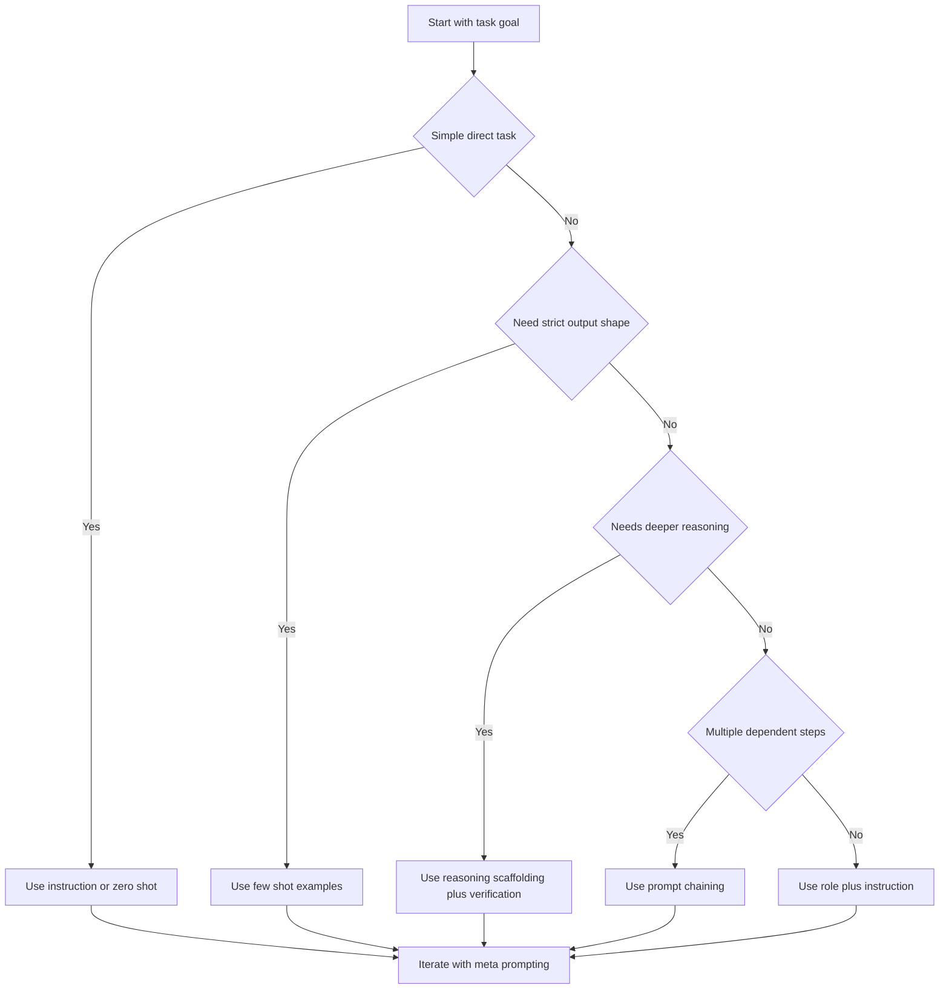

# Intro

Prompt engineering is the practice of turning a vague user intention into a precise model task. It matters because LLMs are probabilistic generators: small wording and setting changes can shift correctness, style, and reliability. In production, a prompt is part of your system interface, so you should treat it like code: explicit, testable, and versioned. This hub covers the foundations, while child pages in this folder go deeper into in-context learning, reasoning, prompt composition, and automated optimization.

## Prompt Anatomy

Most effective prompts combine four elements:

- **Instruction**: the exact task to perform.
- **Context**: domain facts, constraints, or audience details.
- **Input data**: the concrete content to process now.
- **Output indicator**: the required structure for the answer.

Example with all four elements:

```text
Instruction: Extract security risks from the incident note.
Context: You are helping a SOC analyst. Keep findings actionable and concise.
Input data: "API keys were stored in plain text logs for 3 days in staging."
Output indicator: Return JSON with fields risk, impact, mitigation.
```

Mechanically, each element removes uncertainty: instruction narrows behavior, context biases interpretation, input anchors the specific case, and output indicator constrains format.

## LLM Settings

Prompt text controls intent, while generation settings control sampling behavior and output boundaries.

- **Temperature**: higher values increase randomness; lower values make outputs more deterministic.
- **Top-p**: limits candidate tokens to a probability mass (nucleus); lower values are more conservative.
- **Max tokens**: hard cap on generated length, useful for cost and latency control.
- **Stop sequences**: explicit strings that terminate output, useful for schemas and multi-part protocols.

Starting ranges below are heuristics, not universal defaults. Validate them with task-specific evals for your chosen model before using them in production.

| Task type | Temperature | Top-p | Max tokens | Stop sequences |
|---|---:|---:|---:|---|
| Creative writing | 0.8-1.0 | 0.9-1.0 | 600-1200 | Optional section markers |
| Classification | 0.0-0.2 | 0.1-0.4 | 20-80 | Label boundary, newline |
| Code generation | 0.1-0.3 | 0.8-1.0 | 200-800 | \`\`\` or custom delimiter |

Practical rule: tune `temperature` first, keep `top-p` near default unless you have a measured reason to change both.

## Instruction Prompting

Instruction prompting is direct natural-language control: tell the model exactly what to do, how to do it, and how to format the result. It works best when instructions are specific, observable, and testable.

Good instruction pattern:

- Task verb first: classify, extract, summarize, transform.
- Explicit format: JSON schema, bullet count, table columns, or label set.
- Constraints: length, forbidden content, confidence threshold, tone.

Example 1 (name normalization):

```text
Convert the person name to this format: <Last name>, <First name>.
If suffix exists, keep it after first name.
Input: "Nikita Reshetnik"
Output:
```

Example 2 (PII redaction):

```text
Redact all personal data from the email.
Replace names with [NAME], phones with [PHONE], and emails with [EMAIL].
Return only redacted text.
Input: "Hi John, call me at 410-805-2345."
```

If outputs drift, tighten the output indicator before adding complexity.

## Role Prompting

Role prompting assigns a perspective that shapes style, depth, and framing. It does not replace task instructions; it modifies how the model executes them.

- Use role prompting when voice or audience matters.
- Pair role with boundaries so style does not override accuracy.
- Prefer concrete roles over vague ones.

Illustrative contrast:

```text
Standard: Write a review of this pizza place.
Role-based: You are a food critic writing for a city newspaper. Write a review of this pizza place in 120-150 words, focusing on crust texture, sauce balance, and service.
```

The role-based version typically yields richer domain vocabulary and better evaluative structure because the model has a clearer perspective prior.

## Choosing a Technique

Use this quick decision flow for first-pass prompt design:



For deeper implementation patterns, use targeted follow-ups such as [[In-Context Learning]] when format consistency is weak and [[Prompt Composition]] when one prompt is not enough. Prefer verifiable outputs over eliciting hidden reasoning traces.

## Pitfalls

- **Indirect prompt injection from retrieved content**: if documents, web pages, or tool results include malicious instructions, the model may treat them as higher-priority guidance and perform unsafe actions. This happens when instruction and data channels are mixed. Mitigate by isolating trusted instructions, treating retrieved text as untrusted input, and enforcing tool allowlists and output validation.
- **Valid-looking but wrong structured output**: an answer can match your JSON or table format while containing incorrect fields or invented values. This happens because structure constraints do not guarantee factual correctness. Mitigate with schema validation plus semantic checks (required fields, value ranges, and source-grounded assertions).
- **Token budget collapse in multi-step prompts**: long context plus verbose generations can truncate critical instructions or examples, causing silent quality drops. This happens when `max tokens` and context size are not managed together. Mitigate by trimming context, using stop sequences, and monitoring completion length and truncation rate.

## Questions

> [!QUESTION]- Why do prompt anatomy and model settings have to be designed together?
>
> - Prompt text defines intent and constraints, settings define sampling behavior.
> - A precise prompt can still fail with overly random settings.
> - Conservative settings can still produce poor output if instructions are ambiguous.
> - Reliable systems tune both and evaluate with task-specific metrics.

> [!QUESTION]- When should you prefer few-shot prompting over pure instruction prompting?
>
> - When output format is strict or hard to describe in words.
> - When label boundaries are subtle and examples clarify decision edges.
> - When consistency matters more than novelty.
> - Start with minimal examples, then add edge cases.

> [!QUESTION]- How would you debug a prompt that is accurate but too verbose and expensive?
>
> - Tighten output indicator with length limits and schema.
> - Lower `max tokens` and add stop sequences.
> - Keep `temperature` low for deterministic concise tasks.
> - Evaluate token usage and failure rate after each change.

## References

- [Prompt Engineering Guide - Basics](https://www.promptingguide.ai/introduction/basics)
- [Prompt Engineering Guide - Prompt Elements](https://www.promptingguide.ai/introduction/elements)
- [Prompt Engineering Guide - Model Settings](https://www.promptingguide.ai/introduction/settings)
- [OpenAI Prompt Engineering Guide](https://platform.openai.com/docs/guides/prompt-engineering)
- [Anthropic Prompt Engineering Overview](https://docs.anthropic.com/en/docs/build-with-claude/prompt-engineering/overview)
- [OWASP Top 10 for LLM Applications](https://owasp.org/www-project-top-10-for-large-language-model-applications/)
- [OWASP LLM Prompt Injection Prevention Cheat Sheet](https://cheatsheetseries.owasp.org/cheatsheets/LLM_Prompt_Injection_Prevention_Cheat_Sheet.html)
- [Simon Willison - Delimiters won't save you from prompt injection](https://simonwillison.net/2023/May/11/delimiters-wont-save-you/)
