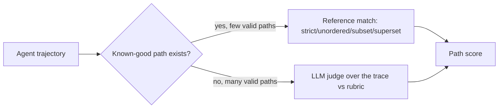

---
topic:
  - AI & ML
subtopic:
  - LLM
level:
  - "3"
priority: High
status: Done
publish: true
---

# Intro

Trajectory evaluation scores the whole path an agent took — the ordered sequence of tool calls, observations, and reasoning steps from task to result — rather than any single step or the final answer alone. It exists because two agents can reach the same correct end state by very different routes: one in four clean steps, the other after wandering through six wrong tool calls and recovering by luck. Outcome scoring rates them equally; [[11 AI & ML/LLM/Agents/Evaluation/Tool-Call Evaluation|tool-call scoring]] rates each call in isolation; only trajectory evaluation answers "was the *path* reasonable."

Two families do this, and they trade off precision against coverage. **Reference-trajectory match** compares the agent's path against a known-good one. **LLM-as-judge over the trace** reads the whole transcript and rates it against a rubric. The judge machinery is the general [[11 AI & ML/LLM/Evaluation/LLM-as-a-Judge|LLM-as-a-Judge]] applied to a trajectory; the modes below are agent-specific.

## Reference-trajectory match

You curate a reference path — the tool sequence a correct solve should take — and score how the agent's actual path compares. The comparison mode decides how strict that is:

- **Strict** — same tools, same arguments, same order. Use only when exactly one correct path exists; otherwise it rejects valid solutions.
- **Unordered** — same set of tool calls, order ignored. Use when the steps are independent (fetch two unrelated facts in either order).
- **Subset** — the agent's calls all appear in the reference set (agent ⊆ reference); no out-of-scope tools. Use to assert "stayed in bounds," e.g. never called a write tool on a read-only task.
- **Superset** — every reference step appears in the agent's path, extra steps allowed (agent ⊇ reference). Use to assert "did the required work," tolerating exploration.

Reference matching is precise and cheap to run, but brittle: it can only credit paths you anticipated, and for open-ended tasks the space of valid paths is too large to enumerate. It also says nothing about *quality* within an allowed path — a superset match passes a bloated trajectory as long as it contains the required steps.

## LLM-as-judge over the trace

When no single path is correct, give a judge the full transcript and a rubric: did the agent form a sensible plan, choose appropriate tools, avoid needless steps, and recover when a tool failed? The judge handles the open-ended "reasonableness" that reference matching cannot, at the cost of a model call per trajectory and the judge's biases — amplified here because a trajectory is long.



## Step-level vs episode-level

Decide what a "score" attaches to. **Episode-level** rates the trajectory as a whole (one pass/fail or one rubric score per run) — cheap, but a failure tells you the run was bad, not where. **Step-level** scores each decision point (was *this* the right next action given the state so far) — far more diagnostic for finding where a long agent derailed, but it costs a judgment per step and needs per-step ground truth or a judge with the running context. Start episode-level for release gating; add step-level only on the trajectories that fail, to localize the break.

## Example

Two evaluations of the same support task, run as reference-match plus judge:

```text
Reference (superset mode): {lookup_order, issue_refund, send_email} must all appear

Agent A path: lookup_order -> issue_refund -> send_email
  - Superset match: PASS (all required present)
  - Judge (1-5): 5  "minimal, correct order, no wasted calls"

Agent B path: search_orders -> lookup_order -> lookup_order -> issue_refund -> send_email
  - Superset match: PASS (all required present)   <- match alone hides the waste
  - Judge (1-5): 3  "redundant lookup_order, unnecessary initial search"

Same outcome, same superset verdict; the judge separates the clean path from the wasteful one.
```

## Tradeoffs

| Approach | Catches | Cost | Breaks when |
| --- | --- | --- | --- |
| Reference match (strict) | Any deviation from the one correct path | Lowest to run | More than one valid path exists |
| Reference match (subset/superset) | Missing required work / out-of-bounds actions | Low | Path quality within bounds (bloat, detours) |
| LLM judge over the trace | Plan quality, redundancy, recovery | High — judge call per run, long context | Traces exceed the judge's reliable context window |

Decision rule: use reference matching where the task has a small, knowable set of correct paths and you want a cheap, objective gate — subset mode is especially good as a *safety* check (never touched a forbidden tool). Switch to a judge for open-ended tasks, and pair it with the cheap outcome and efficiency metrics from [[11 AI & ML/LLM/Agents/Evaluation/Evaluation|Agent Evaluation]] so a high judge score on a failed task is impossible to miss.

## Pitfalls

### Reference brittleness penalizes valid alternate paths

A strict reference match marks a correct solve wrong because it used `search` then `filter` instead of a single `query` call. The metric is now measuring conformance to your guessed path, not task quality, and will rank a rigid agent above a smarter flexible one. Loosen to a more permissive mode (unordered or superset), or move to a judge, whenever more than one path is genuinely correct.

### Judge degrades on long traces

LLM judges lose reliability as the transcript grows — they skim the middle, anchor on the first and last steps, and reward verbosity. A 40-step trajectory is exactly where you most need step localization and least trust a single episode-level judgment. Mitigation: summarize or chunk the trace, score key decision points step-level, and validate judge scores against human labels on long runs specifically.

### Outcome leakage inflates path scores

If the judge can see that the task succeeded, it rationalizes the path as good regardless of how messy it was. Withhold the outcome from the trajectory judge, or score path and outcome with separate calls, so a lucky success through a bad path is not laundered into a high path score.

## Questions

> [!QUESTION]- When do you use reference-trajectory matching versus an LLM judge over the trace?
> - Reference matching fits tasks with a small, knowable set of correct paths; it is cheap, objective, and can assert hard constraints (subset = stayed in bounds, superset = required work done)
> - It breaks when many paths are valid — strict matching then penalizes correct alternate solutions and measures conformance, not quality
> - A judge handles open-ended tasks and rates plan quality, redundancy, and recovery that matching cannot see, at the cost of a model call per run and long-context bias
> - Common setup: subset match as a cheap safety gate (no out-of-scope tools) plus a judge for path quality, backed by outcome and efficiency metrics
> - Matching is cheap but brittle and quality-blind; judging is flexible but expensive and biased — choose by how enumerable the correct paths are

> [!QUESTION]- Why can a high trajectory-judge score be misleading, and how do you guard against it?
> - If the judge sees the task succeeded, outcome leakage makes it rationalize a messy path as good
> - On long traces the judge skims the middle and rewards verbosity, so a bloated trajectory can outscore a clean one
> - Guard by withholding the outcome from the path judge (or scoring path and outcome separately) and by validating against human labels on long runs
> - Pair the judge with objective efficiency counters (steps, cost, redundant calls) that a biased judge cannot launder
> - Separate, calibrated, step-localized judging costs more calls, so spend it on the long, high-stakes trajectories where path quality actually matters

## References

- [Trajectory evaluations -- reference-match modes and LLM-judge scoring of agent trajectories (LangSmith docs)](https://docs.langchain.com/langsmith/trajectory-evals) — practitioner how-to for both families, including the strict/unordered/subset/superset match modes.
- [AgentBench -- evaluating LLMs as agents across eight interactive environments (Liu et al., 2023)](https://arxiv.org/abs/2308.03688) — multi-environment agent benchmark and a reference point for trajectory-level success measurement.
- [tau-bench -- tool-agent-user interaction with policy-grounded trajectories (Yao et al., Sierra, 2024)](https://arxiv.org/abs/2406.12045) — supplies reference end states and rules that make trajectory ground truth tractable.
