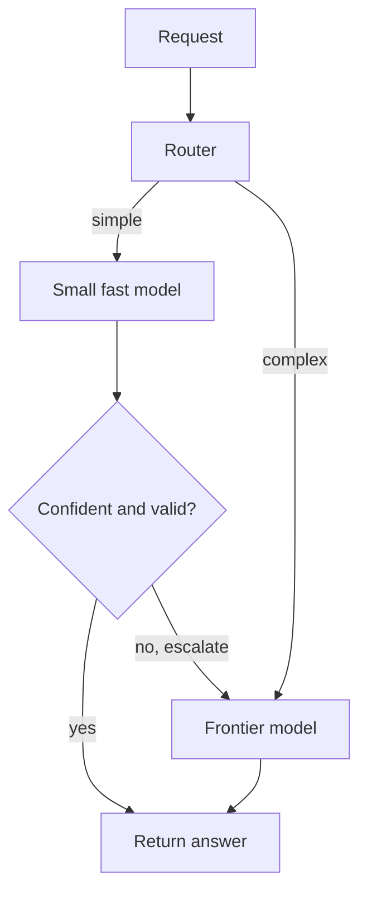

# Intro

Model selection is choosing which model serves a request; routing is choosing per-request among several models. Both exist because there is no single best model — every choice trades **quality against cost and latency**. Frontier models give the highest quality at the highest price and slowest response; small models are cheap and fast but weaker. A production system that sends every request to the largest model overpays and runs slow; one that uses a small model everywhere fails the hard queries. The engineering job is to match each request to the cheapest model that can handle it, and to keep that mapping changeable as models and prices shift underneath you.

This decision compounds with the rest of the stack: a stronger [[Prompting|prompt]], [[RAG|retrieval]], or a [[Fine-tuning|fine-tuned]] small model can let a cheaper model do a job that otherwise needs a frontier one.

## Selection Criteria

Choose a model against the actual requirements of the task, not its leaderboard rank:

- **Task difficulty** — multi-step reasoning and ambiguous tasks need stronger models; classification, extraction, and routing often run well on small ones.
- **Context length** — does the task need a large window, and does the model hold quality across it (see [[Context Engineering]])?
- **Capabilities** — structured-output and tool-calling support, multimodality, and language coverage are hard constraints, not preferences.
- **Latency SLA and cost ceiling** — a p95 latency budget or a per-request cost cap can rule out frontier models regardless of quality.
- **Privacy and residency** — data-handling, region, and self-hosting requirements can force a specific provider or an open model.
- **Reliability and stability** — provider uptime, rate limits, and how often the model changes behavior under you (see Pitfalls).

The decision must be driven by [[11 AI & ML/LLM/Evaluation/Evaluation|evaluation]] on your own task distribution. Public benchmarks and arenas are a starting filter; they overfit and rarely predict performance on your specific workload.

## Routing Patterns

When one model does not fit all traffic, route per request.

**Cascade (tiered fallback).** Send the request to a cheap model first; escalate to a stronger one only when the cheap model fails a check — low confidence, failed output validation, or an explicit "I'm not sure". Most traffic is handled cheaply; only the hard fraction pays for the frontier model.

**Classifier routing.** A small, fast classifier (or the model itself) labels each query and dispatches it to the right model up front, rather than escalating after a failure. This is the [[Agents#Workflow Patterns|routing workflow pattern]] applied to model choice, and the same idea as query routing in [[RAG]].

**Task-based mapping.** A fixed, deterministic mapping: classification and extraction to a small model, complex reasoning to a frontier model, code to a code-specialized model. Simplest to reason about when traffic is cleanly segmented by task type.

## Economics

Cost is driven by tokens, and input and output are usually priced differently (output is typically several times more expensive). Levers:

- **Output-length control** — cap and shape output with `max_tokens` and stop sequences (see [[Generation]]); output tokens dominate cost on generative tasks.
- **Prompt caching** — when a long, stable prefix repeats across requests, caching cuts its input cost and latency dramatically (see [[11 AI & ML/LLM/RAG/Caching|Caching]]).
- **Right-sizing via routing** — cascades and classifier routing keep the expensive model off the easy majority of traffic.
- **Distillation** — [[Fine-tuning|fine-tune]] a small model on a frontier model's outputs to move a high-volume task down a tier permanently.

## Operations

- **Put a gateway in front of models.** Route all calls through an abstraction layer (a model gateway) so swapping providers or models is a config change, not a code change rippling through the app. This is what makes routing, fallback, and A/B model tests practical.
- **Plan for provider failure.** Define a fallback model and degrade gracefully on outages or rate limits rather than failing the request.
- **Pin and watch versions.** Providers update models under stable names; behavior can shift without a code change. Pin versions where possible and re-run [[11 AI & ML/LLM/Evaluation/Evaluation|evaluation]] when a provider ships an update (the same calibration-drift problem judges face in [[LLM-as-a-Judge]]).

## Pitfalls

### Defaulting to the Biggest Model

**What goes wrong**: every request goes to the frontier model "to be safe," and the system is needlessly slow and expensive — often by an order of magnitude on the easy majority of traffic.

**Why it happens**: it is the simplest setup and avoids the work of measuring which queries actually need the strong model.

**How to avoid it**: profile traffic by difficulty, route the easy majority to a small model, and reserve the frontier model for the hard fraction via a cascade or classifier.

### Choosing by Benchmark Instead of Your Eval

**What goes wrong**: a team picks a model because it tops a public leaderboard, ships it, and sees no improvement — or a regression — on their actual task.

**Why it happens**: public benchmarks aggregate over generic tasks and are overfit by model vendors; they do not represent a specific production distribution (the same trap as MTEB for [[Embeddings]]).

**How to avoid it**: evaluate candidates on your own labeled task set and choose on that. Use leaderboards only to shortlist.

### No Abstraction Layer

**What goes wrong**: model and provider calls are hardcoded throughout the app, so switching models for cost, quality, or an outage means touching many call sites and risking regressions.

**Why it happens**: the first integration is direct and never refactored.

**How to avoid it**: route every model call through a gateway/abstraction from the start, so model choice, fallback, and routing are configuration.

### Silent Provider Model Updates

**What goes wrong**: behavior shifts — output format, refusal rate, reasoning quality — with no change on your side, breaking downstream parsing or evals.

**Why it happens**: providers update the model behind a stable name; outputs are not guaranteed stable across infrastructure changes.

**How to avoid it**: pin model versions where the provider allows it, track response fingerprints, and re-run regression evals after provider updates before trusting the new behavior.

## Tradeoffs

| Strategy | Cost | Latency | Quality on hard queries | Best for |
| --- | --- | --- | --- | --- |
| Frontier model for everything | Highest | Highest | Highest | Low volume, uniformly hard tasks, prototyping |
| Small model for everything | Lowest | Lowest | Poor | Uniformly easy, high-volume tasks |
| Fine-tuned small model | Low (after training) | Low | High on the narrow task | A single high-volume task worth distilling |
| Cascade (cheap → escalate) | Low–medium | Low on the majority | High (escalated fraction) | Mixed difficulty, most production traffic |
| Classifier routing | Low–medium | Low | High when the classifier is accurate | Clean task categories, predictable routing |

**Decision rule**: start with a single capable mid-tier model and measure on your eval. If most traffic is easy, add a cascade or classifier router to push the majority to a small model and reserve a frontier model for the hard fraction. If one high-volume task dominates, distill it into a fine-tuned small model. Throughout, keep every call behind a gateway so the model is a config choice, and re-evaluate when providers update.

## Questions

> [!QUESTION]- Why route requests across models instead of picking one good model?
>
> - There is no single best model: frontier models maximize quality but cost the most and are slowest; small models are cheap and fast but weaker — most traffic does not need the frontier model
> - Routing sends the easy majority to a cheap model and reserves the expensive one for the hard fraction, cutting cost and latency without sacrificing quality where it matters
> - A cascade escalates only after a cheap-model failure; a classifier routes up front by predicted difficulty or task type
> - The tradeoff is added routing complexity and the risk of mis-routing a hard query to a weak model — calibrate the router on real traffic and validate escalation triggers

> [!QUESTION]- Why pick a model on your own evaluation rather than public benchmarks?
>
> - Public leaderboards aggregate over generic tasks and are heavily optimized by vendors, so they overfit and rarely predict performance on a specific production distribution
> - The same model can top a benchmark yet underperform on your task, or vice versa — the only reliable signal is measurement on your labeled task set
> - Benchmarks are useful to shortlist candidates, not to make the final choice
> - This mirrors the MTEB caveat for embedding models: a high leaderboard score does not guarantee domain fit

## References

- [FrugalGPT: How to Use Large Language Models While Reducing Cost and Improving Performance (Chen et al., 2023)](https://arxiv.org/abs/2305.05176) — LLM cascades that cut cost by escalating only when needed.
- [RouteLLM: Learning to Route LLMs with Preference Data (Ong et al., 2024)](https://arxiv.org/abs/2406.18665) — learned routing between strong and weak models to trade cost against quality.
- [Chatbot Arena / LMArena leaderboard (LMSYS)](https://lmarena.ai/) — human-preference model rankings; a shortlisting tool, not a substitute for task-specific evaluation.
- [Models overview and pricing (Anthropic)](https://docs.anthropic.com/en/docs/about-claude/models) — capability and price comparison across a model family.
- [Models and pricing (OpenAI)](https://platform.openai.com/docs/models) — capability and price reference for selection.
- [LiteLLM — unified gateway across LLM providers](https://docs.litellm.ai/) — an abstraction layer that makes model choice, fallback, and routing configuration rather than code.
