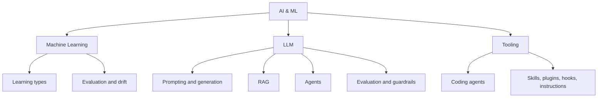

# Intro

AI & ML covers how learning systems are built, evaluated, and operated — from classic supervised models through large language models to the agent tooling that turns models into day-to-day engineering leverage. The unifying theme across all three branches: the model is rarely the hard part. Data quality, evaluation discipline, guardrails, and monitoring decide whether a system works in production, and that engineering work looks remarkably similar whether the model is a gradient-boosted tree or a frontier LLM.

## Map of the Section

- **[[AI & ML/Machine Learning/Machine Learning|Machine Learning]]** — the classic discipline: training pipelines, [[AI & ML/Machine Learning/Types/Types|learning types]], [[AI & ML/Machine Learning/Evaluation/Evaluation|evaluation metrics]], [[Data Drift]], and the [[Spectrum Of Automations|spectrum of automation]] for deploying models safely. Start here for anything with labeled data and an explicit prediction target.
- **[[AI & ML/LLM/LLM|LLM]]** — large language models as an engineering platform: [[AI & ML/LLM/Prompting/Prompting|Prompting]], [[Generation]], [[AI & ML/LLM/RAG/RAG|RAG]], [[AI & ML/LLM/Agents/Agents|Agents]], [[AI & ML/LLM/Evaluation/Evaluation|evaluation]], [[Guardrails]], [[Hallucinations]], and [[OWASP vulnerabilities on AI LLM|security]]. The largest branch, organized around the production pipeline rather than model internals.
- **[[AI & ML/Tooling/Tooling|Tooling]]** — AI-assisted development itself: [[Coding Agents]] and their control surfaces — [[Skills]], [[Plugins]], [[Hooks]], and [[Agent Instructions]].

A useful reading order for someone new to the section: [[AI & ML/Machine Learning/Machine Learning|Machine Learning]] for the foundations and vocabulary, then [[AI & ML/LLM/LLM|LLM]] for the modern stack, then [[AI & ML/Tooling/Tooling|Tooling]] for applying it to your own workflow.

## Choosing an Approach

The first engineering decision is usually not which model — it is which class of solution:

| Situation | Reach for | Why |
| --- | --- | --- |
| Stable rules, auditable logic, tightly controlled error cost | Rules / heuristics | Cheapest to build, test, and explain; no training data needed |
| Labeled data, explicit prediction target, latency or cost constraints | Classic ML (trees, linear models, small transformers) | Millisecond inference, near-zero unit cost, well-understood evaluation |
| Open-ended language tasks, no training data, fast iteration | LLM via prompting | No training loop; quality scales with prompt and context engineering |
| LLM plus current or private knowledge | [[AI & ML/LLM/RAG/RAG\|RAG]] | Updates knowledge without retraining; keeps answers traceable to sources |
| Multi-step tasks with tools and feedback loops | [[AI & ML/LLM/Agents/Agents\|Agents]] | Only when simpler single-call patterns demonstrably fall short |

Whatever the choice, the same operational backbone applies: define success metrics before building, evaluate on held-out data, deploy through the [[Spectrum Of Automations|spectrum of automation]], and monitor for drift and regressions.

## Responsible AI

Fairness, reliability and safety, privacy and security, inclusiveness, transparency, and accountability are the six principles most industry frameworks converge on. They are covered in [[Responsible AI]], including what each principle means in engineering terms and how the major frameworks (Microsoft Responsible AI Standard, NIST AI RMF) operationalize them.

## Questions

> [!QUESTION]- When should you reach for classic ML instead of an LLM API?
>
> - Classic ML wins when the task is a well-defined prediction with labeled data: classification, regression, ranking — millisecond latency and near-zero per-request cost at scale
> - LLMs win when the task involves open-ended language understanding or generation, training data is scarce, or iteration speed matters more than unit cost
> - A common production pattern: prototype with an LLM to validate the product, then distill the stable, high-volume part into a small fine-tuned model
> - Key tradeoff: classic ML trades upfront data and training effort for cheap, fast, predictable inference; LLMs trade per-call cost and latency for flexibility and zero training

> [!QUESTION]- Why does evaluation discipline matter more than model choice?
>
> - Without held-out evaluation, every model swap, prompt change, or retraining run is a guess — improvements cannot be distinguished from noise or regressions
> - Production failures are dominated by data and distribution problems (drift, leakage, segment regressions), which only evaluation and monitoring catch — not by raw model capability
> - A weaker model with solid evaluation and a feedback loop improves over time; a stronger model without them silently degrades
> - This is why every branch of this section has its own evaluation pages: [[AI & ML/Machine Learning/Evaluation/Evaluation|ML Evaluation]] and the general [[AI & ML/LLM/Evaluation/Evaluation|LLM Evaluation]], which RAG and agents specialize in [[AI & ML/LLM/RAG/Evaluation/Evaluation|RAG Evaluation]] and [[AI & ML/LLM/Agents/Evaluation/Evaluation|Agent Evaluation]]

## References

- [Rules of Machine Learning (Google for Developers)](https://developers.google.com/machine-learning/guides/rules-of-ml) — Google's practical guide to ML engineering, including when to use ML versus simpler approaches.
- [Building Effective Agents (Anthropic Engineering)](https://www.anthropic.com/engineering/building-effective-agents) — the canonical guidance on choosing the simplest agentic pattern that solves the problem.
- [Hidden Technical Debt in Machine Learning Systems (NeurIPS 2015)](https://papers.nips.cc/paper_files/paper/2015/hash/86df7dcfd896fcaf2674f757a2463eba-Abstract.html) — the classic paper on why the model is a small fraction of a production ML system.
- [AI Risk Management Framework (NIST)](https://www.nist.gov/itl/ai-risk-management-framework) — vendor-neutral framework for managing AI risk across the lifecycle.
