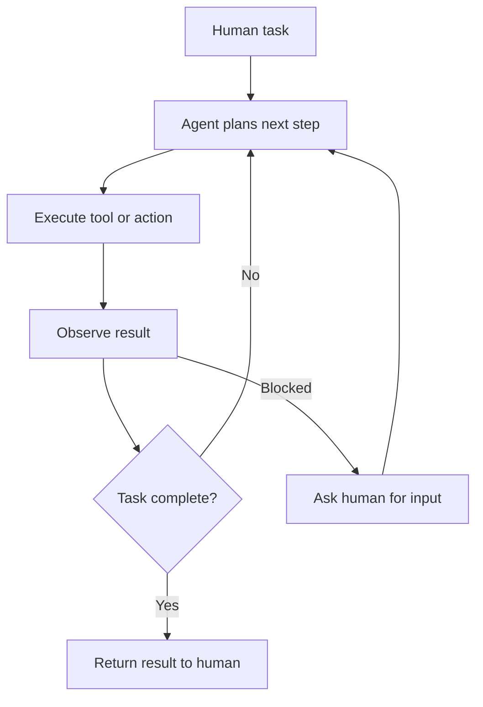

An agentic system gives an LLM control over part of a workflow: calling tools, making decisions, or directing other LLMs. The term "agent" is used loosely, so system design starts with one practical boundary:

- **Workflows** are systems where LLMs and tools are orchestrated through predefined code paths. The developer controls the sequence. The LLM handles individual steps.
- **Agents** are systems where the LLM dynamically directs its own process and tool usage, deciding what to do next based on results so far.

Most production systems described as agents are workflows. That is usually the right choice. A single LLM call with good prompting and retrieval is the simplest starting point. Workflow orchestration belongs next, once a single call falls short. Autonomous agents earn their extra complexity only when the task is genuinely open-ended and unpredictable.

An agent joins the four steering disciplines of the [[AI & ML/LLM/LLM|engineering ladder]]: precise instructions ([[AI & ML/LLM/Prompt Engineering/Prompt Engineering|Prompt Engineering]]), a curated window ([[AI & ML/LLM/Context Engineering/Context Engineering|Context Engineering]]), a capability surface ([[AI & ML/LLM/Harness Engineering/Harness Engineering|Harness Engineering]] — [[Tool Design]] and [[Model Context Protocol|MCP]]), and a controlled runtime ([[AI & ML/LLM/Loop Engineering/Loop Engineering|Loop Engineering]] — the [[Agent Loop]] and [[Multi-Agentic Systems|multi-agent topologies]]). The design question is how much control to place in code and how much to give the model. Measuring the result is [[AI & ML/LLM/Agents/Evaluation/Evaluation|Agent Evaluation]].

<nav style="--card-accent: 16, 185, 129;" class="folder-structure-map" aria-label="Agents section map">
<article class="db-card folder-map-node">

<svg xmlns="http://www.w3.org/2000/svg" stroke-linejoin="round" stroke-linecap="round" stroke-width="2" stroke="currentColor" fill="none" viewBox="0 0 24 24"><path d="M20 20a2 2 0 0 0 2-2V8a2 2 0 0 0-2-2h-7.9a2 2 0 0 1-1.69-.9L9.6 3.9A2 2 0 0 0 7.93 3H4a2 2 0 0 0-2 2v13a2 2 0 0 0 2 2Z"/></svg>Evaluation3 notes

Measures outcome and process separately over a trajectory, since a task can fail by many paths.

<a class="internal-link" href="Home/AI &amp; ML/LLM/Agents/Evaluation/Evaluation.md" data-tooltip-position="top" aria-label="Evaluation">Evaluation</a></article><article class="db-card folder-map-node">

<svg xmlns="http://www.w3.org/2000/svg" stroke-linejoin="round" stroke-linecap="round" stroke-width="2" stroke="currentColor" fill="none" viewBox="0 0 24 24"><path d="M14.5 2H6a2 2 0 0 0-2 2v16a2 2 0 0 0 2 2h12a2 2 0 0 0 2-2V7.5L14.5 2z"/><polyline points="14 2 14 8 20 8"/><line y2="13" y1="13" x2="8" x1="16"/><line y2="17" y1="17" x2="8" x1="16"/><line y2="9" y1="9" x2="8" x1="10"/></svg>Workflow Patterns

Five orchestration patterns — chaining, routing, parallelization, orchestrator-workers, evaluator-optimizer — from fixed pipelines to dynamic delegation.

<a class="internal-link" href="Home/AI &amp; ML/LLM/Agents/Workflow Patterns.md" data-tooltip-position="top" aria-label="Workflow Patterns">Workflow Patterns</a></article>
</nav>

# The Augmented LLM

Every agentic system starts with an LLM enhanced with retrieval, [[Tool Design|tools]], and memory. The model decides what to say or which tool to request. The surrounding harness builds the context, validates and runs tool calls, enforces operational limits, and carries selected state into later calls. [[Agent Loop]] follows that boundary across repeated decisions. This single-agent unit should work well before orchestration is added. Model choice, prompts, and clear tool contracts usually matter more than another control layer.

[[Model Context Protocol|Model Context Protocol (MCP)]] standardizes how an augmented LLM connects to external tools and data sources.

# Workflow Patterns

When one augmented LLM is not enough and full autonomy is excessive, five workflow patterns cover the middle ground: **prompt chaining**, **routing**, **parallelization**, **orchestrator-workers**, and **evaluator-optimizer**. The first pattern that fits is usually enough. Orchestrator-workers decides subtasks at runtime, making it a useful bridge into [[Multi-Agentic Systems]] for complex coding or research.

[[AI & ML/LLM/Agents/Workflow Patterns|Workflow Patterns]] describes each pattern, its control flow, and the conditions that make it fit.

# Autonomous Agents

Autonomy fits tasks whose steps cannot be predicted and whose control flow cannot be expressed as a fixed workflow. The model uses tools in a loop: observe the latest result, choose an action, execute it, and repeat.

That flexibility costs more model calls and introduces compounding error. A small mistake can become the premise for every later step. Three design principles contain the risk:

1. **Simplicity** — keep the control loop small. Extra branches make failures harder to isolate.
2. **Transparency** — record decisions, tool calls, results, and validation outcomes. A useful trace shows where the run diverged without depending on hidden model reasoning.
3. **Tool quality** — treat tool descriptions, parameters, errors, and outputs as an API contract. Ambiguous tools produce ambiguous actions.

Agents work best when progress is observable. Tests constrain coding tasks, resolution criteria constrain support work, and cited evidence constrains research. Without a checkable success signal, the loop has no reliable way to distinguish progress from drift. Measuring task success, trajectory quality, tool-call correctness, and reliability across stochastic runs is [[AI & ML/LLM/Agents/Evaluation/Evaluation|Agent Evaluation]].

For patterns on coordinating multiple agents, see [[Multi-Agentic Systems]].

# Memory Systems

Agent memory is durable state with explicit rules for storage and reuse. It is more than a transcript replayed on every turn or a vector index. Raw messages, tool calls, and results remain trace evidence. A promotion step chooses which observations become durable records, adds scope and provenance, and rejects unverified or duplicate entries. Later calls rebuild a bounded context from applicable rules, stable preferences, relevant memories, and recent state.

A useful design separates five kinds of record. This is an architectural choice, not a universal standard. The separation makes one problem visible: each kind of memory needs a different read path.

| Memory | Represents | Read path |
| --- | --- | --- |
| Policy | Authoritative constraints and procedures | Exact, exhaustive lookup |
| Preference | Stable user or tenant parameters | Exact, exhaustive lookup |
| Fact | Durable assertions with provenance | Scoped lexical, semantic, or hybrid retrieval |
| Episode | A completed task or reusable experience | Scoped retrieval over a compact summary |
| Trace | Raw execution and conversation events | Replay, audit, and extraction source |

Durable records need rules for status, supersession, retention, and deletion. When a record changes, derived indexes and caches must be invalidated. Embeddings are a rebuildable search projection over canonical content, not the only copy of a fact. Authorization scope must be checked before ranking. Relevance metadata cannot enforce access.

Memory systems usually repeat three operations: `record → recall → consolidate`. Consolidation turns raw observations into smaller durable records. Scheduled summaries are another form of derived state. Neither changes model weights or makes answers more accurate by itself. Promoted facts still need provenance, privacy controls, and evaluation.

# Questions

> [!QUESTION]- When does a workflow fit better than an autonomous agent?
> A workflow fits predictable steps with explicit inputs and outputs. Its fixed control flow is cheaper to run and easier to debug. Autonomy is justified when the steps are not known in advance and the system has a checkable success signal that can catch drift.

> [!QUESTION]- How does an autonomous agent accumulate error, and what bounds it?
> Each step consumes state produced by earlier steps, so one bad assumption can shape the rest of the run. Iteration caps bound cost, validation gates reject invalid progress, and an escalation path stops the loop when recovery needs outside input. Decision and tool traces make the original divergence visible.

> [!QUESTION]- What makes a task a good fit for an autonomous agent?
> The control flow must be genuinely open-ended, and progress must still be checkable. Tests, resolution criteria, or source-backed claims give the loop feedback. Vague or delayed outcomes do not. The agent can keep moving while getting further from the goal.

# References

- [Building Effective Agents (Anthropic Engineering)](https://www.anthropic.com/engineering/building-effective-agents)
- [Microsoft Agent Framework — Overview (Microsoft Learn)](https://learn.microsoft.com/en-us/agent-framework/overview/)
