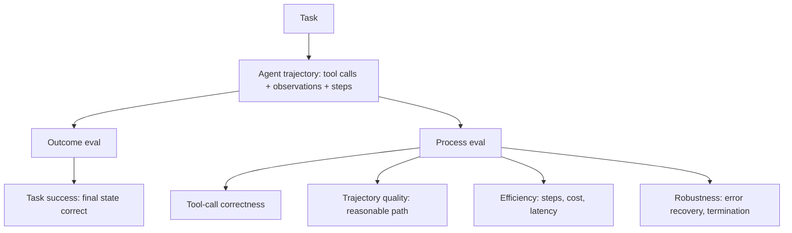

# Intro

Evaluating an [[AI & ML/LLM/Agents/Agents|agent]] is harder than evaluating a single LLM call because the unit under test is a _trajectory_, not one response: the agent chooses tools, reads results, and decides the next step in a loop, so the same task can succeed by many different paths and fail in the middle of a plausible-looking one. A single output score cannot tell you whether the agent solved the task, took a wasteful route to get there, or got lucky after three wrong tool calls. Agent evaluation therefore measures two things separately — the **outcome** (did the task get done) and the **process** (was the path correct and efficient).

This folder holds only what is specific to agents. The general machinery — [[LLM-as-a-Judge]] (here used to grade a whole trajectory), [[Deterministic Checks]] (here applied to each tool call's schema and arguments), [[Building an Evaluation Set|building the task set]], and the [[Online Evaluation and AB Tests|online/A-B loop]] — is shared with every other LLM system and lives under [[AI & ML/LLM/Evaluation/Evaluation|LLM Evaluation]].

<nav style="--card-accent: 16, 185, 129;" class="folder-structure-map" aria-label="Evaluation section map"><div class="folder-map-children"><article class="db-card folder-map-node"><div class="db-card-body"><div class="folder-map-node-heading"><span class="folder-map-node-title-group"><span class="db-card-icon" aria-hidden="true"><svg xmlns="http://www.w3.org/2000/svg" stroke-linejoin="round" stroke-linecap="round" stroke-width="2" stroke="currentColor" fill="none" viewBox="0 0 24 24"><path d="M14.5 2H6a2 2 0 0 0-2 2v16a2 2 0 0 0 2 2h12a2 2 0 0 0 2-2V7.5L14.5 2z"/><polyline points="14 2 14 8 20 8"/><line y2="13" y1="13" x2="8" x1="16"/><line y2="17" y1="17" x2="8" x1="16"/><line y2="9" y1="9" x2="8" x1="10"/></svg></span><span class="db-card-title" title="Agent Benchmarks">Agent Benchmarks</span></span></div><p class="db-card-summary">Public task suites scoring multi-step tool use; useful to shortlist models, not to decide.</p></div><span class="db-card-hit"><a class="internal-link" href="Home/AI &amp; ML/LLM/Agents/Evaluation/Agent Benchmarks.md" data-tooltip-position="top" aria-label="Agent Benchmarks">Agent Benchmarks</a></span></article><article class="db-card folder-map-node"><div class="db-card-body"><div class="folder-map-node-heading"><span class="folder-map-node-title-group"><span class="db-card-icon" aria-hidden="true"><svg xmlns="http://www.w3.org/2000/svg" stroke-linejoin="round" stroke-linecap="round" stroke-width="2" stroke="currentColor" fill="none" viewBox="0 0 24 24"><path d="M14.5 2H6a2 2 0 0 0-2 2v16a2 2 0 0 0 2 2h12a2 2 0 0 0 2-2V7.5L14.5 2z"/><polyline points="14 2 14 8 20 8"/><line y2="13" y1="13" x2="8" x1="16"/><line y2="17" y1="17" x2="8" x1="16"/><line y2="9" y1="9" x2="8" x1="10"/></svg></span><span class="db-card-title" title="Tool-Call Evaluation">Tool-Call Evaluation</span></span></div><p class="db-card-summary">Scoring each agent tool call on four axes: right tool, correct arguments, valid call, and necessity.</p></div><span class="db-card-hit"><a class="internal-link" href="Home/AI &amp; ML/LLM/Agents/Evaluation/Tool-Call Evaluation.md" data-tooltip-position="top" aria-label="Tool-Call Evaluation">Tool-Call Evaluation</a></span></article><article class="db-card folder-map-node"><div class="db-card-body"><div class="folder-map-node-heading"><span class="folder-map-node-title-group"><span class="db-card-icon" aria-hidden="true"><svg xmlns="http://www.w3.org/2000/svg" stroke-linejoin="round" stroke-linecap="round" stroke-width="2" stroke="currentColor" fill="none" viewBox="0 0 24 24"><path d="M14.5 2H6a2 2 0 0 0-2 2v16a2 2 0 0 0 2 2h12a2 2 0 0 0 2-2V7.5L14.5 2z"/><polyline points="14 2 14 8 20 8"/><line y2="13" y1="13" x2="8" x1="16"/><line y2="17" y1="17" x2="8" x1="16"/><line y2="9" y1="9" x2="8" x1="10"/></svg></span><span class="db-card-title" title="Trajectory Evaluation">Trajectory Evaluation</span></span></div><p class="db-card-summary">Scoring the whole path an agent took via reference-trajectory match or an LLM judge over the trace.</p></div><span class="db-card-hit"><a class="internal-link" href="Home/AI &amp; ML/LLM/Agents/Evaluation/Trajectory Evaluation.md" data-tooltip-position="top" aria-label="Trajectory Evaluation">Trajectory Evaluation</a></span></article></div><style>
.db-card {
  position: relative;
  box-sizing: border-box;
  border: 1px solid var(--background-modifier-border, var(--lightgray, #d8dee9));
  border-radius: var(--radius-m, 0.55rem);
  background-color: var(--background-primary, var(--light, #ffffff));
  box-shadow: 0 0 0 rgba(0, 0, 0, 0);
  transition: border-color 150ms ease, background-color 150ms ease, box-shadow 150ms ease, transform 150ms ease;
}
.db-card::before {
  content: "";
  position: absolute;
  inset: 0;
  border-radius: inherit;
  pointer-events: none;
  background: radial-gradient(
    ellipse 150% 175% at -22% -38%,
    rgba(var(--card-accent, 125, 125, 125), 0.09) 0%,
    rgba(var(--card-accent, 125, 125, 125), 0.04) 38%,
    rgba(var(--card-accent, 125, 125, 125), 0.014) 66%,
    transparent 90%
  );
  opacity: 0.78;
  transition: opacity 150ms ease;
}
.db-card:hover,
.db-card:focus-within {
  border-color: rgba(var(--card-accent, 125, 125, 125), 0.55);
  background-color: color-mix(in srgb, rgb(var(--card-accent, 125, 125, 125)) 2.5%, var(--background-primary, var(--light, #ffffff)));
  box-shadow: 0 0.45rem 1.1rem rgba(0, 0, 0, 0.08);
  transform: translateY(-0.125rem);
}
.db-card:hover::before,
.db-card:focus-within::before { opacity: 1; }
.db-card-body {
  position: relative;
  z-index: 0;
  box-sizing: border-box;
  display: flex;
  flex-direction: column;
  padding: var(--db-card-pad, 0.85rem 0.9rem);
}
.db-card-icon {
  display: flex;
  width: 1.1rem;
  height: 1.1rem;
  flex: 0 0 auto;
  color: rgb(var(--card-accent, 125, 125, 125));
}
.db-card-icon svg { display: block; width: 100%; height: 100%; }
.db-card-title {
  display: block;
  margin: 0;
  color: var(--text-normal, var(--dark, #1f2937));
  font-size: 1rem;
  font-weight: 700;
  line-height: 1.25;
}
/* Element-qualified (p.db-card-summary) on purpose: it ties the specificity of
   Obsidian reading view's ".markdown-rendered p" and, being injected later in
   the body, wins. A bare ".db-card-summary" loses to it, so Obsidian keeps its
   default paragraph spacing and the description gets large gaps above/below.
   Quartz doesn't add those margins, which is why the gap only showed there. */
p.db-card-summary {
  margin: 0.45rem 0 0;
  color: var(--text-muted, var(--darkgray, #5f6b7a));
  font-size: 0.875rem;
  line-height: 1.45;
}
.db-card-hit { position: absolute; inset: 0; z-index: 1; }
.db-card-hit a {
  position: absolute;
  inset: 0;
  min-width: 2.75rem;
  min-height: 2.75rem;
  border-radius: var(--radius-m, 0.55rem);
  background: transparent !important;
  font-size: 0;
}
.db-card-hit a:focus-visible {
  outline: 2px solid rgb(var(--card-accent, 125, 125, 125));
  outline-offset: -0.3rem;
}
@media (prefers-reduced-motion: reduce) {
  .db-card { transition: none; }
  .db-card::before { transition: none; }
  .db-card:hover,
  .db-card:focus-within { transform: none; }
}

.folder-structure-map {
\--card-accent: 16, 185, 129;
\--map-gap: 0.75rem;
width: 100%;
box-sizing: border-box;
margin: 0.5rem 0 0.75rem;
container-name: folder-map;
container-type: inline-size;
}
.folder-map-children {
/\* Flex (not grid) so each card sizes to its own title — a long title widens
its card and pushes to another row instead of being truncated, and rows
grow to fill the width with no empty tracks when there are few cards. _/
display: flex;
flex-wrap: wrap;
gap: var(--map-gap);
}
.folder-map-node {
/_ No overflow:hidden on a flex item whose min-width:auto collapses to 0: that
would let the card shrink below its title + note-count and clip them.
Without it the card's min size is its content, so long titles widen the card
(and wrap to another row) instead of being cut off. The shared ::before
accent uses border-radius:inherit to stay inside the rounded corners. \*/
flex: 1 1 12rem;
min-height: 2.75rem;
\--db-card-pad: 0.5rem 0.75rem;
}
.folder-map-node .db-card-body {
min-height: 2.75rem;
justify-content: center;
}
.folder-map-node-heading {
display: flex;
align-items: center;
justify-content: space-between;
gap: 0.75rem;
}
.folder-map-node-title-group {
display: flex;
align-items: center;
gap: 0.5rem;
}
.folder-map-node .db-card-title {
white-space: nowrap;
}
.folder-map-node-count {
display: block;
flex: 0 0 auto;
color: var(--text-muted, var(--darkgray, #5f6b7a));
font-size: 0.875rem;
white-space: nowrap;
}
.folder-map-node .db-card-summary {
display: none;
}
.folder-map-empty {
margin: 1rem 0 0;
color: var(--text-muted, var(--darkgray, #5f6b7a));
font-size: 0.875rem;
}
@container folder-map (min-width: 40rem) {
.folder-map-node {
min-height: 6rem;
\--db-card-pad: 0.85rem 0.9rem;
}
.folder-map-node .db-card-body {
min-height: 6rem;
justify-content: flex-start;
}
.folder-map-node .db-card-summary { display: block; }
}
@container folder-map (min-width: 64rem) {
.folder-map-node,
.folder-map-node .db-card-body { min-height: 6.75rem; }
} </style></nav>

## What to measure



- **Task success (outcome).** Did the world end up in the correct state — the refund issued, the file written, the ticket resolved? This is the metric that matters to the user, and it is best checked against a verifiable end state rather than a judge's opinion: assert the database row, run the produced code against tests, diff the final artifact. Outcome-only scoring is necessary but not sufficient — it hides _how_ the result was reached.
- **Tool-call correctness (process).** For each step: was the right tool selected, were the arguments valid and well-formed, and was the call necessary? Schema validity and allowlisted-action checks are pure [[Deterministic Checks]] — microseconds, zero false positives. "Right tool, wrong tool" and "necessary, redundant" usually need a reference trajectory or an LLM judge. The full decomposition — selection, arguments, validity, necessity — and its metrics are in [[Tool-Call Evaluation]].
- **Trajectory quality (process).** Did the agent take a reasonable path, or did it wander, repeat itself, or recover from a dead end by luck? Score the whole trace with an LLM-as-judge against a rubric, or compare against a reference trajectory when one exists. This is where agents differ most from single-shot eval — the reference-match modes and judge rubrics are in [[Trajectory Evaluation]].
- **Efficiency.** Steps-to-completion, total token cost, and wall-clock latency per task. An agent that solves the task in 14 tool calls when 4 suffice is a regression even if task success is unchanged — it costs more and compounds error risk.
- **Robustness and termination.** Does the agent recover from a tool error, and does it _stop_? Non-termination (looping until the step cap) and oscillation between two actions are agent-specific failure modes that a one-shot eval never surfaces. Measure loop rate and cap-hit rate as first-class metrics.

A subtle but critical point for agents: **measure reliability, not just average success.** Because trajectories are stochastic, an agent that passes a task 6 times out of 10 is very different from one that passes 10/10, even though a single run looks identical. Run each task k times and report the fraction of tasks solved on _all_ k attempts (a pass^k-style reliability metric), not just mean pass rate — production users feel the variance.

To calibrate against the field — and to understand why public scores rarely predict your own results — [[Agent Benchmarks]] covers the major public suites (SWE-bench, tau-bench, GAIA, WebArena) and how to read a leaderboard without being misled.

## Example

A per-task scorecard for a customer-support agent (one task, run k=5 times):

```text
Task: "Refund the damaged item on order #4815 and email the customer"

Outcome (verifiable end state):
- refund_issued(order=4815, amount=full)   -> assert DB row
- email_sent(to=customer, topic=refund)    -> assert outbox

Process (per trajectory):
- Tool-call validity: all calls schema-valid, no disallowed actions  (deterministic)
- Tool selection: used lookup_order before issue_refund               (judge / reference)
- Efficiency: 4 steps, $0.011, 3.2s   (budget: <=6 steps, <$0.02, <5s)
- Termination: stopped after success, no loop

Reliability: solved on 5/5 runs  (pass^5 = 1.0)
```

## Tradeoffs

| Approach | What it catches | Cost | When to rely on it |
| --- | --- | --- | --- |
| Outcome-only (verifiable end state) | Whether the task actually got done | Low — a state assertion, no judge | Always; the ground-truth signal, but blind to path quality |
| Reference-trajectory match | Deviation from a known-good path | High — building reference traces by hand | Narrow, well-defined tasks where one correct path dominates |
| LLM-as-judge over the trace | Path reasonableness, tool-choice quality | Medium — a judge call per trajectory | Open-ended tasks with many valid paths; calibrate against human labels |
| Efficiency / cost counters | Wasteful or looping behavior | Lowest — instrumentation only | Always, as guardrail metrics paired with task success |

Decision rule: gate releases on **verifiable task success plus efficiency guardrails** — they are cheap and objective. Add LLM-judge trajectory scoring for open-ended tasks where many paths are valid and outcome alone cannot distinguish a clean solve from a lucky one. Reserve hand-built reference trajectories for the few high-stakes tasks where one correct path genuinely dominates; they are too expensive to maintain at breadth.

## Questions

> [!QUESTION]- Why is outcome-only scoring insufficient for evaluating an agent, and what do you add?
>
> - A correct final state can be reached by a wasteful or wrong path — three failed tool calls before a lucky success scores identically to a clean solve
> - Outcome-only hides cost, latency, and compounding error risk, so a more expensive or fragile agent looks equal to a cheaper reliable one
> - Add process metrics: tool-call validity (deterministic), tool-selection and trajectory quality (judge or reference), and efficiency counters (steps, cost, latency)
> - Add reliability: run each task k times and report pass^k, since stochastic trajectories make a single run an unreliable estimate
> - Process and reliability scoring multiply eval cost (k runs, a judge call per trace), so spend it where path quality and variance actually affect users and keep cheap outcome+efficiency gates everywhere else

> [!QUESTION]- How do you detect and measure agent non-termination and looping?
>
> - Non-termination shows up as runs that hit the step cap without reaching a terminal state; track cap-hit rate as a first-class metric
> - Oscillation shows up as repeated identical or alternating tool calls; detect by hashing (tool, args) per step and flagging repeats within a trajectory
> - Both inflate cost and latency long before they change task success, so latency/step-count distributions catch them earlier than outcome metrics
> - Mitigation: enforce step and cost caps, add progress checks, and make the agent's plan explicit so a judge can see where it stalled
> - Tight caps cut runaway cost but can truncate genuinely hard tasks — set caps from the step-count distribution of known-good runs, not a round number

## References

- [tau-bench -- a benchmark for tool-agent-user interaction with pass^k reliability (Yao et al., Sierra, 2024)](https://arxiv.org/abs/2406.12045)
- [Building Effective Agents -- measurement and the simplest-pattern principle (Anthropic Engineering)](https://www.anthropic.com/engineering/building-effective-agents)
- [Trajectory evaluations -- reference-match and LLM-judge scoring of agent trajectories (LangSmith docs)](https://docs.langchain.com/langsmith/trajectory-evals)
