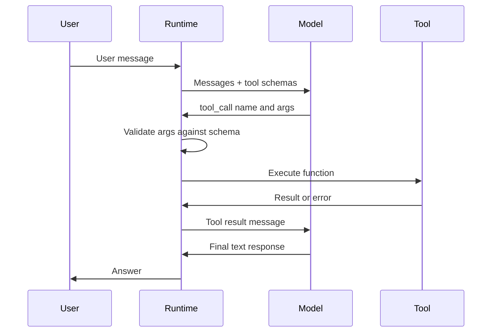

# Intro

Tools are the interface between an LLM's reasoning and the external world — they let the model read data, perform computations, and trigger side effects that text generation alone cannot accomplish. In agentic systems, tools determine what the agent can actually _do_: without well-designed tools, even a strong model with perfect reasoning produces useless output. Anthropic's SWE-bench agent team found that tool quality had more impact on task success than prompt quality — switching from relative to absolute file paths in one tool eliminated an entire class of failures.

The mechanism is function calling: the model receives JSON schemas describing available tools (name, description, parameters), and when it decides a tool is needed, it emits a structured call instead of text. The runtime executes the function, returns the result, and the model continues reasoning. This cycle repeats inside the [[Agent Loop]] until the model produces a final answer.



The model never executes tools directly — it only predicts _which_ tool to call and _what arguments_ to pass. The runtime handles execution, validation, and error propagation. This separation is a security boundary: the model cannot bypass schema validation or invoke tools not in its provided schema.

For how tools are standardized across clients via a shared protocol, see [[Model Context Protocol]]. For how the model selects and calls tools within a reasoning loop, see [[Agent Loop]].

## Tool Design Principles

Tool design is API design for an LLM consumer. The same principles that make an API easy for a junior developer apply — but with tighter constraints, because the model cannot read source code, ask clarifying questions, or debug at runtime.

**Naming.** Use specific, self-documenting function names that signal exactly what the tool does. `search_company_directory` beats `search`. `get_weather_forecast` beats `get_data`. The model picks tools by matching names and descriptions to its current subgoal — ambiguous names cause wrong tool selection.

**Descriptions.** Write tool descriptions for the model, not for humans. Include: what the tool does, when to use it, what it returns, and when _not_ to use it. Anthropic recommends including boundary conditions: "Use this to search for employees by name or department. Do not use this for contractor lookup — use search\_contractor\_database instead."

**Parameters.** Keep schemas flat and simple. Nested objects degrade argument accuracy. Use enums to constrain values where possible — `{"type": "string", "enum": ["celsius", "fahrenheit"]}` prevents the model from inventing units. Mark required versus optional fields explicitly. Every parameter needs a description that explains both format and purpose.

**Return values.** Return only the fields the model needs for its next reasoning step. Returning a full database row when the model only needs one field wastes context tokens and dilutes attention. Structure returns consistently across tools — if all tools return `{"result": ..., "error": ...}`, the model learns the pattern quickly.

**Error messages as teaching signals.** When a tool call fails, return a structured error that tells the model what went wrong and how to fix it: `{"error": "invalid_date_format", "message": "Expected YYYY-MM-DD, got '12/25/2024'", "hint": "Reformat as 2024-12-25"}`. The model can self-correct on the next [[Agent Loop|loop iteration]] if the error is specific. Silent failures or generic "internal error" messages leave the model stuck.

In the Microsoft Agent Framework (.NET), a well-designed tool looks like this:

```csharp
// Any C# method becomes a tool via AIFunctionFactory.Create — the descriptions
// on the method and each parameter become the schema the model reads.
[Description(
    "Get current weather for a city. Returns temperature, conditions, " +
    "and humidity. Use when the user asks about weather or outdoor plans. " +
    "Do not use for historical weather data.")]
static async Task<WeatherResult> GetCurrentWeather(
    [Description("City name, e.g. 'Seattle' or 'London'")] string city,
    [Description("Temperature unit")] TemperatureUnit unit = TemperatureUnit.Celsius)
{
    // Validate input, call weather API, return compact result
}

enum TemperatureUnit { Celsius, Fahrenheit }

// Register the tool on the agent via ChatOptions.Tools
AIAgent agent = new ChatClientAgent(chatClient, new ChatClientAgentOptions
{
    Name = "WeatherAssistant",
    ChatOptions = new ChatOptions
    {
        Instructions = "You answer weather questions.",
        Tools = [AIFunctionFactory.Create(GetCurrentWeather)],
    },
});
```

The `Description` attributes become the tool schema the model reads to decide whether and how to call this function. Investing time in descriptions pays more dividends than prompt engineering.

## Versatility

A versatile tool handles varied inputs gracefully rather than failing on anything outside the happy path. In agentic systems, the model generates inputs — you cannot predict the exact format or phrasing it will use. Design tools to accept reasonable variations and normalize internally.

Concrete patterns:

- **Flexible input parsing.** A date parameter should accept "2024-12-25", "December 25, 2024", and "tomorrow" — normalize to a canonical format inside the tool, not by expecting the model to get the format right every time.
- **Reasonable defaults.** If a parameter is optional, provide a sensible default rather than requiring the model to always specify it. A search tool with `limit` defaulting to 10 prevents the model from sometimes passing 10, sometimes 100, sometimes nothing.
- **Graceful boundary handling.** If the model asks for page 999 of a 10-page result set, return an empty result with a message ("No results — only 10 pages available"), not an exception.

The principle: the more rigid a tool's interface, the more likely the model misuses it. Each failure costs a loop iteration, tokens, latency, and sometimes a cascading series of wrong decisions. Validation should correct, not just reject.

## Fault Tolerance

Tools in agentic systems run inside a loop where failures compound — one failed tool call can derail an entire multi-step plan. Design tools to degrade gracefully, never silently.

**Structured error returns.** Every tool should have a consistent error contract. The model cannot handle exceptions — it only sees the serialized return value. Return typed errors with actionable context: what failed, why, and what the model should do differently.

**Retry-safe design.** If a tool call might be retried (network timeout, transient failure), the tool must be idempotent — calling it twice with the same arguments should not create duplicate records, send duplicate emails, or charge twice. Use idempotency keys for state-mutating operations.

**Timeout handling.** Long-running tools (API calls, database queries) need timeouts with partial result support. Rather than hanging indefinitely, return what you have: `{"status": "partial", "results": [...], "message": "Query timed out after 5s, returning first 50 results"}`. The model can decide whether to proceed with partial data or retry.

**Input validation before execution.** Validate tool arguments _before_ performing any side effect. A tool that sends an email should validate the address format before making the API call, not after. Return validation errors as structured feedback so the model can fix and retry.

## Caching

Caching reduces latency, cost, and token waste in agent loops. There are two layers to consider:

**Tool result caching.** When the same tool is called with the same arguments within a session, cache the result instead of re-executing. This is especially valuable for read-only tools (database lookups, search queries, API fetches) that the model calls repeatedly. A common production pattern: hash the function name + arguments as a cache key with a short TTL (30s–5min depending on data freshness requirements). In the [[Agent Loop]], this prevents the infinite-loop pitfall where the model calls the same search repeatedly without making progress.

**Prompt caching for tool schemas.** When tool schemas are large (many tools, detailed descriptions), they consume significant input tokens on every request. Anthropic's prompt caching feature caches the system prompt and tool definitions across requests, reducing input token cost by up to 90% and latency by up to 85% for subsequent calls. OpenAI's API also supports automatic prompt caching for tool definitions that remain stable across requests.

**Staleness trade-off.** Cache read-only tools aggressively. Caching state-mutating tools is dangerous — if the model calls `create_ticket` and gets a cached "success" response, no ticket was actually created. Only cache tools whose results are deterministic for the given arguments within the cache TTL.

## Pitfalls

### Over-Parameterized Tools

A tool with 15 parameters gives the model 15 opportunities to hallucinate an argument. Each optional parameter increases the surface area for errors. Prefer multiple focused tools over one Swiss-army-knife tool. A `search_by_name(name)` and `search_by_department(dept)` pair is more reliable than `search(name?, dept?, role?, location?, start_date?, ...)`.

### Poor Descriptions That Mislead the Model

Vague descriptions like "Processes data" or "Handles requests" give the model no basis for deciding when to use the tool. The model selects tools by matching descriptions to its current subgoal — if the description does not clearly state what the tool does, when to use it, and what it returns, the model will either skip it when needed or misuse it.

### Tools with Hidden Side Effects

A tool named `get_user_profile` that also logs an analytics event and updates a "last accessed" timestamp has hidden side effects the model cannot reason about. If the model calls it exploratively during planning, the side effects fire unintentionally. Keep read tools read-only. Separate queries from commands — this is [[CQRS]] applied to tool design.

### Context Degradation from Large Toolsets

Adding more tools does not just cost tokens — it actively degrades accuracy. MCPGauge (Song et al., 2025) tested 6 commercial LLMs with 30 MCP tool suites and measured an average **9.5% accuracy drop** when tools were present, with code generation worst-hit at −17%. Token overhead ranged from 3.25× to 236.5× input tokens. A single GitHub MCP server (26 tools) consumes over 4,600 tokens in schema definitions alone; the full MCP ecosystem (2,797 tools) would consume 248K tokens.

Three mechanisms compound:

- **Attention dilution.** Each schema token competes with task-relevant tokens for finite attention. The "Lost in the Middle" effect (Liu et al., 2023) means schemas in the middle of the prompt receive the least model attention.
- **Conflicting signal injection.** Retrieved tool context actively conflicts with the model's parametric knowledge — the model cannot reliably adjudicate between its training-time knowledge and injected text, breaking reasoning chains.
- **Passive selector overhead.** When all tools are pre-injected, the model scans thousands of schema tokens to find the 1–2 relevant tools, distributing ~1/n attention per tool.

**Mitigations:**

| Technique | How it works | Best for |
|---|---|---|
| **On-demand tool search** | Tools register with deferred loading; a search tool retrieves 3–5 relevant definitions per query (Anthropic's native `tool_search_tool`). 85%+ context reduction. | 50–10,000 tools |
| **RAG over tool descriptions** | Embed tool descriptions in a vector index; retrieve top-k by semantic similarity per query. You control the retrieval pipeline. | 500+ tools, custom retrieval |
| **Middleware filtering** | Rule-based layer injects only relevant tools based on conversation state, user role, or stage. Zero retrieval overhead. | 10–50 tools, deterministic routing |
| **Tool consolidation** | Group related operations under one tool with an `action` enum (e.g., `github_pr` with `create\|review\|merge`). Directly reduces schema count. | Related operations, any scale |
| **Two-stage routing** | Stage 1 classifies query into a tool category; Stage 2 shows only that category's tools. Can use a small classifier or the tool search itself. | Multi-domain, any scale |
| **Code generation** | Replace N tool schemas with a single `execute_code` tool + API docs. The model writes code that calls your APIs. | Open-ended data/code tasks |
| **Structured output routing** | Model returns a structured action JSON; your code dispatches. No tool schemas needed. | Fixed action types |

## Tradeoffs

| Design choice | Option A | Option B | Decision criteria |
|---|---|---|---|
| **Tool granularity** | Few broad tools with many parameters | Many narrow tools with focused purpose | Narrow tools are more reliable per-call (fewer hallucinated args) but increase selection confusion as count grows. Split when use cases need genuinely different descriptions; keep together when they share context. |
| **Input handling** | Strict validation — reject malformed input | Flexible normalization — accept variations, convert internally | Normalization reduces loop failures and retries at the cost of implementation complexity. Prefer normalization for agent-facing tools; strict validation for human-facing APIs. |
| **Caching strategy** | Aggressive — cache all tool results with TTL | Conservative — execute every call fresh | Aggressive caching cuts latency and cost but risks stale data. Cache read-only tools with short TTLs; never cache state-mutating tools. |
| **Return verbosity** | Full result payload | Minimal fields needed for next step | Minimal returns save context tokens and reduce attention dilution. Full returns are only justified when the model needs to branch on fields that are hard to predict upfront. |

## Questions

> [!QUESTION]- Why is tool design often more impactful than prompt engineering in agentic systems?
>
> - In a single LLM call, the prompt is the entire interface — prompt quality is everything
> - In an agentic system, the model interacts with tools across multiple loop iterations — each tool call is a decision point where errors compound
> - Wrong tool selection, malformed arguments, or unhelpful error messages cascade across steps
> - Anthropic's SWE-bench team spent more time improving tool interfaces than prompts, because tool quality directly determined task success rate
> - Tradeoff: tool design effort is amortized across all agent runs; prompt tweaks are fragile and session-specific

> [!QUESTION]- How would you decide between one broad tool and many narrow tools?
>
> - Narrow tools reduce parameter count and ambiguity — fewer hallucinated arguments per call
> - Too many tools degrades selection accuracy — MCPGauge measured 9.5% accuracy drop from irrelevant tool presence alone
> - Split when a tool serves genuinely different use cases needing different descriptions and parameters
> - Keep together when operations share context and the model would naturally chain them
> - As tool count grows and selection confusion appears, apply routing or tool filtering to keep the active set focused
> - Tradeoff: per-call reliability (narrow) versus selection accuracy (fewer options)

> [!QUESTION]- What makes a tool safe for caching in an agent loop versus unsafe?
>
> - Cache-safe: read-only (no side effects), deterministic output for same inputs within TTL, acceptable staleness
> - Examples: database lookups, weather API calls, search queries — all safe with short TTLs
> - Cache-unsafe: mutates state (create/update/delete), result depends on rapidly changing context, caching would mask failures
> - Critical failure mode: caching a write operation returns cached "success" without executing — silent data inconsistency
> - Tradeoff: cache hit rate and latency savings versus freshness and correctness guarantees

## References

- [Tool use overview — Anthropic](https://docs.anthropic.com/en/docs/build-with-claude/tool-use/overview)
- [Tool use best practices — Anthropic](https://docs.anthropic.com/en/docs/build-with-claude/tool-use/best-practices)
- [Function calling guide — OpenAI](https://platform.openai.com/docs/guides/function-calling)
- [Using function tools with an agent — Microsoft Agent Framework (Microsoft Learn)](https://learn.microsoft.com/en-us/agent-framework/agents/tools/function-tools)
- [Building Effective Agents — Anthropic Engineering](https://www.anthropic.com/engineering/building-effective-agents)
- [Prompt caching with tool use — Anthropic](https://docs.anthropic.com/en/docs/build-with-claude/prompt-caching#prompt-caching-with-tool-use)
- [Key Elements of Agent Tools — DeepLearning.AI / CrewAI course](https://learn.deeplearning.ai/courses/multi-ai-agent-systems-with-crewai/lesson/c4j19/key-elements-of-agent-tools)
- [MCPGauge — benchmarking token overhead and accuracy impact of MCP tool schemas (arXiv 2508.12566)](https://arxiv.org/abs/2508.12566)
- [Tool search tool — deferred loading for large toolsets (Anthropic)](https://docs.anthropic.com/en/docs/agents-and-tools/tool-use/tool-search-tool)
- [MCP-Zero: Active Tool Discovery — 98% token reduction via on-demand retrieval (arXiv 2506.01056)](https://arxiv.org/abs/2506.01056)
- [Lost in the Middle — how LLMs use long contexts (Liu et al., Stanford 2023)](https://arxiv.org/abs/2307.03172)
