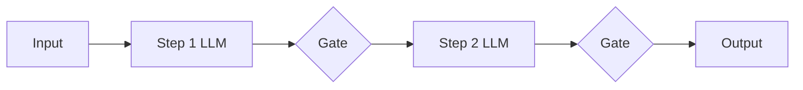
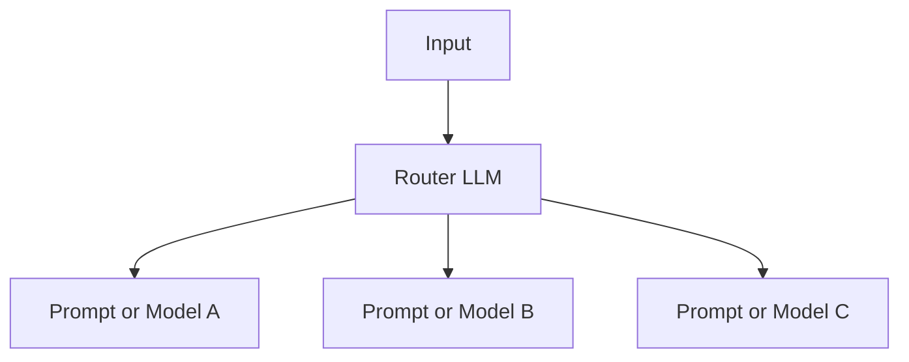
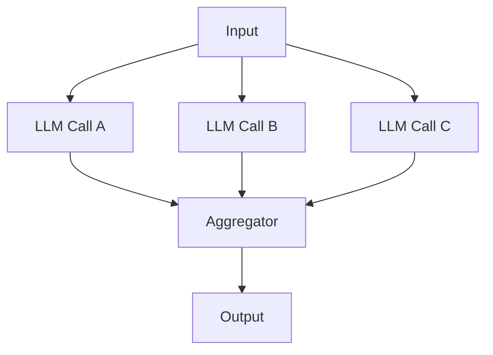
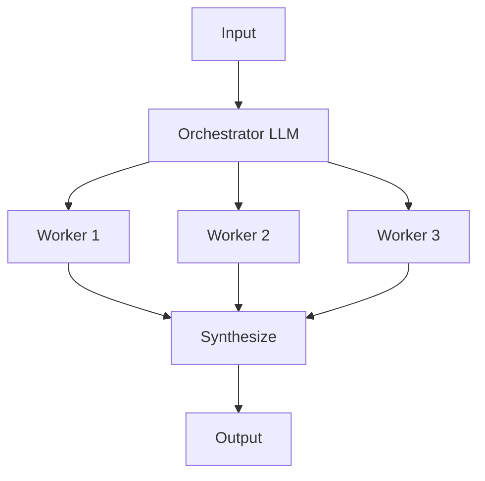
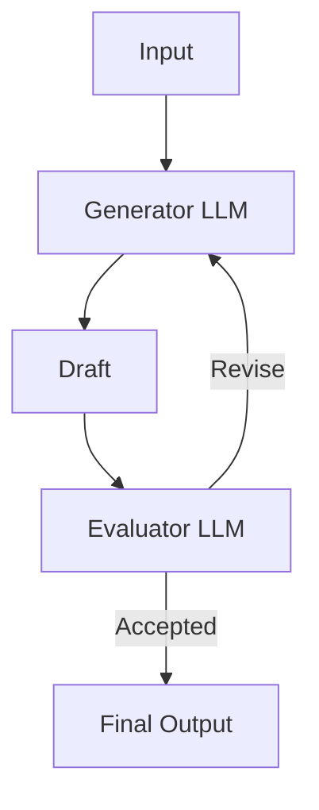

Between a single [[AI & ML/LLM/Agents/Agents|augmented LLM]] and a fully autonomous agent sit five reusable workflow patterns. In a workflow, the developer controls the sequence through predefined code paths and the LLM handles individual steps — so these patterns are the vocabulary for the middle of the [[AI & ML/LLM/Agents/Agents|agentic]] spectrum: more capable than one prompt, more predictable than a loop that decides its own steps.

They form a progression of increasing complexity, from a fixed sequential pipeline to runtime-determined delegation. The guiding rule is the same one that governs agent design overall: **start with the simplest pattern that solves the problem**, and add structure only when a simpler pattern demonstrably falls short.

## Prompt Chaining

Break a task into sequential steps where each LLM call processes the output of the previous one. Add programmatic checks (gates) between steps to verify the process stays on track.

When to use: tasks that decompose cleanly into fixed subtasks. Example: generate marketing copy then translate it, or write an outline, validate it meets criteria, then write the document.

## Routing

Classify the input and direct it to a specialized prompt or model. This lets you optimize each downstream path independently — a change to handle refund requests will not degrade general question answering. The same idea applied to model choice is [[AI & ML/LLM/Model Selection and Routing|model routing]].

When to use: distinct input categories that need different handling. Example: route customer queries to a small fast model for general questions, a larger model for complex technical issues, a constrained workflow for refund requests.

## Parallelization

Run multiple LLMs simultaneously and aggregate results. Two variants: **sectioning** splits independent subtasks across parallel calls; **voting** runs the same task through multiple calls for higher confidence.

When to use: independent subtasks that benefit from speed, or tasks where multiple perspectives improve reliability — running guardrails in parallel with the main response, multi-aspect code review, content moderation with vote thresholds.

## Orchestrator-Workers

A central LLM dynamically decomposes the task, delegates subtasks to worker LLMs, and synthesizes results. The subtasks are not predefined — the orchestrator determines them based on the input. Topologically similar to parallelization, but the key difference is flexibility: workers and their tasks are determined at runtime. Anthropic's Research system uses this pattern — a lead agent spawning 3–5 subagents in parallel — and reports a 90.2% improvement over single-agent on their internal research eval. The dominant production pattern for complex coding and research tasks, and the bridge into [[Multi-Agentic Systems]].

## Evaluator-Optimizer

One LLM generates a response; another evaluates it against criteria and provides feedback. The loop continues until the evaluator approves or an iteration cap is hit. Two indicators of good fit: LLM responses demonstrably improve when given human-like feedback, and the LLM can provide such feedback.

When to use: tasks with clear evaluation criteria — literary translation with nuance, complex search requiring multiple rounds, code review, compliance checking.

# Questions

> [!QUESTION]- How do the five patterns form a progression, and how do you choose among them?
> They climb in complexity and in how much control moves from the developer to the model:
>
> - **Prompt chaining** — fixed sequence, developer owns every step. Use when the task splits into predictable stages.
> - **Routing** — one classification decision fans out to specialized paths. Use for distinct input categories that need different handling.
> - **Parallelization** — independent calls run concurrently and aggregate. Use for speed (sectioning) or reliability (voting).
> - **Orchestrator-workers** — the subtasks themselves are decided at runtime. Use when you can't enumerate the steps in advance.
> - **Evaluator-optimizer** — a generate/critique loop refines toward criteria. Use when there is a clear quality signal and feedback improves the output.
>   The rule is to start at the top and move down only when a simpler pattern demonstrably fails. Every step down buys flexibility at the cost of predictability, latency, and debuggability.

> [!QUESTION]- What separates orchestrator-workers from parallelization when the diagrams look nearly identical?
> Both fan work out to several LLM calls and aggregate the results, so the topology is similar. The difference is _when the subtasks are known_. In parallelization the subtasks are fixed by the developer up front — you decide there are three sections or three votes before any call runs. In orchestrator-workers a central LLM reads the input and _decides at runtime_ how to decompose it, how many workers to spawn, and what each should do. That runtime decision is what makes orchestrator-workers the bridge into [[Multi-Agentic Systems]]: it is the simplest pattern where the model, not the code path, controls the shape of the work.

> [!QUESTION]- Why add gates between steps in prompt chaining instead of a single prompt?
> Chaining trades one hard call for several easier ones, and the gates are where that trade pays off. Each step does a narrower job, so it is more reliable and easier to prompt than asking one call to do everything at once. The programmatic gates between steps — a length check, a schema validation, a "does this outline meet the criteria" test — catch failures early, before a bad intermediate result propagates and compounds downstream. The cost is added latency and more moving parts, so chaining is worth it only when the task genuinely decomposes into fixed subtasks; if it doesn't, a single well-prompted call is simpler and cheaper.

# References

- [Building Effective Agents (Anthropic Engineering)](https://www.anthropic.com/engineering/building-effective-agents) — the source of this workflow-pattern taxonomy and the "simplest pattern that works" principle.
- [Patterns for Basic Agent Workflows — cookbook (Anthropic)](https://platform.claude.com/cookbook/patterns-agents-basic-workflows) — runnable implementations of chaining, routing, and parallelization.
- [Multi-Agent Research System — Engineering (Anthropic)](https://www.anthropic.com/engineering/multi-agent-research-system) — production orchestrator-workers system, including the 90.2% single-agent comparison.
