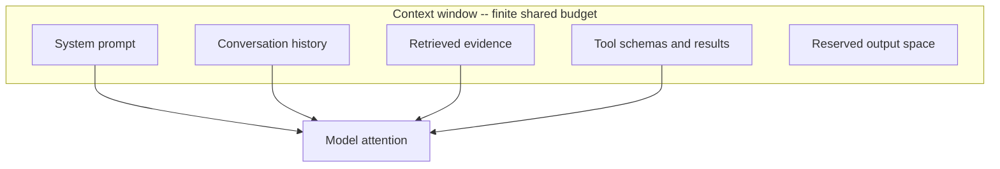

Context engineering is the practice of deliberately deciding what goes into the model's context window — instructions, examples, retrieved evidence, conversation history, tool definitions, and tool results — and in what order, to maximize useful signal within a finite, attention-limited budget. It is the discipline [[AI & ML/LLM/Prompt Engineering/Prompt Engineering|Prompting]] grows into once a system involves retrieval, tools, and memory: the prompt is no longer a single authored string but an assembled payload, and assembling it well is what separates a reliable agent from a flaky one. On the [[AI & ML/LLM/LLM|engineering ladder]] it is the second rung: prompt engineering shapes the single instruction, context engineering decides what the model _sees_, [[Harness Engineering]] decides what it _can do_, and [[Loop Engineering]] decides how it behaves over time.

The core constraint is that the context window is finite and attention across it is uneven. More context is not better. Two findings drive the whole discipline: models attend most to the beginning and end of the context and least to the middle ("lost in the middle", Liu et al. 2023), and answer quality degrades as the input grows even when the extra tokens are relevant — the model's attention dilutes across the material (often called context rot). The engineering goal is therefore the smallest, highest-signal, best-ordered context that answers the task.

The largest mechanism for filling the window with evidence — retrieval — lives in this folder as [[AI & ML/LLM/Context Engineering/RAG/RAG|RAG]]: the pipeline that selects, ranks, and bounds what enters the context from a corpus.

<nav style="--card-accent: 16, 185, 129;" class="folder-structure-map" aria-label="Context Engineering section map">
<article class="db-card folder-map-node">

<svg xmlns="http://www.w3.org/2000/svg" stroke-linejoin="round" stroke-linecap="round" stroke-width="2" stroke="currentColor" fill="none" viewBox="0 0 24 24"><path d="M20 20a2 2 0 0 0 2-2V8a2 2 0 0 0-2-2h-7.9a2 2 0 0 1-1.69-.9L9.6 3.9A2 2 0 0 0 7.93 3H4a2 2 0 0 0-2 2v13a2 2 0 0 0 2 2Z"/></svg>RAG11 notes

Retrieves evidence from your corpus, then generates an answer grounded in it, no retraining needed.

<a class="internal-link" href="Home/AI &amp; ML/LLM/Context Engineering/RAG/RAG.md" data-tooltip-position="top" aria-label="RAG">RAG</a></article>
</nav>

# The Context Budget

Everything competes for the same window: the system prompt, the running conversation history, retrieved documents, tool schemas, tool results, and the space reserved for the output all draw from one token budget. Treat it like a memory budget — account for each component, and when the total approaches the limit, decide what to cut rather than letting the runtime truncate arbitrarily (which usually drops the oldest, and often most important, instructions).

Practical accounting:

- Reserve headroom for the output. A response cannot exceed what is left after the input; budget `max_tokens` (see [[Generation]]) against the remaining space.
- Tool schemas are not free. Each connected tool's name, description, and parameter schema is sent every request; large toolsets consume thousands of tokens before any work happens (see [[Tools]] on context degradation from large toolsets).
- History grows unboundedly. Every turn appends the model's reasoning, tool calls, and results — without management this is the component that silently fills the window in long [[Agent Loop|agent loops]].

# Techniques

**Ordering and positioning.** Place the most important evidence at the start and end of the context to exploit primacy and recency; bury nothing critical in the middle. For ranked retrieval, put the highest-ranked chunks first. This is the context-assembly guidance from [[Generation]] applied as a deliberate lever.

**Selection over stuffing.** Retrieve few high-signal chunks rather than many partial ones — noise dilutes signal. [[Re-ranking|Reranking]] and tight [[Retrieval]] exist precisely to bound what enters the window. Prefer a complete, relevant chunk over fragments of many.

**Compaction.** Summarize or prune older history before it crowds out the task. In long sessions, periodically replace verbose past turns with a compact summary of what matters. Keep tool results minimal — return only the fields the model needs, not entire API payloads (see [[Tools]] on return-value minimalism). Deciding _when_ to compact in a running agent is a [[Loop Engineering]] concern.

**Structure.** Use clear delimiters and sections so the model can tell instructions from data from evidence — this also hardens against [[Guardrails|prompt injection]] by keeping trusted and untrusted content visibly separate. See [[AI & ML/LLM/Prompt Engineering/Prompt Engineering|prompt anatomy]] for the building blocks.

**Offloading.** Move state out of the window into external storage and pass lightweight references back — a scratchpad, a filesystem, or a store the agent reads on demand. Multi-agent systems use this as the filesystem-artifact pattern (see [[Multi-Agentic Systems]]); it keeps the working context compact while preserving access to detail.

**Isolation.** Give separate concerns separate contexts. Splitting work across sub-agents along context boundaries (not problem boundaries) keeps each window focused — the context-centric decomposition principle from [[Multi-Agentic Systems]].

**Caching stable prefixes.** When a long prefix (system prompt, tool definitions, fixed context) repeats across requests, prompt caching makes it cheap and fast to re-send rather than re-engineer it away. See [[AI & ML/LLM/Context Engineering/RAG/Caching|Caching]].

# Pitfalls

## More Context, Worse Answers

**What goes wrong**: a team adds more retrieved documents or a longer system prompt expecting better answers, and quality drops or latency spikes for no visible reason.

**Why it happens**: attention dilutes across a larger window (context rot), and critical evidence lands in the low-attention middle (lost in the middle). Irrelevant tokens actively compete with relevant ones.

**How to avoid it**: optimize for signal density, not volume. Rerank and filter to fewer, higher-quality chunks; order by relevance; measure answer quality as you vary context size rather than assuming more is better.

## Unbounded History Growth

**What goes wrong**: a long conversation or agent run keeps appending turns until the window fills, then the runtime truncates the oldest messages — often the original instructions — and behavior degrades or the request is rejected.

**Why it happens**: tool results and reasoning traces are appended verbatim every iteration with no compaction.

**How to avoid it**: summarize or prune older turns, cap tool-result size, and track cumulative tokens per iteration — terminate or compact before the limit (see [[Agent Loop]] on token explosion).

## Context Poisoning

**What goes wrong**: a hallucinated fact or an injected instruction enters the history once and persists, getting treated as trusted context on every subsequent turn and compounding.

**Why it happens**: history is replayed as if all of it were equally valid; natural-language errors carry no error signal.

**How to avoid it**: validate tool results and model claims before they re-enter context, keep untrusted retrieved/tool content structurally separated from instructions, and enforce critical controls in code rather than relying on the prompt (see [[Guardrails]]).

## Tool-Schema Bloat

**What goes wrong**: connecting many tools "for flexibility" inflates every request's token count and measurably lowers task accuracy as the model sifts dozens of irrelevant schemas.

**Why it happens**: most clients inject all connected tool schemas on every request regardless of relevance.

**How to avoid it**: expose only the tools the current task needs, use on-demand tool search or filtering, and consolidate related operations (see [[Tools]] on large-toolset degradation).

# Tradeoffs

| Lever | What it buys | What it costs | Best when |
| --- | --- | --- | --- |
| Larger context window | Fewer hard truncation limits | Higher cost/latency, attention dilution, lost-in-the-middle | The task genuinely needs broad simultaneous context |
| Retrieval + reranking | High signal density, traceable evidence | Retrieval infra and tuning | Knowledge-heavy tasks over a large corpus |
| History compaction | Bounded window over long sessions | Summarization cost, risk of dropping detail | Long conversations and agent runs |
| Context offloading | Compact working context, full detail on demand | Orchestration complexity, extra reads | Multi-step agents producing large intermediate state |
| Context isolation (sub-agents) | Each window stays focused | Coordination overhead, more tokens overall | Conflicting modes or 20+ tools degrading selection |

**Decision rule**: default to the smallest context that answers the task. Bound what enters with retrieval and reranking, keep the window clean with compaction and minimal tool results, exploit ordering for the evidence that must be there, and reach for offloading or isolation only when a single focused window genuinely cannot hold the work. Validate by measuring quality against context size — if adding context does not measurably help, it is hurting.

# Questions

> [!QUESTION]- Why does adding more context often make answers worse, not better?
>
> - Model attention is uneven: it concentrates on the start and end of the window and underweights the middle ("lost in the middle"), so critical evidence placed there is effectively ignored
> - Overall quality degrades as input grows even when the added tokens are relevant — attention dilutes across more material (context rot)
> - Irrelevant tokens actively compete with relevant ones for finite attention, and larger contexts cost more and add latency
> - The fix is signal density: fewer, higher-quality, well-ordered chunks beat a larger but noisier window — measure quality as you vary context size rather than assuming more helps

> [!QUESTION]- What are the main techniques for keeping a long-running agent's context under control?
>
> - Compaction: summarize or prune older turns before they crowd out the task; cap tool-result size to only the fields needed
> - Offloading: move large intermediate state to a scratchpad or filesystem and pass lightweight references back into the window
> - Isolation: split work across sub-agents along context boundaries so each window stays focused
> - Selection and ordering: retrieve few high-signal chunks and place the most important evidence at the start and end
> - Accounting: track cumulative tokens per iteration and compact or terminate before the window fills, rather than letting the runtime truncate the oldest (often most important) messages

# References

- [Lost in the Middle: How Language Models Use Long Contexts (Liu et al., 2023)](https://arxiv.org/abs/2307.03172) — the U-shaped attention finding that motivates ordering and selection.
- [Effective context engineering for AI agents (Anthropic Engineering)](https://www.anthropic.com/engineering/effective-context-engineering-for-ai-agents) — practitioner guidance on context as a managed, finite resource for agents.
- [Context Rot: How Increasing Input Tokens Impacts LLM Performance (Chroma Research)](https://research.trychroma.com/context-rot) — empirical study showing quality degradation as context length grows.
- [Prompt caching (Anthropic Docs)](https://platform.claude.com/docs/en/build-with-claude/prompt-caching) — making stable context prefixes cheap to re-send.
- [Prompt engineering overview (Anthropic Docs)](https://docs.anthropic.com/en/docs/build-with-claude/prompt-engineering/overview) — the prompt-level building blocks that context engineering assembles.
