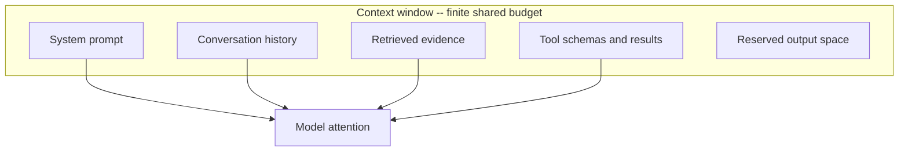

Context engineering decides what the model sees and where it appears in the context window. Instructions compete with examples, retrieved evidence, conversation history, and tool traffic for the same finite budget. Once a system gains retrieval or memory, [[AI & ML/LLM/Prompt Engineering/Prompt Engineering|Prompting]] is only one part of an assembled payload.

On the [[AI & ML/LLM/LLM|engineering ladder]], context engineering sits between the instruction and the runtime around it. [[AI & ML/LLM/Harness Engineering/Harness Engineering|Harness Engineering]] controls what the model can do. [[AI & ML/LLM/Loop Engineering/Loop Engineering|Loop Engineering]] controls repeated behavior. Context engineering controls the material available for each decision.

The hard constraint is uneven attention inside a limited window. Models tend to use evidence near the beginning and end better than evidence buried in the middle. And answer quality can decline as otherwise relevant input grows, often called context rot. More context is therefore a poor default. The target is the smallest well-ordered context that still contains the evidence needed for the task.

```mermaid
flowchart TD
    subgraph CW[Context window -- finite shared budget]
      SP[System prompt]
      H[Conversation history]
      RC[Retrieved evidence]
      TS[Tool schemas and results]
      O[Reserved output space]
    end
    SP --> M[Model attention]
    H --> M
    RC --> M
    TS --> M
```

Retrieval is the main way external evidence enters the window. [[AI & ML/LLM/Context Engineering/RAG/RAG|RAG]] selects and ranks that evidence, then bounds how much of it reaches generation.

<nav style="--card-accent: 16, 185, 129;" class="folder-structure-map" aria-label="Context Engineering section map">
<article class="db-card folder-map-node">

<svg xmlns="http://www.w3.org/2000/svg" stroke-linejoin="round" stroke-linecap="round" stroke-width="2" stroke="currentColor" fill="none" viewBox="0 0 24 24"><path d="M20 20a2 2 0 0 0 2-2V8a2 2 0 0 0-2-2h-7.9a2 2 0 0 1-1.69-.9L9.6 3.9A2 2 0 0 0 7.93 3H4a2 2 0 0 0-2 2v13a2 2 0 0 0 2 2Z"/></svg>RAG11 notes

Retrieves evidence from a corpus, then generates an answer grounded in it, no retraining needed.

<a class="internal-link" href="Home/AI &amp; ML/LLM/Context Engineering/RAG/RAG.md" data-tooltip-position="top" aria-label="RAG">RAG</a></article>
</nav>

# The Context Budget

The system prompt, conversation history, retrieved documents, tool schemas, tool results, and reserved output space all draw from one token budget. They are accounted for like memory allocations. Deciding what to remove before the total reaches the limit keeps the runtime from truncating an old instruction by accident.

Three costs are easy to miss:

- Output needs headroom. The `max_tokens` budget comes from what remains after the input. [[Generation]] cannot produce tokens that the context limit has already consumed.
- Tool schemas are sent as input. Names, descriptions, and parameter definitions can consume thousands of tokens before the first call. [[Tool Design]] covers the accuracy cost of oversized toolsets.
- History grows every turn. Reasoning, calls, and results quietly fill the window during long [[Agent Loop|agent loops]] unless the runtime compacts them.

# Techniques

**Ordering and positioning.** The strongest instructions and evidence go where the model is most likely to use them, usually near the start or end. Ranked retrieval should place its best chunk first. This is the context-assembly side of [[Generation]].

**Selection over stuffing.** A few complete, relevant chunks usually beat a pile of fragments. [[Retrieval]] keeps the candidate set focused, while [[Re-ranking|Reranking]] spends extra work to choose what actually enters the prompt.

**Compaction.** Old turns are replaced with a short record of decisions, constraints, and pending work before history crowds out the task. Tool results should return only fields used by the next decision. [[Tool Design]] shows how oversized API payloads consume context without improving the next decision. [[AI & ML/LLM/Loop Engineering/Loop Engineering|Loop Engineering]] turns token pressure into an explicit compact-or-stop condition.

**Rebuild instead of replay.** A long-lived agent can keep the raw transcript outside the context window. Each turn is rebuilt from the policies, stable preferences, recalled facts or episodes, and recent activity that matter now. The transcript remains evidence, but it does not automatically return to the prompt. The [[AI & ML/LLM/Agents/Agents#Memory Systems|memory system]] decides what may persist. Context engineering decides what belongs in this call.

**Structure.** Explicit sections separate trusted instructions from untrusted data. That makes the payload easier to interpret and supports [[Guardrails|prompt injection]] defenses. [[AI & ML/LLM/Prompt Engineering/Prompt Engineering|prompt anatomy]] supplies the smaller building blocks.

**Offloading.** Bulky intermediate state is stored outside the window, and the context carries a lightweight reference to it. A scratchpad or file can hold detail that is needed later but not on every turn. [[Multi-Agentic Systems]] uses the same idea for shared artifacts.

**Isolation.** Work is split into separate contexts when two concerns need conflicting instructions or large, unrelated toolsets. The context-centric decomposition in [[Multi-Agentic Systems]] keeps each worker's window focused, though coordination adds cost.

**Caching stable prefixes.** A repeated system prompt or fixed tool definition can stay logically present without paying full processing cost each time. [[AI & ML/LLM/LLM Caching#Prompt Caching|Prompt Caching]] covers prefix layout, provider boundaries, and verification of actual reuse.

# Pitfalls

## More Context, Worse Answers

**What goes wrong:** more retrieved documents or a longer system prompt lowers answer quality and raises latency.

**Why it happens:** useful evidence is diluted across the larger input, and some of it lands in the weakly attended middle. Irrelevant tokens still compete for attention.

**How to avoid it:** filtering and reranking reduce the evidence to a smaller set, and quality is measured as context size changes. Added tokens are worth keeping only while they still improve the result.

## Unbounded History Growth

**What goes wrong:** a long run fills the window, after which the runtime drops old messages or rejects the request. The original instruction is often among the first things lost.

**Why it happens:** each iteration appends reasoning and raw tool output without compaction.

**How to avoid it:** tool-result size is capped and cumulative tokens are tracked per iteration, so the runtime compacts or stops before the limit. [[Agent Loop]] traces how repeated oversized results become token explosion across iterations.

## Context Poisoning

**What goes wrong:** one hallucinated fact or injected instruction enters history and is replayed as trusted context on later turns.

**Why it happens:** the runtime replays history without a trust label, and natural-language errors carry no automatic warning.

**How to avoid it:** claims are validated before storage, untrusted content stays separate from instructions, and controls are enforced in code. [[Guardrails]] should not depend on a poisoned prompt obeying itself.

## Tool-Schema Bloat

**What goes wrong:** attaching many tools inflates every request and makes selection less reliable.

**Why it happens:** many clients send every connected schema on every request, even when the task needs only one.

**How to avoid it:** each request exposes only the tools the current task needs, or tool search loads them on demand. [[Tool Design]] covers the degradation seen with large toolsets.

# Tradeoffs

| Lever | What it buys | What it costs | Best when |
| --- | --- | --- | --- |
| Larger context window | More room before truncation | Longer actual input, not the larger limit itself, raises token cost and, depending on model, task and implementation, can lower answer quality and add latency | The task truly needs broad material at once |
| Retrieval + reranking | Dense and traceable evidence | Retrieval infrastructure and tuning | Knowledge-heavy tasks over a large corpus |
| History compaction | A bounded window over long sessions | Summary cost and possible detail loss | Long conversations and agent runs |
| Context offloading | Small working context with detail on demand | Extra reads and coordination | Multi-step work with bulky intermediate state |
| Context isolation (sub-agents) | A focused window for each concern | Coordination overhead and more total tokens | Conflicting instructions or oversized toolsets |

The smallest context that answers the task is the starting point. Retrieval and reranking control what enters, and compaction frees space before more capacity is added. Offloading or isolation becomes worthwhile only when one focused window cannot hold the work. Once extra context stops improving measured quality, it has become overhead.

# Questions

<!-- qard-id: ddd8a30b-97ea-4f04-8025-704d1c3481ab -->

> [!qard]- Why can adding more context make answers worse instead of better?
> Because a model does not use every part of a long input equally well, so extra material can bury or dilute the evidence that the answer depends on.
>
> - **Position effects:** in the long-context tasks evaluated in _Lost in the Middle_, some models used relevant information near the beginning or end of the input more reliably than the same information placed in the middle. The size of the effect depends on the model and task.
> - **Dilution:** irrelevant or redundant text competes with the useful evidence, so adding it can lower answer quality instead of adding information.
> - **Cost:** extra input tokens also add cost and can add latency, even when they do not improve the answer.
>
> Added context is not always harmful. The aim is complete, relevant material placed deliberately, with answer quality and input cost measured on the actual workload as the context grows.
>
> [Lost in the Middle](https://arxiv.org/abs/2307.03172) · [Latency optimization](https://developers.openai.com/api/docs/guides/latency-optimization)

<!-- qard-id: ed47de12-495f-495b-8cbb-662c952b3224 -->

> [!qard]- How can a long-running agent keep useful context within a finite window?
> By treating the context window as a working set. Each call contains the instructions, evidence and state needed for the next decision. Everything else stays outside the prompt but remains retrievable.
>
> The prompt, conversation history, tool results and space reserved for the response all draw from one finite token budget, so they are managed together:
>
> - **Selection and ordering:** only material relevant to the current step enters the window, and it is placed deliberately rather than replayed in full.
> - **Trimmed tool results:** tool output keeps the fields the next decision uses, and stale results that no longer matter are cleared.
> - **Compaction:** older turns are replaced by a short record of decisions, constraints and open work before history crowds out the task.
> - **Offloading:** bulky state, such as notes, files or full documents, lives outside the prompt and is reloaded by reference when needed.
>
> Compaction trades space for possible detail loss: a summary can drop a subtle fact that later matters. Where exact recovery matters, the source material is kept outside the window instead of being trusted to the summary.
>
> [Effective context engineering for AI agents](https://www.anthropic.com/engineering/effective-context-engineering-for-ai-agents)

# References

- [Lost in the Middle: How Language Models Use Long Contexts (Liu et al., 2023)](https://arxiv.org/abs/2307.03172)
- [Effective context engineering for AI agents (Anthropic Engineering)](https://www.anthropic.com/engineering/effective-context-engineering-for-ai-agents)
- [Context Rot: How Increasing Input Tokens Impacts LLM Performance (Chroma Research)](https://research.trychroma.com/context-rot)
