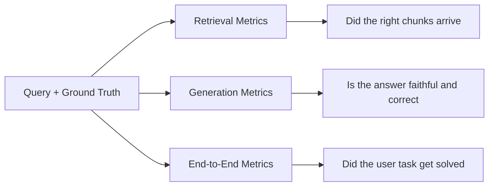

RAG can fail before generation starts. It can also retrieve the right evidence and still produce a bad answer. Evaluation therefore separates retrieval from generation, then checks the finished system against the user's task. One blended quality score cannot show which part needs repair.

Retrieval metrics ask whether relevant chunks reached the model and whether they were ranked well. Generation metrics check that the answer uses those chunks faithfully. End-to-end evaluation looks at the actual outcome. The distinction matters because prompt changes cannot recover a document that retrieval never found, while another embedding model will not fix a generator that ignores clear evidence already in context.

A support bot may retrieve the correct policy and still misread its date constraint. Retrieval passes. Generation fails. Without separate scores, that defect looks like a search problem and sends work toward the wrong component.

<nav style="--card-accent: 16, 185, 129;" class="folder-structure-map" aria-label="Evaluation section map">
<article class="db-card folder-map-node">

<svg xmlns="http://www.w3.org/2000/svg" stroke-linejoin="round" stroke-linecap="round" stroke-width="2" stroke="currentColor" fill="none" viewBox="0 0 24 24"><path d="M14.5 2H6a2 2 0 0 0-2 2v16a2 2 0 0 0 2 2h12a2 2 0 0 0 2-2V7.5L14.5 2z"/><polyline points="14 2 14 8 20 8"/><line y2="13" y1="13" x2="8" x1="16"/><line y2="17" y1="17" x2="8" x1="16"/><line y2="9" y1="9" x2="8" x1="10"/></svg>Component-Level Evaluation

Ablation varies one component at a time to isolate what caused a retrieval-metric change.

<a class="internal-link" href="Home/AI &amp; ML/LLM/Context Engineering/RAG/Evaluation/Component-Level Evaluation.md" data-tooltip-position="top" aria-label="Component-Level Evaluation">Component-Level Evaluation</a></article><article class="db-card folder-map-node">

<svg xmlns="http://www.w3.org/2000/svg" stroke-linejoin="round" stroke-linecap="round" stroke-width="2" stroke="currentColor" fill="none" viewBox="0 0 24 24"><path d="M14.5 2H6a2 2 0 0 0-2 2v16a2 2 0 0 0 2 2h12a2 2 0 0 0 2-2V7.5L14.5 2z"/><polyline points="14 2 14 8 20 8"/><line y2="13" y1="13" x2="8" x1="16"/><line y2="17" y1="17" x2="8" x1="16"/><line y2="9" y1="9" x2="8" x1="10"/></svg>Evaluation Metrics

Retrieval, generation, and end-to-end metrics each answer a different question, making regressions diagnosable.

<a class="internal-link" href="Home/AI &amp; ML/LLM/Context Engineering/RAG/Evaluation/Evaluation Metrics.md" data-tooltip-position="top" aria-label="Evaluation Metrics">Evaluation Metrics</a></article><article class="db-card folder-map-node">

<svg xmlns="http://www.w3.org/2000/svg" stroke-linejoin="round" stroke-linecap="round" stroke-width="2" stroke="currentColor" fill="none" viewBox="0 0 24 24"><path d="M14.5 2H6a2 2 0 0 0-2 2v16a2 2 0 0 0 2 2h12a2 2 0 0 0 2-2V7.5L14.5 2z"/><polyline points="14 2 14 8 20 8"/><line y2="13" y1="13" x2="8" x1="16"/><line y2="17" y1="17" x2="8" x1="16"/><line y2="9" y1="9" x2="8" x1="10"/></svg>Retrieval Evaluation Sets

Pairs queries with their relevant chunks. The hard part is labeling which chunks count.

<a class="internal-link" href="Home/AI &amp; ML/LLM/Context Engineering/RAG/Evaluation/Retrieval Evaluation Sets.md" data-tooltip-position="top" aria-label="Retrieval Evaluation Sets">Retrieval Evaluation Sets</a></article>
</nav>

# Questions

> [!QUESTION]- Why decompose RAG evaluation into separate retrieval, generation, and end-to-end layers?
> The layers fail for different reasons and need different fixes. Retrieval scoring shows whether relevant evidence arrived. Generation scoring checks whether the answer follows that evidence, while the end-to-end score records whether the task was solved. This separates a model that ignores a good context from one that faithfully summarizes irrelevant chunks. A single score makes both failures look the same.

> [!QUESTION]- What belongs in RAG evaluation specifically versus general LLM evaluation?
> RAG adds retrieval relevance, ranking quality, and faithfulness to the evidence placed in context. It also needs labels for queries with several acceptable chunks. Golden sets, deterministic checks, semantic judges, and online experiments remain general LLM evaluation machinery. Reusing that shared layer prevents every RAG pipeline from inventing its own evaluation system.

# References

- [RAGAS metrics reference](https://docs.ragas.io/en/stable/concepts/metrics/available_metrics/)
- [RAG evaluators in Azure AI Foundry](https://learn.microsoft.com/en-us/azure/ai-foundry/concepts/evaluation-evaluators/rag-evaluators)
