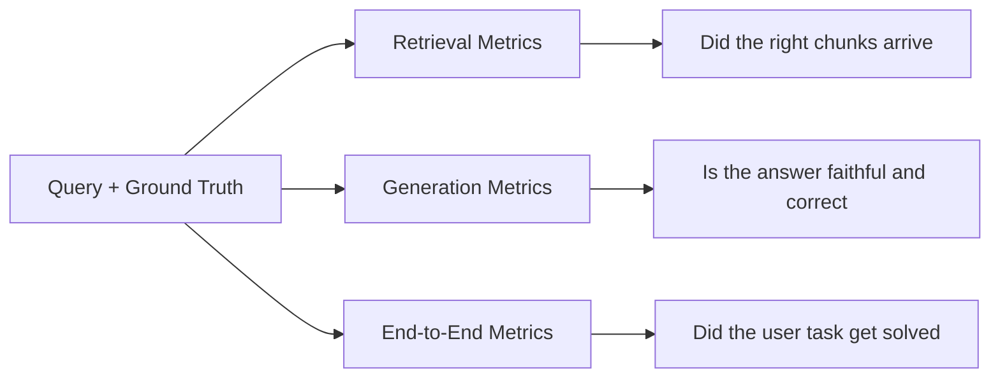

RAG can fail before generation starts. It can also retrieve the right evidence and still produce a bad answer. Evaluation therefore separates retrieval from generation, then checks the finished system against the user's task. One blended quality score cannot show which part needs repair.

Retrieval metrics ask whether relevant chunks reached the model and whether they were ranked well. Generation metrics check that the answer uses those chunks faithfully. End-to-end evaluation looks at the actual outcome. The distinction matters because prompt changes cannot recover a document that retrieval never found, while another embedding model will not fix a generator that ignores clear evidence already in context.

```mermaid
flowchart LR
    Q[Query + Ground Truth] --> RM[Retrieval Metrics]
    Q --> GM[Generation Metrics]
    Q --> EM[End-to-End Metrics]
    RM --> D1[Did the right chunks arrive]
    GM --> D2[Is the answer faithful and correct]
    EM --> D3[Did the user task get solved]
```

A support bot may retrieve the correct policy and still misread its date constraint. Retrieval passes. Generation fails. Without separate scores, that defect looks like a search problem and sends work toward the wrong component.

<nav style="--card-accent: 16, 185, 129;" class="folder-structure-map" aria-label="Evaluation section map">
<article class="db-card folder-map-node">

<svg xmlns="http://www.w3.org/2000/svg" stroke-linejoin="round" stroke-linecap="round" stroke-width="2" stroke="currentColor" fill="none" viewBox="0 0 24 24"><path d="M14.5 2H6a2 2 0 0 0-2 2v16a2 2 0 0 0 2 2h12a2 2 0 0 0 2-2V7.5L14.5 2z"/><polyline points="14 2 14 8 20 8"/><line y2="13" y1="13" x2="8" x1="16"/><line y2="17" y1="17" x2="8" x1="16"/><line y2="9" y1="9" x2="8" x1="10"/></svg>Component-Level Evaluation

Ablation varies one component at a time to isolate what caused a retrieval-metric change.

<a class="internal-link" href="Home/AI &amp; ML/LLM/Context Engineering/RAG/Evaluation/Component-Level Evaluation.md" data-tooltip-position="top" aria-label="Component-Level Evaluation">Component-Level Evaluation</a></article><article class="db-card folder-map-node">

<svg xmlns="http://www.w3.org/2000/svg" stroke-linejoin="round" stroke-linecap="round" stroke-width="2" stroke="currentColor" fill="none" viewBox="0 0 24 24"><path d="M14.5 2H6a2 2 0 0 0-2 2v16a2 2 0 0 0 2 2h12a2 2 0 0 0 2-2V7.5L14.5 2z"/><polyline points="14 2 14 8 20 8"/><line y2="13" y1="13" x2="8" x1="16"/><line y2="17" y1="17" x2="8" x1="16"/><line y2="9" y1="9" x2="8" x1="10"/></svg>Evaluation Metrics

Retrieval, generation, and end-to-end metrics each answer a different question, making regressions diagnosable.

<a class="internal-link" href="Home/AI &amp; ML/LLM/Context Engineering/RAG/Evaluation/Evaluation Metrics.md" data-tooltip-position="top" aria-label="Evaluation Metrics">Evaluation Metrics</a></article><article class="db-card folder-map-node">

<svg xmlns="http://www.w3.org/2000/svg" stroke-linejoin="round" stroke-linecap="round" stroke-width="2" stroke="currentColor" fill="none" viewBox="0 0 24 24"><path d="M14.5 2H6a2 2 0 0 0-2 2v16a2 2 0 0 0 2 2h12a2 2 0 0 0 2-2V7.5L14.5 2z"/><polyline points="14 2 14 8 20 8"/><line y2="13" y1="13" x2="8" x1="16"/><line y2="17" y1="17" x2="8" x1="16"/><line y2="9" y1="9" x2="8" x1="10"/></svg>Retrieval Evaluation Sets

Pairs queries with their relevant chunks. The hard part is labeling which chunks count.

<a class="internal-link" href="Home/AI &amp; ML/LLM/Context Engineering/RAG/Evaluation/Retrieval Evaluation Sets.md" data-tooltip-position="top" aria-label="Retrieval Evaluation Sets">Retrieval Evaluation Sets</a></article>
</nav>

# Questions

<!-- qard-id: 03a585b9-616f-472a-a294-ac7bac300cb4 -->

> [!qard]- What do retrieval, response, and end-to-end evaluations each show about a RAG system?
> Each evaluation answers a different question, so separate results show where a RAG system failed rather than only that it failed.
>
> | Evaluation | Question it answers | A failure points toward | What it cannot show |
> |---|---|---|---|
> | Retrieval | Was relevant evidence found, ranked well and selected for the context? | Indexing, chunking, query handling, search or ranking | Whether the answer then used good evidence correctly |
> | Response | Given the supplied evidence, is the answer grounded in it, relevant to the question and, when a reference exists, correct? | The prompt or the generator's use of the evidence | Whether better evidence existed and was missed |
> | End-to-end | Did the complete system meet the task's outcome criteria? | A user-visible miss somewhere in the pipeline | Which stage caused the miss |
>
> Combined, the results localize a likely cause. A grounded answer built on poor or incomplete context points upstream to retrieval. Good context paired with a wrong answer points to generation.
>
> Example: a support bot retrieves the correct policy but misreads its date constraint. Retrieval passes and the response check fails, so more search tuning cannot fix that answer.
>
> Sources:
>
> - [RAG evaluators (Microsoft Foundry)](https://learn.microsoft.com/en-us/azure/foundry/concepts/evaluation-evaluators/rag-evaluators?view=foundry)

<!-- qard-id: c73e80bf-ab77-4bfc-b246-be9e3d11ce10 -->

> [!qard]- Which evaluation concerns are specific to RAG, and which can reuse general LLM evaluation methods?
> RAG adds retrieval to evaluation: whether relevant evidence was found, ranked well and supplied in sufficient quantity. Retrieval metrics that score against labeled relevance judgments need relevance labels that other LLM tasks do not. Reference-free retrieval evaluation does not use such labels. Answer-quality checks and the evaluation methods themselves are largely reusable.
>
> | Aspect | Specific to RAG | Reusable from general LLM evaluation |
> |---|---|---|
> | What is measured | Retrieval relevance, ranking quality and whether the context covers the evidence an answer needs | Correctness, relevance to the question, safety and format. Groundedness also applies to any answer constrained by supplied text, such as a summary of a given document. |
> | Ground truth | For label-based retrieval metrics, relevance labels per query, which must allow several acceptable chunks or require a set of complementary ones | Reference answers and rubrics, built as for any task |
> | Methods | Ranked-retrieval metrics, such as Recall@k or nDCG, over those labels | Golden datasets, deterministic checks, LLM judges, human review and online evaluation of production traces |
>
> Any evaluator must match the claim being measured. Its limits need checking, as do any labels it uses. A judge reused from another task is not automatically valid for a new one.
>
> Sources:
>
> - [Built-in evaluators (Microsoft Foundry)](https://learn.microsoft.com/en-us/azure/foundry/concepts/built-in-evaluators)
> - [RAGAS: Automated Evaluation of Retrieval Augmented Generation (EACL 2024)](https://aclanthology.org/2024.eacl-demo.16.pdf)
> - [Evaluation types (LangSmith)](https://docs.langchain.com/langsmith/evaluation-types)

# References

- [RAGAS metrics reference](https://docs.ragas.io/en/stable/concepts/metrics/available_metrics/)
- [RAG evaluators in Azure AI Foundry](https://learn.microsoft.com/en-us/azure/ai-foundry/concepts/evaluation-evaluators/rag-evaluators)
