RAG patterns are repairs for observed retrieval failures. The order below is an adoption guide rather than a popularity ranking. The first working pipeline remains in place until [[AI & ML/LLM/Context Engineering/RAG/Evaluation/Evaluation|evaluation]] identifies a failure that the cheaper design cannot fix. Each pattern buys something and creates a new way to fail. The surrounding pipeline is described in [[AI & ML/LLM/Context Engineering/RAG/RAG|RAG]].

# 1. Baseline Single-Pass RAG

The baseline embeds one query, retrieves the nearest chunks, and puts them in the generation prompt. One request, one search, one answer.

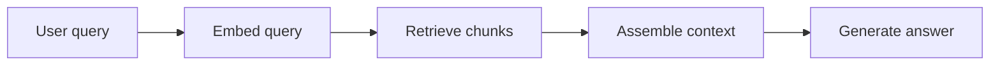

It fits a first production release and small curated corpora with clean [[Chunking]]. More important, it establishes the control measurement for every later change.

Its ceiling is easy to find. A single dense top-k search often misses exact identifiers or product codes, and it has no second stage to remove weak matches.

# 2. Hybrid Search plus Reranking

The [[Retrieval#Sparse Retrieval — Keyword Search (BM25)|lexical search]] and [[Retrieval#Dense Retrieval — Vector Search|vector search]] paths produce separate candidate sets. The merged set passes through [[Re-ranking|reranking]] before generation. Lexical retrieval protects exact terms. Dense retrieval covers semantic matches.

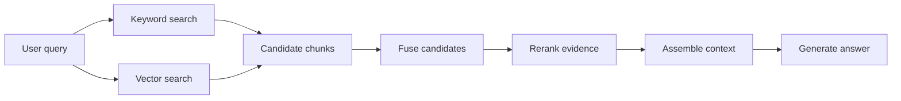

This is the usual production default for enterprise text, especially when names, error codes, or version numbers matter. It also helps when dense retrieval finds the answer but buries it among weak chunks.

The ranking stack becomes another system to tune. Fusion weights and reranker scores all affect the final order, so changes need a labeled query set rather than a few hand-picked examples.

# 3. Query Rewriting and Routing

A model or rules engine rewrites the request and chooses a retrieval path. A vague phrase may need a more precise search query. A simple request may need no retrieval at all, while another belongs in SQL or web search.

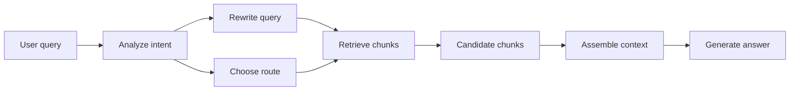

This fits vague requests such as "does the new limit apply to partners" when the corpus says "external reseller quota." Routing also keeps high-volume systems from paying for multi-hop execution on every request.

The rewrite can silently change intent. The original and rewritten queries therefore share a trace, and retrieval effects are measured by query type.

# 4. Parent-Document and Recursive Retrieval

Small chunks provide precise matching, while each match expands to its parent section before generation. Search stays selective while the model receives the local context needed to interpret a row, definition, or dependency.

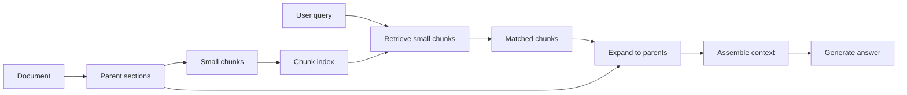

It works well for manuals and policies where a 300-token match is useless without its heading or surrounding table. The danger is context bloat. Parent windows still need token budgets, and large windows may need their own reranking pass.

# 5. Multi-Query Fusion

Several phrasings of the same question produce separate retrieval results. Deduplication and rank fusion combine those candidate sets. The pattern raises recall when one wording cannot cover the document vocabulary.

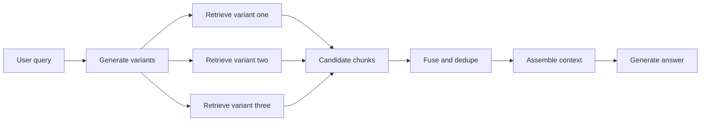

Multi-query fusion suits single-intent requests with uncertain phrasing or many aliases. Genuinely multipart requests belong to decomposition. Every variant costs another search, so a bounded count and concurrent execution keep the pattern practical. Precise fact lookups rarely benefit.

# 6. Contextual Retrieval

A short document-aware explanation is added to each chunk before indexing. The retriever sees the fragment together with enough local context to interpret it.

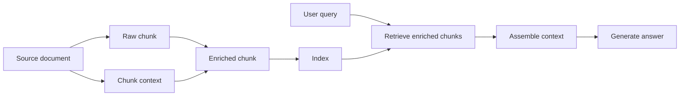

This helps when chunks contain pronouns, shorthand, or isolated table rows. It is most practical for slowly changing corpora because enrichment may require a model call for every chunk.

The generated context becomes part of the index. If the source changes without re-enrichment, the search layer preserves an obsolete interpretation.

# 7. Multimodal RAG

Multimodal RAG retrieves evidence from prose as well as images, tables, and scanned pages. Some systems extract structured text before indexing. Others use vision-capable embeddings and generation models.

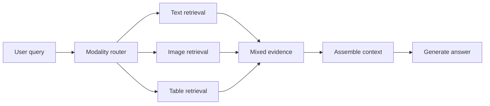

This pattern belongs in document systems where the answer lives in a chart or page layout and OCR loses the structure. A retrieved image is useless if the final model receives only text, so every modality needs a complete path from indexing through generation.

# 8. HyDE

HyDE drafts a hypothetical answer and searches with that answer's embedding. The extra prose can bridge a vague user query to the richer language used in source documents.

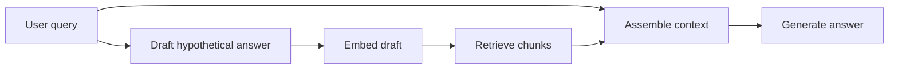

HyDE can help with short, exploratory questions. It is dangerous for exact factual lookup because an invented detail becomes the retrieval anchor. Its value is measured against direct search on the query classes meant to justify it.

# 9. Iterative Multi-Hop Retrieval

Iterative retrieval examines the first evidence set, identifies what is missing, and searches again. The loop stops after a small number of hops or when the evidence satisfies the request.

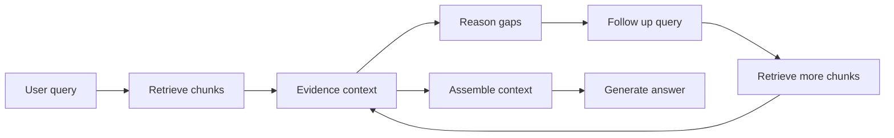

Iterative retrieval fits questions where a second search depends on an entity or fact discovered in the first. Each hop can drift and accumulate noise. The original query, a bounded loop, reranking, and per-hop traces constrain that failure mode.

# 10. Agentic RAG

An [[AI & ML/LLM/Agents/Agents|agent]] chooses a data tool, observes the result, and decides what to do next. The execution path can change for each query.

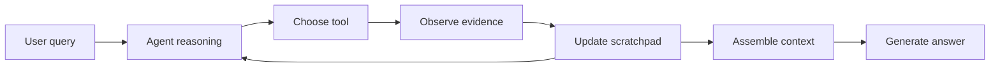

This is justified when requests genuinely cross vector search, SQL, web sources, or calculation tools. A fixed pipeline is simpler when one source answers most questions.

Agents can loop or spend heavily while following the wrong route. Structured tool calls, step limits, and cost budgets are part of the pattern, not optional hardening.

# 11. GraphRAG

GraphRAG extracts entities and relationships into a knowledge graph, then retrieves from graph neighborhoods or community summaries. It makes relationship structure explicit instead of hoping independent chunks imply it.

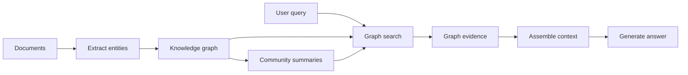

GraphRAG fits dependency-heavy domains and questions about impact or ownership across a corpus. Ordinary support lookup rarely needs it.

The index is expensive and brittle. Entity extraction and linking errors flow into graph edges, while community summaries add another model-produced layer that can go stale.

# 12. Corrective and Self-Reflective RAG

Corrective RAG evaluates the retrieved evidence before generation and may retry or switch sources. Self-reflective variants also inspect the generated answer for support.

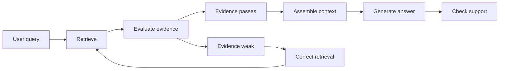

This family fits high-risk systems that can calibrate evidence evaluators or train specialized models. It is rarely a drop-in production feature. Self-RAG requires custom training, while CRAG-style correction depends on trustworthy evaluator thresholds. The added loop is justified only after reranking and ordinary evaluation show a remaining evidence-quality failure.

# Pattern Selection Guide

| Pattern | Best For | Runtime Cost | When to Skip |
|---------|----------|--------------|--------------|
| Baseline Single-Pass RAG | First version and simple factual lookup | Low | Retrieval metrics already show exact-term or precision failures |
| Hybrid Search plus Reranking | Enterprise text with exact terms and semantic matches | Medium | Tiny curated corpus where dense retrieval is already excellent |
| Query Rewriting and Routing | Vague queries and mixed complexity traffic | Low to medium | Users already write precise search queries |
| Parent-Document and Recursive Retrieval | Long documents and structure-sensitive answers | Medium | Short standalone snippets answer most questions |
| Multi-Query Fusion | Synonym-heavy or phrasing-sensitive questions | Medium | Simple single-intent lookup traffic |
| Contextual Retrieval | Chunks that lose meaning outside the source document | Indexing cost high and runtime cost low | Fast-changing corpora where enrichment goes stale quickly |
| Multimodal RAG | PDFs, tables, figures, scans, diagrams | Medium to high | Text-only corpus |
| HyDE | Vocabulary mismatch and sparse queries | Medium | Queries are already specific and direct retrieval works |
| Iterative Multi-Hop Retrieval | Multi-hop evidence chains | High | Single-hop answers dominate traffic |
| Agentic RAG | Multiple tools and adaptive investigation | High | One data source and one retrieval path are enough |
| GraphRAG | Entity relationships and global synthesis | High | Simple fact lookup or frequently changing data |
| Corrective and Self-Reflective RAG | High-risk answers needing custom critique | High | Evaluator training or calibration is unavailable |

**Adoption order**: the baseline is measured first. Hybrid search with reranking is the next step for most text corpora. Query rewriting, parent expansion, or multi-query fusion answers a measured recall problem. The heavier patterns belong to narrower failures: missing visual evidence, multi-hop dependencies, multiple tools, or graph-shaped questions. Self-RAG and CRAG remain specialist designs unless evaluator and training costs are already justified.

# Questions

> [!QUESTION]- When is GraphRAG a better fit than plain vector retrieval?
> GraphRAG earns its cost when answers depend on explicit entity relations or paths across many documents. Compliance tracing and architecture impact analysis are examples. Plain vector retrieval remains better for independent fact lookup because it avoids a graph extraction pipeline.

# References

- [Hybrid search in Azure AI Search](https://learn.microsoft.com/en-us/azure/search/hybrid-search-overview)
- [Contextual Retrieval](https://www.anthropic.com/news/contextual-retrieval)
- [From Local to Global: A Graph RAG Approach to Query-Focused Summarization](https://arxiv.org/abs/2404.16130)
- [Self-RAG: Learning to Retrieve, Generate, and Critique Through Self-Reflection](https://arxiv.org/abs/2310.11511)
- [Corrective Retrieval Augmented Generation](https://arxiv.org/abs/2401.15884)
