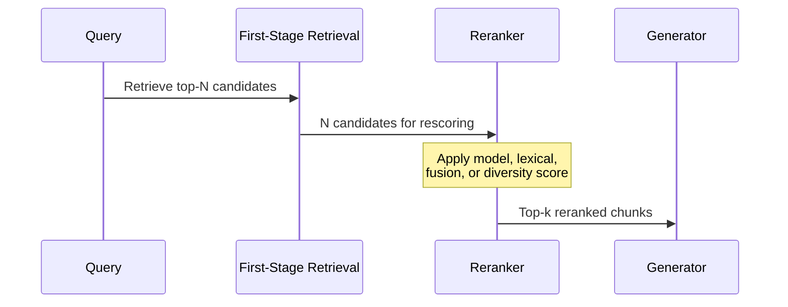
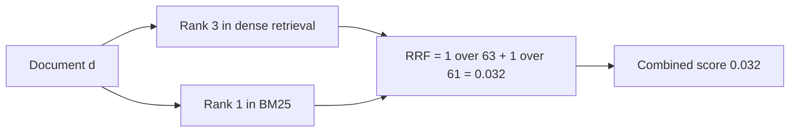

Re-ranking is a second-stage rescoring or reordering pass over candidates returned by [[Retrieval]]. It may use a cross-encoder or LLM, lexical scores such as BM25, rank fusion such as RRF, or a diversity rule such as MMR. First-stage retrieval is built for fast recall across a large corpus. The second stage has a narrower job: improve the short list before context reaches the generator.

But it cannot recover evidence that the first stage missed.

First-stage retrieval, whether dense, sparse, or hybrid, might return 20–100 chunks under its initial score. A second stage applies the chosen model, lexical, fusion, or diversity signal. Only the reordered top-k continues to the generator.



Suppose hybrid retrieval returns 50 candidates for "what are the SLA penalties for tier-2 partners." Ten discuss SLAs in general. Three contain the tier-2 terms, while much of the remaining material concerns partner onboarding. A cross-encoder reads each candidate beside the query and can move the three specific documents into positions 1–3. Without that pass, generic SLA text may crowd the useful clauses out of the prompt.

# Reranking Approaches

## Cross-Encoder Reranking

A cross-encoder concatenates the query with one document, runs the pair through a transformer, and emits a relevance score. Bi-encoders embed the two texts independently. Cross-encoders instead allow full token-level attention across the pair, so wording such as negation or a narrow qualifier can change the score in ways a single embedding may miss.

That accuracy costs time. Scoring 50 candidates requires 50 query-document inference passes, which rules cross-encoders out for a first-stage scan over millions of chunks. They fit after retrieval because the candidate set is already small.

SBERT provides pretrained cross-encoder models across a speed-quality spectrum. At one end, `cross-encoder/ms-marco-TinyBERT-L2-v2` scores ~9000 docs/sec with moderate quality. At the other, `cross-encoder/ms-marco-MiniLM-L12-v2` scores ~960 docs/sec with substantially higher [[Monitoring#Retrieval Quality Metrics|nDCG]] and [[Monitoring#Retrieval Quality Metrics|MRR]] on MS MARCO.

**Cohere Rerank** packages cross-encoder reranking as a managed API. Models such as `rerank-v3.5` and the `rerank-v4.0` family accept JSON or semi-structured data and handle multilingual queries. This removes model hosting from the application, while adding a provider call, per-query cost, and network latency.

## Late Interaction — ColBERT

ColBERT (Contextualized Late Interaction over BERT) produces one embedding per token for both query and document. MaxSim then finds the best document-token match for each query token and sums those similarities. The encoders remain independent. Token-level interaction happens later during scoring.

Document token embeddings can be computed once at index time. A request only encodes the query, then runs MaxSim over stored vectors. This separates document encoding from query-time scoring.

ColBERTv2 adds residual compression that cuts its late-interaction storage footprint by 6–10x. Its paper reports state-of-the-art [[Monitoring#Retrieval Quality Metrics|nDCG]] quality among standalone retrievers across in-domain and out-of-domain benchmarks.

Storage is the harder part. ColBERT keeps one vector per document token, and ordinary single-vector indexes cannot represent that layout. It needs an engine such as PLAID, ColBERTv2's retrieval engine, or a vector store with multi-vector support.

## BM25 Lexical Reranking

BM25 matches query terms against document terms and adjusts the score for term frequency, document length, and how rare each term is across the corpus. It usually serves as a sparse first-stage retriever. It can also provide a cheap lexical pass over dense results when exact wording matters.

Example: a user asks for "SOC 2 Type II retention exception." Dense retrieval may surface semantically similar compliance chunks about audits and data retention. A BM25 pass rewards chunks that contain the exact tokens `SOC`, `2`, `Type II`, `retention`, and `exception`, pushing the policy clause with the real exception language above more generic compliance explanations.

BM25 is particularly good with named entities, error codes, product SKUs, and legal terms. Its weakness is vocabulary brittleness. It does not know that "customer-managed key" and "CMK" may denote the same concept unless both forms appear or query expansion connects them. In semantic workloads it works best as a lexical guardrail beside dense retrieval.

## MMR — Maximal Marginal Relevance

Maximal Marginal Relevance balances query relevance against similarity to documents already selected. Plain top-k may spend several prompt slots on nearly identical chunks. MMR gives some of that space to evidence that adds a different angle.

The scoring idea is: `MMR = lambda * relevance_to_query - (1 - lambda) * similarity_to_selected_docs`. A high lambda behaves like normal relevance ranking. A lower lambda increases diversity and reduces duplicate context.

Example: retrieval returns ten chunks from the same incident report because all of them mention "vector index timeout." Plain top-k may spend the entire prompt budget on near-duplicate paragraphs. MMR can keep the strongest incident chunk, then select a configuration page and a monitoring runbook because they add different evidence for the same query.

MMR helps when overlapping chunks or template-heavy pages crowd out coverage. Set lambda too low, though, and diversity starts displacing strong supporting evidence. It belongs in pipelines where the generator receives repetitive context. It is a poor fit when an answer depends on several adjacent chunks from one source.

## LLM-as-Reranker

An LLM reranker judges candidate relevance directly, usually by scoring each chunk or selecting from a small set. Unlike a fixed cross-encoder, it can apply domain rules such as "prefer current policy over archived policy" or "penalize snippets without dollar amounts."

Example prompt shape:

```text
Query: What SLA credits apply to tier-2 partners?

Candidate A: Tier-2 partners receive a 5 percent service credit after two missed monthly uptime targets...
Candidate B: Our partner program has three support tiers...

Return JSON with relevance scores from 0 to 5 and a one-sentence reason for each score.
```

The model can read longer evidence than a small cross-encoder, apply business rules, and explain a ranking decision. It also adds substantial latency and cost, and repeated calls may disagree. That makes LLM reranking reasonable for low-volume or high-stakes queries. At high QPS, a trained reranker or managed rerank API is usually the steadier choice. LLM judging can remain an evaluation tool or a difficult-case fallback.

## Score Fusion — RRF and Alternatives

Score fusion merges ranked lists from several retrievers. No new model reads the candidates, so this differs from cross-encoder reranking. The output is still a new order for the generator.

**Reciprocal Rank Fusion (RRF)** is the most common fusion method. For each document, sum the reciprocal of its rank in each input list:



The formula is `RRF_score = sum of 1 / (k + rank_i)`, with k=60 in the original paper. RRF works from positions rather than raw scores. Dense similarity and BM25 values can therefore be combined without forcing them onto a shared scale.

**Linear combination** normalizes scores from each retriever to a common range and computes a weighted sum: `score = alpha * dense_score + (1 - alpha) * sparse_score`. This preserves score magnitude but requires choosing alpha and handling score distributions that shift across query types.

RRF is the safer default because it only depends on rank order. Linear combination becomes useful when one retriever is consistently better and deserves an explicit weight. Fusion and model-based reranking can be stacked: merge the input lists first, then rerank the fused candidates.

# Pitfalls

## Latency Budget Exhaustion

Cross-encoder reranking may add 50–200ms per query, depending on model size and candidate count. Against a 500ms total SLA, that is 10–40% of the entire budget. A quality gain in an offline benchmark can arrive with a p95 regression under production concurrency.

Set a hard candidate cap, often 20–50 documents, and choose the model against the latency budget as well as quality. Measure with realistic batch sizes and concurrency. A single-query benchmark is too clean.

## Candidate Count Reduction Under Load

Under load, reducing the reranker input from 100 candidates to 20 is an easy way to protect latency. It can also erase recall. A relevant document at position 35 never reaches the second stage.

Detection: monitor first-stage recall@N at the candidate count passed to the reranker, rather than at a theoretical maximum. If recall@20 is significantly lower than recall@100, the candidate cut is the bottleneck.

## Reranker-Retriever Distribution Mismatch

A reranker trained on short English web passages from MS MARCO may underperform on long technical or multilingual material. Its relevance judgments reflect the training distribution, and unfamiliar document shapes can receive unreliable scores.

Mitigation: evaluate the reranker on domain query-document pairs before committing. A drop in domain recall means the reranker is demoting relevant material. A domain-adapted or multilingual model may fit better.

## Over-Reliance on Reranking to Fix Retrieval

Reranking can only reorder what retrieval found. When the relevant document never enters the candidate set, the fix belongs in [[Chunking]], [[Embeddings|embedding model selection]], query expansion, or another first-stage decision. A stronger reranker cannot recover missing evidence.

Diagnostic: low first-stage candidate Recall@N establishes an upstream ceiling. If Recall@N is high but post-rerank Recall@k is low, the reranker or final cutoff is demoting relevant evidence.

# Tradeoffs

| Approach | Quality | Latency per query | Infrastructure | Best for |
| --- | --- | --- | --- | --- |
| No reranking | Baseline -- retrieval order only | Lowest -- no extra scoring | None | Simple corpora where first-stage ranking is sufficient |
| BM25 lexical reranking | Moderate -- exact term precision | Low -- sparse scoring over candidates | Sparse index or BM25 scorer | Queries with identifiers, acronyms, policy terms, error codes |
| Score fusion only -- RRF | Moderate -- better ordering from multiple signals | Minimal -- arithmetic on ranks | None -- works with any retriever pair | Hybrid retrieval where dense and sparse complement each other |
| MMR diversity reranking | Moderate -- less redundant context | Low to moderate -- pairwise similarity over selected chunks | Embeddings or similarity scores for candidates | Context windows crowded by near-duplicate chunks |
| Cross-encoder -- small model | Often stronger than first-stage scores; measure on the domain | One model pass per candidate pair; benchmark model, hardware, sequence length, and batch | GPU or CPU inference | Quality-sensitive pipelines with moderate latency budgets |
| Cross-encoder -- large model | More capacity, not a guaranteed quality win | Higher pair-scoring cost; benchmark the deployed configuration | Usually GPU inference | High-stakes domains where measured gains justify latency |
| ColBERT late interaction | Token-level alignment with pre-computed documents | Query encoding plus MaxSim over stored document vectors | Multi-vector storage -- specialized index | Latency-sensitive pipelines where held-out retrieval improves over a bi-encoder |
| LLM-as-reranker | High but variable -- instruction-following judgment | Highest -- model call over candidate text | LLM API or hosted model plus output validation | Low-volume, high-stakes queries needing explainable ranking rules |
| Managed API -- Cohere or Azure | High -- no infrastructure | Network round-trip + provider latency | None -- API call | Teams without ML infrastructure or needing fast integration |

Start without a reranker and measure the failures. BM25 or RRF helps when lexical and dense signals cover different queries. MMR earns its place when duplicate chunks waste prompt space. A model-based reranker is justified when the right evidence is already present but ordered badly. If recall is broken, repair retrieval first. LLM reranking belongs only where business judgment or an explained decision is worth the extra latency and cost.

# Questions

> [!QUESTION]- Why can reranking improve offline [[Monitoring#Retrieval Quality Metrics|nDCG]] without visible quality improvement for end users?
> The changed positions may sit outside the generator's context. When generation uses only three chunks, a better ordering at positions 4–5 cannot affect the answer. Compare the actual top-k composition as well as overall [[Monitoring#Retrieval Quality Metrics|nDCG]], and check whether the evaluation queries resemble production traffic.

> [!QUESTION]- When does reranking hurt retrieval quality instead of helping?
> A reranker trained on short web passages may misjudge long technical documents or unfamiliar terminology, then demote the relevant evidence. A small candidate set creates a different failure: low first-stage recall leaves only noise to reorder. Compare [[Monitoring#Retrieval Quality Metrics|recall and precision]] before and after reranking on domain queries.

# References

- [Retrieve and rerank pipeline — bi-encoder retrieval plus cross-encoder reranking (SBERT)](https://sbert.net/examples/applications/retrieve_rerank/README.html)
- [ColBERTv2 — residual compression and denoised supervision (NAACL 2022)](https://arxiv.org/abs/2112.01488)
- [The Probabilistic Relevance Framework BM25 and beyond — lexical ranking model background (Foundations and Trends in Information Retrieval)](https://www.staff.city.ac.uk/~sbrp622/papers/foundations_bm25_review.pdf)
- [The use of MMR, diversity-based reranking for reordering documents and producing summaries (SIGIR 1998)](https://dl.acm.org/doi/10.1145/290941.291025)
- [RankGPT — LLM-based passage reranking with permutation generation (arXiv)](https://arxiv.org/abs/2304.09542)
- [Reciprocal Rank Fusion outperforms Condorcet and individual rank learning methods (SIGIR 2009)](https://plg.uwaterloo.ca/~gvcormac/cormacksigir09-rrf.pdf)
