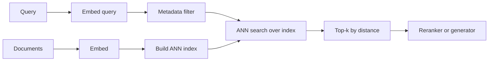

A vector database stores [[Embeddings]] with metadata and searches them by proximity. It sits under dense [[Retrieval]], where the indexed [[Chunking|chunks]] must be searched in milliseconds even when the collection contains millions of vectors.

The central trick is **approximate** nearest-neighbor (ANN) search. Exact search compares the query with every stored vector. Its result is correct, but the O(N) scan becomes too slow at scale. ANN indexes inspect a much smaller search space and return most of the true neighbors. The missing fraction is silent, so the recall-latency choice must be measured explicitly with [[Component-Level Evaluation]].

# Index Types

The index determines the search behavior and much of the operating cost.

- **Flat (brute force)** compares against every vector. It has no recall loss, but each query costs O(N). Flat search works for small collections and provides the ground truth for ANN evaluation.
- **HNSW (Hierarchical Navigable Small World)** builds a layered proximity graph. Search begins at a coarse layer, then walks toward closer neighbors as it descends. It usually gives high recall at low latency and is the common default. The graph and full vectors live in RAM, though. `M` controls connectivity, `ef_construction` controls build effort, and `ef_search` controls query effort. Raising `ef_search` explores more of the graph and trades latency for recall.
- **IVF (Inverted File)** clusters vectors into `nlist` cells and searches only the nearest `nprobe` cells for each query. It often builds faster and uses less memory than HNSW. Increasing `nprobe` improves recall by examining more cells.
- **PQ (Product Quantization)** represents vectors with compact codes learned from a codebook. **IVF-PQ** applies that compression inside IVF for collections where full vectors cost too much memory. The codes are lossy, so another layer of recall is sacrificed.
- **Disk-based indexes such as DiskANN** keep most graph data on SSD. They make billion-scale collections affordable when an in-memory graph would be prohibitive, at the cost of storage latency.

The [[Embeddings|Distance metric]] must match the embedding model. Many text models use cosine similarity. Some use dot product when magnitude carries meaning. Euclidean distance is less common. Building or querying with the wrong metric produces the wrong neighbors even when the index itself is healthy.

# Metadata Filtering

Production queries usually combine similarity with an authorization or business constraint: the same tenant, an allowed ACL, or a date range. ANN and filtering cannot be designed separately, and the index never substitutes for an authorization boundary.

- **Pre-filtering** narrows the eligible vectors before search. Tenant and ACL boundaries need this treatment because semantic similarity cannot enforce authorization.
- **Post-filtering** runs ANN first and discards disallowed results afterward. It is simpler, but a selective filter may remove nearly all of top-k and collapse the effective recall.
- **Filtered indexes** preserve usable graph paths across filter boundaries. Narrow queries retain more recall, paid for with additional index structure.

See [[Retrieval]] for how pre/post-filtering interacts with the rest of the retrieval pipeline.

# Operations

A vector database is a stateful service. The index changes with the corpus.

- **Upserts and deletes** can degrade ANN structures under heavy churn, particularly HNSW. Deletes are often tombstones, and the remaining graph may fragment. Periodic rebuilds keep the search structure clean.
- **Index rebuilds and zero-downtime swaps** become necessary after re-embedding or re-chunking. Build the replacement collection beside the old one, validate it, then switch a **collection alias**. This is the shadow-index pattern from [[Component-Level Evaluation]].
- **Sharding and replication** solve different problems. Shards extend capacity beyond one node. Replicas add read throughput and availability. Semantic clusters can still create hot shards.
- **Memory budgeting** starts with roughly `N × dimensions × 4 bytes` for float32 vectors, plus graph overhead. That estimate often decides when PQ or a disk-based index becomes necessary.

# Choosing a System

| Category | Examples | When it fits |
| --- | --- | --- |
| Managed vector DB | Pinecone, Azure AI Search, Weaviate Cloud | Want search-as-a-service, no infra ops, willing to pay per usage |
| Self-hosted vector DB | Qdrant, Milvus, Weaviate | Want control over cost, versioning, and data residency. Have ops capacity |
| Add-on to existing store | pgvector (Postgres), OpenSearch/Elasticsearch kNN | Already run the database. Want vectors beside relational/lexical data and one fewer system |
| Library, not a service | FAISS, hnswlib | Embedding search inside an application that owns persistence and serving |

If Postgres already owns the data and the corpus is modest, **pgvector** can keep vectors beside relational records and existing [[Retrieval|keyword search]]. One system is easier to operate than two. A dedicated vector database becomes worthwhile when collection size, filtered-search recall, or specialized indexes such as IVF-PQ and DiskANN exceed the add-on's practical limits.

# Pitfalls

## ANN Operating-Point Regression

**What goes wrong**: after corpus growth or distribution change, an HNSW configuration can return fewer exact neighbors without raising an error.

**Why it happens**: recall and latency depend on graph construction, filters, data distribution, implementation, and search parameters. A previously adequate `ef_search` can become inadequate, but neither flat latency nor a larger corpus proves that it did.

**How to avoid it**: schedule ANN recall checks against brute-force ground truth and measure a fresh recall-versus-latency curve. `ef_search` is one tuning response; a rebuild or another parameter/index change may be needed. Infrastructure dashboards alone do not expose neighbor loss. [[Retrieval]] describes the explicit comparison.

## Filtered-Search Recall Collapse

**What goes wrong**: a selective metadata filter causes retrieval to return far fewer relevant results than the unfiltered query.

**Why it happens**: post-filtering applies the filter after ANN, so under high selectivity most retrieved candidates are discarded. With graph indexes, narrow filters can also disconnect the search path.

**How to avoid it**: use pre-filtering or a filtered index and test recall at realistic selectivity levels, including 10% and 1%. An unfiltered benchmark misses the problem.

## Memory Blowup from In-Memory Indexes

**What goes wrong**: an HNSW collection fits at one million vectors and exhausts memory at ten million. The graph overhead makes the bill larger than a raw-vector estimate suggests.

**Why it happens**: HNSW keeps full vectors plus the graph in RAM. Cost grows with `N × dimensions` plus graph overhead, and high dimensionality multiplies it.

**How to avoid it**: budget memory before ingestion, reduce dimensions when [[Embeddings|Matryoshka truncation]] is supported, and move to IVF-PQ or disk before the collection outgrows RAM.

## Stale Index After Re-embedding

**What goes wrong**: the embedding model changes without an index rebuild. New query vectors are then compared with document vectors from another space, making the ranking meaningless.

**Why it happens**: different embedding models occupy different vector spaces. Their vectors are not comparable.

**How to avoid it**: re-embed the full corpus for every model change. Key the [[AI & ML/LLM/Context Engineering/RAG/Caching|embedding cache]] by model version, validate the replacement index, then cut over with a collection alias.

# Tradeoffs

| Index | Recall | Query latency | Memory | Build cost | Best for |
| --- | --- | --- | --- | --- | --- |
| Flat | Exact (100%) | High (O(N)) | High (raw vectors) | None | Small corpora. Ground truth for recall measurement |
| HNSW | High | Low | High (graph in RAM) | Medium–high | The default for most production text RAG |
| IVF | Tunable via `nprobe` | Low–medium | Medium | Low–medium | Large corpora where HNSW memory is too high |
| IVF-PQ | Lower (lossy) | Low | Lowest | Medium | Very large corpora (10M+) where memory dominates |
| DiskANN | High | Medium | Low (on SSD) | High | Billion-scale where in-memory is infeasible |

HNSW is a practical starting point for a typical text corpus. IVF or IVF-PQ becomes attractive when memory is the binding constraint, while a disk-based index fits a collection that cannot live economically in RAM. Every choice still needs scheduled ANN recall checks against brute-force ground truth because lost neighbors leave no error behind.

# Questions

> [!QUESTION]- Why do vector databases use approximate nearest-neighbor search instead of exact search?
> Exact search scores the query against every stored vector, so its work grows linearly with the collection. An ANN index organizes the vectors so a query visits only the most promising parts of the search space, which cuts latency and compute. The tradeoff is that it can miss some true nearest neighbors, so recall must be compared with brute-force ground truth at the required latency.

# References

- [Efficient and robust approximate nearest neighbor search using HNSW graphs (Malkov & Yashunin, 2016)](https://arxiv.org/abs/1603.09320)
- [Product Quantization for Nearest Neighbor Search (Jégou et al., 2011)](https://pubmed.ncbi.nlm.nih.gov/21088323/)
- [DiskANN: Fast Accurate Billion-point Nearest Neighbor Search on a Single Node (Subramanya et al., 2019)](https://proceedings.neurips.cc/paper/2019/hash/09853c7fb1d3f8ee67a61b6bf4a7f8e6-Abstract.html)
- [ANN-Benchmarks — recall vs latency across ANN implementations](https://ann-benchmarks.com/)
- [pgvector — open-source vector similarity search for Postgres](https://github.com/pgvector/pgvector)
- [Vector search concepts (Azure AI Search)](https://learn.microsoft.com/en-us/azure/search/vector-search-overview)
