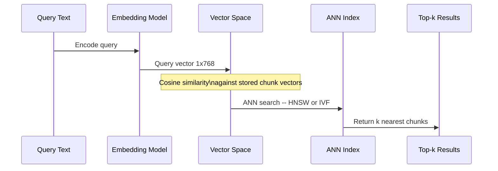

Embeddings turn text into vectors so that related meanings occupy nearby points. That geometry lets retrieval match "throttle partner API traffic" with a document about "rate limiting for partner plan" even when the wording does not overlap.

An encoder model, usually a transformer trained with a contrastive objective, reads a text span and produces a fixed-length vector. Training pulls similar pairs together and pushes unrelated pairs apart. At query time, the same model embeds the query, and the index finds nearby stored vectors with cosine similarity or dot product. Those neighbors are the candidate chunks.

Leaderboard quality is only a starting point. The useful model is the one that meets recall and latency targets on the actual corpus, at an acceptable cost. A model that tops MTEB can still mishandle internal terminology.

# Embedding Model Selection

## Model Families

Production RAG systems usually start with one of these model families.

**Proprietary API models.** OpenAI `text-embedding-3-small` (1536 dimensions) and `text-embedding-3-large` (3072 dimensions) support a `dimensions` parameter for Matryoshka truncation at inference time. Cohere `embed-v3` distinguishes `search_document` from `search_query` through `input_type` and covers more than 100 languages. Per-token rates change, so cost comparisons need current provider pricing.

**Open-source bi-encoders.** Sentence Transformers (SBERT) includes `all-MiniLM-L6-v2` (384 dimensions, 22M parameters) and `all-mpnet-base-v2` (768 dimensions, 109M parameters). Local inference removes per-token API charges, but the serving hardware and model lifecycle become an internal concern.

**Domain-finetuned models.** A base model can be adapted when internal terminology is the measured source of retrieval misses. In a Databricks FinanceBench experiment, `gte-large-en-v1.5` (0.4B parameters) fine-tuned on synthetic domain data reached [[Monitoring#Retrieval Quality Metrics|Recall@10]] of 0.552 versus 0.44 for `text-embedding-3-large`. Adaptation commonly uses continued masked-language pre-training or contrastive training on query-document pairs.

## Dimensionality

Higher dimensions give the model more room to represent fine-grained distinctions. But higher dimensions also mean more storage (4 bytes × dimensions per vector), more compute for similarity search, and higher ANN index memory.

Matryoshka Representation Learning (MRL) trains models so that prefixes of the full vector remain independently meaningful. OpenAI reports `text-embedding-3-large` at 256 dimensions outperforming `ada-002` at 1536 dimensions on the aggregate MTEB benchmark. That result motivates testing shorter vectors, but corpus-specific Recall@k must establish the retrieval tradeoff. Shorter vectors can reduce storage and search work, with full dimensions reserved for cases that need them.

A two-stage design can generate the full embedding once, normalize and index its reduced prefix for ANN search, then score the small candidate set with the retained full vector or a cross-encoder. Full vectors must live outside the ANN index or be recomputed for the candidates. Retaining them reduces ANN memory and search work but not total vector storage; recomputing them trades storage for API cost and latency.

## Similarity Metrics

The similarity metric defines what "near" means in the vector space.

**Cosine similarity** measures the angle between vectors, ignoring magnitude. Most embedding models are trained with cosine objectives, making it the default choice. Range: -1 to 1 (1 = identical direction).

**Dot product** is cosine similarity scaled by vector magnitudes. For L2-normalized vectors, dot product equals cosine similarity. Normalization is model-specific: OpenAI documents its embedding vectors as length-normalized, while another model may preserve magnitude as part of the signal. Follow the selected model's contract rather than assuming every API behaves the same way.

**Euclidean (L2) distance** measures straight-line distance in vector space. Less common for text embeddings because high-dimensional spaces make absolute distances less discriminative than angular measures.

Cosine similarity is the safe default unless the model documentation specifies another metric.

# Pitfalls

## Distribution Shift on Internal Terminology

A model that scores well on MTEB can still fail on a specific domain. Internal acronyms or product names may be poorly represented in the training data, leaving related queries and documents far apart in vector space.

Detection: compare recall@k on a held-out set of domain-specific queries vs generic queries. A significant gap signals distribution shift.

The repair depends on the failure. Domain adaptation can improve semantic placement, while [[Retrieval|hybrid retrieval]] lets BM25 recover exact terminology that dense retrieval misses.

## Embedding Model Swap Invalidation

Changing the embedding model — even a minor version — invalidates every stored vector. The new model produces vectors in a different geometric space. Cosine similarity between old and new vectors is meaningless.

This means re-embedding the entire corpus: for a 10M-chunk index at $0.02/1M tokens and 500 tokens/chunk average, that is ~$100 and hours of ingestion time. Key the [[AI & ML/LLM/Context Engineering/RAG/Caching|embedding cache]] by model name + version to prevent serving stale vectors.

## Benchmark Leaderboard Overfitting

MTEB aggregates several task families. A model can rank first overall while performing poorly on retrieval because strong classification or semantic-similarity results lift its average. For RAG selection, filter to the `Retrieval` category and then test against a corpus-specific evaluation set.

## Multilingual Embedding Collapse

Models trained primarily on English text cluster non-English content into a smaller region of vector space, reducing separation between distinct concepts. A Spanish query about "seguridad informática" and one about "seguridad alimentaria" may land closer together than they should because the model undertrained on Spanish semantic distinctions.

Mitigation: use models with explicit multilingual training (Cohere `embed-v3`, SBERT multilingual variants), and evaluate recall per language separately.

# Tradeoffs

| Factor | Proprietary API | Open-Source Self-Hosted | Domain-Finetuned |
| --- | --- | --- | --- |
| Cost at scale | Per-token pricing -- scales linearly | Infrastructure cost -- GPU amortized across volume | Training cost upfront -- inference same as base |
| Recall on general text | High -- trained on massive web corpora | Competitive -- top models match proprietary on MTEB | Depends on base model and training data quality |
| Recall on domain text | Can miss internal terminology | Same limitation as proprietary | Potentially higher when domain training improves held-out retrieval |
| Latency | Network round-trip + provider queue | Local inference -- no network hop | Same as self-hosted base model |
| Operational burden | Minimal -- API call | High -- GPU infra and model serving and updates | Highest -- training pipeline plus serving |
| Vendor lock-in | Model changes break vector index | Full control over versioning | Full control |
| Dimensionality control | Some models support MRL truncation | Full control via model choice | Full control |

Start with the simplest model that establishes a credible recall baseline. Fine-tune only after failed queries show that domain semantics, rather than chunk boundaries or retrieval configuration, are the bottleneck. Better embeddings cannot repair bad chunks.

# Questions

> [!QUESTION]- How do Matryoshka embeddings reduce vector storage, and how should the smaller size be validated?
> Matryoshka training makes shorter prefixes of the full vector useful on their own, so a model with a `dimensions` option can return 256 or 512 values instead of the full size. Indexing 256 rather than 1536 float values cuts raw ANN vector storage by about six times and also reduces similarity work. Recall is not guaranteed, so the same labeled queries must be compared at several dimensions using Recall@k and latency. If full vectors are used for reranking, retaining or recomputing them adds storage, API cost, or latency outside the smaller index.

> [!QUESTION]- Why can switching to a higher-scoring embedding model cause recall to drop on existing queries?
> Each model defines its own vector space. Comparing a query from the new model with stored vectors from the old one produces meaningless distances and broken rankings. Build the new corpus index before switching query traffic, and include the model name and version in embedding-cache keys.

# References

- [Embeddings guide — text-embedding-3 models and MRL (OpenAI)](https://platform.openai.com/docs/guides/embeddings)
- [MTEB leaderboard — filter by Retrieval task (Hugging Face)](https://huggingface.co/spaces/mteb/leaderboard)
- [Matryoshka Representation Learning — original MRL paper (arXiv)](https://arxiv.org/abs/2205.13147)
- [Azure OpenAI embeddings — deployment and SDK usage (Microsoft Learn)](https://learn.microsoft.com/en-us/azure/ai-foundry/openai/how-to/embeddings)
