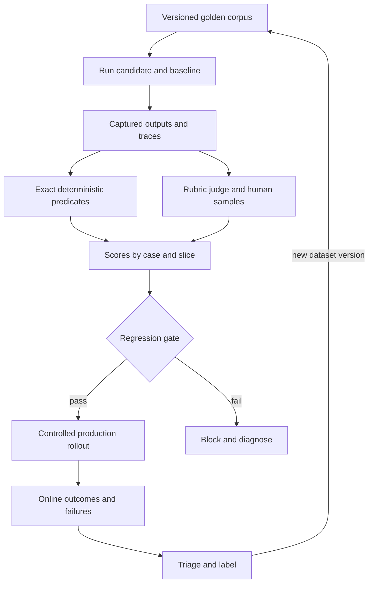

# Intro

Evaluation measures whether an LLM application satisfies product, grounding, safety, and operational requirements. Because open-ended output has several valid forms, one assertion cannot cover the system. A useful evaluation combines a versioned regression corpus, exact predicates, semantic rubrics, human calibration, and production outcomes.

The corpus and the scoring techniques are different things. A [[Golden Test Set and Regression Runs|golden test set]] is the versioned dataset that supplies inputs, expected facts or invariants, rubrics, and slice metadata. [[Deterministic Checks]] and [[LLM-as-a-Judge|judges]] score candidate outputs produced from those cases. Regression logic then compares the candidate with a pinned baseline or threshold.

<nav style="--card-accent: 16, 185, 129;" class="folder-structure-map" aria-label="Evaluation section map"><div class="folder-map-children"><article class="db-card folder-map-node"><div class="db-card-body"><div class="folder-map-node-heading"><span class="folder-map-node-title-group"><span class="db-card-icon" aria-hidden="true"><svg xmlns="http://www.w3.org/2000/svg" stroke-linejoin="round" stroke-linecap="round" stroke-width="2" stroke="currentColor" fill="none" viewBox="0 0 24 24"><path d="M14.5 2H6a2 2 0 0 0-2 2v16a2 2 0 0 0 2 2h12a2 2 0 0 0 2-2V7.5L14.5 2z"/><polyline points="14 2 14 8 20 8"/><line y2="13" y1="13" x2="8" x1="16"/><line y2="17" y1="17" x2="8" x1="16"/><line y2="9" y1="9" x2="8" x1="10"/></svg></span><span class="db-card-title" title="Building an Evaluation Set">Building an Evaluation Set</span></span></div><p class="db-card-summary">The labeled data every eval technique scores against; labeling and size decide if numbers mean anything.</p></div><span class="db-card-hit"><a class="internal-link" href="Home/AI &amp; ML/LLM/Evaluation/Building an Evaluation Set.md" data-tooltip-position="top" aria-label="Building an Evaluation Set">Building an Evaluation Set</a></span></article><article class="db-card folder-map-node"><div class="db-card-body"><div class="folder-map-node-heading"><span class="folder-map-node-title-group"><span class="db-card-icon" aria-hidden="true"><svg xmlns="http://www.w3.org/2000/svg" stroke-linejoin="round" stroke-linecap="round" stroke-width="2" stroke="currentColor" fill="none" viewBox="0 0 24 24"><path d="M14.5 2H6a2 2 0 0 0-2 2v16a2 2 0 0 0 2 2h12a2 2 0 0 0 2-2V7.5L14.5 2z"/><polyline points="14 2 14 8 20 8"/><line y2="13" y1="13" x2="8" x1="16"/><line y2="17" y1="17" x2="8" x1="16"/><line y2="9" y1="9" x2="8" x1="10"/></svg></span><span class="db-card-title" title="Deterministic Checks">Deterministic Checks</span></span></div><p class="db-card-summary">Non-LLM tests that cheaply validate outputs for schema, safety, and policy before any LLM judge.</p></div><span class="db-card-hit"><a class="internal-link" href="Home/AI &amp; ML/LLM/Evaluation/Deterministic Checks.md" data-tooltip-position="top" aria-label="Deterministic Checks">Deterministic Checks</a></span></article><article class="db-card folder-map-node"><div class="db-card-body"><div class="folder-map-node-heading"><span class="folder-map-node-title-group"><span class="db-card-icon" aria-hidden="true"><svg xmlns="http://www.w3.org/2000/svg" stroke-linejoin="round" stroke-linecap="round" stroke-width="2" stroke="currentColor" fill="none" viewBox="0 0 24 24"><path d="M14.5 2H6a2 2 0 0 0-2 2v16a2 2 0 0 0 2 2h12a2 2 0 0 0 2-2V7.5L14.5 2z"/><polyline points="14 2 14 8 20 8"/><line y2="13" y1="13" x2="8" x1="16"/><line y2="17" y1="17" x2="8" x1="16"/><line y2="9" y1="9" x2="8" x1="10"/></svg></span><span class="db-card-title" title="Experiment Platform Architecture">Experiment Platform Architecture</span></span></div><p class="db-card-summary">Binding experiment configuration, assignment, exposure, metrics, and analysis to one versioned contract.</p></div><span class="db-card-hit"><a class="internal-link" href="Home/AI &amp; ML/LLM/Evaluation/Experiment Platform Architecture.md" data-tooltip-position="top" aria-label="Experiment Platform Architecture">Experiment Platform Architecture</a></span></article><article class="db-card folder-map-node"><div class="db-card-body"><div class="folder-map-node-heading"><span class="folder-map-node-title-group"><span class="db-card-icon" aria-hidden="true"><svg xmlns="http://www.w3.org/2000/svg" stroke-linejoin="round" stroke-linecap="round" stroke-width="2" stroke="currentColor" fill="none" viewBox="0 0 24 24"><path d="M14.5 2H6a2 2 0 0 0-2 2v16a2 2 0 0 0 2 2h12a2 2 0 0 0 2-2V7.5L14.5 2z"/><polyline points="14 2 14 8 20 8"/><line y2="13" y1="13" x2="8" x1="16"/><line y2="17" y1="17" x2="8" x1="16"/><line y2="9" y1="9" x2="8" x1="10"/></svg></span><span class="db-card-title" title="Golden Test Set and Regression Runs">Golden Test Set and Regression Runs</span></span></div><p class="db-card-summary">Golden sets give broad regression coverage; targeted suites catch specific high-risk failures. You need both.</p></div><span class="db-card-hit"><a class="internal-link" href="Home/AI &amp; ML/LLM/Evaluation/Golden Test Set and Regression Runs.md" data-tooltip-position="top" aria-label="Golden Test Set and Regression Runs">Golden Test Set and Regression Runs</a></span></article><article class="db-card folder-map-node"><div class="db-card-body"><div class="folder-map-node-heading"><span class="folder-map-node-title-group"><span class="db-card-icon" aria-hidden="true"><svg xmlns="http://www.w3.org/2000/svg" stroke-linejoin="round" stroke-linecap="round" stroke-width="2" stroke="currentColor" fill="none" viewBox="0 0 24 24"><path d="M14.5 2H6a2 2 0 0 0-2 2v16a2 2 0 0 0 2 2h12a2 2 0 0 0 2-2V7.5L14.5 2z"/><polyline points="14 2 14 8 20 8"/><line y2="13" y1="13" x2="8" x1="16"/><line y2="17" y1="17" x2="8" x1="16"/><line y2="9" y1="9" x2="8" x1="10"/></svg></span><span class="db-card-title" title="LLM-as-a-Judge">LLM-as-a-Judge</span></span></div><p class="db-card-summary">One model grades another's output against an explicit rubric, by absolute scoring or pairwise preference.</p></div><span class="db-card-hit"><a class="internal-link" href="Home/AI &amp; ML/LLM/Evaluation/LLM-as-a-Judge.md" data-tooltip-position="top" aria-label="LLM-as-a-Judge">LLM-as-a-Judge</a></span></article><article class="db-card folder-map-node"><div class="db-card-body"><div class="folder-map-node-heading"><span class="folder-map-node-title-group"><span class="db-card-icon" aria-hidden="true"><svg xmlns="http://www.w3.org/2000/svg" stroke-linejoin="round" stroke-linecap="round" stroke-width="2" stroke="currentColor" fill="none" viewBox="0 0 24 24"><path d="M14.5 2H6a2 2 0 0 0-2 2v16a2 2 0 0 0 2 2h12a2 2 0 0 0 2-2V7.5L14.5 2z"/><polyline points="14 2 14 8 20 8"/><line y2="13" y1="13" x2="8" x1="16"/><line y2="17" y1="17" x2="8" x1="16"/><line y2="9" y1="9" x2="8" x1="10"/></svg></span><span class="db-card-title" title="Online Evaluation and AB Tests">Online Evaluation and AB Tests</span></span></div><p class="db-card-summary">Measuring LLM changes on live traffic with outcome metrics, randomized assignment, and uncertainty.</p></div><span class="db-card-hit"><a class="internal-link" href="Home/AI &amp; ML/LLM/Evaluation/Online Evaluation and AB Tests.md" data-tooltip-position="top" aria-label="Online Evaluation and AB Tests">Online Evaluation and AB Tests</a></span></article></div><style>.db-card { position: relative; box-sizing: border-box; border: 1px solid var(--background-modifier-border, var(--lightgray, #d8dee9)); border-radius: var(--radius-m, 0.55rem); background-color: var(--background-primary, var(--light, #ffffff)); box-shadow: 0 0 0 rgba(0, 0, 0, 0); transition: border-color 150ms ease, background-color 150ms ease, box-shadow 150ms ease, transform 150ms ease; } .db-card::before { content: ""; position: absolute; inset: 0; border-radius: inherit; pointer-events: none; background: radial-gradient( ellipse 150% 175% at -22% -38%, rgba(var(--card-accent, 125, 125, 125), 0.09) 0%, rgba(var(--card-accent, 125, 125, 125), 0.04) 38%, rgba(var(--card-accent, 125, 125, 125), 0.014) 66%, transparent 90% ); opacity: 0.78; transition: opacity 150ms ease; } .db-card:hover, .db-card:focus-within { border-color: rgba(var(--card-accent, 125, 125, 125), 0.55); background-color: color-mix(in srgb, rgb(var(--card-accent, 125, 125, 125)) 2.5%, var(--background-primary, var(--light, #ffffff))); box-shadow: 0 0.45rem 1.1rem rgba(0, 0, 0, 0.08); transform: translateY(-0.125rem); } .db-card:hover::before, .db-card:focus-within::before { opacity: 1; } .db-card-body { position: relative; z-index: 0; box-sizing: border-box; display: flex; flex-direction: column; padding: var(--db-card-pad, 0.85rem 0.9rem); } .db-card-icon { display: flex; width: 1.1rem; height: 1.1rem; flex: 0 0 auto; color: rgb(var(--card-accent, 125, 125, 125)); } .db-card-icon svg { display: block; width: 100%; height: 100%; } .db-card-title { display: block; margin: 0; color: var(--text-normal, var(--dark, #1f2937)); font-size: 1rem; font-weight: 700; line-height: 1.25; } p.db-card-summary { margin: 0.45rem 0 0; color: var(--text-muted, var(--darkgray, #5f6b7a)); font-size: 0.875rem; line-height: 1.45; } .db-card-hit { position: absolute; inset: 0; z-index: 1; } .db-card-hit a { position: absolute; inset: 0; min-width: 2.75rem; min-height: 2.75rem; border-radius: var(--radius-m, 0.55rem); background: transparent !important; font-size: 0; } .db-card-hit a:focus-visible { outline: 2px solid rgb(var(--card-accent, 125, 125, 125)); outline-offset: -0.3rem; } @media (prefers-reduced-motion: reduce) { .db-card { transition: none; } .db-card::before { transition: none; } .db-card:hover, .db-card:focus-within { transform: none; } } .folder-structure-map { --card-accent: 16, 185, 129; --map-gap: 0.75rem; width: 100%; box-sizing: border-box; margin: 0.5rem 0 0.75rem; container-name: folder-map; container-type: inline-size; } .folder-map-children { display: flex; flex-wrap: wrap; gap: var(--map-gap); } .folder-map-node { flex: 1 1 12rem; min-height: 2.75rem; --db-card-pad: 0.5rem 0.75rem; } .folder-map-node .db-card-body { min-height: 2.75rem; justify-content: center; } .folder-map-node-heading { display: flex; align-items: center; justify-content: space-between; gap: 0.75rem; } .folder-map-node-title-group { display: flex; align-items: center; gap: 0.5rem; } .folder-map-node .db-card-title { white-space: nowrap; } .folder-map-node-count { display: block; flex: 0 0 auto; color: var(--text-muted, var(--darkgray, #5f6b7a)); font-size: 0.875rem; white-space: nowrap; } .folder-map-node .db-card-summary { display: none; } .folder-map-node-empty { cursor: default; } .folder-map-node-empty:hover, .folder-map-node-empty:focus-within { border-color: var(--background-modifier-border, var(--lightgray, #d8dee9)); background-color: var(--background-primary, var(--light, #ffffff)); box-shadow: 0 0 0 rgba(0, 0, 0, 0); transform: none; } .folder-map-node-empty:hover::before, .folder-map-node-empty:focus-within::before { opacity: 0.78; } .folder-structure-map .folder-map-node-empty .db-card-body { justify-content: center; align-items: center; text-align: center; } .folder-map-empty-text { color: var(--text-normal, var(--dark, #1f2937)); font-size: 1rem; font-weight: 400; font-style: normal; line-height: 1.25; } @container folder-map (min-width: 40rem) { .folder-map-node { min-height: 6rem; --db-card-pad: 0.85rem 0.9rem; } .folder-map-node .db-card-body { min-height: 6rem; justify-content: flex-start; } .folder-map-node .db-card-summary { display: block; } } @container folder-map (min-width: 64rem) { .folder-map-node, .folder-map-node .db-card-body { min-height: 6.75rem; } }</style></nav>

## Evaluation system



Exact checks can run before an expensive judge for one candidate output, but the golden corpus is not a downstream stage after the judge. It is the common input and comparison boundary for every scorer.

Use deterministic code where the predicate is exact:

- JSON parses against a pinned schema.
- A required field exists and has the expected type.
- A tool name belongs to an allowed set.
- A numeric value stays inside a declared range.

Those checks have no classification error when the predicate and implementation match the product contract. The guarantee does not extend to every rule implemented in code. Regex-based PII detection, keyword safety filters, toxicity classifiers, and unsupported-claim heuristics are repeatable but imperfect: they can produce both false positives and false negatives. Calibrate them on labeled examples and treat uncertain content as a scored signal or review path rather than an infallible hard gate.

Semantic dimensions such as correctness, groundedness, and actionability need a rubric. An LLM judge scales that rubric, while blinded human samples measure judge agreement and reveal systematic bias. Keep judge model, prompt, rubric, and sampling settings versioned with the result.

## Example

One customer-support case can carry both exact and semantic expectations:

```text
case_id: damaged-refund-45-days
input: "Can I return a damaged item after 45 days?"

exact predicates:
- response matches the answer schema
- cited_policy_sections contains at least one identifier
- tool_calls use only policy_search

rubric dimensions (0-2):
- policy correctness
- groundedness in the cited section
- actionability of the escalation path

heuristic signals:
- possible payment-card number
- possible unsupported promise
```

A schema failure is exact. “Possible payment-card number” remains a detector result until its precision and recall are established for this traffic.

## Dataset lifecycle and overfitting

Give every corpus version immutable case identifiers, provenance, expected behavior, slice labels, and a reason for inclusion. New production failures enter through triage, not by silently editing an existing case. Keep a development set for iteration and a frozen holdout for release decisions.

Repeatedly tuning prompts or judge rubrics against the holdout turns it into training data. A rising holdout score with flat [[Online Evaluation and AB Tests|online outcomes]] is evidence of evaluation overfitting. Rotate or add independently sourced cases, inspect slice-level effects, and retain human review for disputed decisions.

## Questions

> [!QUESTION]- Is a golden test set a scoring stage?
> No. It is a versioned regression dataset. Exact predicates, semantic judges, and human raters score outputs generated from its cases; the regression gate compares those results with a pinned baseline or threshold.

> [!QUESTION]- When does a deterministic check have zero classification error?
> Only when it evaluates an exact product predicate, such as schema validity or membership in an allowed set, and the implementation matches that contract. Deterministic PII, toxicity, and content heuristics still have false positives and false negatives.

> [!QUESTION]- Why is a strong offline score insufficient to ship?
> A fixed corpus cannot reproduce every traffic shift, multi-turn interaction, or user outcome. Use offline regression as a release gate, then estimate production impact with monitoring and controlled online experiments.

## References

- [OpenAI evaluation best practices](https://developers.openai.com/api/docs/guides/evaluation-best-practices) — provider guidance for task-specific criteria, datasets, graders, and continuous evaluation loops.
- [OpenAI evals guide](https://developers.openai.com/api/docs/guides/evals) — primary API documentation for defining, running, and inspecting evaluation jobs.
- [Anthropic: define success criteria](https://docs.anthropic.com/en/docs/test-and-evaluate/define-success) — provider guidance for translating product goals into measurable success criteria and test cases.
- [NIST AI Risk Management Framework](https://www.nist.gov/itl/ai-risk-management-framework) — the primary voluntary risk-management framework for governing measurement, validation, and monitoring across the AI lifecycle.
