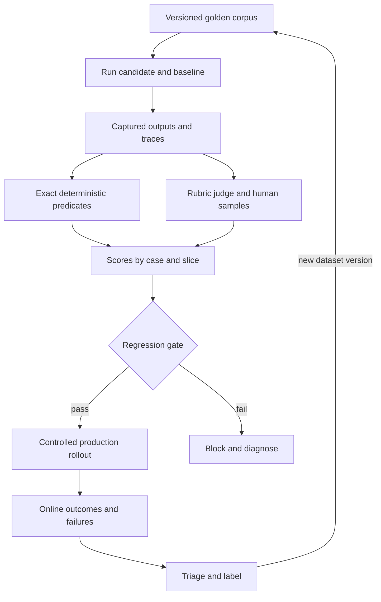

Evaluation checks whether an LLM application behaves well enough to ship. Open-ended output may have several valid forms, so one assertion cannot represent the whole product contract. The practical system combines exact checks with rubric-based scoring, then compares both against a versioned set of cases and production outcomes.

Keep the cases separate from the scorers. A [[Golden Test Set and Regression Runs|golden test set]] contains inputs, expected facts or invariants, rubrics, and slice metadata. [[Deterministic Checks]] and [[LLM-as-a-Judge|judges]] score outputs produced from those cases. The regression gate compares the result with a pinned baseline or threshold.

```datacorejsx
const { FolderStructureMap } = await dc.require("Assets/components/devbook-folder-map.jsx");
return FolderStructureMap;
```

# Evaluation System


```mermaid
flowchart TD
    G[Versioned golden corpus] --> R[Run candidate and baseline]
    R --> O[Captured outputs and traces]
    O --> X[Exact deterministic predicates]
    O --> J[Rubric judge and human samples]
    X --> S[Scores by case and slice]
    J --> S
    S --> C{Regression gate}
    C -->|pass| P[Controlled production rollout]
    C -->|fail| F[Block and diagnose]
    P --> ON[Online outcomes and failures]
    ON --> T[Triage and label]
    T -->|new dataset version| G
```

Cheap exact checks can reject a candidate before an expensive judge runs. The corpus itself is not a later pipeline stage. Every scorer starts from its cases and expectations.

Use deterministic code for predicates with one mechanical answer:

- JSON parses against a pinned schema.
- A required field exists and has the expected type.
- A tool name belongs to an allowed set.
- A numeric value stays inside a declared range.

Such checks have no classification error when the implementation matches the product contract. But deterministic execution does not make every rule exact. A regex for PII or a keyword safety filter is repeatable and still wrong on some inputs. Calibrate heuristic detectors on labeled cases, record false positives and false negatives, and send uncertain results to a score or review path instead of treating them as infallible gates.

Correctness and groundedness need a rubric when several answers are acceptable. An LLM judge applies that rubric at scale. Blinded human samples then show whether the judge agrees with the intended standard or carries a systematic bias. Version the judge model and prompt with the rubric and sampling settings. Otherwise two score files may not mean the same thing.

# Example

One support case can carry exact predicates alongside a semantic rubric:

```text
case_id: damaged-refund-45-days
input: "Can I return a damaged item after 45 days?"

exact predicates:
- response matches the answer schema
- cited_policy_sections contains at least one identifier
- tool_calls use only policy_search

rubric dimensions (0-2):
- policy correctness
- groundedness in the cited section
- actionability of the escalation path

heuristic signals:
- possible payment-card number
- possible unsupported promise
```

A schema either matches or it does not. “Possible payment-card number” remains a detector signal until its precision and recall are known for this traffic.

# Dataset Lifecycle and Overfitting

Give each case an immutable identifier, provenance, expected behavior, slice labels, and a reason for inclusion. Add production failures through triage rather than silently rewriting an old expectation. A development set supports iteration. A frozen holdout decides whether a release regressed.

Repeated prompt or rubric tuning against the holdout turns it into training data. If that score rises while [[Online Evaluation and AB Tests|online outcomes]] stay flat, the evaluation has probably been overfit. Add independently sourced cases and inspect results by slice. Human review remains necessary where the automated signals disagree.

# References

- [OpenAI evaluation best practices](https://developers.openai.com/api/docs/guides/evaluation-best-practices)
- [Anthropic: define success criteria](https://docs.anthropic.com/en/docs/test-and-evaluate/define-success)
