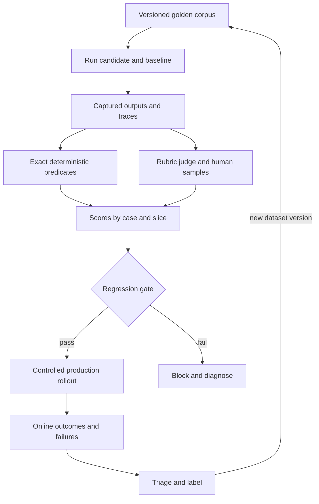

Evaluation checks whether an LLM application behaves well enough to ship. Open-ended output may have several valid forms, so one assertion cannot represent the whole product contract. The practical system combines exact checks with rubric-based scoring, then compares both against a versioned set of cases and production outcomes.

Keep the cases separate from the scorers. A [[Golden Test Set and Regression Runs|golden test set]] contains inputs, expected facts or invariants, rubrics, and slice metadata. [[Deterministic Checks]] and [[LLM-as-a-Judge|judges]] score outputs produced from those cases. The regression gate compares the result with a pinned baseline or threshold.

<nav style="--card-accent: 16, 185, 129;" class="folder-structure-map" aria-label="Evaluation section map"><div class="folder-map-children"><article class="db-card folder-map-node"><div class="db-card-body"><div class="folder-map-node-heading"><span class="folder-map-node-title-group"><span class="db-card-icon" aria-hidden="true"><svg xmlns="http://www.w3.org/2000/svg" stroke-linejoin="round" stroke-linecap="round" stroke-width="2" stroke="currentColor" fill="none" viewBox="0 0 24 24"><path d="M14.5 2H6a2 2 0 0 0-2 2v16a2 2 0 0 0 2 2h12a2 2 0 0 0 2-2V7.5L14.5 2z"/><polyline points="14 2 14 8 20 8"/><line y2="13" y1="13" x2="8" x1="16"/><line y2="17" y1="17" x2="8" x1="16"/><line y2="9" y1="9" x2="8" x1="10"/></svg></span><span class="db-card-title" title="Building an Evaluation Set">Building an Evaluation Set</span></span></div><p class="db-card-summary">How to structure, label, generate, and size the cases that every evaluation method relies on.</p></div><span class="db-card-hit"><a class="internal-link" href="Home/AI &amp; ML/LLM/Evaluation/Building an Evaluation Set.md" data-tooltip-position="top" aria-label="Building an Evaluation Set">Building an Evaluation Set</a></span></article><article class="db-card folder-map-node"><div class="db-card-body"><div class="folder-map-node-heading"><span class="folder-map-node-title-group"><span class="db-card-icon" aria-hidden="true"><svg xmlns="http://www.w3.org/2000/svg" stroke-linejoin="round" stroke-linecap="round" stroke-width="2" stroke="currentColor" fill="none" viewBox="0 0 24 24"><path d="M14.5 2H6a2 2 0 0 0-2 2v16a2 2 0 0 0 2 2h12a2 2 0 0 0 2-2V7.5L14.5 2z"/><polyline points="14 2 14 8 20 8"/><line y2="13" y1="13" x2="8" x1="16"/><line y2="17" y1="17" x2="8" x1="16"/><line y2="9" y1="9" x2="8" x1="10"/></svg></span><span class="db-card-title" title="Deterministic Checks">Deterministic Checks</span></span></div><p class="db-card-summary">Executable checks that reject malformed or policy-violating output before semantic evaluation.</p></div><span class="db-card-hit"><a class="internal-link" href="Home/AI &amp; ML/LLM/Evaluation/Deterministic Checks.md" data-tooltip-position="top" aria-label="Deterministic Checks">Deterministic Checks</a></span></article><article class="db-card folder-map-node"><div class="db-card-body"><div class="folder-map-node-heading"><span class="folder-map-node-title-group"><span class="db-card-icon" aria-hidden="true"><svg xmlns="http://www.w3.org/2000/svg" stroke-linejoin="round" stroke-linecap="round" stroke-width="2" stroke="currentColor" fill="none" viewBox="0 0 24 24"><path d="M14.5 2H6a2 2 0 0 0-2 2v16a2 2 0 0 0 2 2h12a2 2 0 0 0 2-2V7.5L14.5 2z"/><polyline points="14 2 14 8 20 8"/><line y2="13" y1="13" x2="8" x1="16"/><line y2="17" y1="17" x2="8" x1="16"/><line y2="9" y1="9" x2="8" x1="10"/></svg></span><span class="db-card-title" title="Golden Test Set and Regression Runs">Golden Test Set and Regression Runs</span></span></div><p class="db-card-summary">Golden sets detect broad regressions. Targeted suites isolate specific high-risk failures.</p></div><span class="db-card-hit"><a class="internal-link" href="Home/AI &amp; ML/LLM/Evaluation/Golden Test Set and Regression Runs.md" data-tooltip-position="top" aria-label="Golden Test Set and Regression Runs">Golden Test Set and Regression Runs</a></span></article><article class="db-card folder-map-node"><div class="db-card-body"><div class="folder-map-node-heading"><span class="folder-map-node-title-group"><span class="db-card-icon" aria-hidden="true"><svg xmlns="http://www.w3.org/2000/svg" stroke-linejoin="round" stroke-linecap="round" stroke-width="2" stroke="currentColor" fill="none" viewBox="0 0 24 24"><path d="M14.5 2H6a2 2 0 0 0-2 2v16a2 2 0 0 0 2 2h12a2 2 0 0 0 2-2V7.5L14.5 2z"/><polyline points="14 2 14 8 20 8"/><line y2="13" y1="13" x2="8" x1="16"/><line y2="17" y1="17" x2="8" x1="16"/><line y2="9" y1="9" x2="8" x1="10"/></svg></span><span class="db-card-title" title="LLM-as-a-Judge">LLM-as-a-Judge</span></span></div><p class="db-card-summary">A model grades candidate output with anchored scorecards or pairwise preference, then human labels calibrate the judge.</p></div><span class="db-card-hit"><a class="internal-link" href="Home/AI &amp; ML/LLM/Evaluation/LLM-as-a-Judge.md" data-tooltip-position="top" aria-label="LLM-as-a-Judge">LLM-as-a-Judge</a></span></article><article class="db-card folder-map-node"><div class="db-card-body"><div class="folder-map-node-heading"><span class="folder-map-node-title-group"><span class="db-card-icon" aria-hidden="true"><svg xmlns="http://www.w3.org/2000/svg" stroke-linejoin="round" stroke-linecap="round" stroke-width="2" stroke="currentColor" fill="none" viewBox="0 0 24 24"><path d="M14.5 2H6a2 2 0 0 0-2 2v16a2 2 0 0 0 2 2h12a2 2 0 0 0 2-2V7.5L14.5 2z"/><polyline points="14 2 14 8 20 8"/><line y2="13" y1="13" x2="8" x1="16"/><line y2="17" y1="17" x2="8" x1="16"/><line y2="9" y1="9" x2="8" x1="10"/></svg></span><span class="db-card-title" title="Online Evaluation and AB Tests">Online Evaluation and AB Tests</span></span></div><p class="db-card-summary">Measuring LLM changes on live traffic with outcome metrics, randomized assignment, and uncertainty.</p></div><span class="db-card-hit"><a class="internal-link" href="Home/AI &amp; ML/LLM/Evaluation/Online Evaluation and AB Tests.md" data-tooltip-position="top" aria-label="Online Evaluation and AB Tests">Online Evaluation and AB Tests</a></span></article></div><style>.db-card { position: relative; box-sizing: border-box; border: 1px solid var(--background-modifier-border, var(--lightgray, #d8dee9)); border-radius: var(--radius-m, 0.55rem); background-color: var(--background-primary, var(--light, #ffffff)); box-shadow: 0 0 0 rgba(0, 0, 0, 0); transition: border-color var(--dur-2, 140ms) var(--ease-out, cubic-bezier(0.22, 1, 0.36, 1)), background-color var(--dur-2, 140ms) var(--ease-out, cubic-bezier(0.22, 1, 0.36, 1)), box-shadow var(--dur-2, 140ms) var(--ease-out, cubic-bezier(0.22, 1, 0.36, 1)), transform var(--dur-2, 140ms) var(--ease-out, cubic-bezier(0.22, 1, 0.36, 1)); } .db-card::before { content: ""; position: absolute; inset: 0; border-radius: inherit; pointer-events: none; background: radial-gradient( ellipse 150% 175% at -22% -38%, rgba(var(--card-accent, 125, 125, 125), 0.09) 0%, rgba(var(--card-accent, 125, 125, 125), 0.04) 38%, rgba(var(--card-accent, 125, 125, 125), 0.014) 66%, transparent 90% ); opacity: 0.78; transition: opacity var(--dur-2, 140ms) var(--ease-out, cubic-bezier(0.22, 1, 0.36, 1)); } .db-card:hover, .db-card:focus-within { border-color: rgba(var(--card-accent, 125, 125, 125), 0.55); background-color: color-mix(in srgb, rgb(var(--card-accent, 125, 125, 125)) 2.5%, var(--background-primary, var(--light, #ffffff))); box-shadow: 0 0.45rem 1.1rem rgba(0, 0, 0, 0.08); transform: translateY(-0.125rem); } .db-card:hover::before, .db-card:focus-within::before { opacity: 1; } .db-card-body { position: relative; z-index: 0; box-sizing: border-box; display: flex; flex-direction: column; padding: var(--db-card-pad, 0.85rem 0.9rem); } .db-card-icon { display: flex; width: 1.1rem; height: 1.1rem; flex: 0 0 auto; color: rgb(var(--card-accent, 125, 125, 125)); } .db-card-icon svg { display: block; width: 100%; height: 100%; } .db-card-title { display: block; margin: 0; color: var(--text-normal, var(--dark, #1f2937)); font-size: 1rem; font-weight: 700; line-height: 1.25; } p.db-card-summary { margin: 0.45rem 0 0; color: var(--text-muted, var(--darkgray, #5f6b7a)); font-size: 0.875rem; line-height: 1.45; } .db-card-hit { position: absolute; inset: 0; z-index: 1; } .db-card-hit a { position: absolute; inset: 0; min-width: 2.75rem; min-height: 2.75rem; border-radius: var(--radius-m, 0.55rem); background: transparent !important; font-size: 0; } .db-card-hit a:focus-visible { outline: 2px solid rgb(var(--card-accent, 125, 125, 125)); outline-offset: -0.3rem; } @keyframes db-card-in { from { opacity: 0; transform: translateY(6px); } } .dc-topic-grid .db-card, .folder-map-children .db-card { animation: db-card-in var(--dur-3, 220ms) var(--ease-spring, cubic-bezier(0.34, 1.56, 0.64, 1)) backwards; } .dc-topic-grid .db-card:nth-child(2), .folder-map-children .db-card:nth-child(2) { animation-delay: calc(var(--stagger, 28ms) * 1); } .dc-topic-grid .db-card:nth-child(3), .folder-map-children .db-card:nth-child(3) { animation-delay: calc(var(--stagger, 28ms) * 2); } .dc-topic-grid .db-card:nth-child(4), .folder-map-children .db-card:nth-child(4) { animation-delay: calc(var(--stagger, 28ms) * 3); } .dc-topic-grid .db-card:nth-child(5), .folder-map-children .db-card:nth-child(5) { animation-delay: calc(var(--stagger, 28ms) * 4); } .dc-topic-grid .db-card:nth-child(6), .folder-map-children .db-card:nth-child(6) { animation-delay: calc(var(--stagger, 28ms) * 5); } .dc-topic-grid .db-card:nth-child(n+7), .folder-map-children .db-card:nth-child(n+7) { animation-delay: calc(var(--stagger, 28ms) * 6); } @media (prefers-reduced-motion: reduce) { .db-card { transition: none; } .db-card::before { transition: none; } .db-card:hover, .db-card:focus-within { transform: none; } .dc-topic-grid .db-card, .folder-map-children .db-card { animation: none; } } .folder-structure-map { --card-accent: 16, 185, 129; --map-gap: 0.75rem; width: 100%; box-sizing: border-box; margin: 0.5rem 0 0.75rem; container-name: folder-map; container-type: inline-size; } .folder-map-children { display: flex; flex-wrap: wrap; gap: var(--map-gap); } .folder-map-node { flex: 1 1 12rem; min-height: 2.75rem; --db-card-pad: 0.5rem 0.75rem; } .folder-map-node .db-card-body { min-height: 2.75rem; justify-content: center; } .folder-map-node-heading { display: flex; align-items: center; justify-content: space-between; gap: 0.75rem; } .folder-map-node-title-group { display: flex; align-items: center; gap: 0.5rem; } .folder-map-node .db-card-title { white-space: nowrap; } .folder-map-node-count { display: block; flex: 0 0 auto; color: var(--text-muted, var(--darkgray, #5f6b7a)); font-size: 0.875rem; white-space: nowrap; } .folder-map-node .db-card-summary { display: none; } .folder-map-node-empty { cursor: default; } .folder-map-node-empty:hover, .folder-map-node-empty:focus-within { border-color: var(--background-modifier-border, var(--lightgray, #d8dee9)); background-color: var(--background-primary, var(--light, #ffffff)); box-shadow: 0 0 0 rgba(0, 0, 0, 0); transform: none; } .folder-map-node-empty:hover::before, .folder-map-node-empty:focus-within::before { opacity: 0.78; } .folder-structure-map .folder-map-node-empty .db-card-body { justify-content: center; align-items: center; text-align: center; } .folder-map-empty-text { color: var(--text-normal, var(--dark, #1f2937)); font-size: 1rem; font-weight: 400; font-style: normal; line-height: 1.25; } @container folder-map (min-width: 40rem) { .folder-map-node { min-height: 6rem; --db-card-pad: 0.85rem 0.9rem; } .folder-map-node .db-card-body { min-height: 6rem; justify-content: flex-start; } .folder-map-node .db-card-summary { display: block; } } @container folder-map (min-width: 64rem) { .folder-map-node, .folder-map-node .db-card-body { min-height: 6.75rem; } }</style></nav>

# Evaluation System


```mermaid
flowchart TD
    G[Versioned golden corpus] --> R[Run candidate and baseline]
    R --> O[Captured outputs and traces]
    O --> X[Exact deterministic predicates]
    O --> J[Rubric judge and human samples]
    X --> S[Scores by case and slice]
    J --> S
    S --> C{Regression gate}
    C -->|pass| P[Controlled production rollout]
    C -->|fail| F[Block and diagnose]
    P --> ON[Online outcomes and failures]
    ON --> T[Triage and label]
    T -->|new dataset version| G
```

Cheap exact checks can reject a candidate before an expensive judge runs. The corpus itself is not a later pipeline stage. Every scorer starts from its cases and expectations.

Use deterministic code for predicates with one mechanical answer:

- JSON parses against a pinned schema.
- A required field exists and has the expected type.
- A tool name belongs to an allowed set.
- A numeric value stays inside a declared range.

Such checks have no classification error when the implementation matches the product contract. But deterministic execution does not make every rule exact. A regex for PII or a keyword safety filter is repeatable and still wrong on some inputs. Calibrate heuristic detectors on labeled cases, record false positives and false negatives, and send uncertain results to a score or review path instead of treating them as infallible gates.

Correctness and groundedness need a rubric when several answers are acceptable. An LLM judge applies that rubric at scale. Blinded human samples then show whether the judge agrees with the intended standard or carries a systematic bias. Version the judge model and prompt with the rubric and sampling settings. Otherwise two score files may not mean the same thing.

# Example

One support case can carry exact predicates alongside a semantic rubric:

```text
case_id: damaged-refund-45-days
input: "Can I return a damaged item after 45 days?"

exact predicates:
- response matches the answer schema
- cited_policy_sections contains at least one identifier
- tool_calls use only policy_search

rubric dimensions (0-2):
- policy correctness
- groundedness in the cited section
- actionability of the escalation path

heuristic signals:
- possible payment-card number
- possible unsupported promise
```

A schema either matches or it does not. “Possible payment-card number” remains a detector signal until its precision and recall are known for this traffic.

# Dataset Lifecycle and Overfitting

Give each case an immutable identifier, provenance, expected behavior, slice labels, and a reason for inclusion. Add production failures through triage rather than silently rewriting an old expectation. A development set supports iteration. A frozen holdout decides whether a release regressed.

Repeated prompt or rubric tuning against the holdout turns it into training data. If that score rises while [[Online Evaluation and AB Tests|online outcomes]] stay flat, the evaluation has probably been overfit. Add independently sourced cases and inspect results by slice. Human review remains necessary where the automated signals disagree.

# References

- [OpenAI evaluation best practices](https://developers.openai.com/api/docs/guides/evaluation-best-practices)
- [Anthropic: define success criteria](https://docs.anthropic.com/en/docs/test-and-evaluate/define-success)
