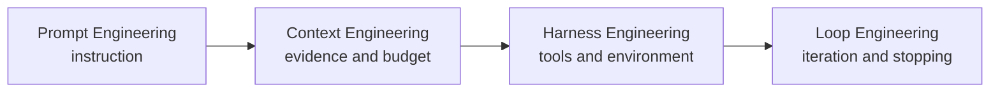

# Intro

A large language model (LLM) is a neural language model with enough capacity and training data to support broad language tasks. Modern LLM systems are usually built on transformers, but “LLM” does not identify one architecture or objective: decoder-only models generate causally, encoder-decoder models generate from an encoded input, and encoder-only models produce contextual representations rather than autoregressive text. [[LLM Foundations and Training]] carries those architecture and training boundaries.

For system design, model output is probabilistic and untrusted. Prompts condition behavior; context supplies current evidence; the harness exposes tools; the loop decides how to iterate and stop; evaluation measures whether the assembled system works. Treat fluent output as a candidate result that still needs grounding, validation, and release evidence.

<nav style="--card-accent: 16, 185, 129;" class="folder-structure-map" aria-label="LLM section map">
<article class="db-card folder-map-node">

<svg xmlns="http://www.w3.org/2000/svg" stroke-linejoin="round" stroke-linecap="round" stroke-width="2" stroke="currentColor" fill="none" viewBox="0 0 24 24"><path d="M20 20a2 2 0 0 0 2-2V8a2 2 0 0 0-2-2h-7.9a2 2 0 0 1-1.69-.9L9.6 3.9A2 2 0 0 0 7.93 3H4a2 2 0 0 0-2 2v13a2 2 0 0 0 2 2Z"/></svg>Agents4 notes

Systems where an LLM controls part of the workflow, calling tools, making decisions, or directing other LLMs.

<a class="internal-link" href="Home/AI &amp; ML/LLM/Agents/Agents.md" data-tooltip-position="top" aria-label="Agents">Agents</a></article><article class="db-card folder-map-node">

<svg xmlns="http://www.w3.org/2000/svg" stroke-linejoin="round" stroke-linecap="round" stroke-width="2" stroke="currentColor" fill="none" viewBox="0 0 24 24"><path d="M20 20a2 2 0 0 0 2-2V8a2 2 0 0 0-2-2h-7.9a2 2 0 0 1-1.69-.9L9.6 3.9A2 2 0 0 0 7.93 3H4a2 2 0 0 0-2 2v13a2 2 0 0 0 2 2Z"/></svg>Context Engineering11 notes

Deliberately deciding what fills the finite context window, and in what order, to maximize useful signal.

<a class="internal-link" href="Home/AI &amp; ML/LLM/Context Engineering/Context Engineering.md" data-tooltip-position="top" aria-label="Context Engineering">Context Engineering</a></article><article class="db-card folder-map-node">

<svg xmlns="http://www.w3.org/2000/svg" stroke-linejoin="round" stroke-linecap="round" stroke-width="2" stroke="currentColor" fill="none" viewBox="0 0 24 24"><path d="M14.5 2H6a2 2 0 0 0-2 2v16a2 2 0 0 0 2 2h12a2 2 0 0 0 2-2V7.5L14.5 2z"/><polyline points="14 2 14 8 20 8"/><line y2="13" y1="13" x2="8" x1="16"/><line y2="17" y1="17" x2="8" x1="16"/><line y2="9" y1="9" x2="8" x1="10"/></svg>Embeddings

Mapping text into a dense vector space where semantic similarity becomes geometric proximity.

<a class="internal-link" href="Home/AI &amp; ML/LLM/Embeddings.md" data-tooltip-position="top" aria-label="Embeddings">Embeddings</a></article><article class="db-card folder-map-node">

<svg xmlns="http://www.w3.org/2000/svg" stroke-linejoin="round" stroke-linecap="round" stroke-width="2" stroke="currentColor" fill="none" viewBox="0 0 24 24"><path d="M20 20a2 2 0 0 0 2-2V8a2 2 0 0 0-2-2h-7.9a2 2 0 0 1-1.69-.9L9.6 3.9A2 2 0 0 0 7.93 3H4a2 2 0 0 0-2 2v13a2 2 0 0 0 2 2Z"/></svg>Evaluation6 notes

Measuring LLM behavior with versioned cases, exact checks, semantic scoring, and production outcomes.

<a class="internal-link" href="Home/AI &amp; ML/LLM/Evaluation/Evaluation.md" data-tooltip-position="top" aria-label="Evaluation">Evaluation</a></article><article class="db-card folder-map-node">

<svg xmlns="http://www.w3.org/2000/svg" stroke-linejoin="round" stroke-linecap="round" stroke-width="2" stroke="currentColor" fill="none" viewBox="0 0 24 24"><path d="M14.5 2H6a2 2 0 0 0-2 2v16a2 2 0 0 0 2 2h12a2 2 0 0 0 2-2V7.5L14.5 2z"/><polyline points="14 2 14 8 20 8"/><line y2="13" y1="13" x2="8" x1="16"/><line y2="17" y1="17" x2="8" x1="16"/><line y2="9" y1="9" x2="8" x1="10"/></svg>Fine-tuning

Adapting model behavior with supervised training, parameter-efficient updates, and held-out evaluation.

<a class="internal-link" href="Home/AI &amp; ML/LLM/Fine-tuning.md" data-tooltip-position="top" aria-label="Fine-tuning">Fine-tuning</a></article><article class="db-card folder-map-node">

<svg xmlns="http://www.w3.org/2000/svg" stroke-linejoin="round" stroke-linecap="round" stroke-width="2" stroke="currentColor" fill="none" viewBox="0 0 24 24"><path d="M14.5 2H6a2 2 0 0 0-2 2v16a2 2 0 0 0 2 2h12a2 2 0 0 0 2-2V7.5L14.5 2z"/><polyline points="14 2 14 8 20 8"/><line y2="13" y1="13" x2="8" x1="16"/><line y2="17" y1="17" x2="8" x1="16"/><line y2="9" y1="9" x2="8" x1="10"/></svg>Generation

Producing reliable, grounded, correctly formatted output by controlling sampling, evidence, and structure.

<a class="internal-link" href="Home/AI &amp; ML/LLM/Generation.md" data-tooltip-position="top" aria-label="Generation">Generation</a></article><article class="db-card folder-map-node">

<svg xmlns="http://www.w3.org/2000/svg" stroke-linejoin="round" stroke-linecap="round" stroke-width="2" stroke="currentColor" fill="none" viewBox="0 0 24 24"><path d="M14.5 2H6a2 2 0 0 0-2 2v16a2 2 0 0 0 2 2h12a2 2 0 0 0 2-2V7.5L14.5 2z"/><polyline points="14 2 14 8 20 8"/><line y2="13" y1="13" x2="8" x1="16"/><line y2="17" y1="17" x2="8" x1="16"/><line y2="9" y1="9" x2="8" x1="10"/></svg>GRPO

Online policy optimization using rewards relative to a group of sampled completions without a learned critic.

<a class="internal-link" href="Home/AI &amp; ML/LLM/GRPO.md" data-tooltip-position="top" aria-label="GRPO">GRPO</a></article><article class="db-card folder-map-node">

<svg xmlns="http://www.w3.org/2000/svg" stroke-linejoin="round" stroke-linecap="round" stroke-width="2" stroke="currentColor" fill="none" viewBox="0 0 24 24"><path d="M20 20a2 2 0 0 0 2-2V8a2 2 0 0 0-2-2h-7.9a2 2 0 0 1-1.69-.9L9.6 3.9A2 2 0 0 0 7.93 3H4a2 2 0 0 0-2 2v13a2 2 0 0 0 2 2Z"/></svg>Harness Engineering2 notes

Designing the capability surface and scaffold the model acts through — tools, protocols, execution environment.

<a class="internal-link" href="Home/AI &amp; ML/LLM/Harness Engineering/Harness Engineering.md" data-tooltip-position="top" aria-label="Harness Engineering">Harness Engineering</a></article><article class="db-card folder-map-node">

<svg xmlns="http://www.w3.org/2000/svg" stroke-linejoin="round" stroke-linecap="round" stroke-width="2" stroke="currentColor" fill="none" viewBox="0 0 24 24"><path d="M14.5 2H6a2 2 0 0 0-2 2v16a2 2 0 0 0 2 2h12a2 2 0 0 0 2-2V7.5L14.5 2z"/><polyline points="14 2 14 8 20 8"/><line y2="13" y1="13" x2="8" x1="16"/><line y2="17" y1="17" x2="8" x1="16"/><line y2="9" y1="9" x2="8" x1="10"/></svg>LLM Foundations and Training

Transformer architecture families, checkpoint compatibility, and the pretraining-to-alignment pipeline.

<a class="internal-link" href="Home/AI &amp; ML/LLM/LLM Foundations and Training.md" data-tooltip-position="top" aria-label="LLM Foundations and Training">LLM Foundations and Training</a></article><article class="db-card folder-map-node">

<svg xmlns="http://www.w3.org/2000/svg" stroke-linejoin="round" stroke-linecap="round" stroke-width="2" stroke="currentColor" fill="none" viewBox="0 0 24 24"><path d="M20 20a2 2 0 0 0 2-2V8a2 2 0 0 0-2-2h-7.9a2 2 0 0 1-1.69-.9L9.6 3.9A2 2 0 0 0 7.93 3H4a2 2 0 0 0-2 2v13a2 2 0 0 0 2 2Z"/></svg>Loop Engineering2 notes

Designing how a model-driven system iterates — control flow, termination, verification, and recovery across turns.

<a class="internal-link" href="Home/AI &amp; ML/LLM/Loop Engineering/Loop Engineering.md" data-tooltip-position="top" aria-label="Loop Engineering">Loop Engineering</a></article><article class="db-card folder-map-node">

<svg xmlns="http://www.w3.org/2000/svg" stroke-linejoin="round" stroke-linecap="round" stroke-width="2" stroke="currentColor" fill="none" viewBox="0 0 24 24"><path d="M14.5 2H6a2 2 0 0 0-2 2v16a2 2 0 0 0 2 2h12a2 2 0 0 0 2-2V7.5L14.5 2z"/><polyline points="14 2 14 8 20 8"/><line y2="13" y1="13" x2="8" x1="16"/><line y2="17" y1="17" x2="8" x1="16"/><line y2="9" y1="9" x2="8" x1="10"/></svg>Mixture of Experts

Sparse transformer layers that route each token through a subset of expert feed-forward networks.

<a class="internal-link" href="Home/AI &amp; ML/LLM/Mixture of Experts.md" data-tooltip-position="top" aria-label="Mixture of Experts">Mixture of Experts</a></article><article class="db-card folder-map-node">

<svg xmlns="http://www.w3.org/2000/svg" stroke-linejoin="round" stroke-linecap="round" stroke-width="2" stroke="currentColor" fill="none" viewBox="0 0 24 24"><path d="M14.5 2H6a2 2 0 0 0-2 2v16a2 2 0 0 0 2 2h12a2 2 0 0 0 2-2V7.5L14.5 2z"/><polyline points="14 2 14 8 20 8"/><line y2="13" y1="13" x2="8" x1="16"/><line y2="17" y1="17" x2="8" x1="16"/><line y2="9" y1="9" x2="8" x1="10"/></svg>Model Selection and Routing

Selecting and routing models from measured task quality, latency, reliability, and cost.

<a class="internal-link" href="Home/AI &amp; ML/LLM/Model Selection and Routing.md" data-tooltip-position="top" aria-label="Model Selection and Routing">Model Selection and Routing</a></article><article class="db-card folder-map-node">

<svg xmlns="http://www.w3.org/2000/svg" stroke-linejoin="round" stroke-linecap="round" stroke-width="2" stroke="currentColor" fill="none" viewBox="0 0 24 24"><path d="M14.5 2H6a2 2 0 0 0-2 2v16a2 2 0 0 0 2 2h12a2 2 0 0 0 2-2V7.5L14.5 2z"/><polyline points="14 2 14 8 20 8"/><line y2="13" y1="13" x2="8" x1="16"/><line y2="17" y1="17" x2="8" x1="16"/><line y2="9" y1="9" x2="8" x1="10"/></svg>Preference Alignment

Optimizing a language model from ranked responses after supervised instruction tuning.

<a class="internal-link" href="Home/AI &amp; ML/LLM/Preference Alignment.md" data-tooltip-position="top" aria-label="Preference Alignment">Preference Alignment</a></article><article class="db-card folder-map-node">

<svg xmlns="http://www.w3.org/2000/svg" stroke-linejoin="round" stroke-linecap="round" stroke-width="2" stroke="currentColor" fill="none" viewBox="0 0 24 24"><path d="M20 20a2 2 0 0 0 2-2V8a2 2 0 0 0-2-2h-7.9a2 2 0 0 1-1.69-.9L9.6 3.9A2 2 0 0 0 7.93 3H4a2 2 0 0 0-2 2v13a2 2 0 0 0 2 2Z"/></svg>Prompt Engineering4 notes

Turning vague intentions into precise, testable model tasks: anatomy, settings, and role prompting.

<a class="internal-link" href="Home/AI &amp; ML/LLM/Prompt Engineering/Prompt Engineering.md" data-tooltip-position="top" aria-label="Prompt Engineering">Prompt Engineering</a></article><article class="db-card folder-map-node">

<svg xmlns="http://www.w3.org/2000/svg" stroke-linejoin="round" stroke-linecap="round" stroke-width="2" stroke="currentColor" fill="none" viewBox="0 0 24 24"><path d="M20 20a2 2 0 0 0 2-2V8a2 2 0 0 0-2-2h-7.9a2 2 0 0 1-1.69-.9L9.6 3.9A2 2 0 0 0 7.93 3H4a2 2 0 0 0-2 2v13a2 2 0 0 0 2 2Z"/></svg>Safety3 notes

Keeping an LLM system safe, secure, and truthful — the cross-cutting concern of guardrails, security threats, and hallucination.

<a class="internal-link" href="Home/AI &amp; ML/LLM/Safety/Safety.md" data-tooltip-position="top" aria-label="Safety">Safety</a></article>
</nav>

## Links

- [[AI & ML/LLM/Agents/Agents|Agents]]
- [[Context Engineering]]
- [[LLM Foundations and Training]]
- [[Embeddings]]
- [[AI & ML/LLM/Evaluation/Evaluation|Evaluation]]
- [[Generation]]
- [[Fine-tuning]]
- [[Harness Engineering]]
- [[Loop Engineering]]
- [[Preference Alignment]]
- [[GRPO]]
- [[Model Selection and Routing]]
- [[Mixture of Experts]]
- [[AI & ML/LLM/Prompt Engineering/Prompt Engineering|Prompt Engineering]]
- [[AI & ML/LLM/Safety/Safety|Safety]]

## Engineering routes

Four inference-time disciplines wrap one another:

| Route | Unit of design | Question |
| --- | --- | --- |
| [[AI & ML/LLM/Prompt Engineering/Prompt Engineering\|Prompt Engineering]] | One instruction | How should this task be specified and demonstrated? |
| [[Context Engineering]] | The whole context window | Which evidence enters the window, in what order, and at what cost? |
| [[Harness Engineering]] | Tools and execution boundary | What can the model do, and through which constrained interface? |
| [[Loop Engineering]] | Runtime across turns | How does work iterate, verify, recover, and stop? |

[[AI & ML/LLM/Evaluation/Evaluation|Evaluation]] and [[AI & ML/LLM/Safety/Safety|Safety]] span every route. Model-level choices sit underneath them: [[Generation]] controls decoding, [[Embeddings]] represent inputs for retrieval, [[Fine-tuning]] adapts behavior, and [[Model Selection and Routing]] chooses which model serves a request.

## Minimal vocabulary

- **Token** — the integer-id unit produced by a specific tokenizer. Tokenizer choice affects sequence length and must match the checkpoint.
- **Context window** — the token budget visible to one model invocation, including instructions, history, evidence, tool results, and output allowance.
- **Inference** — executing a trained model to produce representations or generated tokens; [[Generation]] covers sampling controls for generative models.
- **Embedding** — a vector representation used for similarity or downstream prediction; covered in [[Embeddings]].

## Questions

> [!QUESTION]- Why does architecture matter when someone says “LLM”?
> Encoder-only, encoder-decoder, and decoder-only transformers expose different inputs, objectives, and output paths. A BERT checkpoint is not a causal text generator, while T5 generates through an autoregressive decoder conditioned on encoder output.

> [!QUESTION]- How do you choose between prompting, RAG, and fine-tuning?
> Start with prompting. Add RAG when the gap is current, private, or attributable knowledge. Fine-tune when a measured behavior gap remains—format, policy, style, or a narrow task that prompting cannot stabilize.

## References

- [Attention Is All You Need](https://arxiv.org/abs/1706.03762) — the primary transformer architecture paper; [[LLM Foundations and Training]] follows the later encoder-only, encoder-decoder, and decoder-only families.
- [NIST AI Risk Management Framework](https://www.nist.gov/itl/ai-risk-management-framework) — the primary voluntary framework behind treating model output, evaluation, and monitoring as lifecycle concerns rather than model-only properties.
